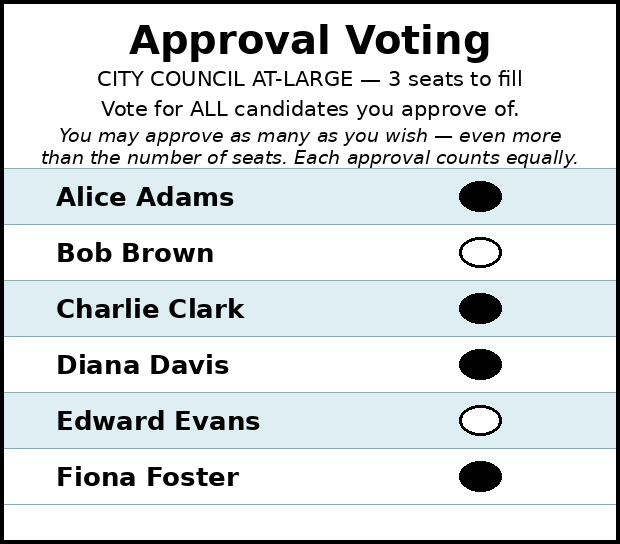

# Approval Voting — Multi-Winner

*The same 0/1 ballot fills more than one seat. The simple version — **bloc (at-large) Approval**, the `seats` most-approved candidates win — is exactly as easy as single-winner Approval, and exactly as **majoritarian**: a cohesive majority can sweep every seat. Proportional adaptations (SPAV, PAV) exist and trade that simplicity for fair minority representation.*

→ **Run it / examples:** [multi-winner Approval](../../04_Approval/multiwinner/) ([`approval_bloc_2seats_c4_b6.yaml`](../../04_Approval/multiwinner/approval_bloc_2seats_c4_b6.yaml)) · Overview: [Approval Voting](approval_voting.md) · The same majoritarian-vs-proportional fork for score ballots: [Bloc STAR](../../02_STAR_Bloc/) vs [proportional STAR](../../03_STAR_PR/) · Concepts: [proportional representation](../proportional_representation/).

---

Many boards, councils, and committees already elect several seats at once from one pool of candidates — usually with **"vote for up to N"** (block plurality). That rule inherits Choose-One's vote-splitting problem *and* adds a cap: run more candidates than seats on your side and you split your own votes.

**Bloc Approval** removes the cap: approve **any number** of candidates, and the **N most-approved win**. Within a faction, vote-splitting disappears — you approve your whole slate. Tabulation stays a single addition pass, precinct-summable, trivial to hand-count.

## The ballot



The ballot is the ordinary Approval checklist — the only multi-winner change is the heading. Note the instruction: you may approve **more** candidates than there are seats (this voter approves four for three seats). Forcing voters to mark *exactly* the seat count is a different — and worse — method (block plurality); giving voters freedom in how many they approve is the better design (Lackner & Skowron, Ch. 2, discuss exactly this).

The data is equally plain — each ballot is a 0/1 row, which is precisely this repo's YAML format:

```text
Adams,Brown,Clark,Davis,Evans,Foster
1,1,0,0,0,0
0,1,1,1,0,0
1,0,0,0,1,1
1,1,1,0,0,0
0,0,1,1,1,0
```

Sum the columns; the top 3 win — Adams, Brown, Clark (3 approvals each). Runnable: [`approval_bloc_3seats_c6_b5.yaml`](../../04_Approval/multiwinner/approval_bloc_3seats_c6_b5.yaml).

## Bloc Approval is majoritarian — the sweep

What bloc Approval does *not* do is represent minorities. Every voter influences every seat with full weight, so 51% of voters who agree on a slate take 100% of the seats. The worked example makes it concrete — 6 voters, 4 candidates, 2 seats; a 4-voter majority (all approve Amy, two also Ben), a 2-voter minority behind Cora (one also Doug):

```text
--- Approval Voting (2 winners) ---
 Tabulating 6 ballots (any non-zero score = approval).

Ballots:
   columns = Amy, Ben, Cora, Doug      (1 = approve; 0 / blank / marker = not approved)
   1,0,0,0
   1,1,0,0
   1,1,0,0
   1,0,0,0
   0,0,1,1
   0,0,1,0

   Amy  -- 4 -- Elected
   Ben  -- 2 -- Elected
   Cora -- 2
   Doug -- 1
  Note: Ben, Cora each have 2 approvals and tie for the last 1 seat.
        Candidate priority order (Ben > Cora) broke the tie: Ben elected, Cora not elected.

Winners — Approval Voting (2 winners)
  Amy, Ben
```

One third of the electorate ends up with zero seats. Sometimes that's the design goal (an executive slate that should reflect the majority); for a representative body it usually isn't. This is the **same trade-off** as Bloc STAR vs Proportional STAR — see [Bloc STAR](../../02_STAR_Bloc/) and [proportional STAR](../../03_STAR_PR/).

## Proportional adaptations: SPAV and PAV

The approval ballot itself carries enough information for proportionality; you change the *tabulation*, not the ballot:

- **SPAV — Sequentially Proportional Approval Voting.** Seats are filled one at a time. After each seat, a ballot's weight drops to **1 / (1 + s)**, where *s* is how many of that ballot's approved candidates have already been elected (1 → 1/2 → 1/3 …, the Jefferson/D'Hondt divisors). A majority that wins the first seat votes at half weight for the second, so minorities earn seats roughly in proportion to their size. Invented by Thorvald Thiele; briefly used in Swedish elections in the early 1900s. Sequential, easy to audit, and the same reweighting spirit as Reweighted Range Voting (RRV) for score ballots.
- **PAV — Proportional Approval Voting.** Thiele's optimizing version: pick the seat-set maximizing total voter satisfaction, where a voter with *k* elected approvals contributes 1 + 1/2 + … + 1/*k* (harmonic weighting). Stronger proportionality guarantees than SPAV, but finding the exact winner set is computationally hard (NP-hard), so it's mostly of theoretical and small-election interest.

This ladder — *same ballot, majoritarian bloc count vs proportional reweighting* — is why the [Equal Vote Coalition's Approval page](https://www.equal.vote/approval) lists "can be used for single-winner or multi-winner elections and can be adapted for proportional representation" among Approval's advantages.

**Engine note:** the LH engine tabulates **bloc Approval only** (`voting_method: Approval_Multi_Winner`, `num_winners: ≥ 2`). The proportional rules are runnable too, via the [the abcvoting engine](../../abcvoting_tabulation_engine/) wrapper around Martin Lackner's peer-reviewed [`abcvoting`](https://github.com/martinlackner/abcvoting) library. On the sweep example above, plain `av` sees the same 2–2 tie the LH engine breaks by priority — but every proportional rule seats the minority's Cora *decisively*:

```text
--- abcvoting: approval-based committee rules (2 seats) ---
 approval_bloc_2seats_c4_b6.yaml: 6 ballots, candidates: Amy, Ben, Cora, Doug
   av           Approval Voting (AV)                       ->  Amy, Ben  |  Amy, Cora  [2 tied committees]
   seqpav       Sequential Proportional Approval Voting (seq-PAV) ->  Amy, Cora
   pav          Proportional Approval Voting (PAV)         ->  Amy, Cora
   seqphragmen  Phragmén's Sequential Rule (seq-Phragmén)  ->  Amy, Cora
```

The repo's other runnable proportional methods are the STAR-PR family ([proportional STAR](../../03_STAR_PR/)) and STV ([other methods](../../06_Other/)).

## The literature's running example (Lackner & Skowron)

The standard textbook for this whole field is Lackner & Skowron, ***Multi-Winner Voting with Approval Preferences*** (SpringerBriefs, 2023 — open access, [doi:10.1007/978-3-031-09016-5](https://doi.org/10.1007/978-3-031-09016-5)); the `abcvoting` library is its computational companion. Its running example (Example 2.1) is in this repo as [`approval_bloc_4seats_c7_b12_lackner_skowron.yaml`](../../04_Approval/multiwinner/approval_bloc_4seats_c7_b12_lackner_skowron.yaml): an academic society elects a **k = 4** steering committee from seven candidates, 12 ballots — `3 × {A,B} · 3 × {A,C} · 2 × {A,D} · 1 × {B,C,F} · 1 × {E} · 1 × {F} · 1 × {G}`.

Approval counts: A = 8, B = 4, C = 4, D = 2, F = 2, E = 1, G = 1. So bloc AV seats A, B, C and then **ties D and F** for the last seat — and the book (Example 2.2) points out the tie matters: `{A,B,C,D}` leaves *three* voters with no representative at all, `{A,B,C,F}` only *two*. Bloc AV can't see that difference; a tiebreak just picks blindly (the LH engine's priority order happens to pick D, the worse of the two). **PAV** (book Example 2.4) elects `{A,B,C,F}` outright — it maximises harmonic satisfaction, which is exactly the quantity that notices those unrepresented voters. Interestingly, seq-Phragmén sides with D here — even good proportional rules can disagree on the margins:

```text
   av           Approval Voting (AV)                       ->  A, B, C, D  |  A, B, C, F  [2 tied committees]
   seqpav       Sequential Proportional Approval Voting (seq-PAV) ->  A, B, C, F
   pav          Proportional Approval Voting (PAV)         ->  A, B, C, F
   seqphragmen  Phragmén's Sequential Rule (seq-Phragmén)  ->  A, B, C, D
```

The same book is the reference for the fairness axioms behind these rules (justified representation and its extensions, the core, priceability — its Ch. 4) if you want the theory under the demo.

## See also

- [Approval Voting](approval_voting.md) — the single-winner overview
- [Approval — Honest Limits](approval_honest_limits.md) — the threshold dilemma carries over to every seat
- [multi-winner Approval](../../04_Approval/multiwinner/) — the runnable sweep example
- **ABC rules (approval committees), two levels:** [committees & coverage — a gentle intro (101)](abc_rules_intro.md) · [ABC rules & the utilitarian–egalitarian spectrum (301)](abc_rules_spectrum.md) — AV vs Chamberlin–Courant vs PAV on Lackner & Skowron's steering-committee example, with the shadow-STAR bridge.
- [Proportional representation](../proportional_representation/) — why and how minorities earn seats
- [Equal Vote: Approval Voting](https://www.equal.vote/approval) — source for the advantages/adaptability framing
- Lackner & Skowron, *Multi-Winner Voting with Approval Preferences* — [open access](https://doi.org/10.1007/978-3-031-09016-5); [`abcvoting`](https://github.com/martinlackner/abcvoting) is its companion library

# file: approval_multiwinner.md
