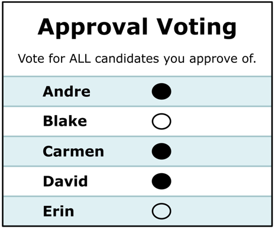
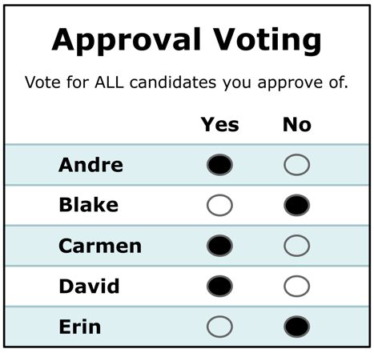

# Approval Voting

*The simplest equal-vote upgrade to Choose-One: mark **every** candidate you
approve (**1**) and leave the rest (**0**); the most-approved candidate wins.
It's Score voting at **one-bit resolution** — a big jump in expressiveness over
"vote for one," for almost no added ballot complexity.*

→ **Run it / examples:** the 101 case [`04_Approval/`](../../04_Approval/README_04_Approval.md)
([`approval_101_c3_b5.yaml`](../../04_Approval/_main/approval_101_c3_b5.yaml)) ·
the same five voters counted by Approval vs STAR vs RCV-IRV vs Score in
[`method_comparisons/black_curtain/`](../../method_comparisons/black_curtain/README_black_curtain.md)
(Approval flips the winner in election 1). · Companions: [honest limits](approval_honest_limits.md) ·
[multi-winner Approval](approval_multiwinner.md) · Curriculum: [301.4](../CURRICULUM.md).

---

**Approval Voting** hands every voter a checklist instead of a single choice.
You approve as many candidates as you like — one, three, all of them — and each
approval is worth one point. Add up the checkmarks; **whoever has the most
wins.** No ranking, no scores, no runoff: a normal ballot with the "vote for
only one" restriction removed.

## The ballot

A standard Approval ballot (mockups from the
[Equal Vote Approval page](https://www.equal.vote/approval)): one bubble per
candidate, mark everyone you approve. It can look identical to a traditional
ballot — only the "vote for one" instruction changes.

The **Yes / No ("double bubble") variant**: every candidate gets an explicit
Yes and No bubble, so a blank is distinguishable from a deliberate "No." This
is the ballot-security hardening discussed in
[honest limits §6](approval_honest_limits.md) — with single bubbles, filling
in *extra* bubbles on someone else's ballot would be undetectable.

That one change fixes Choose-One's core failure. Under Choose-One, approving your
sincere favorite (a long shot) *costs* you a vote against the front-runner you'd
settle for — the **spoiler / vote-splitting** trap. Under Approval you simply
approve **both** your favorite and the acceptable compromise, so supporting a
new candidate never splits your own side.

## The one decision Approval asks of you

Because the ballot is binary, Approval forces exactly one genuinely hard call:
**where to draw the approval line.** Approve too few and you can't help a
compromise; approve too many and you help a rival beat your favorite. That
threshold — and the fact that a checkmark can't say *how much* you approve — is
Approval's central limitation, explored in [honest limits](approval_honest_limits.md).

## Approval is Score at 1-bit resolution

An Approval ballot is just a **Score (0–5) ballot restricted to the two ends**,
`{0, max}`. That's the whole relationship: Approval keeps *who* you'd accept and
throws away *how much* and *in what order*. It's also why approval-style `0/1`
marks are perfectly legal on a STAR ballot — see
[`star_ala_approval.yaml`](../../01_STAR/_main/star_ala_approval.yaml). STAR keeps
the full 0–5 scale and adds the automatic runoff precisely to recover the
intensity and threshold information Approval discards (the
[fidelity ladder](../scores_and_ranks/fidelity_ladder.md);
[scores vs. ranks](../scores_and_ranks/scores_vs_ranks.md)).

## How it compares

| | **Choose-One** | **Approval** | **STAR** |
|---|---|---|---|
| Ballot | pick **one** | approve **any number** (0/1) | score each **0–5** |
| Approve favorite **and** compromise? | ❌ | ✅ | ✅ |
| Preference **strength**? | ❌ | ❌ | ✅ |
| **Order** among the ones you like? | ❌ | ❌ | ✅ |
| Spoiler / vote-splitting resistant? | ❌ | ✅ largely | ✅ |
| Forces a "where's my line?" decision? | — | ⚠️ **yes** | no (score each on its own) |
| Precinct-**summable**? | ✅ | ✅ | ✅ |

## Where it fits

Approval sits one rung above Choose-One in the equal-vote family, and it passes
the [Equal Vote / balance test](../STAR_Voting/equally_weighted_vote.md) (every
ballot has an exact opposite that cancels it). Its virtue is **simplicity** —
zero ballot redesign, trivial hand count — which makes it a strong first step for
an organization leaving plurality behind. Its ceiling is the binary ballot:
where a group wants to express *how strongly* or *in what order* it prefers
candidates, **STAR** is the fuller expression of the same idea. The
[Black Curtain](../../method_comparisons/black_curtain/README_black_curtain.md)
set makes the trade-off concrete: on identical ballots, Approval elects the
broadly-approved consensus candidate while STAR's runoff hands the seat to the
majority's favorite — same voters, different question.

## Practical strengths (beyond the ballot)

Several of Approval's advantages are logistical rather than mathematical —
they're what make it the *cheapest* reform to actually adopt
(the [Equal Vote Coalition's Approval page](https://www.equal.vote/approval)
makes this case at length):

- **Nothing to spoil.** There is essentially no way to mis-mark an Approval
  ballot: no overvotes, no invalid rankings, no skipped-rank rules. Every
  combination of marks is a valid ballot.
- **Works with existing infrastructure.** An Approval ballot can look
  identical to a traditional one, is tallied the same way (add the votes), and
  is precinct-summable — so it's highly compatible with existing election
  codes and equipment. RCV-IRV, by contrast, often requires new equipment,
  central tabulation, or statutory changes.
- **Campaign incentives.** Because candidates benefit from being *acceptable*
  to rivals' supporters, Approval rewards consensus-seeking and positive
  campaigning over base-only polarization.
- **Pairs well with a top-two general.** An Approval primary feeding a top-two
  general election is a minimal-change package that yields notably
  representative results.
- **Scales to multiple seats.** The same ballot handles multi-winner races
  (bloc counting) and can be adapted for proportional representation —
  see [multi-winner Approval](approval_multiwinner.md).

## The stepping-stone argument

Equal Vote's case for Approval is worth stating in its own terms: for a
jurisdiction on Choose-One (or a Choose-One primary + top-two runoff), there is
little reason *not* to switch to Approval immediately — the logistical change
is near zero and the improvement is real. In their assessment, with expected
voter behavior Approval also outperforms RCV-IRV at electing representative
winners, especially in large or competitive fields. And because Approval is
transparent about what it does and doesn't offer (no strength, no order — see
[honest limits](approval_honest_limits.md)), voters who live with it learn
firsthand that vote-splitting isn't a necessary evil — which builds the
appetite to upgrade to a fuller method like STAR later. A good stepping stone
is easy to reach, stable in its own right, and on the way to the next step.
The counterpoint, which Equal Vote also concedes: education-and-adoption work
is expensive even for Approval, so in many places going *directly* to STAR is
the quicker path. Either way, the urgent step is off Choose-One.

## See also

- [Approval — Honest Limits](approval_honest_limits.md) — the critique companion
- [Approval — Multi-Winner](approval_multiwinner.md) — bloc counting, SPAV/PAV
- [`04_Approval/`](../../04_Approval/README_04_Approval.md) — the method's example folder
- [Equal Vote: Approval Voting](https://www.equal.vote/approval) — advantages/disadvantages and the stepping-stone case
- [Black Curtain](../../method_comparisons/black_curtain/README_black_curtain.md) — Approval vs STAR vs RCV-IRV vs Score
- [The fidelity ladder](../scores_and_ranks/fidelity_ladder.md) · [scores vs. ranks](../scores_and_ranks/scores_vs_ranks.md)
- Glossary: **Approval voting** — [`GLOSSARY.md`](../GLOSSARY.md)

# file: approval_voting.md
