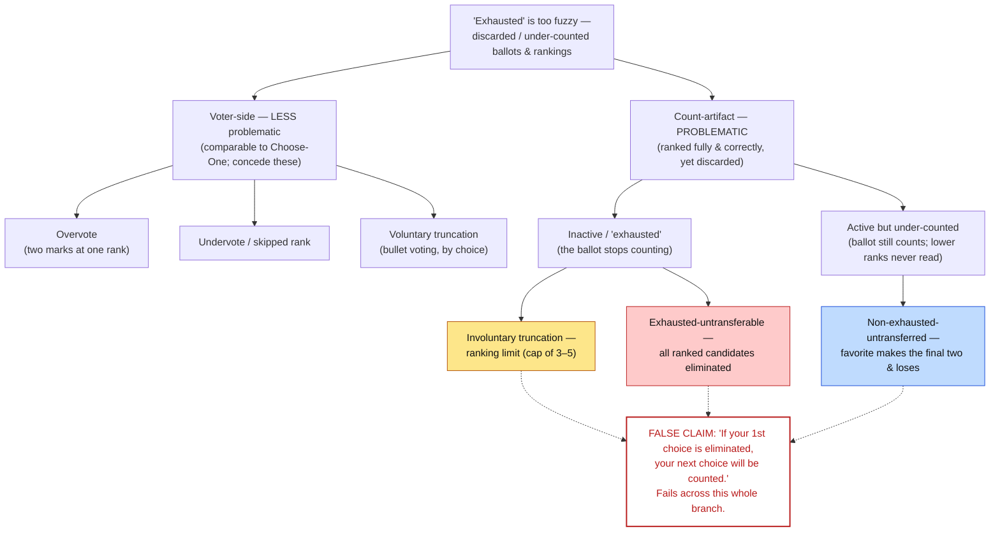

# "Exhausted Ballots" — What FairVote's Word Actually Hides

*The deepest RCV-IRV terminology trap. **"Exhausted ballot" is one word stretched over several very different things** — and that vagueness is the whole problem: it lets proponents wave the issue away by pointing at the harmless cases, while the **method-caused** cases — where a voter ranked everyone correctly and still had rankings thrown out — hide under the same label. This is a clarity page, not a hit piece: it states FairVote's own definition, steelmans their defense, then shows the distinctions the single word leaves out. Throughout, the contrast is STAR, which counts every ballot in both rounds, so nothing is ever "exhausted."*

→ Companions: [Exhausted (Inactive) Ballots — the concept page](RCV_IRV_exhausted_ballots.md) · [forced vs voluntary exhaustion](forced_vs_voluntary_exhaustion.md) · [are equal-score votes "discounted"?](../STAR_Voting/are_equal_score_votes_discounted.md) (the STAR side of this contrast) · one entry in the [RCV-IRV misconceptions & false claims index](rcv_irv_false_claims.md) · Glossary: [`Exhausted ballot`](glossary_rcv_irv.md)

---

## Precision first: exhaustion is an IRV thing, not a ranked-ballot thing

The single most useful correction: ballot exhaustion is a property of **IRV's eliminate-and-transfer count**, *not* of ranked ballots in general. The *same* ranked ballot, counted by **[Ranked Robin](../RCV_Ranked_Robin/ranked_robin.md)** or any Condorcet method, reads **every** ranking — nothing exhausts. Most voters actually assume that's how their ranked ballot is counted; almost everywhere it isn't (it's IRV).

So the precise sentence is *"**RCV-IRV** has exhausted ballots,"* never *"RCV has exhausted ballots."* (See [TIPS — terminology](../TIPS_terminology.md).) <!-- terminology-ok: quotes the imprecise phrasing to correct it -->

## What "exhausted" actually conflates — the taxonomy

FairVote's own definition (their FAQ) gives three reasons a ballot goes "inactive / exhausted": (1) the voter didn't rank all candidates and all their ranked candidates got eliminated — *"voluntary abstention,"* their most common case; (2) an administrator **ranking limit** (e.g. cap of 3) eliminated all their ranked candidates — *"involuntary";* (3) ballot **error**, e.g. the same rank twice (rare). Accurate as far as it goes — but it blurs two very different buckets:

**Bucket A — "this can happen under Choose-One too" (mostly voter-side):**

- **Overvotes** — marking two candidates at one rank; spoils that rank.
- **Undervotes / skipped ranks** — note the trap: in Choose-One an *undervote* is a blank, uncounted ballot; in RCV-IRV an "undervote" is a *single skipped ranking*, and the ballot may still count. Same word, different thing.
- **Voluntary truncation / bullet voting** — the voter chose to rank only one or a few.

These are roughly comparable to a Choose-One voter who skips the race or backs a sure loser. Concede them; they're not the interesting part.

**Bucket B — "purely a product of the elimination count" (the ones glossed over):**

- **Involuntary truncation (ranking limits).** You'd have ranked more, but the ballot only allowed 3–5; all of them got eliminated. You did nothing wrong. (This voter-vs-ballot-design split has its own page: [forced vs voluntary exhaustion](forced_vs_voluntary_exhaustion.md).)
- **Exhausted-untransferable.** Your *lower* choices were eliminated *before* your favorite, so when your favorite finally loses, the vote has nowhere left to go.
- **Nonexhausted-untransferred.** Your top *remaining* choice reaches the final round and **loses** — your lower preferences are simply never read, because counting stopped. (This one isn't even *labeled* "exhausted," yet the rankings still don't count — which is exactly why the famous promise is false.)

Bucket B is the part that's *purely* an artifact of IRV's round-by-round elimination. A voter who ranked everyone, correctly and completely, can still have real preferences discarded. *(On the Exhausted Ballots deck these are the **yellow** box = ranking-limit truncation, **red** box = exhausted-untransferable, and **blue** box = nonexhausted-untransferred.)* The vetted taxonomy (note that nonexhausted-untransferred is *active-but-under-counted*, not literally "inactive"):


```mermaid
flowchart TD
    R["'Exhausted' is too fuzzy —<br/>discarded / under-counted ballots & rankings"]
    R --> A["Voter-side — LESS problematic<br/>(comparable to Choose-One; concede these)"]
    R --> B["Count-artifact — PROBLEMATIC<br/>(ranked fully & correctly, yet discarded)"]

    A --> A1["Overvote<br/>(two marks at one rank)"]
    A --> A2["Undervote / skipped rank"]
    A --> A3["Voluntary truncation<br/>(bullet voting, by choice)"]

    B --> B1["Inactive / 'exhausted'<br/>(the ballot stops counting)"]
    B --> B2["Active but under-counted<br/>(ballot still counts; lower ranks never read)"]

    B1 --> Y["Involuntary truncation —<br/>ranking limit (cap of 3–5)"]
    B1 --> RR["Exhausted-untransferable —<br/>all ranked candidates eliminated"]
    B2 --> BL["Non-exhausted-untransferred —<br/>favorite makes the final two & loses"]

    F["FALSE CLAIM: 'If your 1st choice is eliminated,<br/>your next choice will be counted.'<br/>Fails across this whole branch."]
    Y -.-> F
    RR -.-> F
    BL -.-> F

    classDef yellow fill:#fde68a,stroke:#b45309,color:#111;
    classDef red fill:#fecaca,stroke:#b91c1c,color:#111;
    classDef blue fill:#bfdbfe,stroke:#1d4ed8,color:#111;
    classDef claim fill:#ffffff,stroke:#b91c1c,stroke-width:2px,color:#b91c1c;
    class Y yellow;
    class RR red;
    class BL blue;
    class F claim;
```

*Static version for slides:* [`inactive_ballot_taxonomy.svg`](inactive_ballot_taxonomy.svg)

## The false claim that the vague word protects

The line you'll hear: **"If your first choice is eliminated, your next choice will be counted."** It is false, and the fuzziness of "exhausted" is what lets it pass:

- If your favorite makes the **final two and loses**, your other rankings are *never read* — that's the nonexhausted-untransferred case.
- Your next choice may **already be eliminated** by the time your vote is free to move, so it transfers to nobody.
- Even the softer phrasing — *"next choice"* instead of *"second choice"* — is only *less wrong*, not right. And note the smuggled conflation of **"first choice"** with **"first round."**

The honest version is: *which* of your rankings get counted depends on the **order of elimination** — something you can't see or control.

### A concrete example — *which* ranks IRV threw away

27 voters, three candidates on a spectrum — a classic [center squeeze](RCV_IRV_center_squeeze.md) ([reader page](../../method_comparisons/center_squeeze/center_squeeze_pages/center_squeeze_star.md) · [`center_squeeze_star.yaml`](../../method_comparisons/center_squeeze/center_squeeze_star.yaml)):

| Voters | Their ballot (full ranking) | What IRV did with it | Rank IRV **never read** |
|---|---|---|---|
| 12 | Left > Center > Right | Left led every round and **won** | **Center (2nd)**, Right (3rd) |
| 9  | Right > Center > Left | Right reached the final two, then **lost** | **Center (2nd)**, Left (3rd) |
| 6  | Center > Left > Right | Center eliminated in round 1; ballot transferred to Left | Right (3rd) |

Here are IRV's rounds, straight from the engine: first choices are Left 12, Right 9, **Center 6** — so Center is eliminated first; its 6 ballots move to Left, and **Left wins 18–9.**

```text
--- RCV / Instant-Runoff Voting (single winner) ---
  Center squeeze — STAR elects the consensus (Center)
 Tabulating 27 ballots (converted from score ballots; 0 = unranked).

ROUND 1
Candidate      Votes  Status
-----------  -------  --------
Left              12  Hopeful
Right              9  Hopeful
Center             6  Rejected

FINAL RESULT
Candidate      Votes  Status
-----------  -------  --------
Left              18  Elected
Right              9  Rejected
Center             0  Rejected
```

Now look at the table's last column: **21 of 27 voters ranked Center *second*, and IRV read none of those rankings.** Left's and Right's voters never transferred (their first choice survived round 1), so their Center-2nd preference was simply never consulted.

What those ignored ranks would have said: **Center beats Left head-to-head 15–12** and **beats Right 18–9** — Center is the **Condorcet (pairwise) winner**, the candidate a majority prefers over *each* opponent. IRV eliminated Center anyway, for having the fewest *first* choices, without ever making those head-to-head comparisons.

> **This is the misconception in one line.** The public pictures RCV as *pairwise* — "my second choice gets compared head-to-head." That's a **Condorcet** count (**Ranked Robin**), **not IRV.** IRV only ever looks at each ballot's *top surviving* mark, so a second choice is read **only if** your current candidate is eliminated. Here, that meant 21 voters' decisive Center ranking never counted at all. <!-- terminology-ok: describes the public misconception, then corrects it -->

STAR (and Ranked Robin) read every ballot. The same 27 ballots through the LH STAR engine:

```text
--- STAR Voting Method (single winner) ---
 Tabulating 27 ballots.
Count × Left,Center,Right
   12 ×    5,     4,    3
    9 ×    3,     4,    5
    6 ×    4,     5,    3

Scoring Round
 The two highest-scoring candidates advance to the next round.
   Center        -- 114 -- First place
   Left          -- 111 -- Second place
   Right         --  99
 Center and Left advance.

Automatic Runoff Round
 The candidate preferred in the most head-to-head matchups wins.
   Center        -- 15 -- First place
   Left          -- 12
   Equal Support --  0
 Center wins.
```

The report's `[Divergence from STAR]` block makes the split explicit — Choose-One = Left, RCV-IRV = Left, STAR = Center — and the [full `_tabulated` mirror](../../method_comparisons/center_squeeze/center_squeeze_tabulated/center_squeeze_star_tabulated.txt) adds `Condorcet Winner: Center — matches the STAR winner`. Run both yourself from the repo root:

```text
python3 06_Other/RCV_IRV/RCV_IRV_tabulation_engine/rcv_irv_tabulation.py    method_comparisons/center_squeeze/center_squeeze_star.yaml   # Left wins; Center out in round 1
python3 STARVote_LH_tabulation_engine/starvote_larry_hastings.py method_comparisons/center_squeeze/center_squeeze_star.yaml   # Center wins; Condorcet = Center
```

## The "manufactured majority" — majority of *remaining* ballots

Because exhausted ballots leave the count, IRV's "50% + 1" is a majority of the ballots **still active**, not of all ballots cast. **[Alaska 2022 (US House special)](RCV_IRV_alaska_2022.md):** when Begich was eliminated, **11,243 ballots exhausted**; Peltola's 91,266 votes were **51.5% of the *remaining* ballots but only 48.4% of all Round-1 ballots** — a "majority winner" on a shrinking denominator.

It's systematic, not a one-off. A peer-reviewed study (Burnett & Kogan, *Electoral Studies*, 2015) of 600,000+ ballots across four California IRV elections found final-round exhaustion from **~9.6% to 27.1%** (Oakland's 2014 mayoral race ~24%) — and in **all four, the winner won with less than a majority of all ballots cast.**

## The honest steelman — and the precise response

**FairVote's defense:** *"In Choose-One, every vote not for the winner is 'wasted' too — so what's new?"* Fair, for **Bucket A**: a first-round bullet vote or a spoiled ballot really is comparable to Choose-One. Concede that cleanly.

**The response:** the comparison breaks on **Bucket B**. Those losses happen in **later** rounds, to voters who ranked **fully and correctly** — information they *did* express is discarded purely because of the elimination order. Choose-One has no equivalent, because Choose-One never asked for more than one mark. *That* asymmetry — not the harmless first-round cases — is the real criticism, and it's the one the overloaded word "exhausted" is so good at hiding.

## The STAR contrast: a declared tie is not a lost voice

This is why STAR sidesteps the entire mess: **STAR counts every ballot in both rounds.** Nothing is eliminated, so nothing exhausts. And a STAR **"no-preference"** ballot (equal scores on the two finalists) is the *opposite* of an exhausted one: it's **present data** — a voter who *declared a tie* — that **still counted in the scoring round** to help pick the finalists. It isn't missing information thrown away; it's information that says "I'm equally happy with either."

> **In RCV-IRV, an exhausted ballot is a voter who lost their voice. In STAR, an equal-score ballot is a voter who declared a tie.**

That distinction is the hinge, and it's developed in full on the companion page [are equal-score votes "discounted"?](../STAR_Voting/are_equal_score_votes_discounted.md) — with a runnable demo where the no-preference ballots *picked the finalists*, then stayed neutral in the runoff ([Equal Support in both rounds](../../01_STAR/_main/_main_pages/equal_support_runoff_demo.md)).

## The takeaway

"Exhausted" is one word covering five different situations — overvotes, skipped ranks, voluntary bullet votes, ranking limits, and the elimination-order cases — and only some of them are the voter's own doing. Split the word and the argument mostly resolves itself: concede the voter-side cases (Choose-One has those too), and hold IRV to account for the count-artifact cases, where a voter who ranked fully and correctly still had real preferences discarded by an elimination order they couldn't see or control. STAR never eliminates anyone, so nothing exhausts — every ballot is read in both rounds, and its closest lookalike, the equal-score ballot, is a declared tie, not a lost voice.

---

## Where this fits in the teaching

This is **Voting 301** objection-handling material ([curriculum 301.7](../CURRICULUM_301.md)) — it requires the audience already grasp IRV's round-by-round elimination, so don't open with it; with a general audience, the one-liner ("a declared tie, not a lost voice") is enough. It pairs with [favorite betrayal (301)](../STAR_Voting/favorite_betrayal_voting_301.md) (the *other* IRV-internals deep dive) and [are equal-score votes "discounted"?](../STAR_Voting/are_equal_score_votes_discounted.md) (the STAR no-preference side of this exact contrast). When you do deploy it:

- **Lead by splitting the word.** Half the disagreement evaporates the moment you separate Bucket A (fair) from Bucket B (method-caused).
- **Concede Bucket A immediately** — the candor is what earns the room for Bucket B.
- **End on STAR, not on IRV's flaws:** "counts every ballot, in both rounds."

Presenters: the matching slides are indexed by short name in [LINKS.md](../LINKS.md) — **Exhausted Ballots (deck)** (the red/blue/yellow-box flow chart), **Exhausted Ballots (doc)** (the full source notes), **Full Deck 2025** ("Ranked Choice Deal Breakers" / exhausted-ballot slides), and the **RCV-IRV exhausted-ballot source notes** group (wasted-votes glossary, ranking-limit, definition, tabulation-transparency, commentary). Terminology on this page is strictly **RCV-IRV / IRV** — exhaustion is IRV-specific; Ranked Robin and the Condorcet methods read every ranking ([TIPS — terminology](../TIPS_terminology.md)). Glossary entries: [Exhausted ballot](glossary_rcv_irv.md) · ["Equal Support / No Preference"](../GLOSSARY.md).

<!-- Sourced facts (verified 2026-06): Alaska 2022 US House special — 11,243
ballots exhausted on Begich's elimination; Peltola 91,266 = 51.5% of remaining /
48.4% of Round-1 ballots (Alaska Div. of Elections RCV tabulation; arXiv 2303.00108).
Final-round exhaustion 9.6%–27.1% across four California IRV elections, winner < a
majority of all ballots cast in all four: Burnett & Kogan, Electoral Studies 2015
(SSRN 2519723; 600,000+ ballots; Oakland 2014 mayoral ~24%). FairVote's 3-reason
definition: fairvote.org RCV FAQ. -->
