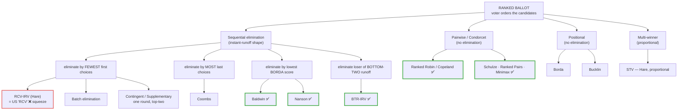

# Which RCV-IRV? — Hare and the Other Sequential-Elimination Methods

*Once you say "RCV-IRV," the next question is **which one**. "Instant runoff" names a shape — rank the ballots, eliminate, transfer, repeat — but the **elimination rule** and the **ballot rules** still have to be pinned down, and different choices crown different winners on the very same votes.*

---

## How the methods divide (family tree)

Every method below reads the **same ranked ballot**; they differ in *what they do with it*. ✅ marks the **Condorcet-safe** methods (always elect the head-to-head winner); ❌ marks Hare's **center squeeze**.

*The whole tree is **ranked** voting. Score/rate methods — **STAR**, **Approval**, **Score** — sit outside it entirely (voters rate rather than order), which is why they aren't on this chart. The single split that matters most: methods that **eliminate on first choices** (Hare, Contingent) can squeeze the center; methods that read the **whole ballot** (Borda-elim, BTR, and the Condorcet family) don't.*

---

## The default: RCV-IRV (Hare)

Unless someone says otherwise, "RCV" in the US means **IRV under the Hare rule** (after Thomas Hare): tally first choices; if a candidate has more than half, they win; otherwise **eliminate the candidate with the fewest first choices**, transfer each of those ballots to its next still-standing choice, and repeat until someone holds a majority of the remaining active ballots (or only two candidates are left). Everything below is a variation on *that* — either a different rule for **who gets eliminated**, or a different rule for **how the ballots are read**.

---

## Variants that change *who gets eliminated*

These keep the "instant runoff" shape but swap the elimination rule. They read an identical ranked ballot and can elect different winners.

| Variant | Elimination rule | Condorcet-safe? | Seen in the wild | Page |
|---|---|---|---|---|
| **Hare (standard IRV)** | drop the candidate with the **fewest first-place** votes, one per round | No (center squeeze) | US "RCV": Maine, Alaska, NYC, SF… | [Hare](../RCV-IRV-Hare.md) |
| **Batch elimination** | drop **all** candidates who are mathematically out of reach **at once** | Same winner as Hare in most cases; can differ at the margins | North Carolina statute; speeds hand counts | [Hare § batch](../RCV-IRV-Hare.md) |
| **Contingent vote** | **one** round only — eliminate everyone except the **top two**, then transfer | No | Sri Lanka presidency (rank up to 3) | [Contingent & SV](RCV-IRV-contingent-supplementary.md) |
| **Supplementary vote** | contingent vote with the ballot **limited to 1st + 2nd** choice | No | London Mayor / English PCCs **until 2022** (now first-past-the-post) | [Contingent & SV](RCV-IRV-contingent-supplementary.md) |
| **Bottom-Two-Runoff (BTR-IRV)** | each round, the **two lowest** candidates meet head-to-head; the **loser** is eliminated | **Yes** — a Condorcet winner can never be cut | proposed reform (Rob LeGrand, 2006) | [BTR](RCV-IRV-BTR.md) |
| **Coombs** | drop the candidate with the **most last-place** votes, each round | No, but resists center squeeze | rare; classroom / academic | [Coombs](RCV-IRV-Coombs.md) |
| **Baldwin** | drop the candidate with the **lowest Borda score**, each round | **Yes** | academic | [Baldwin & Nanson](RCV-IRV-Baldwin-Nanson.md) |
| **Nanson** | drop **every** candidate at or below the **average Borda score**, each round | **Yes** | academic; some org elections | [Baldwin & Nanson](RCV-IRV-Baldwin-Nanson.md) |

Two things worth underlining. First, **Hare is the only one of these the US actually calls "RCV"** — but it's also the one prone to *center squeeze* (eliminating a broadly-liked middle candidate who'd beat everyone head-to-head). Second, the **Condorcet-safe** variants (BTR, Baldwin, Nanson) fix that specific flaw precisely because they stop eliminating purely on first-choice counts. (Borda and Coombs read whole ballots but are **not** Condorcet methods; BTR/Baldwin/Nanson are.)

> **Where does Ranked Robin fit?** It doesn't eliminate at all — **RCV-RR** (Ranked Robin / Copeland) compares every pair head-to-head and elects whoever wins the most matchups. It's the round-robin alternative to sequential elimination. See [`../RCV_Ranked_Robin/`](../../RCV_Ranked_Robin/).

---

## Same Hare rule, *different results*: the implementation knobs

Even two elections that both run plain Hare IRV can disagree, because real ballots force choices the textbook glosses over:

- **How many candidates you may rank.** NYC allows **5**; San Francisco long allowed only **3**; Sri Lanka **3**. A shorter ballot means more **exhausted ballots** (a ballot whose every ranked candidate has been eliminated), which changes the denominator and can change the winner.
- **Batch vs. one-at-a-time elimination.** Dropping several hopeless candidates at once usually matches single elimination, but not always at the margins.
- **What "majority" counts against.** A **majority of *continuing* ballots** (exhausted ballots excluded) vs. a **majority of *all* ballots cast** are different thresholds — the first is how most US IRV laws declare a winner.
- **Equal ranks and skipped rankings.** Pure IRV forbids equal ranks; jurisdictions differ on whether a skipped rank ends the ballot or is passed over.
- **Tie-breaks.** Who gets eliminated when two candidates are tied for last is set by statute (lot, prior round, etc.) and can flip a close result. Because ranks carry no strength signal, there's often little to break the tie *with*, so it falls to chance sooner than in a score method — see [Tie-Breaking: STAR vs. RCV-IRV](../../topics/ties/tiebreaking_star_vs_irv.md) for why strict ranks make ties *harder* to resolve, not easier.

This is why a precise reference says not just "IRV" but the **whole rule set** — the elimination rule *plus* the ballot rules.

---

## Multi-winner: the same Hare family, renamed STV

For several seats at once, the Hare idea becomes the **Single Transferable Vote (STV)** — proportional, not majoritarian. Instead of "win a majority," a candidate must **reach a quota** (the Droop quota, `⌊total ÷ (seats + 1)⌋ + 1`); a candidate over quota is elected and the **surplus** above it transfers to next choices, while last-place candidates are eliminated and transfer downward, until every seat is filled. Run STV with a single seat and it reduces exactly to **IRV-Hare** — siblings, not separate inventions. (FairVote promotes IRV-Hare for one seat and STV for many; both are "RCV.")

---

## So which label should I use?

| Context | Use |
|---|---|
| Everyday / public-facing (slides, intro talks, op-eds) | **RCV-IRV** — clear enough; "(Hare)" is over-precise here |
| The elimination rule is the actual point (comparing variants, this page) | **RCV-IRV (Hare)** — names the exact rule |
| Statutes, specs, academic papers, or any place a reader could assume Coombs/BTR/Baldwin | **RCV-IRV (Hare)** + the ballot rules (rankings allowed, majority basis) |
| Multi-winner / proportional | **STV** |
| The pairwise, no-elimination alternative | **RCV-RR** (Ranked Robin) |

**Short version:** insisting on bare **RCV-IRV** is right for everyday use — it already rules out STV, Ranked Robin, Approval, and STAR. Escalate to **RCV-IRV (Hare)** only when the *elimination rule itself* is on the table, because that's the moment "RCV-IRV" stops being specific enough.

---

## Related concept pages

- [RCV vs. IRV vs. RCV-IRV — a note on terminology](../RCV-IRV-confusing-name.md) — why "RCV" is a confusing name
- [RCV-IRV center squeeze](../RCV_IRV_center_squeeze.md) — the flaw the Condorcet-safe variants fix
- [RCV-IRV exhausted ballots](../RCV_IRV_exhausted_ballots.md) — the ranking-limit knob, in depth
- [RCV-IRV non-monotonicity](../RCV_IRV_non_monotonicity.md)
- See also the repo terminology canon: `00_start_here/tips/TIPS_terminology.md` and `GLOSSARY.md`

## Learn more — external resources

- [Instant-runoff voting — Wikipedia](https://en.wikipedia.org/wiki/Instant-runoff_voting)
- [Nanson's method — Wikipedia](https://en.wikipedia.org/wiki/Nanson%27s_method)
- [Supplementary vote — Wikipedia](https://en.wikipedia.org/wiki/Supplementary_vote)
- [Electoral Commission — changes to mayoral & PCC voting (Elections Act 2022)](https://www.electoralcommission.org.uk/news-and-views/elections-act/changes-voting-system-mayoral-and-pcc-elections)
- [NYC Board of Elections — Ranked Choice Voting (rank up to 5)](https://www.vote.nyc/page/ranked-choice-voting)
- [Descriptions of ranked-ballot voting methods (R. LeGrand, Angelo State)](https://www.cs.angelo.edu/~rlegrand/rbvote/desc.html)
