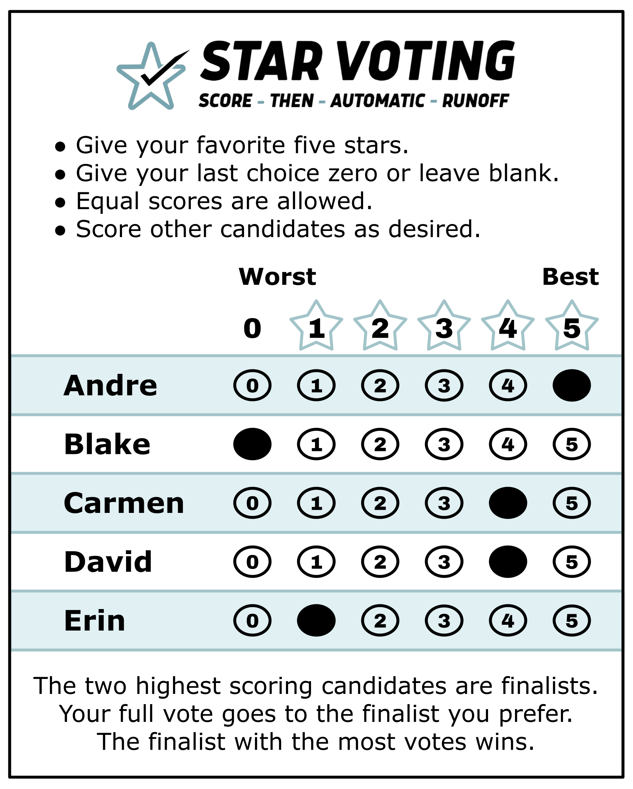

# The STAR Voting Ballot

*One ballot, scored 0–5. This page shows what a STAR ballot actually looks like and walks through a few filled-out examples — every one of them legal, every one counted.*

---

A STAR ballot asks one thing: **score each candidate from 0 to 5 stars**, exactly like rating movies or restaurants. Two rules make it almost impossible to spoil:

- **Equal scores are allowed** — two candidates can share a 5 (or a 0). You're never forced to invent a preference you don't feel.
- **Skipping is fine** — a candidate you leave blank simply counts as 0. You can't over-vote or double-mark your way to a spoiled ballot.

## What it looks like

Here is the official STAR ballot, filled out by one voter — favorite (Andre) marked 5, least favorite (Blake) left at 0, the rest scored honestly in between:

*Official STAR Voting ballot design — © [Equal Vote Coalition](https://www.equal.vote/star), used by permission.*

The four instructions printed on it are the whole method:

- Give your **favorite 5 stars**.
- Give your **last choice 0** (or leave it blank).
- **Equal scores are allowed.**
- **Score everyone else** wherever they honestly land.

## A few example ballots

There's no single "right" way to fill it out. Here are three voters in the same race — the same five candidates as the ballot above, **Andre, Blake, Carmen, David, Erin** — each voting honestly, in a different style:

| Voter's style | Andre | Blake | Carmen | David | Erin | What the ballot says |
|---|--:|--:|--:|--:|--:|---|
| **Bullet vote** | 5 | 0 | 0 | 0 | 0 | "Andre, and no one else." Legal — but if Andre misses the runoff, this ballot has no say in the final head-to-head. |
| **Honest spread** | 5 | 0 | 4 | 4 | 1 | "Love Andre; Carmen and David nearly as good; Erin barely; Blake no." Uses the full range — and it's exactly the ballot pictured above. |
| **Equal top** | 5 | 5 | 0 | 0 | 0 | "Andre or Blake, either is great." If both reach the runoff it counts as [Equal Support](../GLOSSARY.md) — no preference between them — but it still helped choose the finalists in the scoring round. |

Every one of these counts. And a backup score — the 4s for Carmen and David in the honest-spread row — can **never** hurt your favorite (Andre) in the scoring round: a 5 is a 5 no matter what else you mark. So honest rating is also the smart rating; you never have to exaggerate or hold back.

## Learn more

- The full gallery of legal styles — strong/weak backups, "anyone but…", protest votes, all in one worked election: [the STAR ballot & its voting styles](STAR_ballot_voting_styles.md).
- The ballot in its family — score vs ranked vs yes/no: [The Score Ballot](../scores_and_ranks/score_ballot.md) · [alternate ballot styles, one voter three ballots](../topics/ballot_styles.md).
- Back to the five-minute intro: [Welcome to STAR Voting](STAR_start_here.md).

## Sources

- [Equal Vote Coalition — STAR Voting](https://www.equal.vote/star) — official ballot design (used by permission)
- [starvoting.org](https://www.starvoting.org) · [bettervoting.com](https://bettervoting.com)
