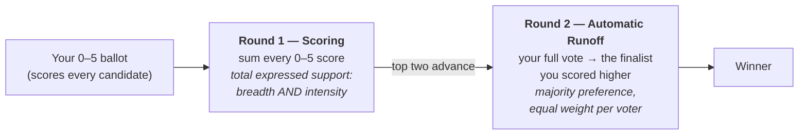

# The STAR second round — FAQ, and how to answer twisted claims

*Everything people push back on about STAR's **automatic runoff** (the "second round"), sorted into what's a fair point, what's misleading, and what's simply false — plus the one honest philosophical trade-off worth conceding.*

→ Mechanics: [The Automatic Runoff](STAR_Automatic_Runoff.md) · [Why two rounds?](STAR_start_here.md) · the caveats: [STAR's honest limits](STAR_honest_limits.md) · official: [starvoting.org/why_the_runoff](https://www.starvoting.org/why_the_runoff).

---

## First, what each round actually measures

Most bad-faith arguments start by mislabeling the two rounds. Get this straight and half the "gotchas" evaporate:



- **Round 1 (scoring) already captures breadth.** A candidate can top the score round with a pile of moderate 3s and 4s (broad, mild support) *or* with fewer intense 5s. It rewards *total expressed support* — breadth and intensity together. This is where the expressive, "how much" signal lives.
- **Round 2 (the runoff) is the majoritarian check.** Among the top two, every ballot counts as **one full vote** for whichever finalist it scored higher (equal weight, regardless of the gap). It asks: does the score leader actually beat the runner-up when every voter counts equally? That guards against a candidate riding lopsided intensity from a minority — [Score voting's known weakness](https://www.starvoting.org/why_the_runoff) — and guarantees the winner is *majority-preferred over the runner-up*.

So the honest one-liner: **Round 1 measures how much support each candidate has; Round 2 checks that the leader can actually win a majority head-to-head.** (If someone says "round one is intensity, round two is breadth," they've got it backwards — the breadth is already in the scores.)

## The claims, sorted

| Claim you'll hear | Verdict | The honest answer |
|---|---|---|
| "The runoff **throws your scores in the garbage**." | ❌ False | Your scores did the most important job — they chose the two finalists. In the runoff your ballot is still counted, as one vote for the finalist you scored higher. Nothing is discarded. |
| "If my favorite isn't a finalist, **my ballot doesn't count** in the runoff." | ❌ False | It counts for whichever *finalist* you scored higher. Score your favorite 5 and the finalists 3 and 2? Your full vote goes to the 3. You're only "no preference" if you scored the two finalists **equally** — and that's your own stated intent, not disenfranchisement. |
| "Equal-score voters are **silenced** in the runoff." | ⚠️ Misleading | Their scores were fully counted in Round 1 (helping pick the finalists). Scoring the two finalists equally means "I'm happy with either" — counted exactly as intended. It doesn't tip a race you said you're neutral on. |
| "STAR is just **IRV with extra steps**." | ❌ False | IRV eliminates and transfers over *many* rounds and only ever looks at each ballot's current top choice. STAR has **one** runoff, between the two highest-scored candidates, using your *whole* ballot at once. Different ballot, different count, different failure modes. |
| "A **50.1% runoff isn't 'broad support'**." | ⚠️ Half-fair | Correct that "wins the runoff" means "majority-preferred over the *runner-up*," not "loved by all." But breadth was already measured in Round 1 (the score totals). The runoff adds the majority check on top; it doesn't claim to be the breadth measure by itself. Cite both numbers, not just one. |
| "The **highest scorer should always win** — a reversal is a bug." | ⚠️ Philosophical | This is the real debate (see below). It's a deliberate design choice, not a malfunction: STAR trades a little cardinal-utility maximization for majoritarian legitimacy. Reasonable people weight those differently. |
| "STAR can elect someone who **loses head-to-head to a third candidate** (fails Condorcet)." | ✅ True | Genuine limit. STAR only runs the runoff between the top *two* scorers, so it can miss a Condorcet winner who scored third. It's **rare** in practice and STAR still usually elects the Condorcet winner — but yes, not always. See [honest limits](STAR_honest_limits.md) and [three notions of winner](STAR_three_winner_notions.md). |
| "Two rounds is **too complicated** for voters." | ⚠️ Weak | Voters do one thing: score 0–5, like rating movies. The two rounds are how it's *counted*, not extra work at the ballot box — and it's fully [summable / hand-countable](STAR_summability.md). Choose-one is simpler to count and far worse at representing people. |
| "The runoff **punishes enthusiasm** / builds a beige government." | ⚠️ Philosophical | Same trade-off as the reversal debate. STAR does deliberately stop a passionately-loved *minority* candidate from beating a broadly-preferred one — most people call that a feature, but it's a values question, not a factual error. |

## The Runoff Reversal — the honest core of the debate

A **Runoff Reversal** is when the candidate with the highest *score total* loses the *runoff* to the second-highest scorer. The engine even names it and refuses to call it a bug:

```
[Runoff Reversal]
 - Score Round Winner(s) = (Uma)
 - Runoff Round Winner   = (Rye)
  Candidate Uma earned the highest total score, but
  Candidate Rye won the automatic runoff — not a malfunction,
  STAR working as designed: the runoff elects the finalist preferred
  by the majority (of voters with a preference).
```

But be honest: **not all reversals are equally convincing.** Some clearly serve the majority; some are genuinely debatable. Show both.

### Scenario A — a *convincing* reversal (the runoff earns its keep)

Three candidates, 100 voters: Max is a **passionate-minority favorite**, Nora the **broad compromise**, and Cal a no-hoper who never reaches the runoff.

```
Ballots:            Max  Nora  Cal
  45 voters      ×   5    2    0     (Max's intense base)
  55 voters      ×   2    3    1     (mildly prefer Nora)

Round 1 (scores):  Max 335  ·  Nora 255  ·  Cal 55   → Max & Nora are finalists (Cal drops)
Round 2 (runoff):  Nora 55  vs  Max 45               → Nora WINS
```

Max's high total came from 45 people who love him. But **55 of 100 prefer Nora.** Pure Score voting would crown Max on the strength of an intense minority; STAR's runoff catches that a *majority* actually wants Nora. Here almost everyone nods — the reversal is obviously right.

*Reproduce it:* [`reversal_convincing_c3_b100.yaml`](../../01_STAR/runoff_overturns_leader/reversal_convincing_c3_b100.yaml).

### Scenario B — a *jarring* reversal (the real philosophical drawback)

Same setup, different electorate. Uma is a **near-consensus, high-utility** candidate, Rye is **polarizing**, and Tao is a no-hoper.

```
Ballots:            Uma  Rye  Tao
  51 voters      ×   4    5    0     (love Rye, but Uma is a strong 4)
  49 voters      ×   5    0    1     (love Uma, reject Rye)

Round 1 (scores):  Uma 449  ·  Rye 255  ·  Tao 49   → Uma & Rye are finalists
Round 2 (runoff):  Rye 51  vs  Uma 49               → Rye WINS   (Uma avg 4.5 vs Rye 2.6)
```

Uma is nearly everyone's near-favorite — a 4.5/5 average, *almost twice* Rye's total. Yet Rye wins the runoff by a single vote, 51–49. A pure utilitarian says STAR just elected the candidate who makes the electorate **less happy overall**, on a razor-thin ordinal majority, and threw away a huge cardinal signal. A majoritarian says: 51 people preferred Rye, and "more than half preferred them" is the most legitimate thing an election can say.

*Reproduce it:* [`reversal_jarring_c3_b100.yaml`](../../01_STAR/runoff_overturns_leader/reversal_jarring_c3_b100.yaml).

**Concede it plainly:** this is a genuine philosophical drawback of STAR, not a bug to explain away. STAR is a **hybrid** — a cardinal (score) ballot with an ordinal (majority) finish — and Scenario B is exactly where those two values pull apart. STAR chooses majority preference over utility maximization at the final step. That's defensible, and it's also a real cost; whether it's the right call depends on whether you think an election should maximize total satisfaction or honor majority rule. (Score-voting advocates would elect Uma; STAR and every majoritarian method elect Rye.)

## How to argue it well

1. **Lead with the honest concession, then reframe.** "Yes, STAR fails the Condorcet criterion and yes, the score leader can lose — here's why that's a deliberate majoritarian choice." Owning the limit disarms the gotcha and builds trust; overselling invites backlash.
2. **Always cite both numbers.** The score total *and* the runoff margin. Most twisted claims work by quoting one and hiding the other.
3. **Separate facts from values.** "Scores are thrown away" is a factual error you correct. "The highest scorer should always win" is a values position you engage — don't treat a philosophical disagreement as if it were a factual mistake, or you'll sound evasive.

## Related

- [The Automatic Runoff](STAR_Automatic_Runoff.md) · [runoff percentages / two denominators](runoff_percentages.md) · [STAR's hybrid nature](STAR_hybrid_nature.md)
- [Three notions of "winner"](STAR_three_winner_notions.md) (score / runoff / Condorcet) · [STAR's honest limits](STAR_honest_limits.md)
- [Aren't equal-score votes discounted? (conversation)](are_equal_score_votes_discounted.md)
- Runoff-reversal case files in the repo: [`01_STAR/runoff_overturns_leader/`](../../01_STAR/runoff_overturns_leader/)
- Official: [Why bother with the automatic runoff?](https://www.starvoting.org/why_the_runoff) · [Equal preference votes](https://www.starvoting.org/equal_preference)
