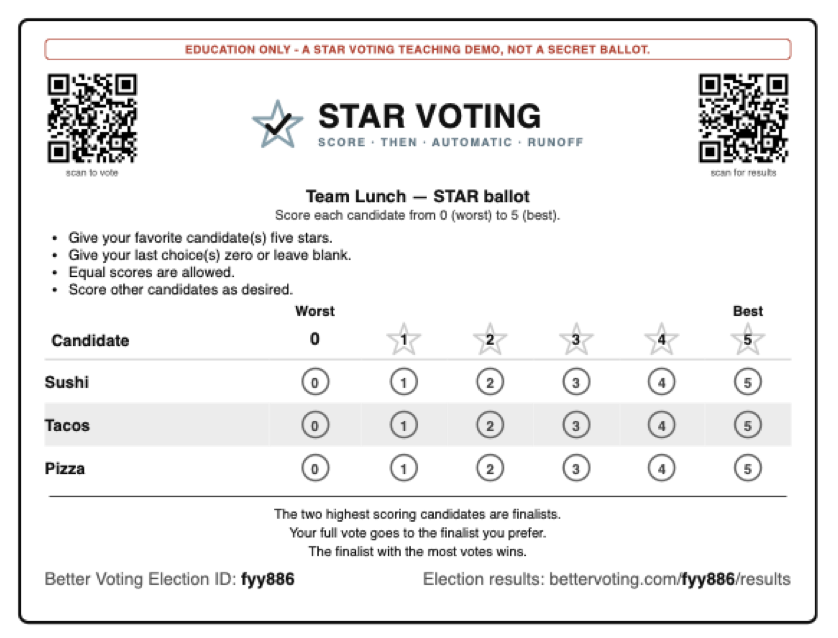
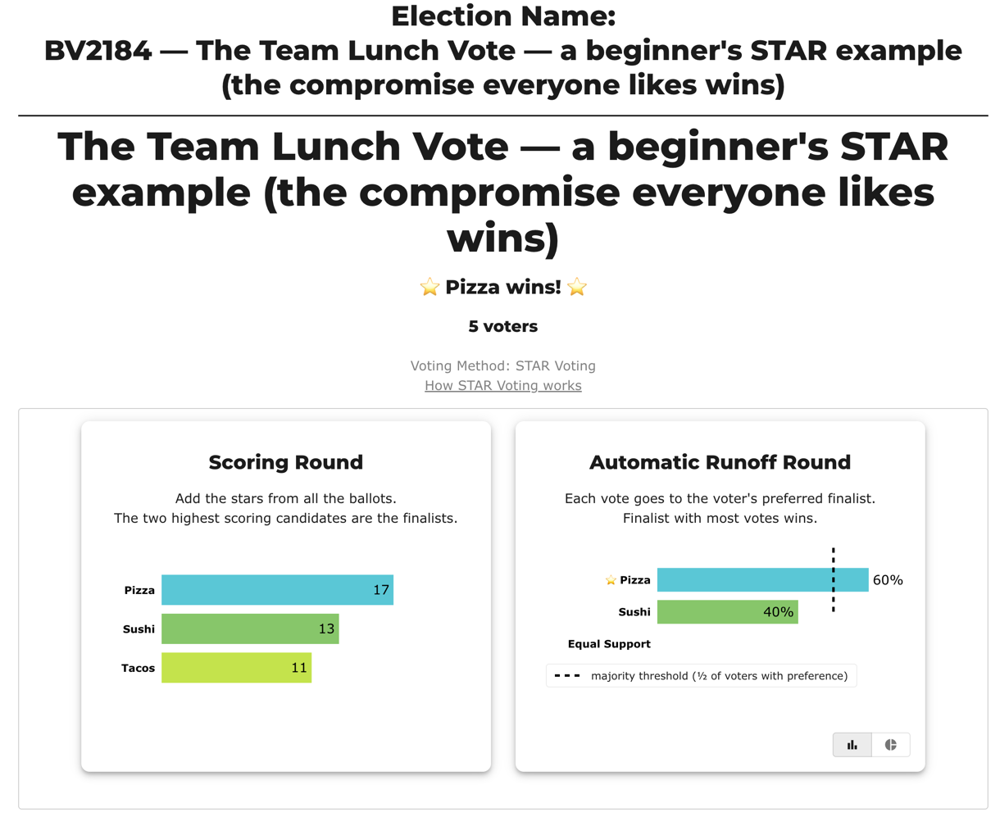

# Welcome to STAR Voting 👋

**New here? You're in exactly the right place.** No background needed, about five minutes, and not a word of politics. By the end you'll know what STAR Voting is — and *feel* why it picks winners people actually like.

Here's the plan: we'll start with a small, familiar problem, watch the usual way of voting get it wrong, then meet the fix. That's it. Ready?

---

## First, a problem you already know: the team lunch

Five coworkers are picking lunch. Two of them love **Sushi**, two love **Tacos**, and everyone — every single person — is perfectly happy with **Pizza**.

They vote the usual way: **everyone names one favorite.**

> **Sushi 2 · Tacos 2 · Pizza 1**

The two adventurous camps *split*, so lunch comes down to a coin flip between Sushi and Tacos — and **Pizza, the one option nobody objected to, finishes last.** Half the team ends up with something they didn't want.

That's **vote-splitting**, and it isn't just about lunch. It's the same thing that makes people vote for the "lesser evil" in real elections instead of who they actually like — a similar candidate enters, the vote splits, and someone the majority *didn't* want can win. (The formal name is the [spoiler effect](../spoiler_effect.md).)

The trouble isn't the voters. It's the *ballot*: "pick one" throws away everything except your single favorite.

## Meet STAR — in one breath

STAR asks for a little more, using two things you already know:

- **Rate every option 0 to 5 stars** — exactly like a Yelp or Amazon review. (Give your favorite 5, something you can't stand 0, and everything else wherever it honestly lands.)
- **Then the two highest-rated options have a final runoff** — head-to-head, like a championship.

That's the name: **S**core **T**hen **A**utomatic **R**unoff. One ballot; the "runoff" happens automatically in the count.

**And here's the ballot the five coworkers would actually fill out** — the official STAR ballot design, printed for this very lunch election (it's real: the QR codes go to the live election on BetterVoting):



The official [Equal Vote Coalition](https://www.equal.vote/star) rules, in four lines:

- Give your **favorite** **5 stars**.
- Give your **last choice 0** (or just leave it blank).
- **Equal scores are allowed** — you're never forced to invent a preference you don't feel.
- **Score everyone else** wherever they honestly land, 0 to 5.

→ [the STAR ballot & the ways to fill it out](STAR_ballot_voting_styles.md).

## Watch STAR fix the lunch

Same five people, same feelings — but now each of them **rates all three** (5 = love it, 3 = fine, 0 = no):

Run it yourself: [`bv2184_fyy886_lunch_vote.yaml`](../../01_STAR/_main/bv2184_fyy886_lunch_vote.yaml) · [reader page](../../01_STAR/_main/_main_pages/bv2184_fyy886_lunch_vote.md) · **[see it live on BetterVoting ↗](https://bettervoting.com/fyy886/results)**.

```
                    Sushi   Tacos   Pizza
  2 Sushi-lovers      5       0       3
  2 Taco-lovers       0       5       3
  1 Pizza-fan         3       1       5

  Round 1 — add the stars:  Pizza 17 · Sushi 13 · Tacos 11   → Pizza & Sushi advance
  Round 2 — the final two:  Pizza 3  vs  Sushi 2             → Pizza wins
```

Here's that exact election counted on real software — the same two rounds, live on BetterVoting:



*(The runoff bars read **60% vs 40%** — that's the same **3 of the 5 people vs 2** from Round 2, just shown as a share.)*

In plain English:

- **Round 1 just adds up the stars.** Pizza collects 17 (a 3 or a 5 from *everyone*), the most — so Pizza and Sushi become the two finalists, and Tacos is out.
- **Round 2 is a simple head-to-head between those two finalists.** Each person's ballot counts as **one vote**, for whichever finalist they rated higher. **Three** people scored Pizza above Sushi; **two** scored Sushi above Pizza. So **Pizza wins the final, 3 to 2** — an actual majority.

**Pizza wins** — the option *everyone* was happy with. It got only one first-place vote, so "pick one" buried it; but because STAR reads the *whole* ballot, the broad, quiet support shows up. Nobody had to vote strategically, and nobody's stuck with a 0.

*(For contrast: Choose-One and Instant-Runoff both pick Sushi here. Same voters, same feelings — the method decides.)*

## The one idea worth pausing on: why *two* rounds?

Because the two rounds measure two different things:

- **The Scoring Round measures *how much* support** — add up the stars, and the two strongest options become finalists.
- **The Automatic Runoff measures *how many* supporters** — each ballot goes to whichever finalist it rated higher; the finalist more people preferred wins.

> Strength of support finds the real contenders → number of supporters decides between them.

The part that takes a moment to click is what happens to *your* ballot in the second round. Follow one voter's ballot all the way through — Sofia, one of the two Sushi-lovers from the lunch:

 3), so her whole ballot becomes a single vote for Sushi. In the runoff her 5 and 3 collapse to one vote, for whichever finalist she preferred.">

So your scores do two jobs: their *size* helps pick the two finalists, and then, in the runoff, they shrink to a single **vote for whichever finalist you rated higher**. A 5-vs-3 and a 5-vs-0 count exactly the same in that final step — one vote each. Once that lands, STAR makes sense.

And notice how Sofia's story ends: her runoff vote went to Sushi, and Sushi still lost the final, 2 to 3. She wasn't cheated — she was **outvoted**, fair and square. Meanwhile the 3 stars she gave Pizza had already done real work in Round 1, helping the option she was happy with reach the final at all. That's an honest ballot doing exactly what it should: full say in who the finalists are, one equal vote between them.

Why not just add up the stars and stop? Because then you'd be tempted to game it — give your favorite 5 and everyone else 0, so your ballot "shouts" loudest. The runoff quietly removes that temptation: in the final, your big scores and small scores count the same (one vote for whichever finalist you preferred). So **honest rating is also the smart rating** — you never have to exaggerate or hold back.

One nuance you can now name: if you rate the **two finalists** the *same*, your ballot counts as **"no preference"** between them (this tool calls it **Equal Support**) — a 5/5 means "either is great," a 0/0 means "I dislike both equally." Either way your ratings still counted fully in Round 1, where they helped choose the finalists.

## What this means for you

- **You can be honest.** Score your favorite a 5 *and* a backup a 4 — you never split your own vote.
- **No ["wasted" votes](../wasted_votes.md).** Supporting someone who can't win no longer helps elect someone you dislike — the [spoiler effect](../spoiler_effect.md), gone.
- **It's one ballot**, not a separate primary and general election.

→ The fuller case (with the honest caveats): [The benefits of STAR Voting](STAR_benefits.md).

*Thinking "wait, but isn't it just averaging? / a wasted 0? / a second election?"* — the honest, plain-language answers: [Common misunderstandings](common_misunderstandings.md).

## Where to go next

You've seen the two rounds turn once. Now watch them on more elections, smallest first:

| Step | Read in order | What you'll see |
|---|---|---|
| **Three candidates** | [one ballot](../../01_STAR/_main/_main_pages/02a_c3_b1_three-candidates.md) · [two ballots](../../01_STAR/_main/_main_pages/02b_c3_b2_three-candidates.md) | A third option, and the winner becomes the broad compromise — the lunch, formalized in the smallest possible way. |
| **Ways to vote** | [the eight-style gallery](../../01_STAR/_main/_main_pages/03c_c6_b8_style-gallery.md) | Bullet votes, equal scores, "anyone but…" — all the honest ways to fill it out. |
| **The classic** | [Tennessee capital](../../01_STAR/_main/_main_pages/09_c4_b100_tennessee-capital.md) | The textbook example, with the same shape as the lunch. |
| **Do it yourself** | [Count a STAR election by hand](count_star_by_hand.md) | Tally the lunch with pencil and paper — proof that STAR is genuinely simple to count. |

Then, when you're ready: **the two rounds in depth** ([Scoring Round](STAR_Scoring_Round.md) · [Automatic Runoff](STAR_Automatic_Runoff.md)), the [full learning path (101 / 201 / 301)](../CURRICULUM.md), and — if you want the *political* case — [two-party dominance](../two_party_dominance.md) and [Why STAR Voting](../Why_STAR_Voting.md).

**Try it for real:** cast a STAR ballot or run your own election at [bettervoting.com](https://bettervoting.com).

## Sources

- Equal Vote Coalition — [STAR Voting overview](https://www.equal.vote/star)
- ["How Does STAR Voting Work?" (short video)](https://www.youtube.com/watch?v=fKg0fRL88zc)
- [bettervoting.com](https://bettervoting.com) · [help, FAQ & hand-count guides](https://docs.bettervoting.com)
- **More explainers, videos & guides:** [STAR Voting — resources & further watching](STAR_resources.md)

---

*Up: [Start Here](../00_START_HERE.md) (all methods, method-neutral) · [more STAR concept pages](README.md).*
