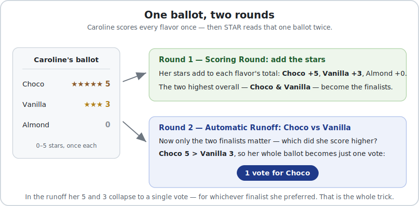
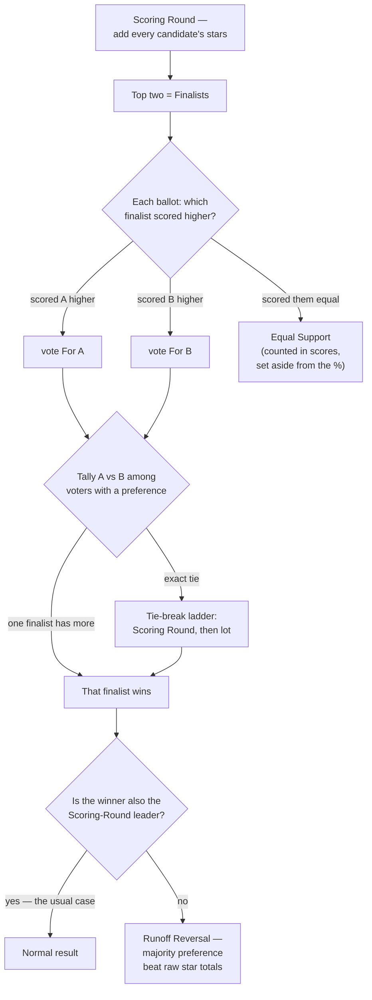

# The Automatic Runoff Round

**One line:** STAR's second step. The Scoring Round picks the **two finalists**; the **Automatic Runoff** then looks *only* at those two and gives each ballot's full vote to whichever finalist it scored higher. **The finalist more voters prefer wins** — which is not always the one with the most stars. That second step is the whole point of STAR (**S**core **T**hen **A**utomatic **R**unoff).

→ Round 1: [The Scoring Round](STAR_Scoring_Round.md) · the whole report, section by section: [Reading a STAR report](../../tabulation_engines/LH_starvote/reading_a_star_report.md) · the two-step count vs IRV: [Tabulation, step by step](../../topics/tabulation_star_vs_irv.md) · how it's displayed: [STAR Reporting](../../STAR_reporting/).

> Pushback on the runoff (why not just the scores? isn't the reversal a bug? are equal-score votes wasted?) → [The second round — FAQ & how to answer twisted claims](STAR_second_round_FAQ.md).

---

## First, the whole idea on one ballot

New to the runoff? Before the buckets and denominators below, just watch what STAR does to a **single** ballot — read once to help pick the finalists, then again as one vote between them:

 3), so her whole ballot becomes a single vote for Choco. In the runoff her 5 and 3 collapse to one vote, for whichever finalist she preferred.">

The key move is in Round 2: your scores **shrink to a single vote** for whichever finalist you rated higher — a 5-vs-3 and a 5-vs-0 count exactly the same there. Size chose the finalists; direction chooses the winner. Everything below is the precise version of that.

---

## Why a second step at all?

The key contrast is **how much vs how many.** The Scoring Round measures *how much* support each candidate has; the runoff counts *how many* voters prefer each finalist. Points and people aren't the same thing — a candidate's total can be lifted by a handful of very high scores, while the runoff gives every voter exactly **one** vote between the two finalists. So the runoff is what makes the winner the **majority's** choice, not just the biggest pile of stars.

It also keeps the ballot **honest**. Without a runoff, the smart way to vote in a pure scoring election is to give your favorite a 5 and everyone else a 0 — any in-between score only helps a rival catch up. If everyone does that, the 0–5 ballot collapses to just 0s and 5s, which is **[Approval voting](../../GLOSSARY.md)**: strategic score voting *degenerates into Approval*, and the expressive scale stops meaning anything. STAR's runoff removes that incentive — because it only asks which finalist you scored higher, your honest 3s and 4s still do real work, so you never have to exaggerate. **The runoff is what lets STAR keep an expressive ballot people can use honestly.**

## Why the top scorer can sometimes lose (made intuitive)

A score total **can't tell your #1 from your strong #2** — a 4 looks the same either way. So a candidate who is *everyone's solid second choice* can pile up the most stars without being *anyone's* first choice. The runoff forces the question the total can't answer — "between these two, which is your #1?" — and the majority's pick wins.

A **Runoff Reversal** is just *how much* and *how many* pointing at different candidates: the leader had more total support, but fewer voters prefer them head-to-head. It's the safeguard working, not a glitch. Worked examples, the voter patterns behind it, and how to teach it: [Runoff Reversal](../../../01_STAR/runoff_overturns_leader/).

## What the round does

1. From the Scoring Round, take the **top two** candidates — the **Finalists**.
2. For every ballot, compare the two finalists' scores on *that* ballot:
   - scored one **higher** → that ballot is a full vote **For** them (Against the other);
   - scored them the **same** → **Equal Support** (no preference between these two).
3. The finalist with more votes wins. The losing finalists of the score round don't get a "second count" — only the top two are ever in the runoff.

The result block names all three buckets and then states the decisive split:

```
Automatic Runoff Round
 The candidate preferred in the most head-to-head matchups wins.
   Banana        -- 3 -- First place
   Apple         -- 1
   Equal Support -- 4
 Banana wins.
   Voters with a preference: 4 of 8 (4 Equal Support).
   Banana 3 (75%) vs Apple 1 (25%); majority = 3.
```

(From [`flat_scores_abstention_c3_b8`](../../../01_STAR/pet_real_bv_election/cases/flat_scores_abstention_c3_b8.yaml).)

## The flow



Two things to read off the flow: **Equal Support** leaves the *percentage* but not the score round; and **tie-breaking** and **Runoff Reversal** are *independent* — the tie-break ladder only runs on an exact split, while a reversal is simply the *outcome* when the runoff winner isn't the score leader (same path, different finishing candidate). A reversal is not a tie and does not require one.

## The counts and percentages — two denominators

The winner needs a **majority of the voters who expressed a preference** between the two finalists, *not* a majority of everyone. The **Equal Support** voters are set aside from this percentage (they declared a tie between these two) but **counted fully in the Scoring Round**. The self-reconciling summary line states the decided count against the total with the Equal Support gap named inline, so the denominator is never in doubt. Full treatment, including how BetterVoting shows the same number two ways: [Runoff percentages — two denominators](runoff_percentages.md). What an Equal Support ballot is (and that it isn't an abstention): [`GLOSSARY`](../../GLOSSARY.md).

### Why this differs from RCV-IRV — no exhausted ballots

The cleanest way to teach the runoff is as a **three-way sort**: every ballot lands in one of three buckets — *prefers finalist A*, *prefers finalist B*, or **Equal Support** (scored the two finalists the same — whether *loved both* or, in the both-low case, *equal opposition*; the term family is in the [glossary](../../GLOSSARY.md)). **All three buckets are counted and reported.** An Equal Support ballot doesn't move the A-vs-B margin — that voter said these two are equal *to them* — but it is never thrown away: its scores were fully counted in the Scoring Round (they helped *choose* the finalists), and it shows up as an explicit **Equal Support** tally in the runoff.

Now contrast **RCV-IRV**. A ballot that ranks *neither* finalist is **[exhausted](../../RCV_IRV/RCV_IRV_exhausted_ballots.md)** — removed from the deciding round **entirely**, so the winner needs only a majority of the *surviving* ballots (over 10% of RCV-IRV ballots exhaust on average). Those voters simply vanish from the result.

**The precise version (this is the part that trips people up).** STAR measures the runoff majority among the voters who *expressed a preference* between the finalists — Equal Support is set aside **from that percentage** (the "decided-voters" denominator; see [two denominators](runoff_percentages.md)). That is **not** the same as RCV-IRV exhaustion: the Equal Support ballots are still **counted**, still **reported**, and still **shaped who the finalists were**. STAR's winner is "the finalist **more voters prefer**," never "a majority of whoever's left." So the shorthand "STAR keeps the ballots and RCV throws them away" is right in spirit; stated exactly, it's that STAR never *exhausts* a ballot, while RCV-IRV does. Every ballot keeps a voice — [one person, one vote](../properties_and_limits/equally_weighted_vote.md). <!-- terminology-ok: quotes the loose shorthand, then states it exactly -->

This is exactly why the common criticism that STAR "**discounts**" equal-score ballots is misleading — the ballot is counted in full, it just isn't forced to invent a preference between two candidates the voter rated the same. Objection handled in depth: [Aren't equal-score votes just discounted?](../reference/are_equal_score_votes_discounted.md). See it on one small election: [Equal Support demo](../../../01_STAR/_main/cases/cases_pages/equal_support_runoff_demo.md) (the 40 "love both finalists" ballots *chose* the finalists, then register as Equal Support in the runoff).

## Variation 1 — Runoff Reversal (the score leader loses)

Usually the score leader also wins the runoff. **Sometimes it doesn't** — and that's the most important thing to understand about STAR. Leading the Scoring Round only makes you a *finalist*; the winner is whichever finalist **more voters prefer**:

```
Scoring Round
   Almond        -- 13 -- First place
   Brownie       -- 11 -- Second place
   Cocoa         --  2
 Almond and Brownie advance.

Automatic Runoff Round
   Brownie       -- 2 -- First place
   Almond        -- 1
   Equal Support -- 0
 Brownie wins.
```

**Almond** has the most stars (13) but **Brownie** wins — more voters prefer Brownie head-to-head. This is **not a malfunction**: the runoff is enforcing majority preference between the finalists. (BetterVoting itself pops up *"Why is the top-scoring candidate different from the winner?"* here.)

**The name:** the house term is **Runoff Reversal**; in technical/debate writing use the plain phrasing "**the runoff overturns the score leader**" (it avoids colliding with *reversal symmetry* in social-choice theory). Full walkthrough as a 3→9-candidate progression, plus a voter-facing explanation: [Runoff Reversal](../../../01_STAR/runoff_overturns_leader/). Teaching it (step-by-step, why it's good, devil's-advocate Q&A): [Teaching Runoff Reversal — a step-by-step guide](../../../01_STAR/runoff_overturns_leader/teaching_runoff_reversal.md). Why STAR is built to do this: [STAR's hybrid nature](STAR_hybrid_nature.md) · the three different "winners" (score / runoff / Condorcet): [three winner notions](../properties_and_limits/STAR_three_winner_notions.md).

## Variation 2 — exact ties

When the two finalists tie *in the runoff* (an even split), the engine says so and resolves it by the **tie-break ladder** (first the Scoring Round, then, as a last resort, a documented lot). On an exact tie the percentage line is **suppressed** — a 50/50 split has no "winner vs other" to state, so the tie-break chain explains the result instead. The full ladder, lot order, and imported `tieBreakType`: [STAR Tie-Breaking](../Tie_Breaking_STAR/tie_breaking.md) · how a tie reads in each report: [reporting true ties](../../STAR_reporting/reporting_ties.md).

## Variation 3 — everyone's a finalist (two candidates)

With only two candidates the Scoring Round is just a formality (both advance), so the "runoff" is the whole election and the finalists matrix merely echoes it. That's why two-candidate teaching files set `show_matrix: false`.

## Quick questions (the ones learners actually ask)

**"If Austin has the most stars, isn't he the most popular — how can he lose?"** Most stars ≠ most preferred. Stars say *how much*; the runoff counts *how many*. Austin was a lot of people's strong **second** choice, so asked to pick between the two finalists, the majority chose the other.

**"Then why not just skip the runoff and crown the highest total?"** Because then the smart move is to score only 5s and 0s — and STAR collapses into Approval. The runoff lets you score honestly *and* guarantees a majority winner.

**"Isn't it unfair to whoever won the scoring round?"** They didn't win — they earned a **spot in the runoff**. Leading the score round makes you a finalist, not the office-holder.

**"Could the runoff winner be almost nobody's favorite?"** No. They're preferred **head-to-head by a majority** of the voters who expressed a preference — a real majority, not a fluke.

**"Does my in-between score — a 3 — even matter?"** Yes: it helps choose the two finalists, and it sets which finalist you back in the runoff. You never need to inflate it to 5.

**"What if everyone gives everyone 5 stars?"** *(the silly one)* Then nobody prefers anybody — it's all Equal Support, the runoff is a tie, and the [tie-break ladder](../Tie_Breaking_STAR/tie_breaking.md) (score round, then lot) decides.

**"What if the 3rd-place candidate would actually beat both finalists?"** Then STAR can miss them. It's rare — and it's an honest **limit**, in the cons below.

## What the runoff buys you — and its limits

**What it buys you**
- A **majority-backed** winner — beats the runner-up among voters with a preference.
- **Honest scoring is safe** — no reward for exaggerating, so the expressive 0–5 ballot doesn't degenerate into Approval.
- **Resists intensity capture and center squeeze** — a passionate minority can't win on volume, and a broadly-acceptable middle candidate isn't eliminated early ([center squeeze, STAR vs IRV](../../../method_comparisons/center_squeeze/cases/center_squeeze_star.yaml)).
- Still **simple** — two steps, easy to hand-count.

**Its limits**
- It only considers the **top two**. A candidate who would beat *both* finalists one-on-one but finished 3rd never enters the runoff — so STAR can, rarely, **miss the Condorcet winner**. (A calm **301** topic, not hidden: [three winner notions](../properties_and_limits/STAR_three_winner_notions.md).)
- The reversal **surprises** people; unexplained, it can feel illegitimate (the cost these lessons exist to fix).
- One extra tabulation step + the Equal-Support wrinkle (two denominators) over a plain score count.
- Like every method, it **can't satisfy every fairness criterion at once** (Arrow / Gibbard) — no method can.

*Teaching note: **101 stays inside STAR's own two steps** (Score → Runoff). The cross-method surprises — Approval disagreeing, or a missed Condorcet winner — are named here honestly but explored calmly in **201/301**, not in a learner's first lesson.*

## At a glance

| Bucket in the runoff | Meaning | In the percentage? | In the score round? |
|---|---|:--:|:--:|
| **For** a finalist | scored that finalist higher | yes | yes |
| **Against** (the other finalist) | scored the other higher | yes | yes |
| **Equal Support** | scored the two the same | no (set aside) | yes |

| Variation | What happens | Page |
|---|---|---|
| Runoff Reversal | score leader loses the runoff | [When the top-scoring candidate isn't the winner](../../../01_STAR/runoff_overturns_leader/) |
| Exact tie | even split → tie-break ladder | [Tie-Breaking](../Tie_Breaking_STAR/tie_breaking.md) |
| Two candidates | runoff *is* the election | — |
| Percentages | decided-voters denominator | [runoff percentages](runoff_percentages.md) |
