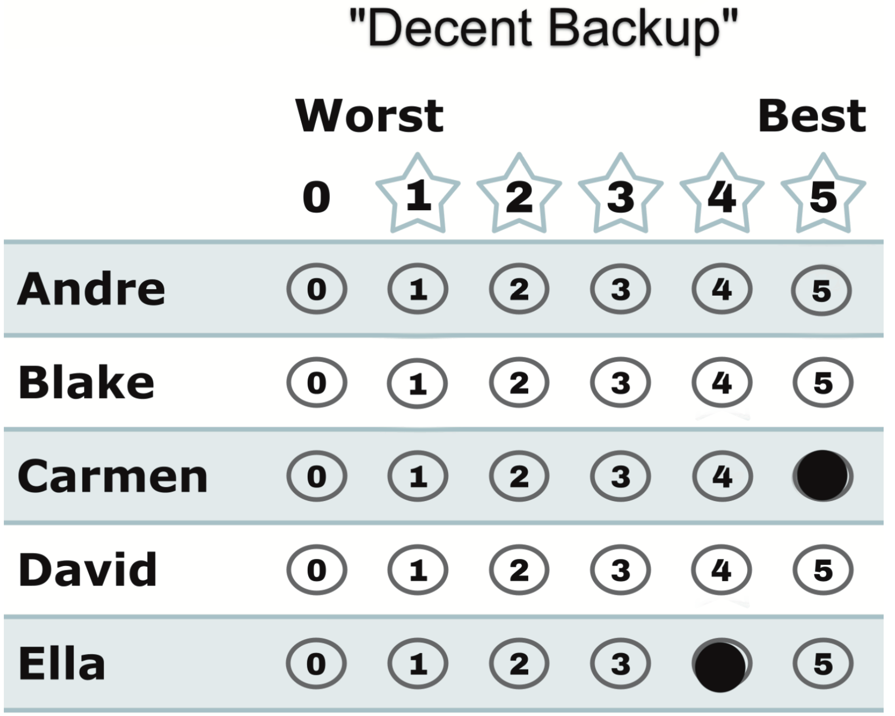

# "Decent Backup" — a 5 for your favorite, a 4 for your insurance

*Favorite at 5, a strong second at 4, everyone else blank. The everyday super-power of a scored ballot.*

← One of eight [voting styles](../STAR_ballot_voting_styles.md). Every style is legal and counted; this page is what this one means, when it fits, and what it trades away.

## What this ballot says

**"Carmen — and if not her, Ella is nearly as good."** The 5 gives Carmen everything; the 4 tells the count that Ella is a genuinely acceptable outcome; the blanks put everyone else at 0.

## When it fits

- You have a clear favorite *and* a second choice you'd be happy with — the most common honest opinion there is.
- You remember choose-one elections punishing this exact opinion (supporting a second choice used to mean abandoning your first) and want the fix.

## The trade-off, honestly

Here's the part worth saying carefully. **In the scoring round, the 4 can never hurt Carmen** — her 5 is a 5 no matter what else you mark; scores are independent. What the 4 does do: it helps Ella climb — possibly past a candidate you scored 0, and that's exactly what you asked it to do. And *if Carmen and Ella both reach the [runoff](../the_count/STAR_Automatic_Runoff.md)*, your ballot says "Carmen over Ella, but Ella is fine" — the 5-vs-4 gap is a full vote for Carmen in that head-to-head. The backup only "costs" you anything in the one scenario where it also just saved your election. The fine print, stated fairly: [STAR's honest limits](../properties_and_limits/STAR_honest_limits.md).

## This exact style in a real election

In the runnable [style-gallery election](../../../01_STAR/_main/cases/cases_pages/03c_c6_b8_style-gallery.md), the decent-backup row is `0,5,0,0,0,4` — Bianca 5, Frank 4. Both of this voter's picks became the finalists: the 4 helped Frank get there, the 5-vs-4 gap sent the ballot's full runoff vote to Bianca, and Bianca won. One ballot, both jobs done, nothing sacrificed.

## Related

- [Not Much of a Backup](not_much_of_a_backup.md) — the same idea with the volume turned down to 1
- [Nuanced](nuanced.md) — backups on every rung, the full-information ballot
