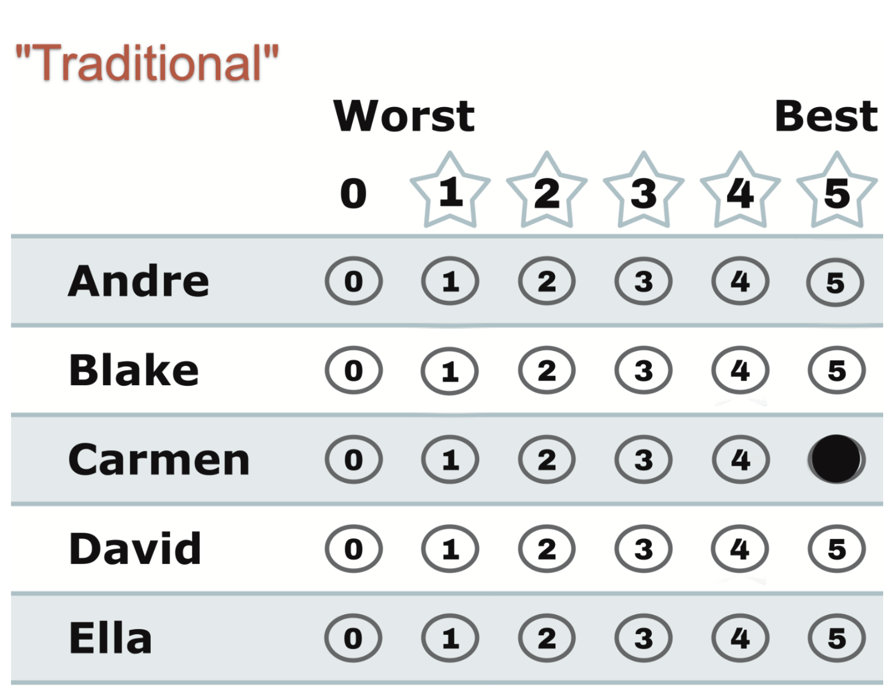

# "Traditional" — the choose-one habit, transplanted

*One 5 for your favorite, every other row left blank. The familiar single-choice vote, written on a 5-star ballot.*

← One of eight [voting styles](../STAR_ballot_voting_styles.md). Every style is legal and counted; this page is what this one means, when it fits, and what it trades away.



## What this ballot says

**"Carmen. Period."** Carmen gets the full 5; every other row is blank, and a blank simply counts as 0. To the count, this voter loves Carmen and rates everyone else at the very bottom — even candidates they may never have thought about.

## When it fits

- You genuinely support one candidate and genuinely rate everyone else at zero — then this ballot is *exactly* honest, not a shortcut.
- You're new to scored ballots and reach for the familiar one-mark habit. It works: your vote is legal, full-weight, and can't be spoiled.

## The trade-off, honestly

The blanks are real information — *"everyone else: 0"* — whether or not you meant them that deeply. If Carmen makes the [runoff](../the_count/STAR_Automatic_Runoff.md), your full vote backs her there. But if she doesn't, your ballot scores both finalists 0 — [Equal Support](../../GLOSSARY.md), no preference — and you sit out the final head-to-head by your own choice. A single mark spends one point of voice out of the twenty-five the ballot offers. Nothing about that is penalized; it's just under-used.

## This exact style in a real election

In the runnable [style-gallery election](../../../01_STAR/_main/cases/cases_pages/03c_c6_b8_style-gallery.md) (different names, same eight styles — one ballot per style), the traditional row is `0,5,0,0,0,0`: a lone 5 for Bianca. Bianca reached the runoff, so this ballot's full vote counted for her there — and she won. The happy path. The dedicated two-line demo of the *unhappy* path — your lone pick missing the final — is the bullet-vote case: [reader page](../../../01_STAR/_main/cases/cases_pages/03a_c3_b3_style-bullet-vote.md) · [`03a_c3_b3_style-bullet-vote.yaml`](../../../01_STAR/_main/cases/03a_c3_b3_style-bullet-vote.yaml).

## What if *everyone* voted this way?

Then the 5-star ballot has nothing left to work with. Here is that election, live on BetterVoting — three voters, the same five candidates, every voter marking exactly one:

**▶ Live on BetterVoting:** [vote](https://bettervoting.com/2jpcxd) · **[results ↗](https://bettervoting.com/2jpcxd/results)** (election `2jpcxd`, Test ID BV2255).

| Voter | Andre | Blake | Carmen | David | Ella |
|---|:--:|:--:|:--:|:--:|:--:|
| 1 — *"Carmen. Period."* | – | – | **5** | – | – |
| 2 — *"Ella. Period."* | – | – | – | – | **5** |
| 3 — *"Ella. Period."* | – | – | – | – | **5** |

That single mark was then written on **all three ballot formats** — choose-one, 0–5 score, and ranked — and counted four ways. Every count returns the same name:

| Method | Ballot it reads | Winner |
|---|---|:--:|
| **[Choose-One (Plurality)](../../topics/plurality.md)** | one mark | Ella |
| **[STAR](../STAR_start_here.md)** | scores, then a runoff | Ella |
| **[RCV-IRV](../../RCV_IRV/README.md)** | a ranking, eliminate-and-transfer | Ella |
| **[Ranked Robin](../../RCV_Ranked_Robin/why_ranked_robin.md)** | a ranking, every pair head-to-head | Ella |

**And that agreement is the whole point — it is not a win for STAR.** When every ballot carries one bit, every method has the same one bit to read, so none of them can do better than choose-one. STAR's scoring round is just a first-choice count here; its runoff still runs, but the two finalists were already the only candidates anyone said anything about:

```
Scoring Round
   Ella          -- 10 -- First place
   Carmen        --  5 -- Second place
   Andre         --  0
   Blake         --  0
   David         --  0
 Ella and Carmen advance.

Automatic Runoff Round
   Ella          -- 2 -- First place
   Carmen        -- 1
   Equal Support -- 0
 Ella wins.
   Voters with a preference: 3 of 3 (no Equal Support).
   Ella 2 (67%) vs Carmen 1 (33%); majority = 2.
```

Andre, Blake and David finish on zero having had *nothing* said about them — not "we considered them and rated them last," simply nothing. Want the whole count? See the full LH report → [`bv2255_2jpcxd_all-traditional-ballots.md`](../../../01_STAR/_main/cases/cases_pages/bv2255_2jpcxd_all-traditional-ballots.md).

The mirror image is worth clicking too: in [minority winner](../../../method_comparisons/minority_winner/README.md) the voters *do* use the range, the methods promptly disagree, and the fuller counts find a candidate a majority actually prefers. Same five-minute setup, opposite lesson — the method can only ever read what the ballot says.

## Related

- [Decent Backup](decent_backup.md) — the one-change upgrade: keep your 5, add a 4
- [The Equally Weighted Vote](../properties_and_limits/equally_weighted_vote.md) — why no style, this one included, carries secret extra weight
