# Books on Voting Methods — a shelf, with honest labels

The [How to Learn About Voting Methods](../topics/how_to_learn_about_voting_methods.md) reading path is threaded through *this repo's* runnable examples, and its "further reading" points mostly at websites, blogs, and videos. This shelf is the other half: the **published books** — the popular introductions you can hand a newcomer, and the scholarly volumes the whole field cites.

It's organized into four shelves by how you'd actually use them, not by method. A book is listed on **one** shelf (its best home) and cross-referenced from the others, so nothing drifts out of sync.

> **Reading fairly.** Several of these authors *advocate* — for range voting, for approval, for majority judgment, for Condorcet methods, even (in one famous case) for the Borda count. That's not a flaw; it's the field. This repo is STAR-centered and says so, and it reads its own sources — including [FairVote](../topics/how_to_learn_about_voting_methods.md#level-3-more-perspectives) — critically, for the argument and not the conclusion. **Every book below carries a one-line "the lean" so you know where the author is standing before you start.** Read them that way.

---

## The four shelves

### 📘 [Popular introductions](popular_introductions.md) — start here, no math required

The books to read first, and the ones to lend. Narrative, example-driven, written for a general audience.

<a href="popular_introductions.md">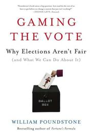</a>
<a href="popular_introductions.md">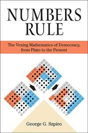</a>

### ⭐ [Rated & score methods](rated_and_score_methods.md) — this repo's home turf

Approval, score/range, and majority judgment — the *cardinal* family STAR belongs to. Where the case for scoring-not-ranking is made in full.

<a href="rated_and_score_methods.md">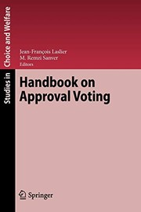</a>
<a href="rated_and_score_methods.md">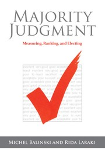</a>
<a href="rated_and_score_methods.md">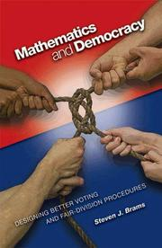</a>

### 🎓 [Social choice theory](social_choice_theory.md) — the impossibility results and the paradoxes

Arrow, Sen, Saari, and the rest: *why* no method is perfect, worked rigorously. Read these when the "no voting system is fair" objection comes up — they're where it comes from, stated precisely.

<a href="social_choice_theory.md">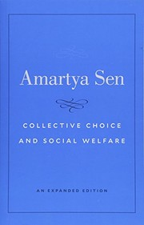</a>
<a href="social_choice_theory.md">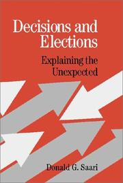</a>
<a href="social_choice_theory.md">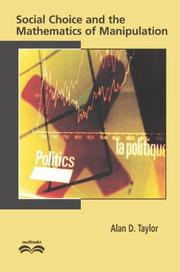</a>
<a href="social_choice_theory.md">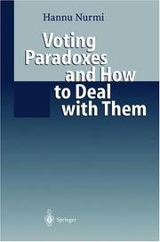</a>

### 🗳️ [Electoral systems & proportional representation](electoral_systems_and_pr.md) — the comparative and civic view

Zoom out from single-winner: how whole systems compare, how seats get apportioned, and a citizen's guide to the trade-offs.

<a href="electoral_systems_and_pr.md">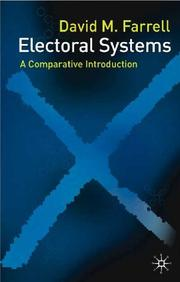</a>
<a href="electoral_systems_and_pr.md">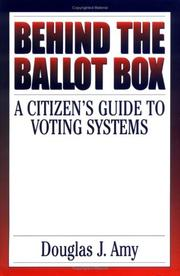</a>
<a href="electoral_systems_and_pr.md">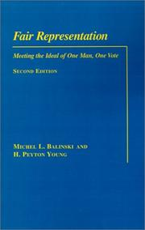</a>

---

## If you read only one

- **Curious voter, no math:** [*Gaming the Vote*](popular_introductions.md) (Poundstone). A page-turner that lands on score voting — the closest popular book to this repo's outlook.
- **You want the STAR family's intellectual roots:** [*Approval Voting*](rated_and_score_methods.md) (Brams & Fishburn) and [*Majority Judgment*](rated_and_score_methods.md) (Balinski & Laraki).
- **You keep hearing "no voting system is fair":** [*Chaotic Elections!*](popular_introductions.md) (Saari) for the intuition, [Arrow](social_choice_theory.md) for the proof.
- **You care about seats, not just single winners:** [*Fair Representation*](electoral_systems_and_pr.md) (Balinski & Young).

---

## About the covers

Cover thumbnails are from the [Open Library](https://openlibrary.org) covers API (community-maintained, freely reusable), shown small for identification in this annotated bibliography. Editions and cover art vary; the year given is the first edition unless noted. No endorsement by any author or publisher is implied.

## Related

- [How to Learn About Voting Methods](../topics/how_to_learn_about_voting_methods.md) — the runnable, example-first reading path (books complement it)
- [Who's who in voting reform](../topics/whos_who_voting_reform.md) — many of these authors, profiled
- [Glossary](../GLOSSARY.md) · [Start Here](../00_START_HERE.md) · [Curriculum](../CURRICULUM.md)
