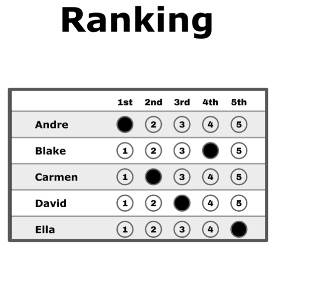

# The Ranked Ballot

*One ballot style, many counts. A ranked ballot asks one question — "put the candidates in order" — and that single design choice fixes what any method downstream can ever know about you: your **order**, never your **strength**. This page is the anatomy of the ballot itself; its twin is [the score ballot](score_ballot.md), and the side-by-side comparison is [alternate ballot styles](../topics/ballot_styles.md).*

→ Companions: [scores vs. ranks](scores_vs_ranks.md) (the core distinction) · [strict vs. weak ranks](strict_vs_weak_ranks.md) · [the ranked-ballot method zoo](../topics/ranked_ballot_methods_zoo.md) (fifteen ways to count this one ballot) · terminology canon: [TIPS_terminology](../tips/TIPS_terminology.md)

---

## What it looks like

One row per candidate, one column per rank. This voter says: Andre first, then Carmen, then David, then Blake, and Ella last.

It's the same voter, the same opinion, as on [the score ballot](score_ballot.md) — line the expressions up and you can see what each style keeps:

| Candidate | **Ranking (this page)** | Yes/No | Score 0–5 |
|---|:--:|:--:|:--:|
| Andre | 1st | ● | 5 |
| Blake | 4th | ○ | 1 |
| Carmen | 2nd | ● | 4 |
| David | 3rd | ● | 4 |
| Ella | 5th | ○ | 0 |

Notice the middle of the field: the voter feels Carmen = David (both 4s), but this ballot *has* to call one of them 2nd and the other 3rd. The full side-by-side walk-through is [alternate ballot styles](../topics/ballot_styles.md).

## The grid rules — and how they bite

A ranking is a *grid constraint*: on the common **strict** ballot, one mark per row **and** one per column. That coupling between rows is what makes the ranked ballot fussier to fill out than it looks:

- **Duplicate ranks (an "overvote")** — mark two candidates 2nd and, in most US RCV-IRV rules, that portion of your ballot (or all of it) is void. You weren't allowed to feel a tie.
- **Skipped ranks** — jump from 2nd to 4th and jurisdictions differ: some ignore the gap, some stop reading your ballot right there.
- **Rank caps** — many real ballots only offer 3–5 rank columns in a large field. Whatever you couldn't rank, the count treats as silence — a ballot-format path into [exhausted ballots](../RCV_IRV/RCV_IRV_exhausted_ballots.md).

These aren't hypotheticals: reported spoilage runs roughly **4–9% for ranked ballots vs. 0–2% for rated ballots** (see [scores vs. ranks](scores_vs_ranks.md)), and the errors fall hardest on voters with the least practice navigating grids.

## What it captures — and what it throws away

A ranking records **relative order only**. It cannot say *how much* you prefer 1st over 2nd, and it spaces every rung equally even when the voter feels a cliff: this voter's real feeling might be "Andre, Carmen, David all great; Blake and Ella, no" — but 1st/2nd/3rd/4th/5th flattens that cliff into a smooth staircase. Any method that later needs strengths has to *invent* them (that's [Borda](../other_ranked_methods/borda.md), and why rank→score conversion fabricates information — the [fidelity ladder](fidelity_ladder.md)).

**Strict vs. weak** is the one ballot-design fork inside the ranked family: a **weak** ranking allows equal ranks (`A = B`), a **strict** one forbids them. [Ranked Robin](../RCV_Ranked_Robin/ranked_robin.md) happily reads weak rankings; typical US RCV-IRV ballots are strict, which is exactly the "forced to invent a preference" problem. Full story: [strict vs. weak ranks](strict_vs_weak_ranks.md).

## One ranked ballot, many tabulations

This is the repo's core terminology point: **RCV names the ballot, not the count.** The identical grid above can be tabulated by:

| Count it with | Family | Notes |
|---|---|---|
| [RCV-IRV (Hare)](../RCV_IRV/RCV-IRV-Hare.md) | elimination rounds | what "RCV" usually means in the US |
| [Ranked Robin](../RCV_Ranked_Robin/ranked_robin.md) | Condorcet / round-robin | reads every pairwise matchup; allows equal ranks |
| STV | proportional | multi-winner transfers ([STV vs proportional STAR](../proportional_representation/stv/proportional_stv_vs_star.md)) |
| [Borda](../other_ranked_methods/borda.md), Bucklin, and a dozen more | positional & hybrids | the [method zoo](../topics/ranked_ballot_methods_zoo.md) runs 15+ on one screen |

Different tabulations of the same ballots routinely elect **different winners** — which is why "the ballots decided" is never the whole story. See [what is a voting method? — a ballot and a count](../topics/voting_method_ballot_and_count.md).

## Related

- [The score ballot](score_ballot.md) — the twin page: independent 0–5 values instead of an order
- [Alternate ballot styles](../topics/ballot_styles.md) — the same voter on ranking / Yes-No / scoring, side by side
- [Scores vs. ranks](scores_vs_ranks.md) — why order and strength are different data
- [Exhausted ballots](../RCV_IRV/RCV_IRV_exhausted_ballots.md) — where unranked finalists end up under IRV
- [Which RCV-IRV?](../RCV_IRV/variants/RCV_IRV_variants.md) · Glossary: [`ranked ballot`](../GLOSSARY.md)
