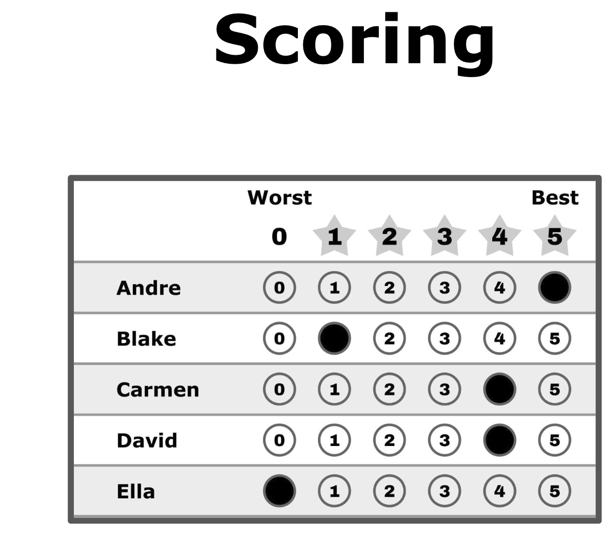

# The Score Ballot

*One ballot style, several counts. A score ballot asks a different question than a ranking: not "which do you prefer?" but "**how much** do you like each one?" — every candidate gets an independent value, so the ballot carries your order **and** your strength. This page is the anatomy of the ballot itself; its twin is [the ranked ballot](ranked_ballot.md), and the side-by-side comparison is [alternate ballot styles](../topics/ballot_styles.md).*

→ Companions: [scores vs. ranks](scores_vs_ranks.md) (the core distinction) · [filling out the 5-star ballot — the style gallery](../STAR_Voting/STAR_ballot_voting_styles.md) · [the fidelity ladder](fidelity_ladder.md) · [scale granularity](scale_granularity_flips_the_winner.md)

---

## What it looks like



One row per candidate, 0 (worst) to 5 (best) — like rating movies. This voter says: Andre a 5, Carmen and David both a 4, Blake a grudging 1, Ella a 0.

It's the same voter, the same opinion, as on [the ranked ballot](ranked_ballot.md) — line the expressions up and you can see what each style keeps:

| Candidate | Ranking | Yes/No | **Score 0–5 (this page)** |
|---|:--:|:--:|:--:|
| Andre | 1st | ● | 5 |
| Blake | 4th | ○ | 1 |
| Carmen | 2nd | ● | 4 |
| David | 3rd | ● | 4 |
| Ella | 5th | ○ | 0 |

Note what survived the trip: here Carmen = David is *recorded* — the ranking had to fake a 2nd-vs-3rd difference, and Yes/No can't tell Andre from David at all. The full side-by-side walk-through is [alternate ballot styles](../topics/ballot_styles.md).

## Writing it down — the grid, and why not to read it by columns

This library writes elections as a text **grid** (it's what the tabulation engine reads, and it's just a spreadsheet):

```
A, B, C     ← the header names the candidates (the COLUMNS)
5, 2, 0     ← each following row is ONE voter's whole ballot, read left→right
0, 5, 3
```

The one thing to get right: **rows are voters, columns are candidates.** The first data row above is a single voter who gave **A = 5, B = 2, C = 0** — *not* candidate A's three scores read downward. (This is the *transpose* of the paper ballot up top, which lists one candidate per row; the grid just turns it on its side so a whole ballot fits on one line.) A small square grid like 3 voters × 3 candidates is the easiest to misread — the header is your anchor: whatever a cell sits under is the candidate it scores.

The same single ballot can be written several equivalent ways — all of these say *A five, B two, C zero*:

| Notation | Example | Where you'll see it |
|---|---|---|
| **Grid row** (this library) | `A, B, C` then `5, 2, 0` | YAML files, case pages, the engine |
| **Colon / dict** | `{A: 5, B: 2, C: 0}` | prose, JSON-ish contexts |
| **Equals** | `A=5, B=2, C=0` | quick inline notes |
| **Bracket** | `A[5] B[2] C[0]` | occasionally in write-ups |

(A slash form like `A/5, B/2, C/0` is **not** a standard convention — a slash usually reads as "or" or a fraction, so it's best avoided.) They're all the same ballot; the grid just happens to be the one a computer counts and a spreadsheet stores.

## The marking rules — deliberately hard to get wrong

Every row is **independent** — there is no grid constraint tying your candidates together, which removes the ranked ballot's failure modes wholesale:

- **Equal scores are allowed.** Two 5s, three 3s, whatever you feel. You're never forced to invent a preference — and never punished for feeling a tie.
- **Blanks count as 0.** Skipping a candidate can't spoil anything.
- **No overvotes, no skipped-rank traps.** There is nothing to "double-mark": each row is its own question. Reported spoilage runs roughly **0–2% for rated ballots vs. 4–9% for ranked** (see [scores vs. ranks](scores_vs_ranks.md)).

Filling it out is anchor-based, not field-scanning: give your favorite a 5, your last choice a 0, then place everyone else against those two anchors. Even a 20-candidate race never asks you to hold the whole field in your head — contrast each ranked slot, which means re-scanning everyone you haven't placed yet. The full gallery of legal styles (bullet votes, protest ballots, "anyone but…") is [filling out the 5-star ballot](../STAR_Voting/STAR_ballot_voting_styles.md).

## What it captures — order, strength, and honest ties

A score carries **both** pieces of information a ballot can collect: the order (5 > 4 > 1 > 0) and the size of the gaps (Andre-to-Carmen is small; David-to-Blake is a cliff). Downstream methods can always *reduce* that to a ranking when they need one — scores → ranks drops information gracefully, while ranks → scores has to fabricate it (the [fidelity ladder](fidelity_ladder.md)).

**Resolution is a design dial.** Yes/No approval is a score ballot at 1-bit resolution; 0–5 is the STAR standard (fine enough to express, coarse enough to read); classic Range ran 0–99. More levels = more expressiveness, and the choice can genuinely matter: [scale granularity can flip the winner](scale_granularity_flips_the_winner.md). The honest cost of coarseness: if you max out two candidates you *slightly* prefer apart, you've recorded a tie you didn't quite feel — see [are equal-score votes "discounted"?](../STAR_Voting/reference/are_equal_score_votes_discounted.md) for the whole story, including why "show the gap: 5 and 4" is the honest advice.

## One score ballot, several tabulations

The same 0–5 grid above can be counted by:

| Count it with | How it reads the ballot | Notes |
|---|---|---|
| [Score / Range](../Range_Voting/range_voting.md) | add the scores; highest total wins | STAR without the runoff |
| [STAR](../STAR_Voting/STAR_start_here.md) | add the scores, then the top two meet in an [automatic runoff](../STAR_Voting/the_count/STAR_Automatic_Runoff.md) | equal scores on the two finalists = [Equal Support](../STAR_Voting/reference/glossary_STAR.md) — counted in round 1, neutral in the tie it had no stake in |
| [Approval](../Approval_Voting/approval_voting.md) | as 0/1 (approve or don't) | the 1-bit special case |
| STAR-PR and friends | proportional multi-winner | [proportional representation](../proportional_representation/) |

Same lesson as the ranked twin, from the other side: the ballot is what you mark; the **tabulation** decides what happens to it. See [what is a voting method? — a ballot and a count](../topics/voting_method_ballot_and_count.md).

## Related

- [The ranked ballot](ranked_ballot.md) — the twin page: an order instead of independent values
- [Alternate ballot styles](../topics/ballot_styles.md) — the same voter on ranking / Yes-No / scoring, side by side
- [Scores vs. ranks](scores_vs_ranks.md) — why order and strength are different data
- [Strict vs. weak ranks](strict_vs_weak_ranks.md) — the tie-handling story on the ranked side
- Glossary: [`score ballot`](../GLOSSARY.md)
