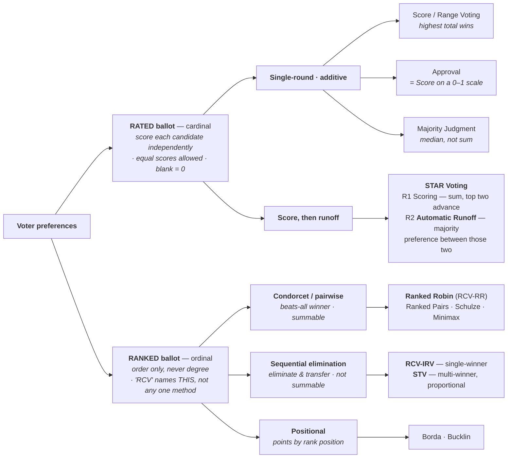

# Scores vs. Ranks — Don't Confuse Ranks and Ratings

*The single most important distinction in ballot design — and the one people get wrong most often.*

→ **See it, don't just read it:** [Alternate ballot styles — one voter, three ballots](../topics/ballot_styles.md) shows the *same* voter's opinion on a ranking ballot (read by RCV-IRV, STV, or Ranked Robin), a Yes/No ballot (Approval), and a 0–5 scoring ballot (Score/Range, STAR) — side by side, with what each captures and throws away.

---

There are two fundamentally different ways a ballot can ask for your opinion, and they are **not** interchangeable:

- **Ranking** (ordinal): put the candidates in **order** — 1st, 2nd, 3rd. This captures *relative* preference: "I like A more than B." It says nothing about **how much**.
- **Rating / Scoring** (cardinal): give each candidate an **independent value** — 0–5 stars, A–F. This captures *absolute* preference: "I like A **this much**." It carries both the order **and** the strength.

A rank answers *"which do you prefer?"* A score answers *"how much do you like each one?"* Those are different questions, and a ballot that asks one cannot be silently treated as if it asked the other.

## The map — from one voter's opinion to a method

Read it in two steps, and **keep the two steps separate**: first the **ballot** (what the voter is asked to record), then the **tabulation** (what the count does with it). Nearly every taxonomy error comes from mixing those two levels.

Four things this diagram is careful about, because popular versions of it usually aren't:

- **STAR's second round is a *runoff*, not a ranking.** It counts, for each ballot, which of the **two finalists** that voter scored higher — a majority preference, not an ordering of the field. Calling it "ranking" feeds the very confusion this page exists to clear up.
- **Both sides branch by *tabulation*.** Whether a ballot permits **equal ranks** is a *ballot rule*, not a method family — most US RCV-IRV forbids them, [Ranked Robin](../RCV_Ranked_Robin/ranked_robin.md) allows them, and the same is true of truncation limits. Those belong as footnotes on the ballot, not as branches. (What defines IRV is *sequential elimination*, not its equal-ranks rule.)
- **Condorcet is a *family*, not a method.** Ranked Robin sits **inside** it, alongside Ranked Pairs, Schulze and Minimax — it isn't a sibling of "Condorcet."
- **A ranked ballot is not one method.** IRV, Ranked Robin and STV read *the same ballot* and can elect *different winners*. The full ranked breakdown — with aliases and the summability split — is the canonical [ranked-method family tree](../tips/TIPS_terminology.md).

*(Single-winner unless marked; STV is the proportional multi-winner branch. The rated side has proportional forms too — [STAR-PR](../proportional_representation/STAR_PR/README.md) — and a majoritarian multi-winner one, Bloc STAR.)*

> **The naming trap.** *Rank* and *rate* sound almost identical and get swapped constantly — but they are opposites in what they measure. This library uses **rank** only for ordering and **score** (synonyms: rate, grade) only for independent values. If you remember one thing: **equal rankings are still rankings; a score is not a ranking.**

## Relative vs. absolute preference

| | **Ranks** (ordinal) | **Scores** (cardinal) |
|---|---|---|
| The question | "Which do you prefer?" | "How much do you like each?" |
| Captures | Order only | Order **+ strength** |
| Utility type | Ordinal utility | Cardinal utility (interval scale) |
| Differences meaningful? | No — 1st vs. 2nd ≠ 2nd vs. 3rd | Yes — a 5 vs. a 3 is a real gap |
| Familiar from | A race: 1st, 2nd, 3rd | Amazon / movie **five-star** reviews |
| Methods | RCV-IRV, STV, Condorcet (Ranked Robin), Borda | STAR, Score, Approval (0/1) |

Because differences are meaningful only for scores, you can **average** scores (a column sum) but it makes no sense to "average" ranks. This is exactly why STAR is summable and IRV is not. (See [STAR Is Summable — Add Up Precinct Totals](../STAR_Voting/properties_and_limits/STAR_summability.md) and [How the Count Works — STAR vs RCV-IRV, Step by Step](../topics/tabulation_star_vs_irv.md).)

## Why "ranked" is about the *data*, not just the ballot

A common point of confusion: **Ranked Robin allows equal rankings, so why isn't it a scoring method?** Because the method only ever reads the *order* (who beats whom), never a magnitude. Allowing ties in a ranking doesn't turn order into strength. The line between ranked and scored is **what information the tabulation uses** — pure order (ranked) vs. degree of support (scored) — not merely how the bubbles look.

**But how the bubbles look changes what voters *think* they're doing.** That definition is about the tabulation; the ballot is about the human. A row of bare numerals — `0 1 2 3 4 5` — invites people to fill it in like a ranking: first choice, second choice, third, each number used once. Equal Vote's **STAR ballot design standards** exist largely to fight that instinct: label the ends **Worst / Best** and draw the scale as **star icons**, explicitly to reinforce the star scale *as opposed to ranking*. Stars say *rate each candidate on its own, reuse values freely*; bare numerals say *put them in order*. The tabulation is identical either way — but a ballot that **reads** as a ranking gets **filled in** as one, and that discards precisely the intensity information the method exists to capture. Ballot design isn't decoration here; it's what makes the ballot honest.

## Why the distinction has real consequences

**Different winners from identical voters.** A candidate who wins under a ranked method can lose under a scored method on the very same electorate, because the two are measuring different things. Treating "ranked = scored" hides that.

**Expressiveness — preference vs. support.** A rank carries order only; a score carries order *and* how strongly you feel. The sharpest way to see it: ballots `1,0,1,0` and `5,4,5,4` state the *same preference* but *opposite support*, yet as ranks they're the identical `A=C > B=D` — the ranking literally can't tell "I tolerate them" from "I love them." That gap is its own page: [**Preference vs. Support**](preference_vs_support.md). A broadly-liked compromise candidate can look weak on first-choice ranks yet clearly strong on scores — which is part of why IRV suffers [center squeeze](../RCV_IRV/RCV_IRV_center_squeeze.md) and STAR doesn't.

**You can go one way but not the other.** Scores → ranks is easy (just read off the order). Ranks → scores is **impossible** without inventing information, because the strength was never collected.

**Ballot reliability.** Independent scoring removes the "grid" constraints of ranking (no overvotes, no skipped-rank traps, ties allowed, blanks = 0). Reported spoilage rates run roughly **0–2% for rated ballots vs. 4–9% for ranked ballots** (and 1–4% for single-mark) — but **read those with care**. The compilation is [rangevoting.org](https://www.rangevoting.org/SPRatesSumm.html), which advocates for rated methods, and the *rated* figure rests on a thin base: almost no public election has ever used a rated ballot, so there is little real-world data to average. The **ranked** end is the better-evidenced half — Neely & McDaniel's San Francisco work found real RCV spoilage, with racial disparities (see the [scorecard](../../method_comparisons/single_winner_scorecard/README.md)). Safe version of the claim: **ranked ballots demonstrably spoil more than single-mark**, and rated ballots have structurally fewer ways to go wrong; the precise percentages are not settled. And research on values measurement (Maio, Roese, Seligman & Katz) found **ratings showed superior validity to rankings**, because forcing a full strict order captures noise — distinctions voters don't actually feel.

---

## Related concepts in this library

- [Preference vs. Support](preference_vs_support.md) — the vivid special case: same order, opposite strength, indistinguishable as ranks
- [Alternate ballot styles](../topics/ballot_styles.md) — the three ballots side by side, marked by one voter (with the ballot images)
- [The ranked ballot](ranked_ballot.md) · [the score ballot](score_ballot.md) — one anatomy page per ballot type
- [Strict vs. weak ranks](strict_vs_weak_ranks.md) — equal ranks & pairwise comparison: which ranked methods allow them (IRV doesn't)
- [Scoring methods vs. ranked voting](../topics/scoring-methods-vs-ranked-voting.md) — why Approval & STAR sit *outside* the RCV family
- [Is RCV "simple"? (201)](../RCV_IRV/RCV_IRV_is_simple.md) — the five-star mental model vs. ordering strangers
- [Tabulation, step by step](../topics/tabulation_star_vs_irv.md) — the same ballots counted as scores vs. ranks
- [Center squeeze](../RCV_IRV/RCV_IRV_center_squeeze.md) — how order-only ballots can bury a strong compromise candidate
- [RCV vs. IRV vs. RCV-IRV — terminology](../RCV_IRV/RCV-IRV-confusing-name.md)

## Learn more

- [Scoring and rankings (slide deck)](https://docs.google.com/presentation/d/11CLQr6bQUH8iSGcicYisTfNT7piINbyq0r3C0fr2qRE/edit?slide=id.g2ed1db947c0_0_95#slide=id.g2ed1db947c0_0_95)
- [Relative preference vs. absolute preference](https://docs.google.com/document/d/1_hIt2CEk4fB4wy4Eu0Nn4R5NW_EFjj725IiSS42ev2k/edit?tab=t.0)
- [Ratings, rankings and preferences — main](https://docs.google.com/document/d/1ImJsgGzxkcdWwAJjDZEaWbgTRi4sPiDFSEP2OkfOhgI/edit?tab=t.0)
- [Compare ballots — STAR Voting and RCV](https://docs.google.com/document/d/1xMXONflRF8x1TOQxdTZpdYPlT8rXZ-h695PHnnBduhM/edit?tab=t.0)
- [Cardinal utility and ordinal utility (the math)](https://docs.google.com/document/d/1poWz45UuPwlaoPTe4nE-_tz2QCn0NiXlYpvoK4G6qWQ/edit?tab=t.0)
- [Maio et al. — "Rankings, Ratings, and the Measurement of Values: Evidence for the Superior Validity of Ratings"](https://www.researchgate.net/publication/233061022_Rankings_Ratings_and_the_Measurement_of_Values_Evidence_for_the_Superior_Validity_of_Ratings)
