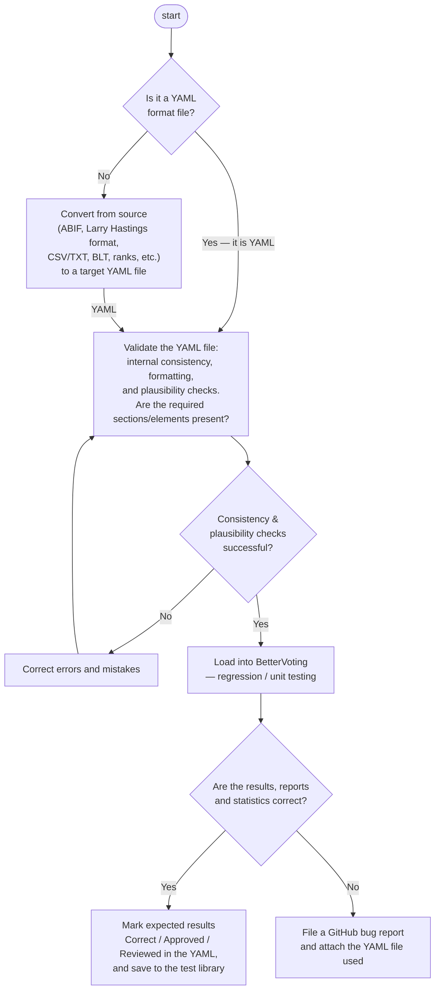

# BetterVoting and the LH Engine — One Election, Two Reports

**One line:** the same STAR election shows up in these materials as **two** result reports — BetterVoting's **live visual display** (what voters see) and the LH `starvote` **engine's text report** (the full audit/teaching tabulation). They're independent implementations of the *same* STAR method, so they **agree on the winner and the runoff margin**. They can differ in one bookkeeping detail — **how a "no preference" ballot is classified** (abstention vs Equal Support) — which nudges the score totals and the Equal Support count without changing the result. See [When the two reports differ](#when-the-two-reports-differ-abstentions-vs-equal-support).

→ The engine report section by section: [reading a STAR report](LH_starvote/reading_a_star_report.md). The runoff percentages in both: [runoff percentages](../STAR_Voting/the_count/runoff_percentages.md). Glossary: [`BetterVoting`](../GLOSSARY.md). The LH engine upstream: [`larryhastings/starvote` on GitHub](https://github.com/larryhastings/starvote) · [`starvote` on PyPI](https://pypi.org/project/starvote/).

---

## Why there are two reports

| | **BetterVoting** (bettervoting.com) | **LH `starvote` engine** (this repo) |
|---|---|---|
| What it is | the live web app voters run elections on | a text tabulator for study, teaching, auditing |
| Audience | voters, organizers | presenters, auditors, this curriculum |
| Output | interactive charts + Race Details tables | a full plain-text report (the `_tabulated.txt` copy) |
| Strength | one-click, visual, shareable | every step shown: matrix, divergence, both rounds |

They are not rivals on the result: STAR is STAR. Feed both the same ballots and you get the same finalists, the same runoff margin, the same winner. (They can report slightly different *score totals* and *abstention counts* — see below — but not a different outcome.) When a lesson shows a BetterVoting screenshot *and* an engine report, they're two views of one count — pick whichever makes the point clearer.

How the pieces line up (same Dog/Cat race):

| BetterVoting shows … | … the engine shows the same as |
|---|---|
| **Scoring Round** bars | **Scoring Round** block (total stars; top two advance) |
| **Automatic Runoff** bars / pie | **Automatic Runoff Round** block (finalist counts + Equal Support) |
| **% Between Finalists** (52 / 48) | the `show_runoff_percent` line — *Voters with a preference: 363…* |
| **Race Details** tables | the **Preference Matrix** (For–Equal–Against) + runoff block |

See both sides for this exact race, end to end — the export YAML and the full engine report — in the worked lesson [A real BetterVoting election, end to end](../../01_STAR/pet_real_bv_election/).

## When the two reports differ — abstentions vs Equal Support

On the pet race the two reports give the **same winner and the same runoff margin** (Dog 190 / Cat 173, 363 voters with a preference), but BetterVoting reports **6 abstentions and 455 ballots tallied** while a full count keeps all **461**. The gap is a single classification choice:

| | BetterVoting (frozen snapshot) | LH engine (all 461) |
|---|---:|---:|
| Ballots tallied | 455 | 461 |
| "Abstentions" | 6 | 1 (the blank only) |
| Equal Support in runoff | 92 | 98 |
| Per-candidate score totals | 9 lower (Dog 1798) | Dog 1807 |
| **Winner / runoff margin** | **Dog, 190–173** | **Dog, 190–173** |

BetterVoting's 6 "abstentions" are all **flat** ballots — every candidate scored the same — and two of them carry real scores: one voter rated **all seven candidates 5**, another rated them **all 4**. Those are *Equal Support* ballots (no preference between finalists), not abstentions: the voters participated, and in STAR their stars should count in the score round. Filing them under "abstention" is what makes BetterVoting's totals run uniformly 9 lower (`5 + 4 = 9` per candidate) and its tally 6 short. The LH engine instead counts every cast ballot and treats only the **1 truly-blank** ballot as an abstention; the rest land in Equal Support and are excluded *only* from the runoff percentage denominator.

This is the "results don't reconcile" branch of the pipeline below. It's tracked as a documentation/correctness issue for BetterVoting:

- Minimal **real** BetterVoting reproduction (3 candidates / 8 ballots, where BV files a flat `3,3,3` as an abstention): [When "no preference" gets called an "abstention"](../../01_STAR/pet_real_bv_election/small_case_abstention_lesson.md)
- Frozen evidence + raw export (the 461-ballot race): [BetterVoting result — frozen snapshot (pet race)](../../01_STAR/pet_real_bv_election/BV_result_snapshot.md)
- Write-up & GitHub issue [Equal-Vote/bettervoting#1407](https://github.com/Equal-Vote/bettervoting/issues/1407): [Equal Support ballots (incl. an all-5s vote) are being counted as "abs](../../01_STAR/pet_real_bv_election/LH_BV_reconciliation_issue.md)
- Synthetic minimal illustration: [`abstention_reconciliation_min_c2_b6.yaml`](../../01_STAR/pet_real_bv_election/cases/abstention_reconciliation_min_c2_b6.yaml)

The terminology — why a flat ballot is *Equal Support*, not a discarded or abstaining vote — is [runoff percentages](../STAR_Voting/the_count/runoff_percentages.md) and [`Equal Support`](../GLOSSARY.md).

## How a real election becomes a trusted example

The two reports are tied together by a pipeline. A real ballot file — a BetterVoting JSON export, or data in ABIF / CSV / BLT / ranked form — is converted to a **YAML election**, validated, and tabulated, then **cross-checked against BetterVoting's own result** before it's saved as a trusted test case:

That loop is why the examples here can be trusted: every saved election has been tabulated *and* cross-checked, and the engine's answer key is only marked "approved" once it matches. The BetterVoting-JSON → YAML converter is `YAML_library/1_positive/01_convert_json_yaml.py`, and a guard test (`STARVote_LH_tabulation_engine/tests/test_json_to_yaml_conversion.py`) re-converts a real export and confirms the engine reproduces the stated winner. Two independent implementations cross-checking each other is a *feature* — it's how you trust a count.

---

*This page is about STAR's two reports (BetterVoting + the LH `starvote` engine). **Ranked** ballots are a different family with a different count — see [RCV-IRV](RCV_IRV/).*
