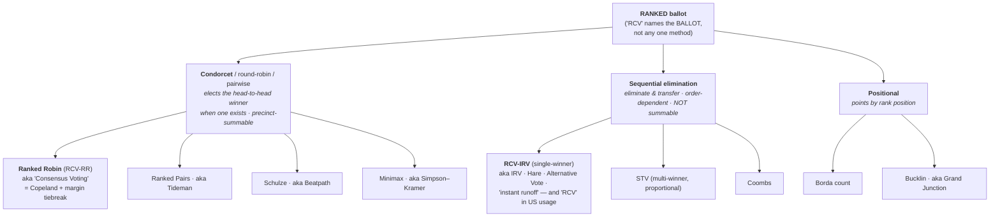

# Tips — Terminology: RCV vs IRV vs RCV-IRV (and friends)

Which word to use when. The whole thing untangles once you separate **the ballot** from **the tabulation** — the same distinction that matters everywhere else in STAR.

## The one idea that fixes it

> **RCV names a BALLOT. IRV names a TABULATION.**

- **RCV (Ranked-Choice Voting)** = a *ballot type*: the voter ranks candidates (1st, 2nd, 3rd…). It's a **family**, not a single method.
- **IRV (Instant-Runoff Voting)** = *one way to count* a ranked ballot: eliminate the lowest, transfer, repeat. The single-winner method people usually mean.
- The **same ranked ballot** can be counted other ways:
  - **Ranked Robin** — a Condorcet / "consensus" tabulation (most head-to-head wins). Sometimes written **RCV-RR** or "Consensus Voting."
  - **STV (Single Transferable Vote)** — the *proportional, multi-winner* tabulation.

So when someone says "RCV," they've named the *ballot* but implied a *count*. In the US, "RCV" has been hijacked to mean **IRV specifically** — that's the abuse.

## The ranked-method family tree

The ranked ballot ("RCV") is counted by a whole family of *methods*, which split into two branches. Knowing which is which keeps you precise — and keeps you from lumping a Condorcet method in with IRV.

*(**Copeland** is the algorithm under Ranked Robin, so it's folded into that node. A Condorcet **cousin**: "**Consensus Choice**" — Better Choices for Democracy's variant, same family but a different cycle-resolution rule. Plain-text version of this tree is in the `git log` if a viewer can't render Mermaid.)*

True statements that follow (and good ways to test your own precision):
- "Ranked Robin, Ranked Pairs, Schulze, and Minimax are forms of **Condorcet** RCV." ✅
- "Condorcet [methods], Borda, Bucklin, and RCV-IRV are forms of **RCV**." ✅ (All ranked ballots — though *Condorcet* is a family, the others are specific methods, so they sit at slightly different levels.)
- "Borda / Bucklin are Condorcet methods." ❌ — ranked, yes; Condorcet, no.

Spelling/naming watch: it's **Bucklin** (not "Buckling"); **Hare ≈ IRV** for single-winner, but "Hare" strictly usually means **STV** / the Hare quota.

## Aliases — same thing, different name

The single biggest source of confusion is that one method has many names. This table maps what you'll *hear* to what it *is*:

| You'll hear… | What it actually is | Precise name here |
|---|---|---|
| "RCV" (US / FairVote usage) | the eliminate-and-transfer single-winner method | **RCV-IRV** |
| "Instant runoff", "Alternative Vote", "Hare" (single-winner) | the same eliminate-and-transfer method | **RCV-IRV** |
| "Round-robin voting", "pairwise voting", "Condorcet" (used as *a* method) | the *family* that elects the head-to-head winner | **Condorcet methods** (a family, not one method) |
| "Ranked Robin", "RCV-RR", "Consensus Voting" | Equal Vote's Copeland-plus-margin-tiebreak | **Ranked Robin** |
| "Consensus Choice" | Better Choices for Democracy's Condorcet variant (different cycle rule) | a **Condorcet cousin** — *not* identical to Ranked Robin |
| "Copeland" | the win-minus-loss algorithm underneath Ranked Robin | **Copeland** |
| "Beatpath" → Schulze · "Tideman" → Ranked Pairs · "Grand Junction" → Bucklin | older / academic names | as named |

Rule of thumb: when you mean the **family**, say "Condorcet" or "round-robin"; when you mean the **specific Equal-Vote method**, say "Ranked Robin." Reserve bare "**RCV**" for the *ballot*.

## Why the precision actually matters

Several of the strongest criticisms are **IRV-specific, not ranked-ballot-wide**:

- **Center squeeze**, **exhausted ballots**, **non-monotonicity** → these are failures of **IRV's elimination tabulation**.
- **Ranked Robin** (Condorcet) uses the *same ranked ballot* and does **not** have center squeeze.

So if you say *"RCV has center squeeze,"* a sharp opponent can correctly reply *"Ranked Robin is RCV and doesn't."* If you say *"IRV has center squeeze,"* you're exactly right. Precision protects your credibility — and it's the same reason you insist STAR critics distinguish "the ballot" from "the runoff."

## When to use which word

| Situation | Use | Why |
|-----------|-----|-----|
| US public audience, naming the thing they know | **[RCV-IRV](../RCV_IRV/RCV-IRV-Hare.md)** (or "IRV — what's usually called RCV") | familiar *and* precise; signals you mean the eliminate-and-transfer method, not the ballot family |
| Technical / comparison / criticism of the method | **[IRV](../RCV_IRV/RCV-IRV-Hare.md)** | the exact, defensible name; criticisms like center squeeze are IRV's, not all ranked ballots' |
| Naming the elimination *rule* itself | **[Hare](../RCV_IRV/RCV-IRV-Hare.md)** (fewest-first-choices elimination; single-winner = IRV) | precise for the rule — but note "Hare" *also* names the STV quota, so single-winner "Hare" ≈ IRV |
| Talking about the *ballot* / the ranked family | **[ranked ballots](../scores_and_ranks/strict_vs_weak_ranks.md)** / **[ranked methods](../RCV_IRV/RCV-IRV-confusing-name.md)** / **RCV ballot** | reserve bare "RCV" for the ballot, and say so |
| A Condorcet count of a ranked ballot | **[Ranked Robin](../RCV_Ranked_Robin/ranked_robin.md)** (RCV-RR / "consensus") | a different RCV tabulation; do NOT lump it with IRV |
| Proportional multi-winner ranked | **[STV](../proportional_representation/stv/proportional_stv_vs_star.md)** | the proportional RCV tabulation |

## House style for this repo

1. **Default to `RCV-IRV`** in STAR-vs-method comparisons (the engine's `[Divergence from STAR]` block and the conversation scripts already do this). It's unambiguous to a US reader and makes clear you mean the method.
2. **Use `IRV`** in tight technical passages where you've already established you're talking about the eliminate-and-transfer count.
3. **Reserve bare `RCV`** for "the ranked-ballot family," and when you use it that way, make it explicit (e.g. "RCV ballots can be counted as IRV, Ranked Robin, or STV").
4. **Name `Ranked Robin` and `STV` explicitly** — never fold them into "RCV" meaning IRV.
5. When quoting how others (mis)use "RCV," keep their word but add the correction once.

## The mirror image — STAR's own ballot vs tabulation

The same split applies to STAR, which is why this framing is so useful:

- **The ballot:** a 0–5 **score** ballot (cardinal).
- **The tabulation:** **Score Then Automatic Runoff.**
- The same score ballot can also be counted as **Approval** (threshold), **Score** (pure total), or **Proportional STAR** (multi-winner). "STAR" is one tabulation of a score ballot, just as "IRV" is one tabulation of a ranked ballot.

Teaching tip: once your audience holds "ballot vs tabulation," the whole nomenclature snaps into place — and so does why "RCV" alone is ambiguous.

See also: [GLOSSARY.md](../GLOSSARY.md) (precise definitions) · [CURRICULUM.md](../CURRICULUM.md) · the nomenclature episode ["Is It RCV or IRV? Why Do You Keep Saying RCV-IRV?"](../RCV_IRV/RCV_or_IRV_whats_the_right_word.md).
