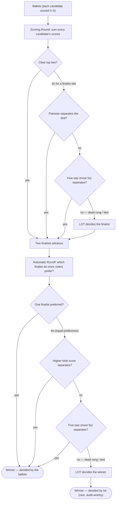

# Why Build "Silly" Tie Elections? — and a Map of Every Tie Case

*In praise of the contrived example. The tiny, symmetric elections in this repo — `5,5,5 / 4,4,4`, or `4,0,0 / 0,4,0 / 0,0,4` — will never show up at a polling place. That's the point: they're **probes**, built on purpose to drive a tabulation algorithm into its corners so we can see exactly what it does there.*

Part of the [Ties & Tie-Breaking](README.md) hub · companion to [STAR Tie-Breaking — The Full Chain](../../STAR_Voting/Tie_Breaking_STAR/tie_breaking.md).

---

## The apologia (why a "silly" case earns its keep)

A deliberately-degenerate election isn't pedantry — it's the same move as a unit test that feeds a function `0`, `-1`, and `MAX_INT`. Five concrete payoffs:

1. **It isolates one behavior.** A real election changes a dozen things at once. A two-ballot tie changes *nothing but the tie*, so whatever the engine does next is unambiguously the tie-break — nothing else can be causing it.
2. **It makes a real bug reproducible.** The contrived `jfk7pd` ballots are what turned "STAR sometimes shows something weird on ties" into a one-click repro that surfaced actual defects — the `NaN` display, the "no ballots have been cast" message, the silent random tie-break. The ballots are fake; the bugs they flushed out are real.
3. **It pins down the spec.** "What *should* happen when every rung ties?" is a real design question. A minimal case forces a definite, documented answer (here: the pre-published lot decides) instead of leaving it to whatever the code happens to do.
4. **It teaches the concept.** The clearest way to explain the "dead rung," or why each round breaks its tie with the *other* round's yardstick, is the smallest election that shows it. Big elections bury the lesson in noise.
5. **It becomes a regression test.** Once captured with an expected winner, the case guards the engine forever: if someone later reorders the tie-break cascade, these tiny files fail immediately.

**What each of your two examples isolates:**

- **`5,5,5` then `4,4,4`** — every voter rates *all* candidates equally, so no ballot expresses any preference at all. Totals tie, every pairwise is "Equal Support," five-star ties: a **fully flat** dead heat. It probes *"what happens when the ballots say literally nothing to separate anyone?"* (See [Flat scores, ties & tie-breaking](../../../01_STAR/Flat_scores_ties/README.md).)
- **`4,0,0 / 0,4,0 / 0,0,4`** — a perfect rotation: three equal, mutually symmetric camps, and (capped at 4) **no 5s**, so the five-star rung is a *dead rung*. It probes *"a genuine k-way symmetric tie with no cardinal signal to break it"* — the 3-candidate analog of `jfk7pd`. (See [the three-way dead-rung tie](../../../01_STAR/tie_break_dead_rung/three_way_dead_rung_tie/three_way_dead_rung_tie.md).)

**And the honest caveat, so it stays balanced:** these exact symmetries are astronomically rare in a public election, and the tabulation is *correct* the whole way down — the interesting question is only *who wins a genuine tie*. But "rare" isn't "never": small electorates — clubs, boards, committees, local primaries, which are much of BetterVoting's actual use — tie far more often than statewide races do. The probe is how you make sure the rare case is handled *before* it decides a real seat.

---

## A map of every tie case (single-winner STAR)

Where a STAR result can land, from a clean win down to the lot. Each round has its own ladder; the lot is the floor of both.

The left spine (all "yes") is the ordinary election: a clean top two and a decisive runoff, no tiebreak ever consulted. Every rightward branch is a tie rung — and each one has a probe.

## Every branch has a test

| Branch reached | What it isolates | Probe |
|----------------|------------------|-------|
| Clean top two + decisive runoff | the baseline (no tiebreak) | [`Flat_scores_ties_01`](../../../01_STAR/Flat_scores_ties/Flat_scores_ties_01_baseline_clean.md) |
| Scoring tie → **pairwise** breaks it | a finalist chosen by head-to-head | [dead-rung case 01](../../../01_STAR/tie_break_dead_rung/README.md) |
| Scoring tie → **five-star** breaks it | a finalist chosen by most 5s | [dead-rung case 05](../../../01_STAR/tie_break_dead_rung/README.md) |
| Scoring tie → **dead rung → lot** | no 5s; the lot picks the finalist | [dead-rung cap ladder](../../../01_STAR/tie_break_dead_rung/README.md) |
| Runoff tie → **score** breaks it | winner by higher total score | [dead-rung case 04](../../../01_STAR/tie_break_dead_rung/README.md) |
| Runoff tie → **five-star** breaks it | winner by most 5s | [dead-rung case 04/07](../../../01_STAR/tie_break_dead_rung/README.md) |
| Runoff tie → **dead rung → lot** | no 5s; the lot picks the winner | [BV `jfk7pd`](../../../01_STAR/tie_break_dead_rung/lot_random_vs_published_jfk7pd/lot_random_vs_published_jfk7pd.md) |
| Runoff tie → five-star **tied non-zero → lot** | rung runs, decides nothing | [dead-rung case 09](../../../01_STAR/tie_break_dead_rung/README.md) |
| **Fully flat** (no preference anywhere) | ties at both loci at once | [`Flat_scores_ties_07`](../../../01_STAR/Flat_scores_ties/Flat_scores_ties_07_fully_flat.md) |
| **k-way symmetric** (rotation) | any of k wins by lot; divergence (k−1)/k | [three-way dead-rung](../../../01_STAR/tie_break_dead_rung/three_way_dead_rung_tie/three_way_dead_rung_tie.md) |

Generate your own along any branch with [`generate_dead_rung_scenarios.py`](../../../STARVote_LH_tabulation_engine/tools_adam/generate_dead_rung_scenarios.md).

> **This map is v1 — single-winner STAR only.** Natural extensions later: abstentions / quorum interactions, multi-winner (Bloc / proportional) tie handling, and the RCV-IRV elimination-tie branch (see [Tie-Breaking: STAR vs. RCV-IRV](tiebreaking_star_vs_irv.md)).

## See also

- [STAR Tie-Breaking — The Full Chain](../../STAR_Voting/Tie_Breaking_STAR/tie_breaking.md) — the ladders in words.
- [The "dead rung" case set](../../../01_STAR/tie_break_dead_rung/README.md) and [Flat scores, ties & tie-breaking](../../../01_STAR/Flat_scores_ties/README.md) — the probes themselves.
- [Tie-Breaking: STAR vs. RCV-IRV](tiebreaking_star_vs_irv.md) — why strict ranks make ties harder, not easier.
