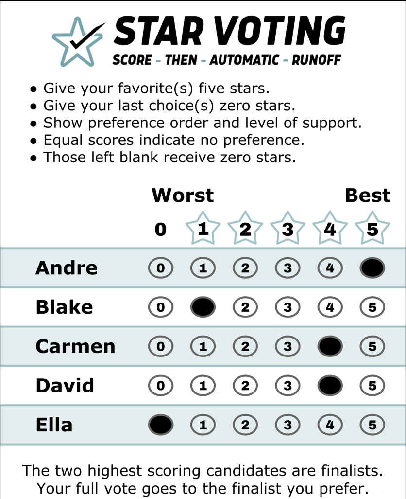
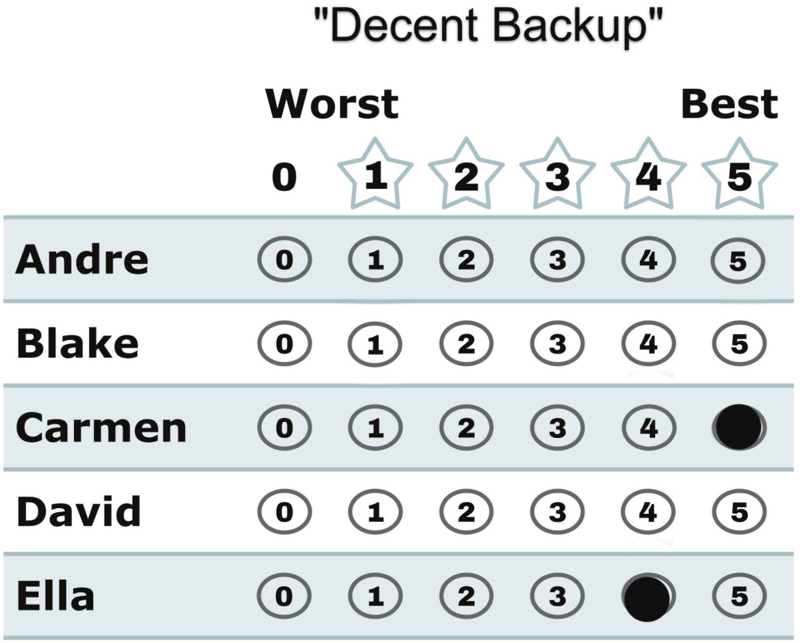
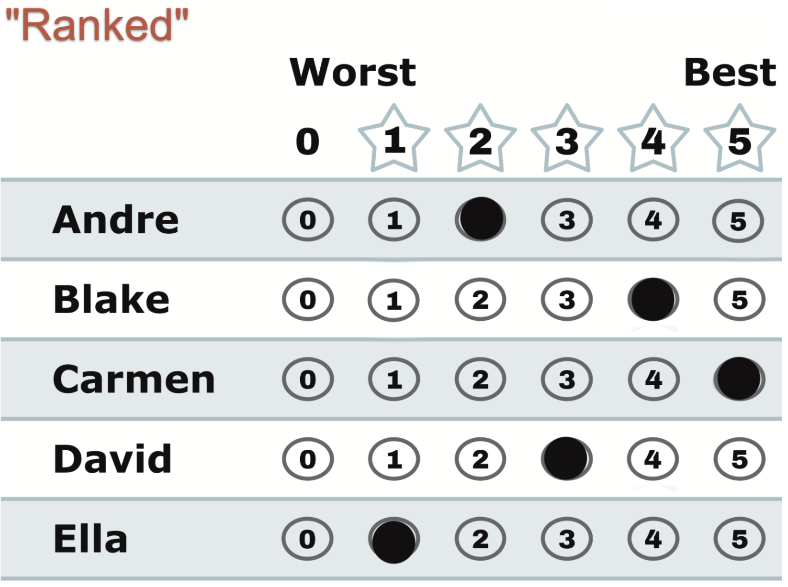
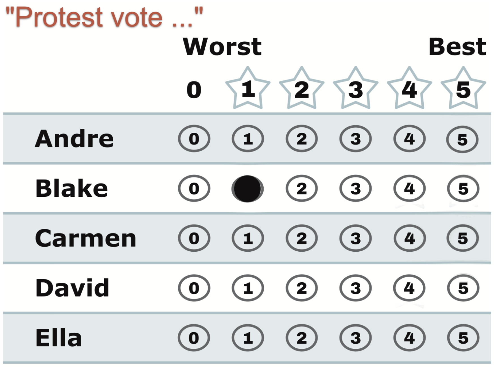

# The STAR Ballot — and every legal way to fill it out

*One ballot, scored 0–5. This page shows what a STAR ballot actually looks like, then the gallery of legal ways to fill it out — from a plain choose-one vote to a fully expressive spread — and what each one says to the count. There is no wrong way to fill out a STAR ballot.*

---

## What the ballot looks like

STAR uses a **5-star ballot**: you give every candidate an independent score from 0 to 5, exactly like rating movies or restaurants. Here is a finished one — this voter gave their favorite (Andre) a 5, their last choice (Ella) a 0, and scored everyone else honestly in between:



The instructions printed on it are the whole method:

- Give your **favorite(s) five stars**.
- Give your **last choice(s) zero stars** — or just leave them blank.
- **Show preference order and level of support** — order *and* strength, on one ballot.
- **Equal scores indicate no preference.**
- **Those left blank receive zero stars.**

Two of those rules do most of the work on this page:

- **Equal scores are allowed.** Two candidates can both get a 5 (or a 0). You're never forced to invent a difference you don't feel.
- **Skipping is allowed.** A candidate you leave blank simply counts as 0 — skipping can't spoil anything. On a **digital** ballot there is no way to mis-mark at all, since each row takes one score. On **paper** exactly one error is possible: marking *two bubbles in the same row*, which spoils **that candidate's score** (counted 0) — not the ballot. Even then the damage is *contained to one candidate*, where a ranked-ballot overvote can stop the count for the whole ballot from that rank on. See [running a paper-ballot demo](hands_on/running_a_paper_ballot_demo.md).

Because each score stands alone, filling the ballot out is quick: give your favorite a 5, your least favorite a 0, then place everyone else relative to those two. You never have to hold the whole field in your head at once — even in a 20-candidate race you're only ever comparing a candidate against your two anchors. (Contrast a ranked ballot, where each slot means re-scanning everyone you haven't ranked yet.)

## The style gallery — eight voters, eight legal ballots

Eight common ways people fill out that same ballot — same five candidates, every one legal, every one counted. **Click any style for its own page:** what the ballot says, when it fits, the honest trade-off, and how that exact ballot fared in a real election.

| Ballot | Style | What the voter is saying |
|---|---|---|
|  | **[Traditional](voting_styles/traditional.md)** | "Carmen. Period." — the familiar single-choice vote, transplanted. |
|  | **[Decent Backup](voting_styles/decent_backup.md)** | "Carmen — and if not her, Ella is nearly as good." |
|  | **[Not Much of a Backup](voting_styles/not_much_of_a_backup.md)** | "Carmen — and Ella only over the rest, reluctantly." |
|  | **[Partisan](voting_styles/partisan.md)** | "My side's three, full support; nobody else." |
|  | **[Ranked](voting_styles/ranked.md)** | "I'll use each score once, like a ranking: Carmen > Blake > David > Andre > Ella." |
|  | **[Nuanced](voting_styles/nuanced.md)** | "Full range — and Blake = Ella because I truly can't split them." |
|  | **[Anyone But…](voting_styles/anyone_but.md)** | "Anyone but Blake." |
|  | **[Protest Vote](voting_styles/protest_vote.md)** | "I dislike them all; Blake is the least bad." |

*One page per style: [voting_styles/](voting_styles/).*

Every one of these is legal, none can spoil the ballot, and none carries secret extra weight. Two things are worth knowing before you pick one. A **backup score can never hurt your favorite**: the 4 you give your second choice does nothing to your favorite's 5 in the scoring round, so honest rating is also the smart rating — you never have to exaggerate or hold back. And a ballot that scores *both* finalists the same lands as [Equal Support](the_count/STAR_Automatic_Runoff.md) in the runoff — it still helped choose the finalists, it just voices no preference between them. The per-style pages hold the full discussion: the fine print on backups, where equal scores land, why the ranked style volunteers a constraint the ballot doesn't impose, and how quiet a protest vote really is.

## All eight styles in one election

The gallery above is a real, tabulatable election — one ballot per style, six candidates (**Allen, Bianca, Chris, Desi, Edith, Frank**): [reader page](../02_Examples/cases/cases_pages/03c_c6_b8_style-gallery.md) · [`03c_c6_b8_style-gallery.yaml`](../02_Examples/cases/03c_c6_b8_style-gallery.yaml).

| Style | Allen | Bianca | Chris | Desi | Edith | Frank |
|---|--:|--:|--:|--:|--:|--:|
| Traditional | 0 | 5 | 0 | 0 | 0 | 0 |
| Decent Backup | 0 | 5 | 0 | 0 | 0 | 4 |
| Not Much of a Backup | 0 | 5 | 0 | 0 | 0 | 1 |
| Partisan | 5 | 5 | 0 | 0 | 0 | 5 |
| Ranked | 2 | 5 | 0 | 3 | 1 | 4 |
| Nuanced | 3 | 4 | 0 | 3 | 1 | 5 |
| Anyone But… | 5 | 5 | 0 | 5 | 5 | 5 |
| Protest Vote | 0 | 0 | 0 | 0 | 0 | 1 |

Bianca and Frank reach the runoff on scores; Bianca wins it 4–2, with the Partisan and Anyone-But voters counted as Equal Support (they scored both finalists 5):

```
Scoring Round
 The two highest-scoring candidates advance to the next round.
   Bianca        -- 34 -- First place
   Frank         -- 25 -- Second place
   Allen         -- 15
   Desi          -- 11
   Edith         --  7
   Chris         --  0
 Bianca and Frank advance.

Automatic Runoff Round
 The candidate preferred in the most head-to-head matchups wins.
   Bianca        -- 4 -- First place
   Frank         -- 2
   Equal Support -- 2
 Bianca wins.
   Voters with a preference: 6 of 8 (2 Equal Support).
   Bianca 4 (67%) vs Frank 2 (33%); majority = 4.
```

Full report: [`03c_c6_b8_style-gallery_tabulated.txt`](../02_Examples/cases/cases_tabulated/03c_c6_b8_style-gallery_tabulated.txt).

## Blanks, and what they mean

Leaving a candidate's line blank counts as **0** — always, with no penalty to the rest of the ballot. In this library's YAML files a blank is written `-`, and there are markers for the other real-world cases (race abstention `~`, candidate abstention `&`, spoiled `?`, spoiled-and-reissued `%`) — all tabulate as 0 but are reported honestly. See [Ballot & Terminology Basics](../../07_Concepts/topics/ballot_and_terminology_basics.md) and the [GLOSSARY](../../07_Concepts/GLOSSARY.md).

Contrast RCV-IRV: skipped or repeated rankings are, in many jurisdictions, ballot *errors* — one reason reported spoilage runs roughly **4–9% for ranked ballots vs. 0–2% for rated ballots** (and 1–4% for the familiar single-mark ballot).[^spoilage] A scored ballot is very hard to fill out wrong.

[^spoilage]: Ranges as summarized by [rangevoting.org — Ballot spoilage rate summary](https://www.rangevoting.org/SPRatesSumm.html) and [BTernaryTau, *Why I like STAR voting: the 5-star ballot*](https://bternarytau.github.io/2021/06/06/why-i-like-star-voting-the-5-star-ballot). **Disclose the lean:** both are STAR/score-advocacy sources, so treat these as *directional* — the rated < ranked spoilage gap is well-attested (an overvote spoils a whole ranked ballot but only one score on a rated one), but the exact percentages vary by jurisdiction, ballot design, and how "spoiled" is defined, and no neutral meta-analysis pins them down. Cite the ordering, not the decimals.

## Why the 5-star ballot earns its keep

**Expressive.** A choose-one ballot carries one bit of your opinion; an approval ballot, one yes/no per candidate; a ranked ballot, order but never strength. The 0–5 ballot carries order *and* strength — "Bianca by a mile" and "Bianca by a hair" are finally different votes. Six levels (0–5) sits near the sweet spot: enough resolution to matter, few enough that every step means something.

**Accurate.** Research comparing **ratings and rankings** finds ratings have superior validity — forced full rankings capture *noise*, differences voters don't actually feel. (*"Ratings"* is the measurement literature's term for what STAR calls **scores** — a 0–5 rating *is* a score; we keep the research word here because that's how the studies name it.) Equal scores let voters express exactly the distinctions that matter to them and no more. (The deep dive: [Scores vs. Ranks](../../07_Concepts/scores_and_ranks/scores_vs_ranks.md).)

**Equal.** Any way you fill out your ballot, someone else can fill theirs out in the equal and opposite way — no style has secret extra weight. That's the [Equally Weighted Vote](properties_and_limits/equally_weighted_vote.md), and it's why the gallery above is safe to publish as a how-to: there is no trick style to teach.

## Related concepts in this library

- [Scores vs. Ranks](../../07_Concepts/scores_and_ranks/scores_vs_ranks.md) — the ballot-design distinction underneath this whole page
- [The Score Ballot](../../07_Concepts/scores_and_ranks/score_ballot.md) — this ballot in its family · [one voter, three ballot formats](../../07_Concepts/topics/ballot_styles.md)
- [STAR's Automatic Runoff](the_count/STAR_Automatic_Runoff.md) — where Equal Support ballots land
- [Equally Weighted Vote](properties_and_limits/equally_weighted_vote.md) — why no style out-muscles another
- [STAR's honest limits](properties_and_limits/STAR_honest_limits.md) — what a backup score does and doesn't risk
- [Curriculum 101.3 — How you're allowed to vote](../../07_Concepts/CURRICULUM.md) — this page's slot in the learning path
- Small demos: [`03a` bullet vote](../02_Examples/cases/03a_c3_b3_style-bullet-vote.yaml) · [`03b` protest vote](../02_Examples/cases/03b_c3_b3_1_style-protest-vote.yaml) · [`03c` the full gallery](../02_Examples/cases/03c_c6_b8_style-gallery.yaml)

## Learn more

- [Equal Vote Coalition — STAR Voting](https://www.equal.vote/star) — the official ballot design and marking rules
- [Voting Scenarios — traditional, partisan, "ranked" — ballot examples](https://docs.google.com/document/d/1jrRYt7NhCKEBqnBZCzjx_9eTVBlENfIHl8bahjH8g4k/edit?tab=t.0) (Adam's source notes for this page)
- [Why I like STAR voting: the 5-star ballot](https://bternarytau.github.io/2021/06/06/why-i-like-star-voting-the-5-star-ballot) — BTernaryTau, *Technically Exists* (spoilage rates, ratings validity, expressiveness)
- [Ballot spoilage rate summary](https://www.rangevoting.org/SPRatesSumm.html) — rangevoting.org
- Back to the five-minute intro: [Welcome to STAR Voting](STAR_start_here.md)
