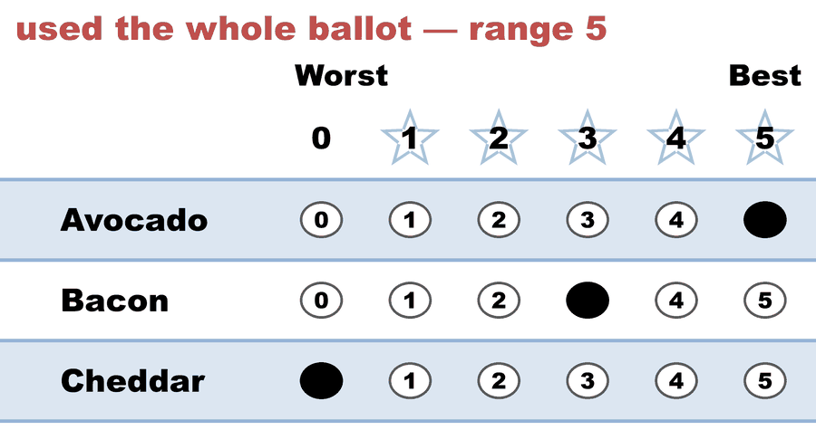
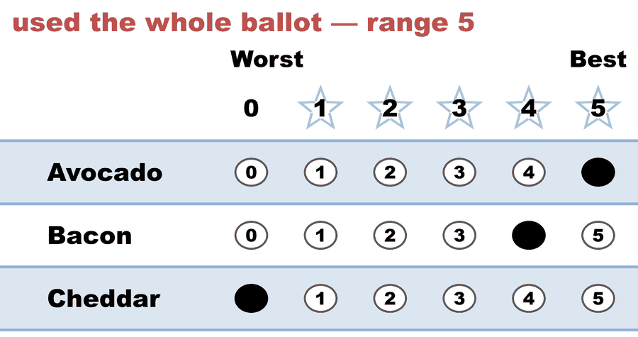
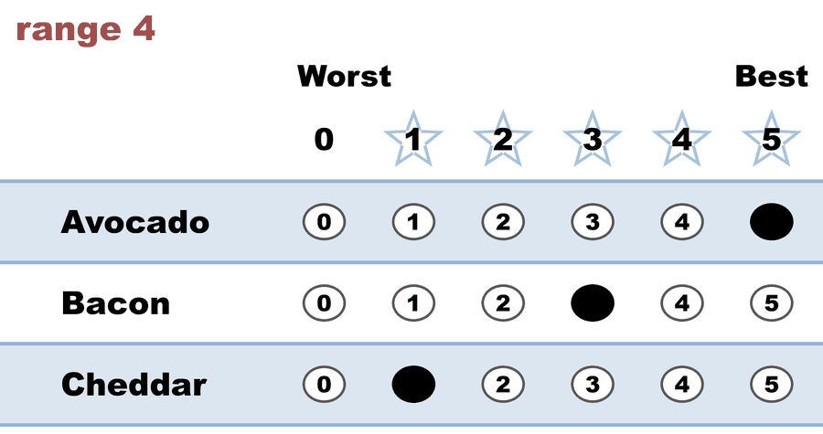
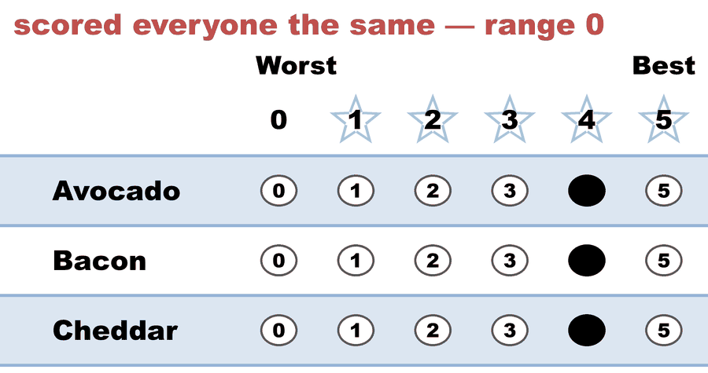
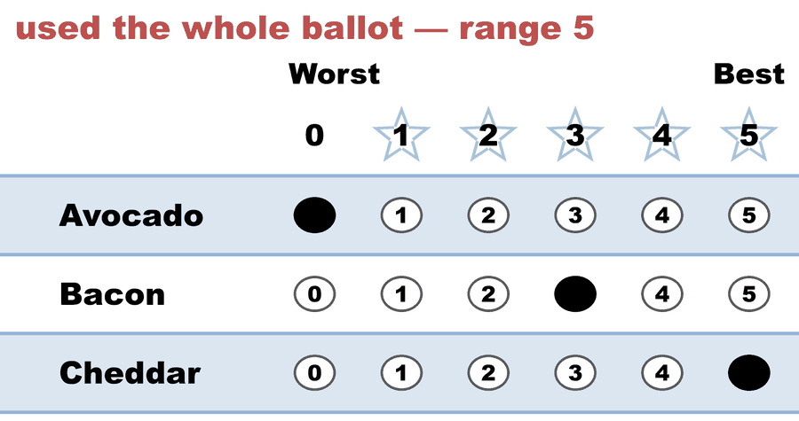
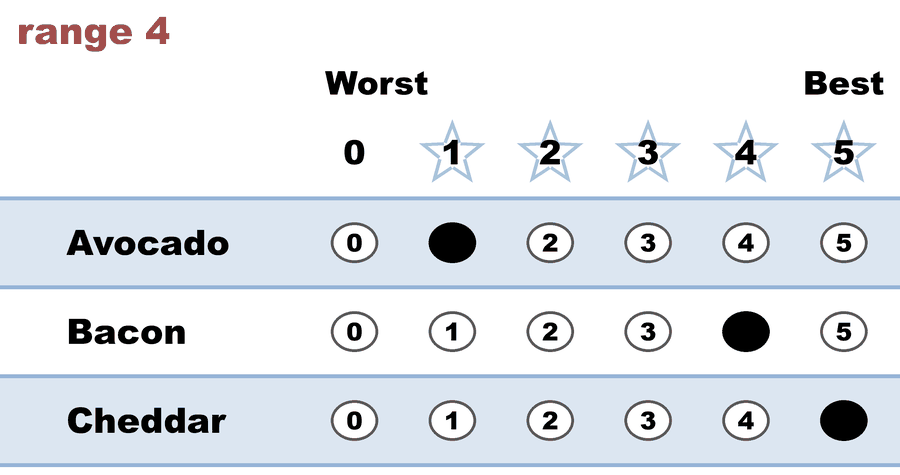
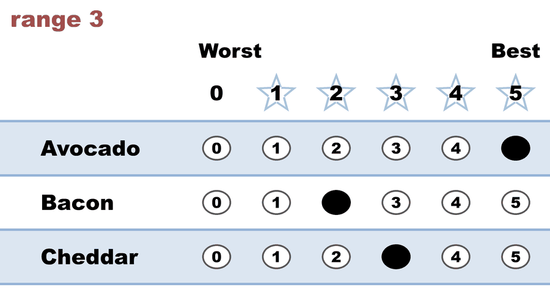

---
search:
  exclude: true
---

# Same-ish total, different shape — the sandwich vote

*Generated from [`same_total_different_shape_c3_b7.yaml`](../same_total_different_shape_c3_b7.yaml) — do not edit by hand. Regenerate: `python STARVote_LH_tabulation_engine/tools_adam/scripts/build_yaml_pages.py`.*

**Method:** [STAR (single winner)](../../../README.md) · **1 seat** · **Expected winner:** Avocado

## Scenario

Seven people pick a sandwich. The score totals are close — **Avocado 25, Bacon
23** — but the two candidates got there in opposite ways, and no single number
in the Scoring Round shows that:

- **Avocado is polarizing.** Four voters gave it a 5; two gave it a 1 or a 0.
- **Bacon is the consensus.** Nobody's favourite (no 5s at all), but nobody's
  enemy either (nothing below a 2). Every score is a 2, 3 or 4.

That difference lives in the **columns** of the ballot grid, which is what the
LH engine's `[Score Distribution]` block prints.

Read the **rows** instead and a different fact appears: three voters used the
whole 0-5 ballot (a range of 5), while voter 4 scored everyone a flat 4 and used
none of it (a range of 0). That is what BetterVoting's "Range of Scores" chart
measures — and it cannot be recovered from the score totals or from the score
distribution, because it is the other margin of the same grid.

Neither reading changes the result: Avocado and Bacon are the finalists, and
Avocado takes the runoff 4-2 with one Equal Support ballot.

## Ballots

The ballots as marked — the filled bubble is the score given, and the score is the number in its column:

| # | Ballot as marked | Avocado | Bacon | Cheddar |
|:--:|:--|:--:|:--:|:--:|
| 1 |  | 5 | 3 | 0 |
| 2 |  | 5 | 4 | 0 |
| 3 |  | 5 | 3 | 1 |
| 4 |  | 4 | 4 | 4 |
| 5 |  | 0 | 3 | 5 |
| 6 |  | 1 | 4 | 5 |
| 7 |  | 5 | 2 | 3 |

The same ballots as the file records them:

Row 1 = candidate names; each later row is one voter's 0–5 scores (a `N ×` prefix = N identical ballots).

```text
Avocado,Bacon,Cheddar
5,3,0   # used the whole ballot — range 5
5,4,0   # used the whole ballot — range 5
5,3,1   # range 4
4,4,4   # scored everyone the same — range 0
0,3,5   # used the whole ballot — range 5
1,4,5   # range 4
5,2,3   # range 3
```

## What the engine says

The count, step by step — the rounds and how the winner is reached:

<!-- --8<-- [start:report] -->
```text
[Divergence from STAR]
  STAR     = Avocado
  Approval = Bacon   (differs from STAR)

--- STAR Voting Method (single winner) ---

[STAR Voting]
 Tabulating 7 ballots.
Avocado,Bacon,Cheddar
      5,    3,      0
      5,    4,      0
      5,    3,      1
      4,    4,      4
      0,    3,      5
      1,    4,      5
      5,    2,      3

[STAR Voting: Scoring Round]
 The two highest-scoring candidates advance to the next round.
   Avocado       -- 25 -- First place
   Bacon         -- 23 -- Second place
   Cheddar       -- 18
 Avocado and Bacon advance.

[STAR Voting: Automatic Runoff Round]
 The candidate preferred in the most head-to-head matchups wins.
   Avocado       -- 4 -- First place
   Bacon         -- 2
   Equal Support -- 1
 Avocado wins.
   Runoff math:
     7  ballots cast
   − 1  Equal Support (no preference between the two finalists)
     ─
     6  voters with a preference  (majority = 4)
           Avocado 4 (67%)  ·  Bacon 2 (33%)

[STAR Voting: Winner — STAR Voting Method (single winner)]
 Avocado
```
<!-- --8<-- [end:report] -->

### Full audit — preference matrix, Condorcet, and score distribution

```text
--- Runoff (Preference) Matrix ---
Head-to-head / pairwise comparison
Legend: For - Equal Support - Against
        * indicates Top 2 Finalist
                |  * Avocado  |  * Bacon   |   Cheddar  |
---------------------------------------------------------
    * Avocado > |     ---     | 4 - 1 - 2  | 4 - 1 - 2  |
      * Bacon > |  2 - 1 - 4  |    ---     | 3 - 1 - 3  |
      Cheddar > |  2 - 1 - 4  | 3 - 1 - 3  |    ---     |

[Condorcet Winner]
  Condorcet Winner: Avocado — matches the STAR winner

[Condorcet Loser]
  No strict Condorcet loser; jointly weak Condorcet losers: Bacon, Cheddar (winless — pairwise ties) — Bacon elected by Approval!

[Score Distribution] (how many ballots gave each star rating)
                Score
Candidate  5  4  3  2  1  0  | Total   Avg
Avocado    4  1  0  0  1  1  |    25   3.6
Bacon      0  3  3  1  0  0  |    23   3.3
Cheddar    2  1  1  0  1  2  |    18   2.6
```

Everything in one file: the [`_tabulated` mirror](../cases_tabulated/same_total_different_shape_c3_b7_tabulated.txt) (regenerated on every run; every analysis forced on).

Run it yourself:

```bash
python STARVote_LH_tabulation_engine/starvote_larry_hastings.py 01_STAR/01_Learn/reporting/cases/same_total_different_shape_c3_b7.yaml
```

## See also

- [Methods disagree on this election](../../../../../method_comparisons/divergence_review/cases/APPROVAL_OR_MINOR/same_total_different_shape_c3_b7.md) — its entry in the divergence review ledger
- [Runoff reversal (worked set)](../../../../02_Examples/runoff_overturns_leader/README.md)
- [Glossary](../../../../../07_Concepts/GLOSSARY.md) · [all cases by method](../../../../../07_Concepts/YAML_test_case_index/README.md)

More cases in this set: [bv2284_8q3xcg_weak_mandate](bv2284_8q3xcg_weak_mandate.md)
