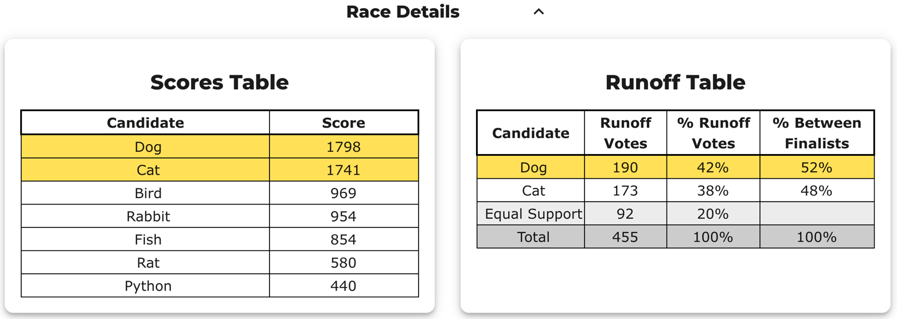
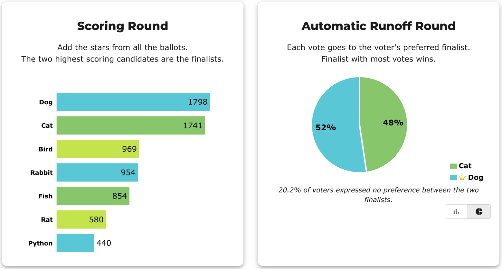

# How BetterVoting reports a STAR result

**One line:** BetterVoting (bettervoting.com) shows a **live, visual** result — interactive bar/pie charts plus "Race Details" tables — for the same STAR election the LH engine prints as text. Same method, same winner; a friendlier, less exhaustive view.

→ Hub: [STAR Reporting](../README.md) · **panel by panel: [How to read a BetterVoting results page](../../../../07_Concepts/tabulation_engines/BV/reading_a_bv_results_page.md)** · the mapping in full: [BetterVoting and the LH engine](../../../../07_Concepts/tabulation_engines/bettervoting_and_the_engine.md) · the percentages: [Runoff percentages](../../the_count/runoff_percentages.md).

---

## What BetterVoting shows

- **Scoring Round** — a bar chart of total stars; the top two bars are the finalists.
- **Automatic Runoff** — a chart with a **toggle**:
  - **bar view** uses the *all-voters* numbers (e.g. 42 / 38 / 20) with a dashed **majority-threshold** line labelled "½ of voters **with preference**";
  - **pie view** drops Equal Support and shows just the two finalists (52 / 48), footnoting the no-preference share.
- **Race Details tables** — a **Scores Table** (the score totals) and a **Runoff Table** with **two percent columns**:
  - **% Runoff Votes** — out of *all* ballots (includes the Equal Support share);
  - **% Between Finalists** — out of only the voters *with a preference*. This is the column that decides the race. (Same idea, named: [Runoff percentages](../../the_count/runoff_percentages.md).)
- **Abstentions / tally** — the result data carries `nAbstentions` and `nTallyVotes`.
- **Stats for Nerds** — a second expander below Race Details, with a dropdown of analysis widgets. For a STAR race that's *Voter Profile* (the average ballot of a chosen candidate's top-scorers, plus a head-to-head split), *Head-to-head*, *Voter Error Stats*, *Column Distribution* (how many candidates each voter scored, and which star columns got used at all), **Range of Scores** (`max − min` per ballot), *Name Recognition* (feature-flagged off by default), and the STAR-specific *Detailed Steps* / *Equal Preferences* panels. These are **per-voter** analyses; the LH engine's `[Score Distribution]` is the **per-candidate** one, and the two are not substitutes — see [Two views of the same scores](../score_matrix_two_views.md).

## The screenshots (the pet race)

**Scoring Round + Automatic Runoff bars** — totals on the left; on the right each ballot's full vote goes to the higher-scored finalist, with the dashed *majority-threshold* line (½ of voters **with a preference**) that only the winner's bar crosses:

**Race Details tables** — the Scores Table and the Runoff Table, where the same 190 votes appear as **two percentages**: `% Runoff Votes` (out of all 455) and `% Between Finalists` (out of the 363 with a preference):

**Pie view** — the runoff toggled to drop Equal Support and show just the two finalists (52 / 48), footnoting the no-preference share:

(The same screenshots, walked through against the two denominators, are in [Runoff percentages](../../the_count/runoff_percentages.md).)

## One thing to watch: what BetterVoting calls an "abstention"

BetterVoting counts a ballot as an **abstention** when it is **flat** — every candidate scored the same — and excludes it from the tally. That includes an all-zeros ballot **and** an engaged ballot like all-5s or `3,3,3`. The LH engine instead counts every cast ballot and treats only a **blank** ballot as an abstention, filing flat ballots under **Equal Support**. Same winner, different tally and score totals — see [Where the two reports differ](../reporting_diff_BV_LH.md).

### The same rule, one page over — "Range of Scores" (#1487)

The *Stats for Nerds* charts read the anonymized ballots directly, through a helper (`ballotsForRace()`) that drops only a **truly blank** ballot — i.e. **LH's** abstention rule, not BetterVoting's. So on an election with flat ballots the **Range of Scores** chart and the page headline divide by different numbers, and only one of them is printed. On [`hckrf7`](../../../04_Real_Elections/abstain_bugs/bhckrf7_range_of_scores.md) the chart reads `33% / 67%` (of **3** ballots) directly under the words *"1 voters"*. Nothing is miscounted; the denominator is just invisible. Filed as [Equal-Vote/bettervoting#1487](https://github.com/Equal-Vote/bettervoting/issues/1487).

### A related display bug — the "Distribution of Equal Support" graph (#1390)

The same **blank (`null`) vs explicit `0`** distinction bit one of BetterVoting's *Stats for Nerds* charts. On the real **[CA Governor election `gvdy42`](../../../04_Real_Elections/runoff_reversal_bv_cases/Runoff_08_ca_governor_reversal_gvdy42.md)**, the "Distribution of Equal Support" graph showed a single bar built from only **5** ballots, though the runoff correctly counted **124** equal-support. The widget compared raw scores, so ballots that skipped *both* finalists (`null == null`) and `null`-vs-`0` ballots were silently dropped. Fixed by coercing skipped scores to `0` to match the tabulator — [#1390](https://github.com/Equal-Vote/bettervoting/issues/1390) / [PR #1431](https://github.com/Equal-Vote/bettervoting/pull/1431). The tabulator was always right; only the chart was wrong. (LH independently reproduces the 124: it reports 141 Equal Support = 124 + the 17 abstentions it folds in.)

Try it: [bettervoting.com](https://bettervoting.com) · [help & FAQ](https://docs.bettervoting.com) · a real frozen result: [pet race snapshot](../../../04_Real_Elections/pet_real_bv_election/BV_result_snapshot.md).
