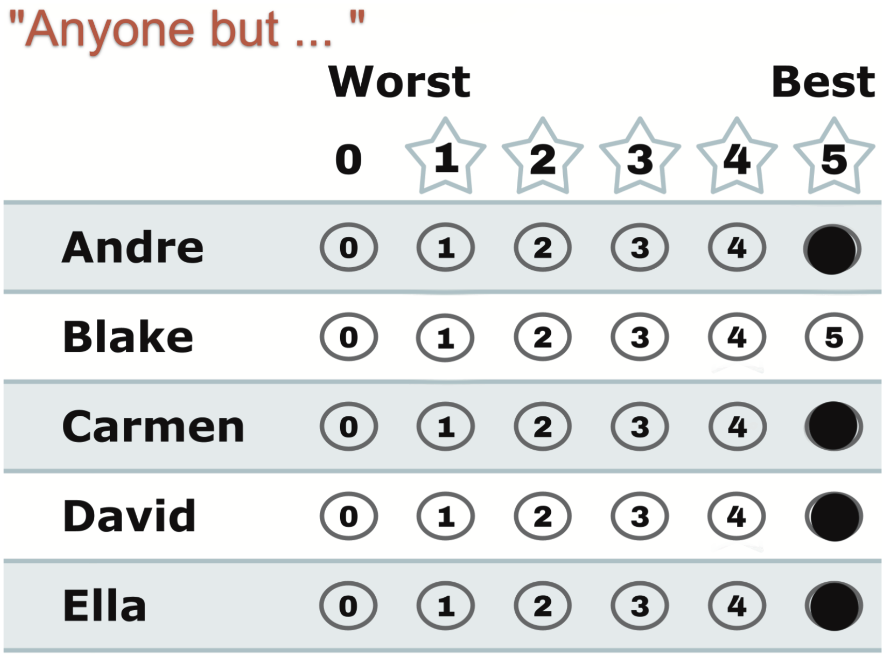

# "Anyone But…" — every candidate at 5 except the one

*Fives across the board, one row left blank. A ballot with a single, emphatic message: not that one.*

← One of eight [voting styles](../STAR_ballot_voting_styles.md). Every style is legal and counted; this page is what this one means, when it fits, and what it trades away.

## What this ballot says

**"Anyone but Blake."** Four candidates at the maximum, Blake at 0. This voter isn't choosing a champion — they're drawing a line, and the ballot lets them draw it at full strength.

## When it fits

- One candidate is, to you, disqualifying — and stopping them matters more than sorting the alternatives.
- Choose-one ballots serve this opinion terribly (you must guess which opponent can win); a scored ballot serves it perfectly — back *all* of them at once, no guessing.

## The trade-off, honestly

Against Blake, this ballot is maximal: every rival gets full scoring help, and in any Blake-versus-anyone [runoff](../the_count/STAR_Automatic_Runoff.md), your whole vote lands on the anyone. The cost cuts the other way: if Blake *misses* the final — partly thanks to ballots like yours — the runoff is between two of your identical 5s, and yours is an [Equal Support](../../../07_Concepts/GLOSSARY.md) ballot with no say between them. You also boosted candidates you may only tepidly accept on equal footing with ones you genuinely like. If you can feel *any* daylight between the acceptables, score it — a 5-4-4-3 "anyone but" keeps all the stopping power and adds a voice in the aftermath.

## This exact style in a real election

In the runnable [style-gallery election](../../02_Examples/cases/cases_pages/03c_c6_b8_style-gallery.md), the anyone-but row is `5,5,0,5,5,5` — anyone but Chris. It worked: Chris finished dead last with zero points. And then the finalists were two of the ballot's own 5s, so it watched the final as Equal Support — the exact aftermath scenario above, caught live.

## Related

- [Partisan](partisan.md) — the same all-or-nothing ballot pointed *for* a team instead of against one candidate
- [Nuanced](nuanced.md) — how to keep the stop-power and still have a say in the final
