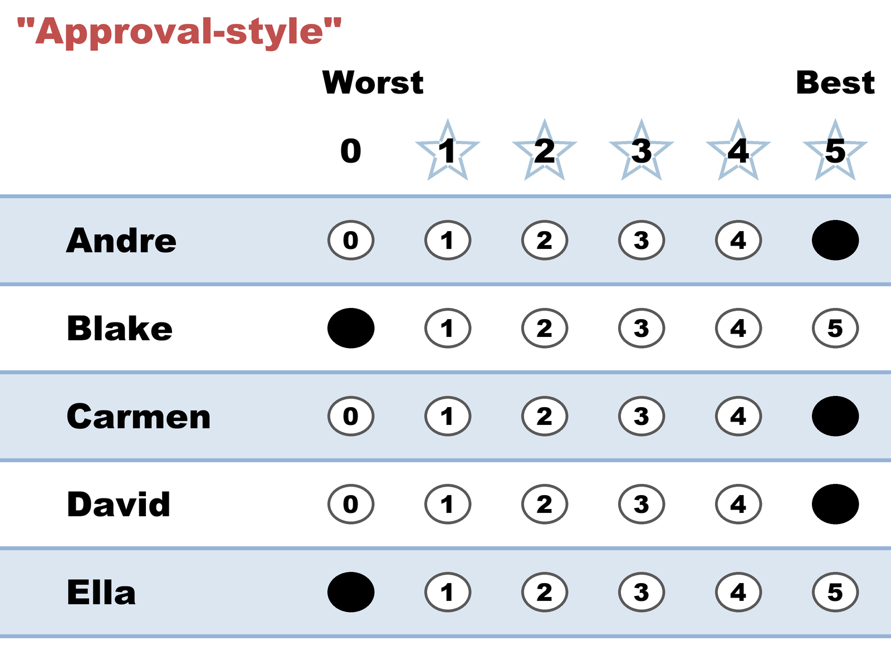

# "Approval-style" — only 0s and 5s, across the whole field

*Every candidate gets either full marks or nothing. A yes/no threshold, drawn wherever you choose to draw it.*

← One of thirteen [voting styles](README.md). Every style is legal and counted; this page is what this one means, when it fits, and what it trades away.

## What this ballot says

**"Andre, Carmen and David are acceptable. Blake and Ella are not."** No middle, no ordering — one line drawn across the field, with everyone above it at 5 and everyone below it at 0. It is a STAR ballot filled out as an [Approval ballot](../../../04_Approval/01_Learn/approval_voting.md), and the count accepts it without complaint.

Worth separating from the [Partisan](partisan.md) style, which produces similar-looking marks for a different reason. Partisan is about a **team** — my side, all of them, none of yours. Approval-style is about a **threshold**: this voter might well have put two rivals from opposing camps above the line and left a nominal ally below it. Same marks, different question answered.

## When it fits

- Your honest opinion really is a cliff rather than a slope — some candidates are qualified and the rest are not, and the gaps within each group don't feel real to you.
- You want maximum weight behind everyone you like: a 5 pushes a candidate toward the final harder than a 4 does, and this ballot spends the maximum on every candidate it supports.
- You're deciding quickly, or in a large field, and you trust your yes/no judgement more than your ability to rank fine distinctions.

## The trade-off, honestly

This ballot is loud in the first round and silent in the second. In the **scoring round** it spends every point available to it, so it has the most possible influence over *who reaches the final*. But STAR then asks a second question — which of these two finalists do you prefer? — and a ballot with only 0s and 5s often has no answer. If two of your 5s become the finalists, it lands as [Equal Support](../../../07_Concepts/GLOSSARY.md): you helped choose the matchup and then declined to call it. Same story if two of your 0s make the final.

The fix costs nothing and requires no strategy: keep the threshold, but break the tie at the top. Give your genuine favorite the 5 and your next-best approved candidate a 4. Every candidate you approve of still gets near-maximum scoring-round weight, and now the runoff has something to work with. That single point is the difference between voting in the final and watching it.

## This exact style in a real election

In the runnable [five-more election](../../02_Examples/cases/cases_pages/03d_c5_b5_style-gallery-five-more.md), the approval-style row is `5,0,5,0,0` — Alice and Clara above the line, Bruno, Diego and Erin below it. Both of this ballot's 5s became the finalists, so it sat out the Clara-versus-Alice runoff as Equal Support: the two candidates it had done the most to promote were the two it then had nothing to say about.

A whole election of these ballots has its own case: [STAR à la Approval](../../02_Examples/cases/cases_pages/star_ala_approval.md), where every voter scores only 0 or 5 and the scoring round becomes a plain approval count.

## Related

- [STAR à la Approval](../../02_Examples/cases/cases_pages/star_ala_approval.md) — an entire election cast in this style
- [Partisan](partisan.md) — the same all-or-nothing marks, drawn around a team instead of a threshold
- [Decent Backup](decent_backup.md) — the one-point change that keeps the runoff vote
- [Approval Voting](../../../04_Approval/01_Learn/approval_voting.md) — the method this ballot is borrowed from
- [STAR's Automatic Runoff](../the_count/STAR_Automatic_Runoff.md) — where Equal Support ballots land
