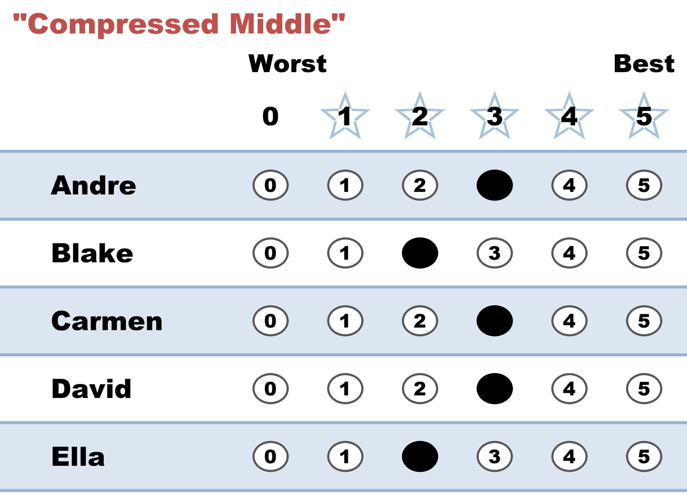

# "Compressed Middle" — everything 2s and 3s, nothing extreme

*Mild preferences, honestly recorded. No candidate gets full marks, none gets a zero, and the whole ballot fits in a one-point band.*

← One of thirteen [voting styles](../STAR_ballot_voting_styles.md). Every style is legal and counted; this page is what this one means, when it fits, and what it trades away.

## What this ballot says

**"They're all roughly fine. I lean slightly toward Andre, Carmen and David, but nobody here excites or alarms me."** It's the ballot of a voter with real but small preferences, who declines to manufacture larger ones.

## When it fits

- The race genuinely is low-stakes to you, or the field is genuinely uniform — a slate of similar, competent people.
- You dislike the feeling that scoring is shouting, and you'd rather your ballot said something proportionate.
- You're rating on an absolute scale by instinct ("nobody here is a 5") rather than relative to the field.

## The trade-off, honestly

STAR's two rounds treat this ballot very differently, and the asymmetry is the whole lesson.

In the **scoring round**, influence is measured in points. A voter who spreads 5 to 0 contributes five points of separation between their favorite and their last choice; this ballot contributes one. So its say in *who reaches the final* is genuinely, arithmetically small — not discounted by any rule, just quieter by its own choice.

In the **[runoff](../the_count/STAR_Automatic_Runoff.md)**, influence is measured in direction. A 3-over-2 is a **full vote**, exactly as strong as a 5-over-0 — the runoff asks which way you lean, never how far. So a ballot that whispered about the finalists shouts about the winner.

Two consequences worth knowing. First, this is not a weak ballot; it's a ballot that is weak in one round and at full strength in the other. Second, if you want more say in *who makes the final* without inventing opinions you don't have, stretch only the ends: your genuine favorite to 5, your genuine last choice to 0, everyone in between exactly where your honest opinion puts them. You'll have invented nothing — the [Equally Weighted Vote](../properties_and_limits/equally_weighted_vote.md) guarantees no style out-muscles another, and a wider honest spread is simply your own opinion at full volume.

The one thing to avoid is compressing so far that the band collapses. A ballot where every candidate has the *same* score stops saying anything at all — that's the [Null Ballot](null_ballot.md), one step past this one.

## This exact style in a real election

In the runnable [five-more election](../../02_Examples/cases/cases_pages/03d_c5_b5_style-gallery-five-more.md), the compressed row is `2,2,3,2,3` — a single point between best and worst. It barely moved the scoring round. But in the Clara-versus-Alice runoff, its 3-over-2 was one of only **two** full votes cast out of five ballots (the other three were Equal Support) — so the quietest ballot in the election turned out to be half the decisive margin.

## Related

- [Null Ballot](null_ballot.md) — one step further: the band collapses and the ballot goes silent
- [Nuanced](nuanced.md) — the same honesty, using the full range
- [Equally Weighted Vote](../properties_and_limits/equally_weighted_vote.md) — why no style out-muscles another
