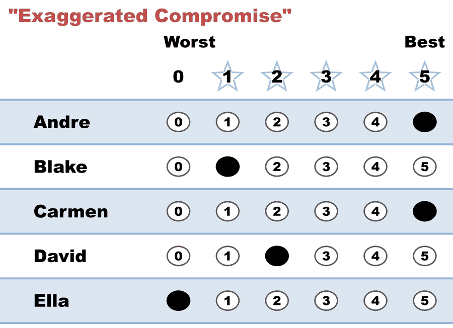

# "Exaggerated Compromise" — a fearful 5 for the front-runner

**Level: 101 · for voters**

*Your favorite gets a 5. So does the candidate you'd honestly rate a 3 — because you're afraid your favorite can't win and you want insurance.*

← One of thirteen [voting styles](README.md). Every style is legal and counted; this page is what this one means, when it fits, and what it trades away.

## What this ballot says

**"Carmen is my favorite. Andre is honestly a 3 — but everyone says he's going to make the final, so I'm giving him a 5 to be safe."** The rest of the ballot is sincere. Only the top is inflated, and it's inflated out of fear rather than enthusiasm.

This is the instinct a choose-one ballot trains into people: *don't waste your vote on someone who can't win*. It's the one style in this gallery that reliably works against the voter who uses it, so it's here to be named rather than recommended.

## When it fits

Honestly: almost never. The worry behind it is real, but STAR already answers it — a lower score for your compromise choice does nothing at all to your favorite's 5, so you can support both without a trade. The two cases where equal top scores are genuinely right are covered by other styles: [Partisan](partisan.md) (you sincerely refuse to rank teammates) and [Nuanced](nuanced.md) (you sincerely cannot split two candidates). If your equal 5s are sincere, this page isn't about your ballot.

## The trade-off, honestly

The exaggeration buys you something real and charges you for it in the same breath. Andre gets two extra points, which genuinely helps him reach the final. But if the final turns out to be **Carmen versus Andre** — the exact matchup this voter was anxious about — the ballot is [Equal Support](../../../07_Concepts/GLOSSARY.md). You said the two of them were identical, so the count believes you, and the choice between your favorite and your insurance policy is made by other people.

So the strategic advice STAR actually supports is narrow and easy to remember: **never give your top two the same score.** Score your favorite 5 and your compromise 4, and both of the things you wanted are true at once — the compromise gets nearly all the help a 5 would have given, and you keep a full vote in the runoff between them. That ballot has a name already: it's the [Decent Backup](decent_backup.md), and it is strictly better than this one for the voter casting it.

(The deeper version of this worry — whether STAR ever *rewards* betraying your favorite — is its own topic: [favorite betrayal](../properties_and_limits/favorite_betrayal_voting_301.md), and [STAR's honest limits](../properties_and_limits/STAR_honest_limits.md).)

## This exact style in a real election

In the runnable [five-more election](../../02_Examples/cases/cases_pages/03d_c5_b5_style-gallery-five-more.md), this row is `5,1,5,2,0` — Clara the real favorite, Alice the fearful 5. The scoring round produced exactly the feared matchup: **Clara 21, Alice 15**, the two finalists. And so the ballot arrived at the Clara-versus-Alice runoff as Equal Support, with nothing to say about the only question it had been worrying about all along. Clara won regardless — the cost here wasn't the result, it was the vote this voter gave away for free.

## Related

- [Decent Backup](decent_backup.md) — the same instinct, one point lower, runoff vote intact
- [Partisan](partisan.md) — equal 5s that are sincere rather than fearful
- [Approval-style](approval_style.md) — the same Equal Support trap reached by a different route
- [STAR's honest limits](../properties_and_limits/STAR_honest_limits.md) — what a backup score does and doesn't risk
