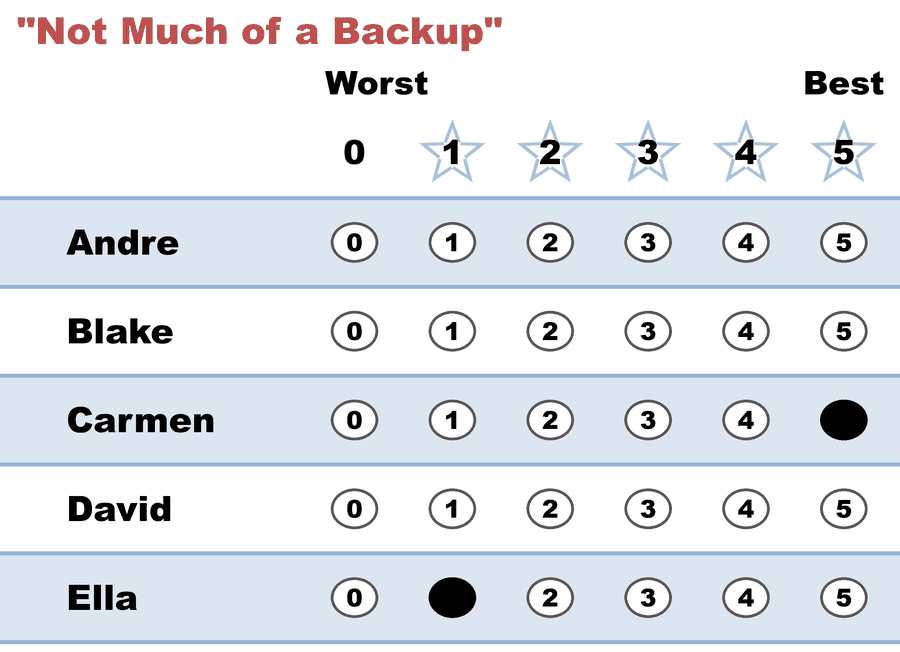

# "Not Much of a Backup" — a 5, then a grudging 1

*Favorite at 5, a reluctant second at just 1, everyone else blank. A backup with the volume turned way down.*

← One of thirteen [voting styles](README.md). Every style is legal and counted; this page is what this one means, when it fits, and what it trades away.

## What this ballot says

**"Carmen — and Ella only over the rest, reluctantly."** The 1 is a real preference: in any Ella-versus-someone-else [runoff](../the_count/STAR_Automatic_Runoff.md), this ballot's full vote goes to Ella (1 beats 0). But in the scoring round it gives Ella almost nothing — one point instead of the four a "decent backup" would send.

## When it fits

- Your second choice really is that distant — you'd take Ella over the rest, but you don't want your ballot *campaigning* for her.
- You want to keep the biggest possible gap between your favorite and everyone else while still holding a tiebreaker-of-last-resort over the field.

## The trade-off, honestly

The low score is honest, and honesty is the point — but know what it buys. A 1 barely helps Ella *reach* the runoff; if your real opinion is "she'd be clearly better than the rest," an under-scored backup can watch a candidate you like even less take the second finalist slot instead. The runoff preference (1 over 0) only matters if Ella gets there. Score the gap you actually feel: a 1 that means "barely tolerable" is perfect; a 1 that secretly means "pretty good, but I'm playing it cool" mostly just mutes your own voice.

## This exact style in a real election

In the runnable [style-gallery election](../../02_Examples/cases/cases_pages/03c_c6_b8_style-gallery.md), the weak-backup row is `0,5,0,0,0,1` — Bianca 5, Frank 1. Bianca and Frank became the two finalists anyway, and the ballot's runoff vote went to Bianca (5 over 1), who won. Same runoff behavior as the decent backup — the difference was all in the scoring round, where this ballot gave Frank one point instead of four.

## Related

- [Decent Backup](decent_backup.md) — the same idea at full, honest volume
- [Protest Vote](protest_vote.md) — the style this becomes when even the favorite drops away
