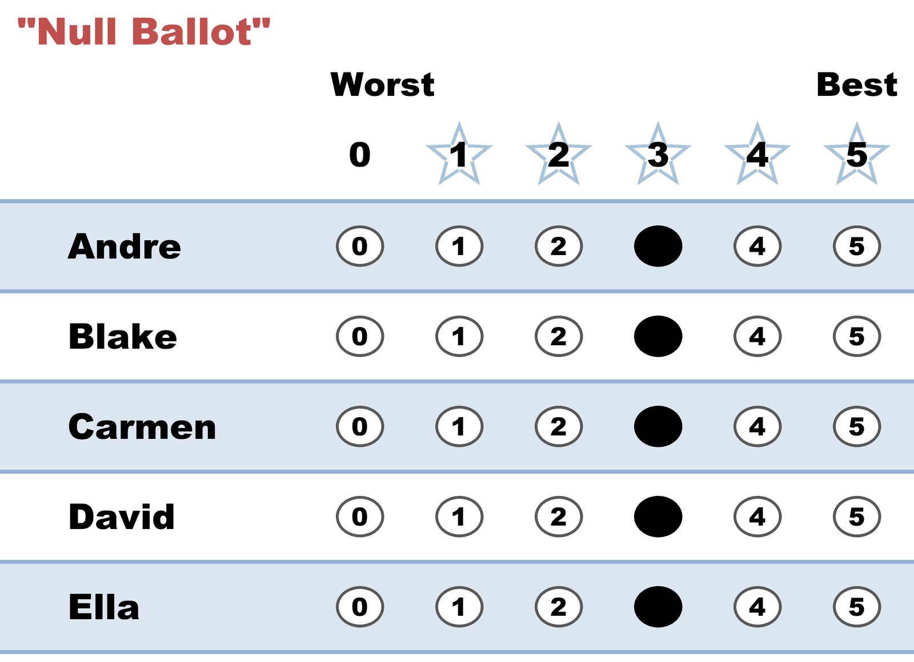

# "Null Ballot" — every candidate the same score

*A legal, counted ballot that has no effect on anything. The one way to fill out a STAR ballot that says nothing at all.*

← One of thirteen [voting styles](README.md). Every style is legal and counted; this page is what this one means, when it fits, and what it trades away.

## What this ballot says

**Nothing.** Usually the voter means something warm by it — *"I like them all!"* — and occasionally something cold — *"they're interchangeable."* Either way the count hears the same thing, which is silence.

Four ballots that look quite different on paper are all the same null ballot once counted: **every row 5**, **every row 3**, **every row 0**, and **every row blank**. Adding the same number to every candidate raises every total by that number, so nothing moves relative to anything else — and with no gaps anywhere, there's no preference to carry into a runoff either. "I love them all" and "I hate them all" are, as votes, identical.

## When it fits

As a strategy, never — it is the only ballot in this gallery with no influence whatsoever, and every other style on the page beats it. It's documented here for two better reasons.

- Voters really do cast it, most often the "I like them all" version, believing it helps everyone they like. It helps no one.
- It's a legitimate way to **abstain from a race while still returning a ballot** — you turn in the paper, you're counted in the turnout, and you decline this particular contest. If that's what you want, this is how to do it deliberately rather than by accident.

## The trade-off, honestly

There is no trade-off, because nothing is being traded. In the **scoring round** the ballot adds the same number to every candidate, which cannot change their order. In the **[runoff](../the_count/STAR_Automatic_Runoff.md)** it is [Equal Support](../../../07_Concepts/GLOSSARY.md) against every possible pair of finalists. Both rounds, no effect, guaranteed in advance — not by chance in this election, but by arithmetic in every election.

If the feeling behind it is sincere — you really are content with all of them — the ballot that expresses *that* and still counts is a narrow honest spread: your mild favorite a 3, your mild least-favorite a 2, everyone else where they fall. That's the [Compressed Middle](compressed_middle.md), and it takes one extra mark to go from silent to decisive.

If instead the feeling is "none of these deserve my support," the [Protest Vote](protest_vote.md) records displeasure in a way the count can actually hear.

## This exact style in a real election

In the runnable [five-more election](../../02_Examples/cases/cases_pages/03d_c5_b5_style-gallery-five-more.md), the null row is `3,3,3,3,3`. Delete that voter entirely and the election is unchanged where it matters: the same two finalists, the same winner, the same runoff tally of **Clara 2, Alice 0**. The only movement is that every score total drops by the same 3 — Clara 21 → 18, Alice 15 → 12 — and the Equal Support count falls from 3 to 2, since the silent ballot is no longer there to be silent. Nothing that decides anything moves at all.

## Related

- [Compressed Middle](compressed_middle.md) — one mark away, and decisive
- [Protest Vote](protest_vote.md) — how to register "none of these" so that it counts
- [Partisan](partisan.md) — equal scores used deliberately, on part of the field instead of all of it
- [STAR's Automatic Runoff](../the_count/STAR_Automatic_Runoff.md) — where Equal Support ballots land
