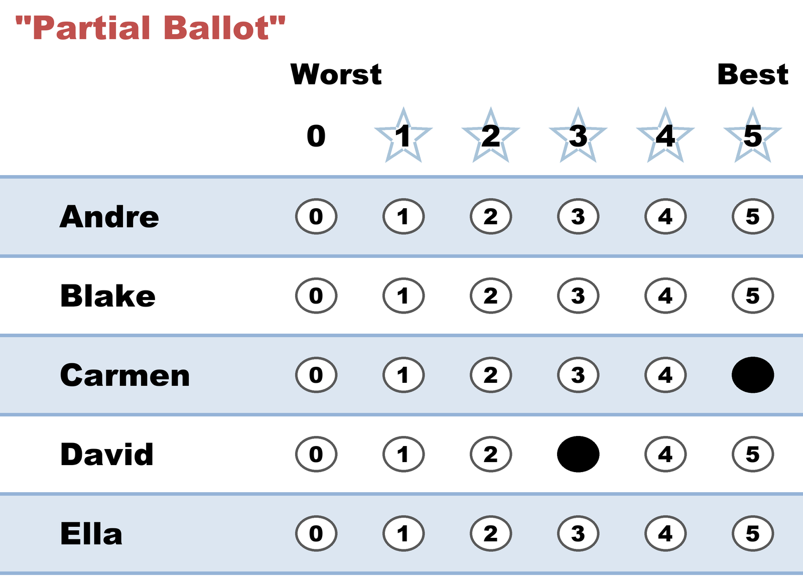

# "Partial Ballot" — score the ones you know, leave the rest

*Two candidates you've actually heard of get real scores. The others stay blank, because you have no opinion to give them.*

← One of thirteen [voting styles](README.md). Every style is legal and counted; this page is what this one means, when it fits, and what it trades away.

## What this ballot says

**"Carmen I like, David is decent, and I genuinely don't know the other three."** This isn't a statement about the field — it's a statement about the voter's information. It's probably the most common ballot in any real down-ballot race, and it's completely legal: no skipped row can spoil a STAR ballot.

It's worth distinguishing from [Traditional](traditional.md), which looks similar in the marks. A traditional bullet vote is a decision — *this one, nobody else*. A partial ballot is a gap in knowledge. The count can't tell them apart, which is exactly what the next section is about.

## When it fits

- Long ballots and down-ballot races — judicial retention, water boards, at-large council seats — where nobody has met most of the candidates.
- Large primary fields where you know the three names from the news and none of the other eleven.
- Any race where you'd rather record a small honest opinion than a large invented one.

## The trade-off, honestly

Here is the part that surprises people: **a blank is not an abstention from that candidate — it's a zero.** The ballot's printed rules say so plainly ("those left blank receive zero stars"), and the count applies them literally. So a row you left empty because you'd never heard of the candidate lands on the tally in exactly the same place as a row you deliberately scored 0 to say "this one, never."

That's not a flaw to be fixed — a score has to be *some* number, and there's no neutral value available (see [abstention vs. zero vs. NOTA](../properties_and_limits/abstention_vs_zero_vs_nota.md) for why "no opinion" can't simply be left out of an average). But it does mean the choice is yours to make deliberately: if you'd rather not push an unknown candidate to the bottom of the field, give them a middle score instead of a blank. Leave the row empty when "I don't want this one" is true; use a 2 or a 3 when the honest statement is "I don't know."

This library's YAML files keep the distinction visible even though the arithmetic doesn't — `-` for a blank, `~` for a race abstention, `&` for a candidate abstention. All three tabulate as 0 and all three are [reported separately](../../../07_Concepts/topics/ballot_and_terminology_basics.md), so a reader can always see which zeros were opinions and which were silences.

## This exact style in a real election

In the runnable [five-more election](../../02_Examples/cases/cases_pages/03d_c5_b5_style-gallery-five-more.md), the partial row is `-,-,5,3,-` — Clara 5, Diego 3, and blanks for Alice, Bruno and Erin. Alice went on to become a **finalist**, losing the runoff to Clara. This ballot contributed a 0 to Alice's score total and then cast a full runoff vote against her — all from a voter whose actual opinion of Alice was that they had never heard of her. The ballot did no harm to its own goals (Clara won), but it's a clean illustration of a blank doing real work.

## Related

- [Traditional](traditional.md) — the same sparse marks, made as a decision rather than a gap
- [Compressed Middle](compressed_middle.md) — what "I don't know" looks like when you score it instead of skipping it
- [Abstention vs. zero vs. NOTA](../properties_and_limits/abstention_vs_zero_vs_nota.md) — why there's no neutral score to give
