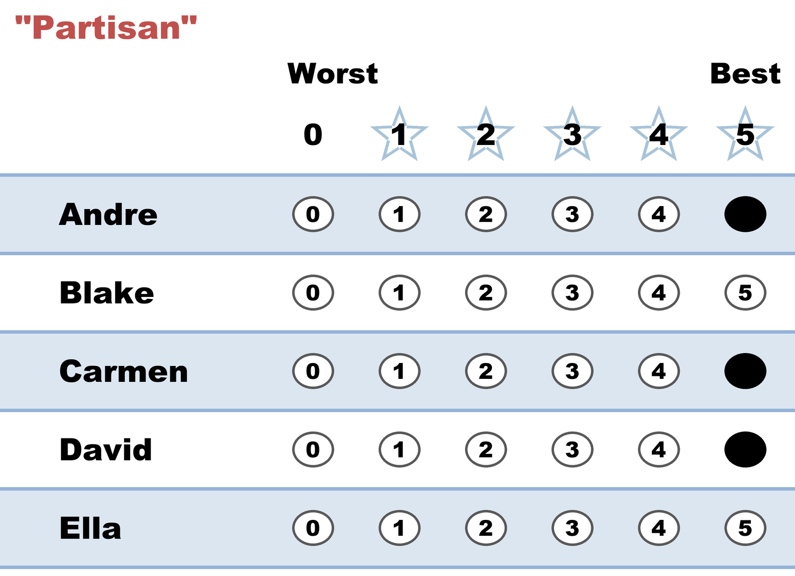

# "Partisan" — the whole slate at 5, nobody else

**Level: 101 · for voters**

*Every candidate on your side gets a 5; every other row stays blank. A party-line vote, written in stars.*

← One of thirteen [voting styles](README.md). Every style is legal and counted; this page is what this one means, when it fits, and what it trades away.

## What this ballot says

**"My side's three — Andre, Carmen, David — full support. Nobody else."** Equal 5s are allowed and honest: this voter refuses to rank teammates against each other, and the blanks put everyone outside the slate at 0.

## When it fits

- You support a team, not a person — a party slate, an endorsement list — and your genuine opinion is "any of mine over any of theirs."
- Group endorsements: an organization can recommend this exact ballot without asking members to split hairs among friends.

## The trade-off, honestly

Two edges, both by your own choice. If the [runoff](../the_count/STAR_Automatic_Runoff.md) is **your slate versus outside** — the fight this ballot was built for — your full vote lands on your candidate, every time. But if **two of your own 5s become the finalists**, your ballot is [Equal Support](../../../07_Concepts/GLOSSARY.md): you said "no preference between them," so the choice among your teammates is made by voters who *did* express one. Same on the other side — two blanks in the final means you've no say at all. Equal scores are never discarded (they helped decide *who* made the final); they just decline the last question.

## This exact style in a real election

In the runnable [style-gallery election](../../02_Examples/cases/cases_pages/03c_c6_b8_style-gallery.md), the partisan row is `5,5,0,0,0,5` — a three-candidate slate. Two of the slate's own 5s (Bianca and Frank) became the finalists, so this ballot sat the runoff out as Equal Support — precisely the "teammates in the final" edge case above, caught live in a six-candidate race.

## Related

- [Anyone But…](anyone_but.md) — the same all-or-nothing ballot pointed the other way
- [STAR's Automatic Runoff](../the_count/STAR_Automatic_Runoff.md) — where Equal Support ballots land, exactly
