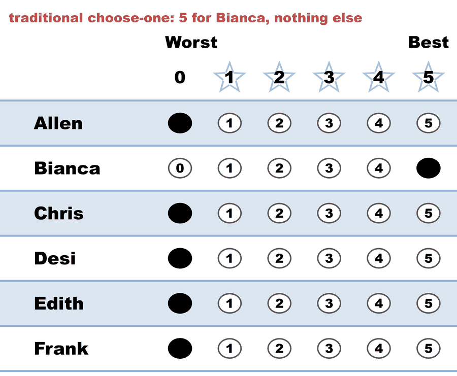
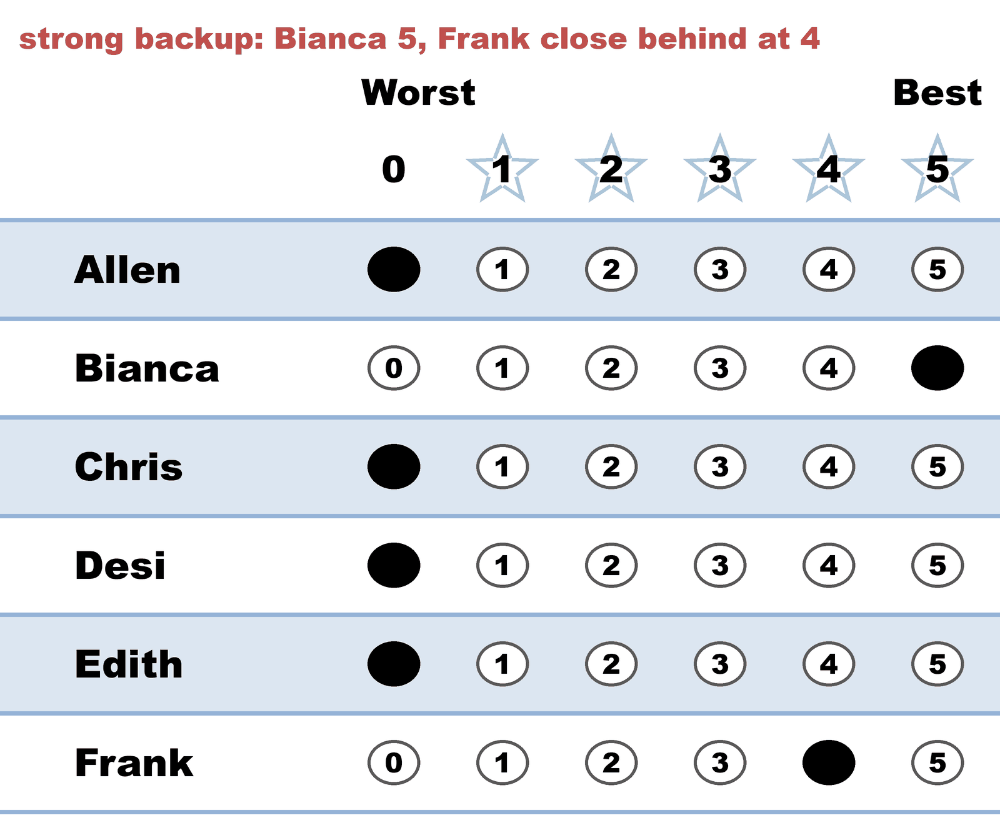
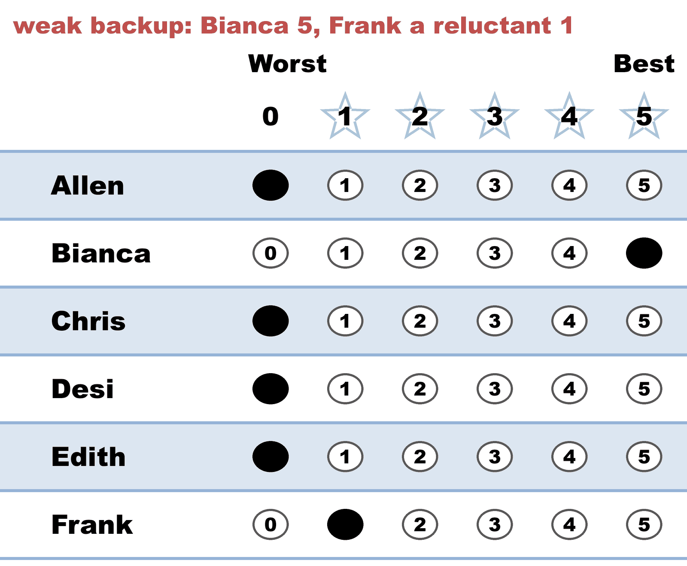
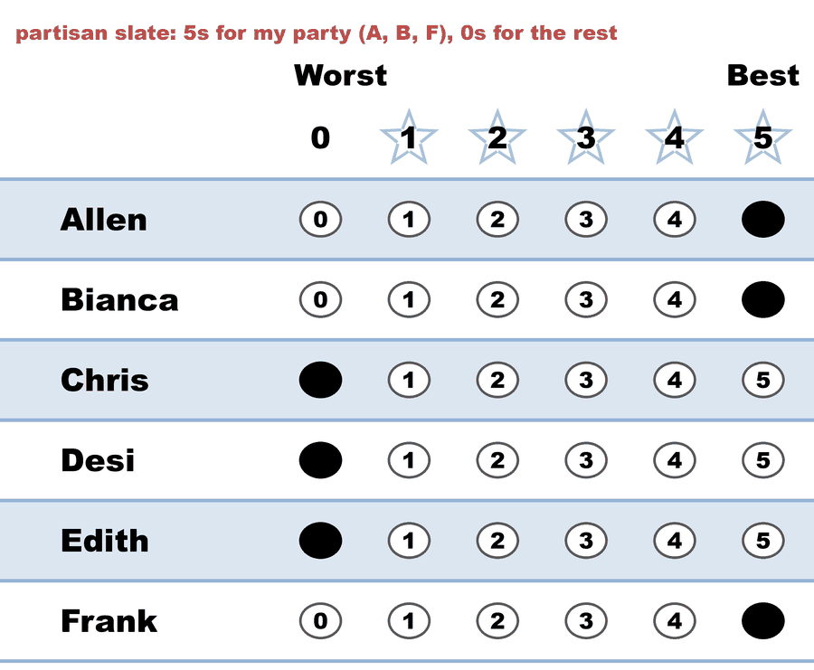
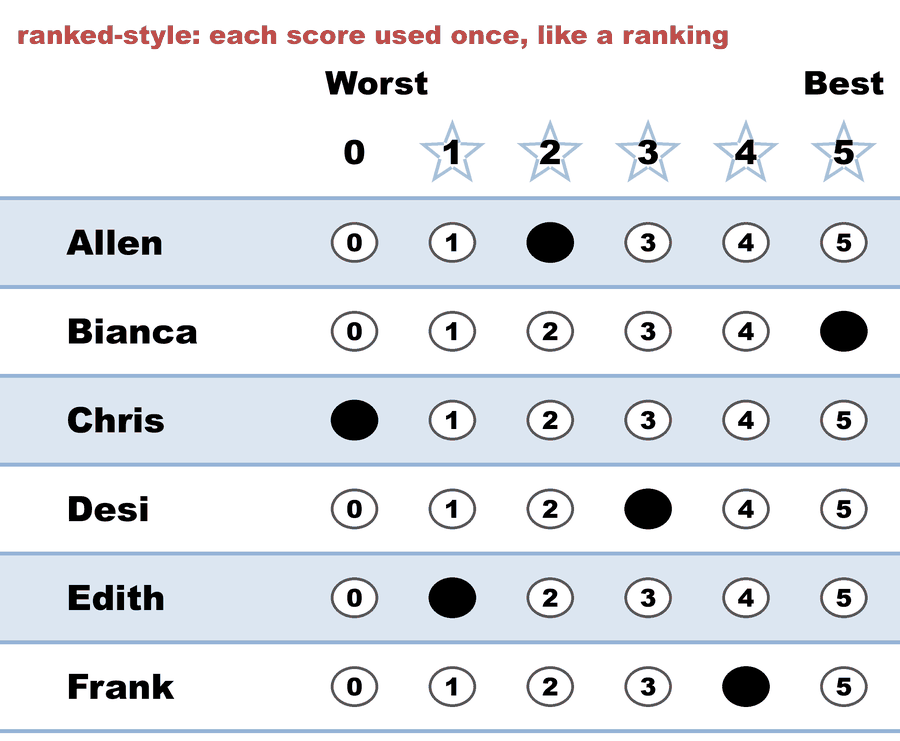
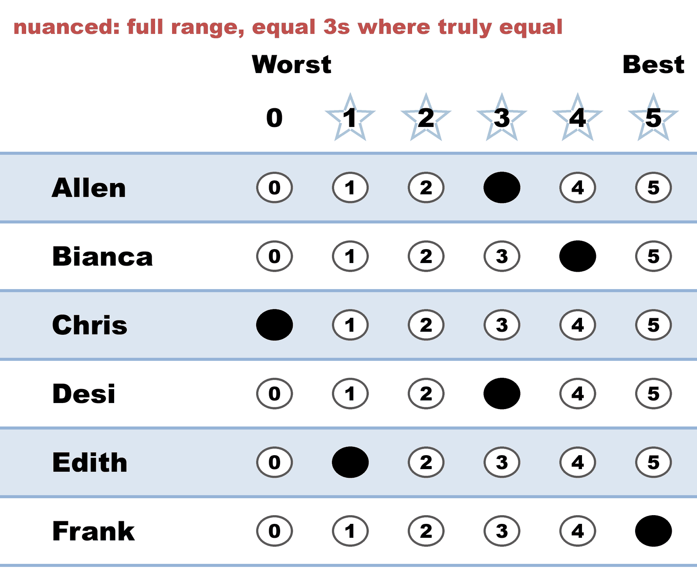
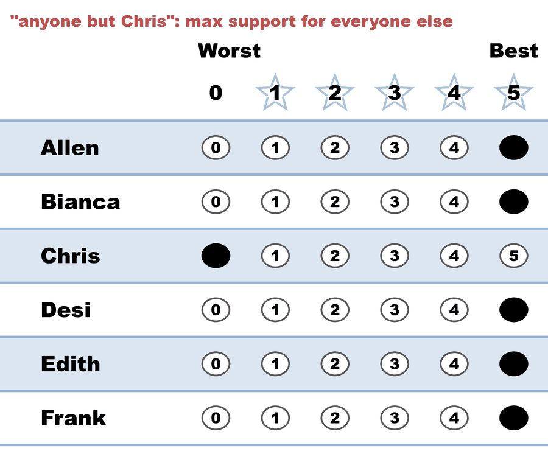
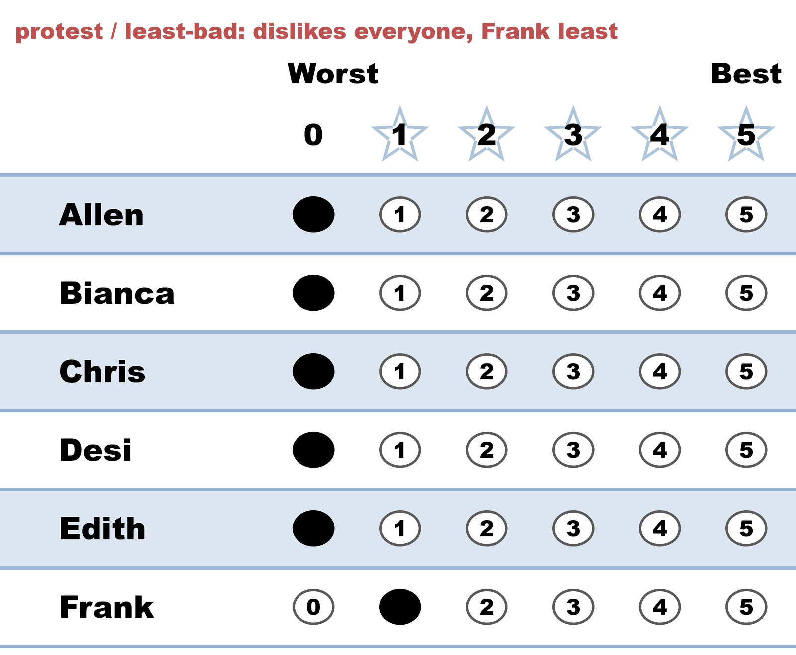

---
search:
  exclude: true
---

# Voting styles — eight ways to fill out one 5-star ballot

*Generated from [`03c_c6_b8_style-gallery.yaml`](../03c_c6_b8_style-gallery.yaml) — do not edit by hand. Regenerate: `python STARVote_LH_tabulation_engine/tools_adam/scripts/build_yaml_pages.py`.*

**Method:** [STAR (single winner)](../../../01_Learn/README.md) · **1 seat** · **Expected winner:** Bianca

## Scenario

A gallery of legal STAR ballot styles, one voter per style: traditional
(choose-one), strong backup, weak backup, partisan slate, ranked-style,
nuanced, "anyone but...", and a protest (least-bad) vote. Every ballot is
valid — STAR scores each candidate independently 0-5, so equal scores and
skipped candidates can't spoil a ballot. Note the two Equal Support ballots
in the runoff: the partisan and "anyone but" voters scored both finalists
the same, so they expressed no preference between them — but their scores
still helped pick the finalists.
Lesson: 01_STAR/01_Learn/voting_styles/README.md

## Ballots

The ballots as marked — the filled bubble is the score given, and the score is the number in its column:

| Ballot as marked | Allen | Bianca | Chris | Desi | Edith | Frank |
|:--|:--:|:--:|:--:|:--:|:--:|:--:|
|  | 0 | 5 | 0 | 0 | 0 | 0 |
|  | 0 | 5 | 0 | 0 | 0 | 4 |
|  | 0 | 5 | 0 | 0 | 0 | 1 |
|  | 5 | 5 | 0 | 0 | 0 | 5 |
|  | 2 | 5 | 0 | 3 | 1 | 4 |
|  | 3 | 4 | 0 | 3 | 1 | 5 |
|  | 5 | 5 | 0 | 5 | 5 | 5 |
|  | 0 | 0 | 0 | 0 | 0 | 1 |

The same ballots as the file records them:

Row 1 = candidate names; each later row is one voter's 0–5 scores (a `N ×` prefix = N identical ballots).

```text
Allen,Bianca,Chris,Desi,Edith,Frank
    0,     5,    0,   0,    0,    0   # traditional choose-one: 5 for Bianca, nothing else
    0,     5,    0,   0,    0,    4   # strong backup: Bianca 5, Frank close behind at 4
    0,     5,    0,   0,    0,    1   # weak backup: Bianca 5, Frank a reluctant 1
    5,     5,    0,   0,    0,    5   # partisan slate: 5s for my party (A, B, F), 0s for the rest
    2,     5,    0,   3,    1,    4   # ranked-style: each score used once, like a ranking
    3,     4,    0,   3,    1,    5   # nuanced: full range, equal 3s where truly equal
    5,     5,    0,   5,    5,    5   # "anyone but Chris": max support for everyone else
    0,     0,    0,   0,    0,    1   # protest / least-bad: dislikes everyone, Frank least
```

## What the engine says

The count, step by step — the rounds and how the winner is reached:

<!-- --8<-- [start:report] -->
```text
--- STAR Voting Method (single winner) ---

[STAR Voting]
 Tabulating 8 ballots.
Allen,Bianca,Chris,Desi,Edith,Frank
    0,     5,    0,   0,    0,    0
    0,     5,    0,   0,    0,    4
    0,     5,    0,   0,    0,    1
    5,     5,    0,   0,    0,    5
    2,     5,    0,   3,    1,    4
    3,     4,    0,   3,    1,    5
    5,     5,    0,   5,    5,    5
    0,     0,    0,   0,    0,    1

[STAR Voting: Scoring Round]
 The two highest-scoring candidates advance to the next round.
   Bianca        -- 34 -- First place
   Frank         -- 25 -- Second place
   Allen         -- 15
   Desi          -- 11
   Edith         --  7
   Chris         --  0
 Bianca and Frank advance.

[STAR Voting: Automatic Runoff Round]
 The candidate preferred in the most head-to-head matchups wins.
   Bianca        -- 4 -- First place
   Frank         -- 2
   Equal Support -- 2
 Bianca wins.
   Runoff math:
     8  ballots cast
   − 2  Equal Support (no preference between the two finalists)
     ─
     6  voters with a preference  (majority = 4)
           Bianca 4 (67%)  ·  Frank 2 (33%)

[STAR Voting: Winner — STAR Voting Method (single winner)]
 Bianca
```
<!-- --8<-- [end:report] -->

### Full audit — preference matrix, Condorcet, and score distribution

```text
--- Runoff (Preference) Matrix ---
Head-to-head / pairwise comparison
Legend: For - Equal Support - Against
        * indicates Top 2 Finalist
               |    Allen   | * Bianca  |   Chris   |    Desi   |   Edith   | * Frank   |
-----------------------------------------------------------------------------------------
       Allen > |    ---     |0 - 3 - 5  |4 - 4 - 0  |1 - 6 - 1  |3 - 5 - 0  |0 - 3 - 5  |
    * Bianca > | 5 - 3 - 0  |   ---     |7 - 1 - 0  |6 - 2 - 0  |6 - 2 - 0  |4 - 2 - 2  |
       Chris > | 0 - 4 - 4  |0 - 1 - 7  |   ---     |0 - 5 - 3  |0 - 5 - 3  |0 - 1 - 7  |
        Desi > | 1 - 6 - 1  |0 - 2 - 6  |3 - 5 - 0  |   ---     |2 - 6 - 0  |0 - 2 - 6  |
       Edith > | 0 - 5 - 3  |0 - 2 - 6  |3 - 5 - 0  |0 - 6 - 2  |   ---     |0 - 2 - 6  |
     * Frank > | 5 - 3 - 0  |2 - 2 - 4  |7 - 1 - 0  |6 - 2 - 0  |6 - 2 - 0  |   ---     |

[Condorcet Winner]
  Condorcet Winner: Bianca — matches the STAR winner

[Condorcet Loser]
  Condorcet Loser: Chris — loses every head-to-head matchup

[Score Distribution] (how many ballots gave each star rating)
                Score
Candidate  5  4  3  2  1  0  | Total   Avg
Allen      2  0  1  1  0  4  |    15   1.9
Bianca     6  1  0  0  0  1  |    34   4.3
Chris      0  0  0  0  0  8  |     0   0.0
Desi       1  0  2  0  0  5  |    11   1.4
Edith      1  0  0  0  2  5  |     7   0.9
Frank      3  2  0  0  2  1  |    25   3.1
```

Everything in one file: the [`_tabulated` mirror](../cases_tabulated/03c_c6_b8_style-gallery_tabulated.txt) (regenerated on every run; every analysis forced on).

Run it yourself:

```bash
python STARVote_LH_tabulation_engine/starvote_larry_hastings.py 01_STAR/02_Examples/cases/03c_c6_b8_style-gallery.yaml
```

## See also

- [Runoff reversal (worked set)](../../runoff_overturns_leader/README.md)
- [Glossary](../../../../07_Concepts/GLOSSARY.md) · [all cases by method](../../../../07_Concepts/YAML_test_case_index/README.md)

More cases in this set: [02a_c3_b1_three-candidates](02a_c3_b1_three-candidates.md) · [02b_c3_b2_three-candidates](02b_c3_b2_three-candidates.md) · [03a_c3_b3_style-bullet-vote](03a_c3_b3_style-bullet-vote.md) · [03b_c3_b3_1_style-protest-vote](03b_c3_b3_1_style-protest-vote.md) · [03b_c3_b3_2_expand_style-protest-vote](03b_c3_b3_2_expand_style-protest-vote.md) · [03d_c5_b5_style-gallery-five-more](03d_c5_b5_style-gallery-five-more.md) · [04b_c4_b3_display-options-all](04b_c4_b3_display-options-all.md) · [05a_c5_b3_unanimous-ballots](05a_c5_b3_unanimous-ballots.md) · [06a_c9_b3_large-field-equal-support](06a_c9_b3_large-field-equal-support.md) · [06b_c9_runoff-overturns-leader](06b_c9_runoff-overturns-leader.md) · [09_c4_b100_tennessee-capital](09_c4_b100_tennessee-capital.md) · [abstentions](abstentions.md) · [bv2182_tg4779_faq_runoff_reversal](bv2182_tg4779_faq_runoff_reversal.md) · [bv2184_fyy886_lunch_vote](bv2184_fyy886_lunch_vote.md) · [bv2187_qrw6wb_ann-bob-cal](bv2187_qrw6wb_ann-bob-cal.md) · [bv2256_c8h3tb_traditional_style](bv2256_c8h3tb_traditional_style.md) · [bv2263_xw23m9_over_50_percent](bv2263_xw23m9_over_50_percent.md) · [csv_ambiguity_ex1_c4_b8](csv_ambiguity_ex1_c4_b8.md) · [display_options_demo](display_options_demo.md) · [equal_support_runoff_demo](equal_support_runoff_demo.md) · [quorum_demo_c3_b6](quorum_demo_c3_b6.md) · [quorum_fail_demo_c3_b6](quorum_fail_demo_c3_b6.md) · [star_ala_approval](star_ala_approval.md) · [three_winners_cw_score_runoff](three_winners_cw_score_runoff.md) · [vote_splitting](vote_splitting.md) · [vote_splitting2](vote_splitting2.md) · [vote_splitting3](vote_splitting3.md) · [vote_splitting_scenario1_spoiler](vote_splitting_scenario1_spoiler.md) · [vote_splitting_scenario2_bloc_leads](vote_splitting_scenario2_bloc_leads.md) · [vote_splitting_scenario3_outsider_wins](vote_splitting_scenario3_outsider_wins.md)
