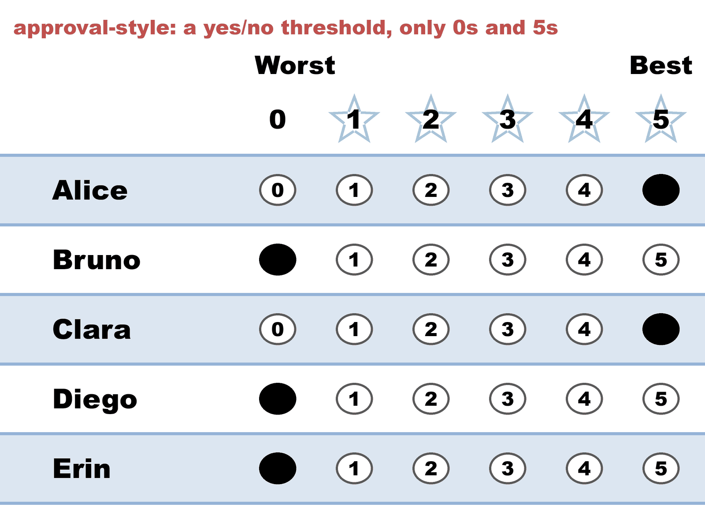
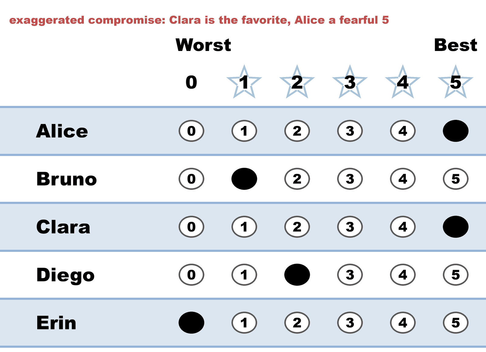
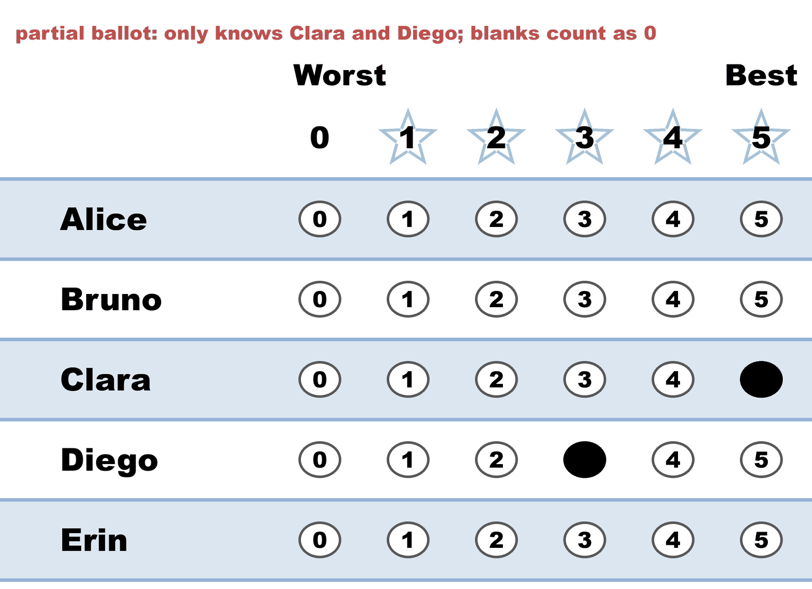
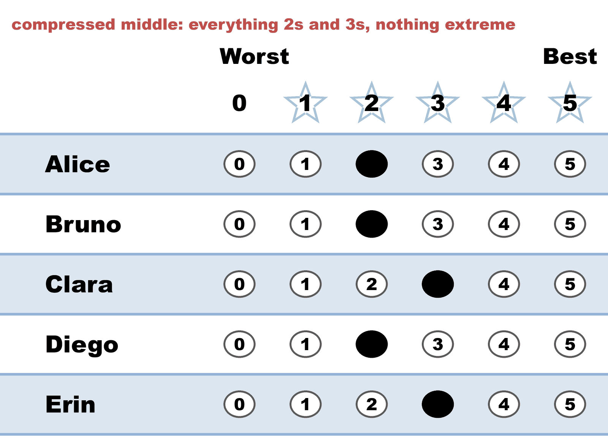
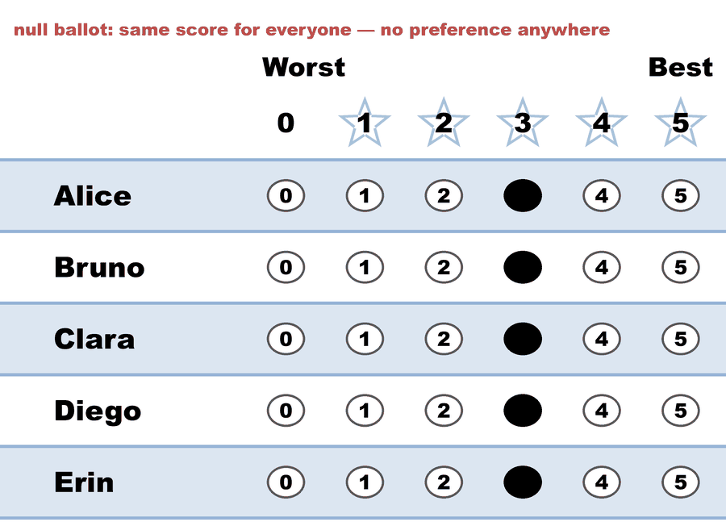

---
search:
  exclude: true
---

# Voting styles — five more ways to fill out one 5-star ballot

*Generated from [`03d_c5_b5_style-gallery-five-more.yaml`](../03d_c5_b5_style-gallery-five-more.yaml) — do not edit by hand. Regenerate: `python STARVote_LH_tabulation_engine/tools_adam/scripts/build_yaml_pages.py`.*

**Method:** [STAR (single winner)](../../../01_Learn/README.md) · **1 seat** · **Expected winner:** Clara

## Scenario

A companion to the eight-style gallery (03c), for the five styles that gallery
doesn't show: approval-style (only 0s and 5s), the exaggerated compromise (a
fear-driven 5 for the candidate you'd honestly rate mid-field), a partial
ballot (score the two you've heard of, leave the rest blank), a compressed
middle (everything 2s and 3s), and a null ballot (every candidate the same
score). One voter per style.
Three of the five say nothing in the runoff. The null ballot says nothing
anywhere — delete it and the finalists, the winner and both runoff tallies are
identical (Clara 21/Alice 15 becomes Clara 18/Alice 12: every total drops by
the same 3, so nothing moves relative to anything else). That is "equal scores
indicate no preference" taken to its limit. The
exaggerated-compromise voter is the sharp one: Clara was their real favorite
and they gave the front-runner Alice a 5 as insurance, so when the final came
down to exactly Clara vs Alice they had no preference left to express.
Meanwhile the compressed-middle voter, whose widest gap is a single point,
cast a full-strength runoff vote — runoff votes count direction, not distance.
Lesson: 01_STAR/01_Learn/voting_styles/README.md

## Ballots

The ballots as marked — the filled bubble is the score given, and the score is the number in its column:

| Ballot as marked | Alice | Bruno | Clara | Diego | Erin |
|:--|:--:|:--:|:--:|:--:|:--:|
|  | 5 | 0 | 5 | 0 | 0 |
|  | 5 | 1 | 5 | 2 | 0 |
|  | - | - | 5 | 3 | - |
|  | 2 | 2 | 3 | 2 | 3 |
|  | 3 | 3 | 3 | 3 | 3 |

The same ballots as the file records them:

Row 1 = candidate names; each later row is one voter's 0–5 scores (a `N ×` prefix = N identical ballots).

Markers on these ballots: `-` blank · `~` race abstention · `&` candidate abstention · `?` spoiled · `%` spoiled+reissued — all tabulate as 0 (reported honestly).

```text
Alice,Bruno,Clara,Diego,Erin
    5,    0,    5,    0,   0   # approval-style: a yes/no threshold, only 0s and 5s
    5,    1,    5,    2,   0   # exaggerated compromise: Clara is the favorite, Alice a fearful 5
    -,    -,    5,    3,   -   # partial ballot: only knows Clara and Diego; blanks count as 0
    2,    2,    3,    2,   3   # compressed middle: everything 2s and 3s, nothing extreme
    3,    3,    3,    3,   3   # null ballot: same score for everyone — no preference anywhere
```

## What the engine says

The count, step by step — the rounds and how the winner is reached:

<!-- --8<-- [start:report] -->
```text
[Divergence from STAR]
  STAR                   = Clara
  Choose-One (Plurality) = Alice   (differs from STAR)
  RCV-IRV                = Alice   (differs from STAR)
  Note: 4 of 5 ballots (80%) had equal non-zero scores, so their ranks were
        decided by candidate priority order. The RCV-IRV result may be an
        artifact of score-to-rank tie-breaking rather than a deep
        difference.
  Note: Ranked Robin (RCV-RR) agrees with STAR, so RCV-IRV is the lone
        outlier — the classic center-squeeze signature.
  Full round-by-round reports (generated for review):
  RCV-IRV rounds: cases_tabulated/03d_c5_b5_style-gallery-five-more_RCV-IRV_tabulated.txt

--- STAR Voting Method (single winner) ---

[STAR Voting]
 Tabulating 5 ballots.
Alice,Bruno,Clara,Diego,Erin
    5,    0,    5,    0,   0
    5,    1,    5,    2,   0
    -,    -,    5,    3,   -
    2,    2,    3,    2,   3
    3,    3,    3,    3,   3
  ('-' = left blank / abstained; '0' = scored zero — both count as 0 stars.)

[STAR Voting: Scoring Round]
 The two highest-scoring candidates advance to the next round.
   Clara         -- 21 -- First place
   Alice         -- 15 -- Second place
   Diego         -- 10
   Bruno         --  6
   Erin          --  6
 Clara and Alice advance.

[STAR Voting: Automatic Runoff Round]
 The candidate preferred in the most head-to-head matchups wins.
   Clara         -- 2 -- First place
   Alice         -- 0
   Equal Support -- 3
 Clara wins.
   Runoff math:
     5  ballots cast
   − 3  Equal Support (no preference between the two finalists)
     ─
     2  voters with a preference  (majority = 2)
           Clara 2 (100%)  ·  Alice 0 (0%)

[STAR Voting: Winner — STAR Voting Method (single winner)]
 Clara
```
<!-- --8<-- [end:report] -->

### Full audit — preference matrix, Condorcet, and score distribution

```text
--- Runoff (Preference) Matrix ---
Head-to-head / pairwise comparison
Legend: For - Equal Support - Against
        * indicates Top 2 Finalist
               |  * Alice   |   Bruno   | * Clara   |   Diego   |    Erin   |
-----------------------------------------------------------------------------
     * Alice > |    ---     |2 - 3 - 0  |0 - 3 - 2  |2 - 2 - 1  |2 - 2 - 1  |
       Bruno > | 0 - 3 - 2  |   ---     |0 - 1 - 4  |0 - 3 - 2  |1 - 3 - 1  |
     * Clara > | 2 - 3 - 0  |4 - 1 - 0  |   ---     |4 - 1 - 0  |3 - 2 - 0  |
       Diego > | 1 - 2 - 2  |2 - 3 - 0  |0 - 1 - 4  |   ---     |2 - 2 - 1  |
        Erin > | 1 - 2 - 2  |1 - 3 - 1  |0 - 2 - 3  |1 - 2 - 2  |   ---     |

[Condorcet Winner]
  Condorcet Winner: Clara — matches the STAR winner

[Condorcet Loser]
  No strict Condorcet loser; jointly weak Condorcet losers: Bruno, Erin (winless — pairwise ties)

[Score Distribution] (how many ballots gave each star rating)
                Score
Candidate  5  4  3  2  1  0  Abs  | Total   Avg
Alice      2  0  1  1  0  0    1  |    15   3.8
Bruno      0  0  1  1  1  1    1  |     6   1.5
Clara      3  0  2  0  0  0    0  |    21   4.2
Diego      0  0  2  2  0  1    0  |    10   2.0
Erin       0  0  2  0  0  2    1  |     6   1.5
```

Everything in one file: the [`_tabulated` mirror](../cases_tabulated/03d_c5_b5_style-gallery-five-more_tabulated.txt) (regenerated on every run; every analysis forced on).

Run it yourself:

```bash
python STARVote_LH_tabulation_engine/starvote_larry_hastings.py 01_STAR/02_Examples/cases/03d_c5_b5_style-gallery-five-more.yaml
```

## See also

- [Methods disagree on this election](../../../../method_comparisons/divergence_review/cases/IRV_DIFFERS_ARTIFACT/03d_c5_b5_style-gallery-five-more.md) — its entry in the divergence review ledger
- [Runoff reversal (worked set)](../../runoff_overturns_leader/README.md)
- [Ballot & terminology basics](../../../../07_Concepts/topics/ballot_and_terminology_basics.md)
- [Glossary](../../../../07_Concepts/GLOSSARY.md) · [all cases by method](../../../../07_Concepts/YAML_test_case_index/README.md)

More cases in this set: [02a_c3_b1_three-candidates](02a_c3_b1_three-candidates.md) · [02b_c3_b2_three-candidates](02b_c3_b2_three-candidates.md) · [03a_c3_b3_style-bullet-vote](03a_c3_b3_style-bullet-vote.md) · [03b_c3_b3_1_style-protest-vote](03b_c3_b3_1_style-protest-vote.md) · [03b_c3_b3_2_expand_style-protest-vote](03b_c3_b3_2_expand_style-protest-vote.md) · [03c_c6_b8_style-gallery](03c_c6_b8_style-gallery.md) · [04b_c4_b3_display-options-all](04b_c4_b3_display-options-all.md) · [05a_c5_b3_unanimous-ballots](05a_c5_b3_unanimous-ballots.md) · [06a_c9_b3_large-field-equal-support](06a_c9_b3_large-field-equal-support.md) · [06b_c9_runoff-overturns-leader](06b_c9_runoff-overturns-leader.md) · [09_c4_b100_tennessee-capital](09_c4_b100_tennessee-capital.md) · [abstentions](abstentions.md) · [bv2182_tg4779_faq_runoff_reversal](bv2182_tg4779_faq_runoff_reversal.md) · [bv2184_fyy886_lunch_vote](bv2184_fyy886_lunch_vote.md) · [bv2187_qrw6wb_ann-bob-cal](bv2187_qrw6wb_ann-bob-cal.md) · [bv2256_c8h3tb_traditional_style](bv2256_c8h3tb_traditional_style.md) · [bv2263_xw23m9_over_50_percent](bv2263_xw23m9_over_50_percent.md) · [csv_ambiguity_ex1_c4_b8](csv_ambiguity_ex1_c4_b8.md) · [display_options_demo](display_options_demo.md) · [equal_support_runoff_demo](equal_support_runoff_demo.md) · [quorum_demo_c3_b6](quorum_demo_c3_b6.md) · [quorum_fail_demo_c3_b6](quorum_fail_demo_c3_b6.md) · [same_mean_different_spread_c2_b5](same_mean_different_spread_c2_b5.md) · [star_ala_approval](star_ala_approval.md) · [three_winners_cw_score_runoff](three_winners_cw_score_runoff.md) · [vote_splitting](vote_splitting.md) · [vote_splitting2](vote_splitting2.md) · [vote_splitting3](vote_splitting3.md) · [vote_splitting_scenario1_spoiler](vote_splitting_scenario1_spoiler.md) · [vote_splitting_scenario2_bloc_leads](vote_splitting_scenario2_bloc_leads.md) · [vote_splitting_scenario3_outsider_wins](vote_splitting_scenario3_outsider_wins.md)
