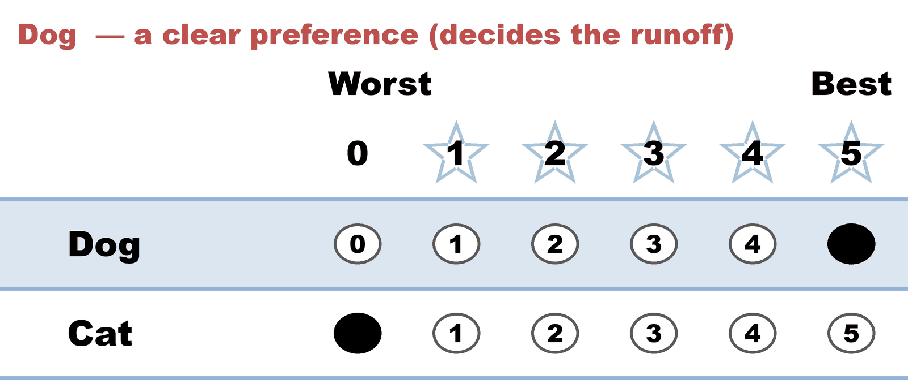
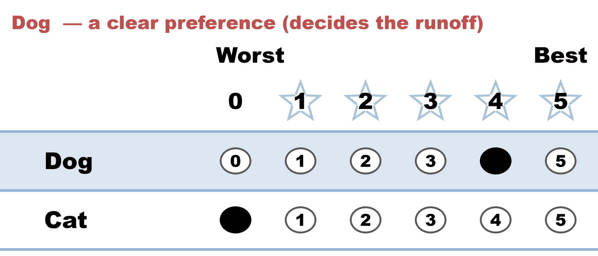
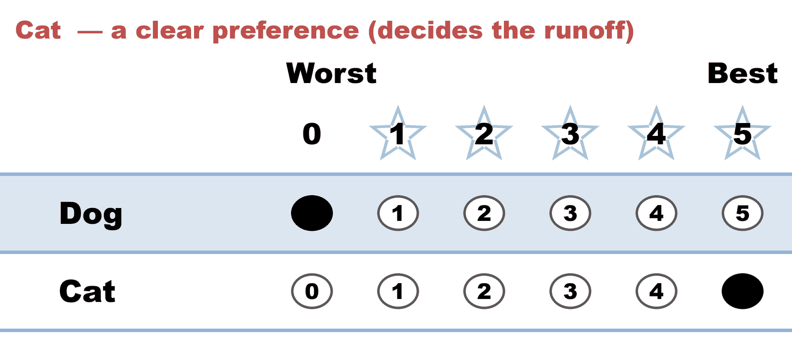
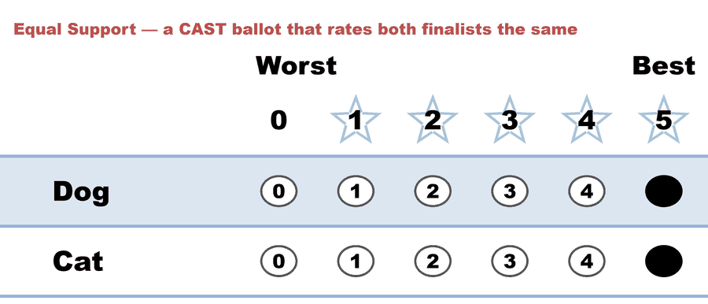
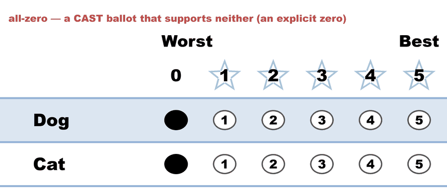
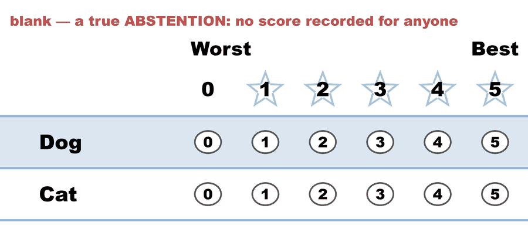

---
search:
  exclude: true
---

# Abstentions — blank and abstaining ballots in STAR

*Generated from [`abstentions.yaml`](../abstentions.yaml) — do not edit by hand. Regenerate: `python STARVote_LH_tabulation_engine/tools_adam/scripts/build_yaml_pages.py`.*

**Method:** [STAR (single winner)](../../../01_Learn/README.md) · **1 seat** · **Expected winner:** Dog

## Scenario

Six ballots tabulated, only three of which can decide the runoff: the 5-5
Equal Support ballot, the all-zero ballot, and the truly blank ballot all
express no preference between the finalists. Teaches the runoff
denominator: the two-line summary (show_runoff_percent) counts ALL
tabulated ballots and folds every no-preference ballot — the blank
included — into one Equal Support bucket, so it reads 3 of 6 (3 Equal
Support); the cast-vs-abstained split is carried separately by the
abstention Note (1 of 6 ballots). Dog beats Cat 2-1 among voters WITH a
preference, and the percentages never look like votes went missing.

## Ballots

The ballots as marked — the filled bubble is the score given, and the score is the number in its column:

| Ballot as marked | Dog | Cat |
|:--|:--:|:--:|
|  | 5 | 0 |
|  | 4 | 0 |
|  | 0 | 5 |
|  | 5 | 5 |
|  | 0 | 0 |
|  | - | - |

The same ballots as the file records them:

Row 1 = candidate names; each later row is one voter's 0–5 scores (a `N ×` prefix = N identical ballots).

Markers on these ballots: `-` blank · `~` race abstention · `&` candidate abstention · `?` spoiled · `%` spoiled+reissued — all tabulate as 0 (reported honestly).

```text
Dog,Cat
5,0 # Dog  — a clear preference (decides the runoff)
4,0 # Dog  — a clear preference (decides the runoff)
0,5 # Cat  — a clear preference (decides the runoff)
5,5 # Equal Support — a CAST ballot that rates both finalists the same
0,0 # all-zero — a CAST ballot that supports neither (an explicit zero)
-,- # blank — a true ABSTENTION: no score recorded for anyone
```

## What the engine says

The count, step by step — the rounds and how the winner is reached:

<!-- --8<-- [start:report] -->
```text
--- STAR Voting Method (single winner) ---

[STAR Voting]
 Tabulating 6 ballots. Note: 1 of 6 ballots is marked as an abstention.
Dog,Cat
  5,  0
  4,  0
  0,  5
  5,  5
  0,  0
  -,  -
  ('-' = left blank / abstained; '0' = scored zero — both count as 0 stars.)

[STAR Voting: Scoring Round]
 The two highest-scoring candidates advance to the next round.
   Dog           -- 14 -- First place
   Cat           -- 10 -- Second place
 Dog and Cat advance.

[STAR Voting: Automatic Runoff Round]
 The candidate preferred in the most head-to-head matchups wins.
   Dog           -- 2 -- First place
   Cat           -- 1
   Equal Support -- 3
 Dog wins.
   Runoff math:
     6  ballots cast
   − 3  Equal Support (no preference between the two finalists)
     ─
     3  voters with a preference  (majority = 2)
           Dog 2 (67%)  ·  Cat 1 (33%)

[STAR Voting: Winner — STAR Voting Method (single winner)]
 Dog
```
<!-- --8<-- [end:report] -->

### Full audit — preference matrix, Condorcet, and score distribution

```text
--- Runoff (Preference) Matrix ---
Head-to-head / pairwise comparison
Legend: For - Equal Support - Against
        * indicates Top 2 Finalist
               |   * Dog    |  * Cat    |
-----------------------------------------
       * Dog > |    ---     |2 - 3 - 1  |
       * Cat > | 1 - 3 - 2  |   ---     |

[Condorcet Winner]
  Condorcet Winner: Dog — matches the STAR winner

[Condorcet Loser]
  Condorcet Loser: Cat — loses every head-to-head matchup

[Score Distribution] (how many ballots gave each star rating)
                Score
Candidate  5  4  3  2  1  0  Abs  | Total   Avg
Dog        2  1  0  0  0  2    1  |    14   2.8
Cat        2  0  0  0  0  3    1  |    10   2.0
```

Everything in one file: the [`_tabulated` mirror](../cases_tabulated/abstentions_tabulated.txt) (regenerated on every run; every analysis forced on).

Run it yourself:

```bash
python STARVote_LH_tabulation_engine/starvote_larry_hastings.py 01_STAR/02_Examples/cases/abstentions.yaml
```

## See also

- [Vote splitting (worked set)](../../../../method_comparisons/split_voting/README.md)
- [Runoff reversal (worked set)](../../runoff_overturns_leader/README.md)
- [Ballot & terminology basics](../../../../07_Concepts/topics/ballot_and_terminology_basics.md)
- [Glossary](../../../../07_Concepts/GLOSSARY.md) · [all cases by method](../../../../07_Concepts/YAML_test_case_index/README.md)

More cases in this set: [02a_c3_b1_three-candidates](02a_c3_b1_three-candidates.md) · [02b_c3_b2_three-candidates](02b_c3_b2_three-candidates.md) · [03a_c3_b3_style-bullet-vote](03a_c3_b3_style-bullet-vote.md) · [03b_c3_b3_1_style-protest-vote](03b_c3_b3_1_style-protest-vote.md) · [03b_c3_b3_2_expand_style-protest-vote](03b_c3_b3_2_expand_style-protest-vote.md) · [03c_c6_b8_style-gallery](03c_c6_b8_style-gallery.md) · [03d_c5_b5_style-gallery-five-more](03d_c5_b5_style-gallery-five-more.md) · [04b_c4_b3_display-options-all](04b_c4_b3_display-options-all.md) · [05a_c5_b3_unanimous-ballots](05a_c5_b3_unanimous-ballots.md) · [06a_c9_b3_large-field-equal-support](06a_c9_b3_large-field-equal-support.md) · [06b_c9_runoff-overturns-leader](06b_c9_runoff-overturns-leader.md) · [09_c4_b100_tennessee-capital](09_c4_b100_tennessee-capital.md) · [bv2182_tg4779_faq_runoff_reversal](bv2182_tg4779_faq_runoff_reversal.md) · [bv2184_fyy886_lunch_vote](bv2184_fyy886_lunch_vote.md) · [bv2187_qrw6wb_ann-bob-cal](bv2187_qrw6wb_ann-bob-cal.md) · [bv2256_c8h3tb_traditional_style](bv2256_c8h3tb_traditional_style.md) · [bv2263_xw23m9_over_50_percent](bv2263_xw23m9_over_50_percent.md) · [csv_ambiguity_ex1_c4_b8](csv_ambiguity_ex1_c4_b8.md) · [display_options_demo](display_options_demo.md) · [equal_support_runoff_demo](equal_support_runoff_demo.md) · [quorum_demo_c3_b6](quorum_demo_c3_b6.md) · [quorum_fail_demo_c3_b6](quorum_fail_demo_c3_b6.md) · [same_mean_different_spread_c2_b5](same_mean_different_spread_c2_b5.md) · [star_ala_approval](star_ala_approval.md) · [three_winners_cw_score_runoff](three_winners_cw_score_runoff.md) · [vote_splitting](vote_splitting.md) · [vote_splitting2](vote_splitting2.md) · [vote_splitting3](vote_splitting3.md) · [vote_splitting_scenario1_spoiler](vote_splitting_scenario1_spoiler.md) · [vote_splitting_scenario2_bloc_leads](vote_splitting_scenario2_bloc_leads.md) · [vote_splitting_scenario3_outsider_wins](vote_splitting_scenario3_outsider_wins.md)
