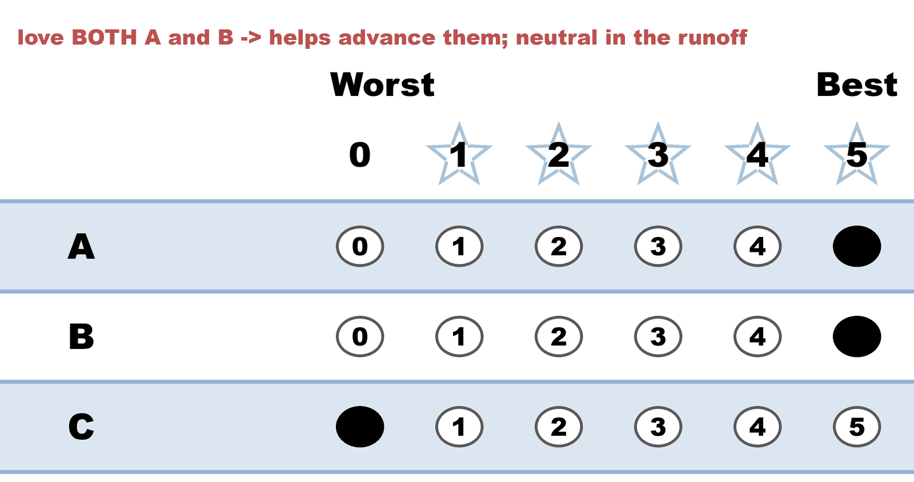
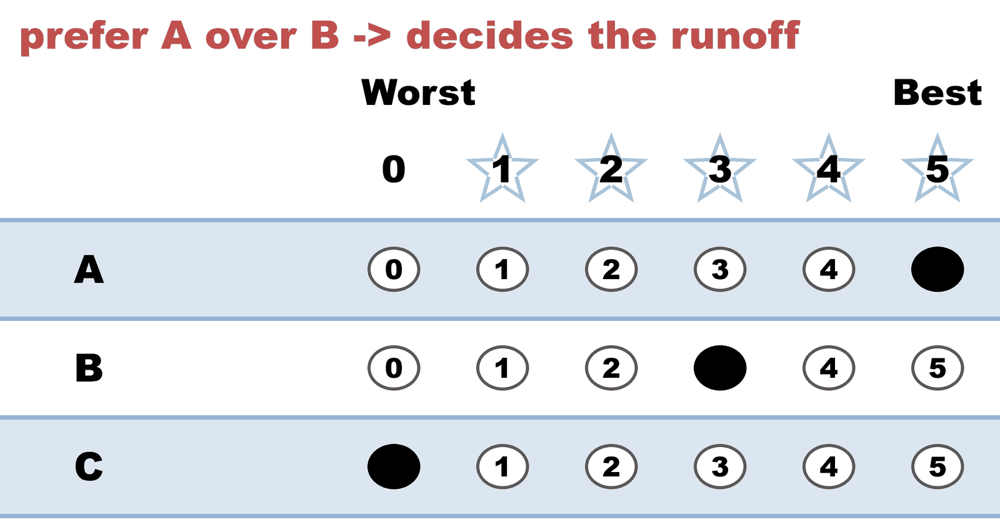
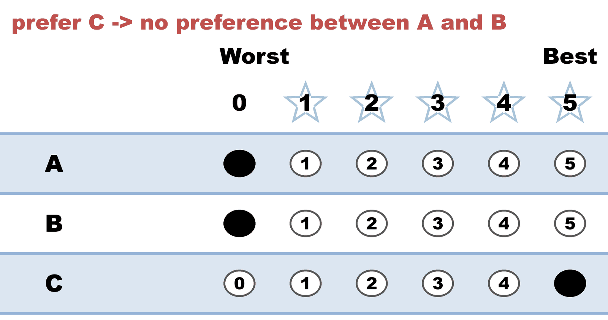

---
search:
  exclude: true
---

# Equal Support — counted in both rounds, neutral only in the tie-break

*Generated from [`equal_support_runoff_demo.yaml`](../equal_support_runoff_demo.yaml) — do not edit by hand. Regenerate: `python STARVote_LH_tabulation_engine/tools_adam/scripts/build_yaml_pages.py`.*

**Method:** [STAR (single winner)](../../../01_Learn) · **1 seat** · **Expected winner:** A

## Scenario

A demo for the "discounted votes" objection. 100 voters, candidates A, B, C.

40 voters score A=5 AND B=5 (they love both) and C=0. 35 prefer A (A=5, B=3).
25 prefer C (A=0, B=0, C=5).

Scoring Round: A and B have the highest totals and advance — and the 40
"equal support" ballots are exactly what pushed them there. So those ballots
were COUNTED: they chose the finalists.

Automatic Runoff: between A and B, the 40 equal-A-B ballots and the 25 C-lovers
(who scored both finalists 0) have no preference, so they are "Equal Support."
The runoff is decided by the 35 voters who did prefer one finalist: A wins.

Takeaway: an Equal Support ballot is a voter who DECLARED A TIE between the
finalists, not a voter who lost their voice. It counted in the scoring round
and is simply neutral in a tie-break it has no preference in.

## Ballots

The ballots as marked — the filled bubble is the score given, and the score is the number in its column:

| Ballot as marked | Voters | A | B | C |
|:--|:--:|:--:|:--:|:--:|
|  helps advance them; neutral in the runoff: A 5, B 5, C 0."> | 40 | 5 | 5 | 0 |
|  decides the runoff: A 5, B 3, C 0."> | 35 | 5 | 3 | 0 |
|  no preference between A and B: A 0, B 0, C 5."> | 25 | 0 | 0 | 5 |

The same ballots as the file records them:

Row 1 = candidate names; each later row is one voter's 0–5 scores (a `N ×` prefix = N identical ballots).

```text
Count:A,B,C
40:5,5,0   # love BOTH A and B -> helps advance them; neutral in the runoff
35:5,3,0   # prefer A over B -> decides the runoff
25:0,0,5   # prefer C -> no preference between A and B
```

## What the engine says

The count, step by step — the rounds and how the winner is reached:

<!-- --8<-- [start:report] -->
```text
--- STAR Voting Method (single winner) ---

[STAR Voting]
 Tabulating 100 ballots.
Count × A,B,C
   40 × 5,5,0
   35 × 5,3,0
   25 × 0,0,5

[STAR Voting: Scoring Round]
 The two highest-scoring candidates advance to the next round.
   A             -- 375 -- First place
   B             -- 305 -- Second place
   C             -- 125
 A and B advance.

[STAR Voting: Automatic Runoff Round]
 The candidate preferred in the most head-to-head matchups wins.
   A             -- 35 -- First place
   B             --  0
   Equal Support -- 65
 A wins.
   Runoff math:
     100  ballots cast
   −  65  Equal Support (no preference between the two finalists)
     ───
      35  voters with a preference  (majority = 18)
           A 35 (100%)  ·  B 0 (0%)

[STAR Voting: Winner — STAR Voting Method (single winner)]
 A
```
<!-- --8<-- [end:report] -->

### Full audit — preference matrix, Condorcet, and score distribution

```text
--- Runoff (Preference) Matrix ---
Head-to-head / pairwise comparison
Legend: For - Equal Support - Against
        * indicates Top 2 Finalist
                 |     * A      |    * B      |      C      |
-------------------------------------------------------------
           * A > |     ---      |35 - 65 -  0 |75 -  0 - 25 |
           * B > |  0 - 65 - 35 |    ---      |75 -  0 - 25 |
             C > | 25 -  0 - 75 |25 -  0 - 75 |    ---      |

[Condorcet Winner]
  Condorcet Winner: A — matches the STAR winner

[Condorcet Loser]
  Condorcet Loser: C — loses every head-to-head matchup

[Score Distribution] (how many ballots gave each star rating)
                   Score
Candidate   5   4   3   2   1   0  | Total   Avg
A          75   0   0   0   0  25  |   375   3.8
B          40   0  35   0   0  25  |   305   3.1
C          25   0   0   0   0  75  |   125   1.3
```

Everything in one file: the [`_tabulated` mirror](../cases_tabulated/equal_support_runoff_demo_tabulated.txt) (regenerated on every run; every analysis forced on).

Run it yourself:

```bash
python STARVote_LH_tabulation_engine/starvote_larry_hastings.py 01_STAR/02_Examples/cases/equal_support_runoff_demo.yaml
```

## See also

- [Ties & tie-breaking (topic hub)](../../../../07_Concepts/topics/ties/README.md)
- [The tie-breaking ladder (full chain)](../../../01_Learn/Tie_Breaking_STAR/tie_breaking.md)
- [Runoff reversal (worked set)](../../runoff_overturns_leader/README.md)
- [Glossary](../../../../07_Concepts/GLOSSARY.md) · [all cases by method](../../../../07_Concepts/YAML_test_case_index/README.md)

More cases in this set: [02a_c3_b1_three-candidates](02a_c3_b1_three-candidates.md) · [02b_c3_b2_three-candidates](02b_c3_b2_three-candidates.md) · [03a_c3_b3_style-bullet-vote](03a_c3_b3_style-bullet-vote.md) · [03b_c3_b3_1_style-protest-vote](03b_c3_b3_1_style-protest-vote.md) · [03b_c3_b3_2_expand_style-protest-vote](03b_c3_b3_2_expand_style-protest-vote.md) · [03c_c6_b8_style-gallery](03c_c6_b8_style-gallery.md) · [03d_c5_b5_style-gallery-five-more](03d_c5_b5_style-gallery-five-more.md) · [04b_c4_b3_display-options-all](04b_c4_b3_display-options-all.md) · [05a_c5_b3_unanimous-ballots](05a_c5_b3_unanimous-ballots.md) · [06a_c9_b3_large-field-equal-support](06a_c9_b3_large-field-equal-support.md) · [06b_c9_runoff-overturns-leader](06b_c9_runoff-overturns-leader.md) · [09_c4_b100_tennessee-capital](09_c4_b100_tennessee-capital.md) · [abstentions](abstentions.md) · [bv2182_tg4779_faq_runoff_reversal](bv2182_tg4779_faq_runoff_reversal.md) · [bv2184_fyy886_lunch_vote](bv2184_fyy886_lunch_vote.md) · [bv2187_qrw6wb_ann-bob-cal](bv2187_qrw6wb_ann-bob-cal.md) · [bv2256_c8h3tb_traditional_style](bv2256_c8h3tb_traditional_style.md) · [bv2263_xw23m9_over_50_percent](bv2263_xw23m9_over_50_percent.md) · [display_options_demo](display_options_demo.md) · [quorum_demo_c3_b6](quorum_demo_c3_b6.md) · [quorum_fail_demo_c3_b6](quorum_fail_demo_c3_b6.md) · [star_ala_approval](star_ala_approval.md) · [three_winners_cw_score_runoff](three_winners_cw_score_runoff.md) · [vote_splitting](vote_splitting.md) · [vote_splitting2](vote_splitting2.md) · [vote_splitting3](vote_splitting3.md) · [vote_splitting_scenario1_spoiler](vote_splitting_scenario1_spoiler.md) · [vote_splitting_scenario2_bloc_leads](vote_splitting_scenario2_bloc_leads.md) · [vote_splitting_scenario3_outsider_wins](vote_splitting_scenario3_outsider_wins.md)
