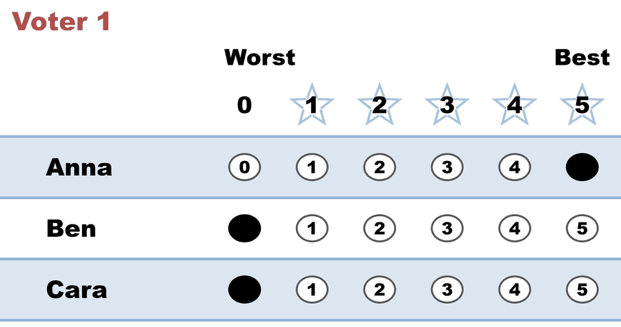
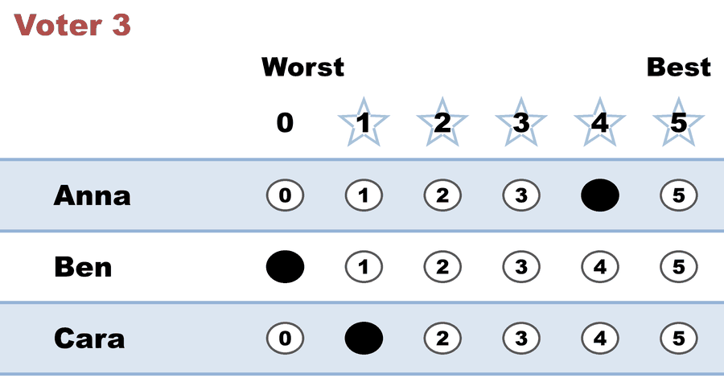
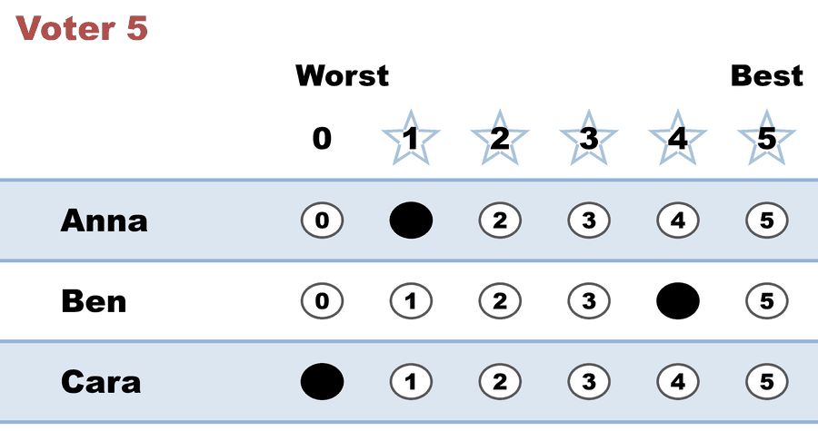
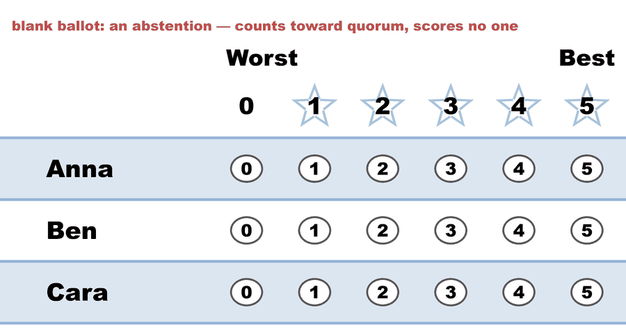

---
search:
  exclude: true
---

# Quorum — an abstention still counts toward turnout

*Generated from [`quorum_demo_c3_b6.yaml`](../quorum_demo_c3_b6.yaml) — do not edit by hand. Regenerate: `python STARVote_LH_tabulation_engine/tools_adam/scripts/build_yaml_pages.py`.*

**Method:** [STAR (single winner)](../../../01_Learn/README.md) · **1 seat** · **Expected winner:** Anna

## Scenario

A 10-member board (eligible_voters: 10). Six members submit a ballot — five
score the candidates, and one turns in a BLANK ballot (an abstention). No
explicit quorum is set, so the engine's default applies: a majority (>50%) of
eligible voters must participate — i.e. at least 6 of 10.

The teaching point (ties quorum to abstention): the blank ballot is the SIXTH
participant. A cast abstention is still participation, so it counts toward
quorum — and here it is exactly what carries turnout from 5 (not enough) to 6
(quorum met). Drop the abstention and quorum would FAIL. The abstainer changed
no candidate's score, but their presence made the election valid.

→ Concept: 07_Concepts/topics/quorum.md

## Parameters (from the YAML)

```yaml
eligible_voters: 10
```

## Ballots

The ballots as marked — the filled bubble is the score given, and the score is the number in its column:

| # | Ballot as marked | Anna | Ben | Cara |
|:--:|:--|:--:|:--:|:--:|
| 1 |  | 5 | 0 | 0 |
| 2 |  | 5 | 1 | 0 |
| 3 |  | 4 | 0 | 1 |
| 4 |  | 0 | 5 | 0 |
| 5 |  | 1 | 4 | 0 |
| 6 |  | - | - | - |

The same ballots as the file records them:

Row 1 = candidate names; each later row is one voter's 0–5 scores (a `N ×` prefix = N identical ballots).

Markers on these ballots: `-` blank · `~` race abstention · `&` candidate abstention · `?` spoiled · `%` spoiled+reissued — all tabulate as 0 (reported honestly).

```text
Anna, Ben, Cara
5, 0, 0
5, 1, 0
4, 0, 1
0, 5, 0
1, 4, 0
-, -, -    # blank ballot: an abstention — counts toward quorum, scores no one
```

## What the engine says

The count, step by step — the rounds and how the winner is reached:

<!-- --8<-- [start:report] -->
```text
 Quorum: 6 of 10 eligible voters participated (60% turnout); requires more than 50% (>= 6). MET.

--- STAR Voting Method (single winner) ---

[STAR Voting]
 Tabulating 6 ballots. Note: 1 of 6 ballots is marked as an abstention.
Anna,Ben,Cara
   5,  0,   0
   5,  1,   0
   4,  0,   1
   0,  5,   0
   1,  4,   0
   -,  -,   -
  ('-' = left blank / abstained; '0' = scored zero — both count as 0 stars.)

[STAR Voting: Scoring Round]
 The two highest-scoring candidates advance to the next round.
   Anna          -- 15 -- First place
   Ben           -- 10 -- Second place
   Cara          --  1
 Anna and Ben advance.

[STAR Voting: Automatic Runoff Round]
 The candidate preferred in the most head-to-head matchups wins.
   Anna          -- 3 -- First place
   Ben           -- 2
   Equal Support -- 1
 Anna wins.
   Runoff math:
     6  ballots cast
   − 1  Equal Support (no preference between the two finalists)
     ─
     5  voters with a preference  (majority = 3)
           Anna 3 (60%)  ·  Ben 2 (40%)

[STAR Voting: Winner — STAR Voting Method (single winner)]
 Anna
```
<!-- --8<-- [end:report] -->

### Full audit — preference matrix, Condorcet, and score distribution

```text
--- Runoff (Preference) Matrix ---
Head-to-head / pairwise comparison
Legend: For - Equal Support - Against
        * indicates Top 2 Finalist
               |   * Anna   |  * Ben    |    Cara   |
-----------------------------------------------------
      * Anna > |    ---     |3 - 1 - 2  |4 - 2 - 0  |
       * Ben > | 2 - 1 - 3  |   ---     |3 - 2 - 1  |
        Cara > | 0 - 2 - 4  |1 - 2 - 3  |   ---     |

[Condorcet Winner]
  Condorcet Winner: Anna — matches the STAR winner

[Condorcet Loser]
  Condorcet Loser: Cara — loses every head-to-head matchup

[Score Distribution] (how many ballots gave each star rating)
                Score
Candidate  5  4  3  2  1  0  Abs  | Total  Avg all  Avg rated
Anna       2  1  0  0  1  1    1  |    15      2.5        3.0
Ben        1  1  0  0  1  2    1  |    10      1.7        2.0
Cara       0  0  0  0  1  4    1  |     1      0.2        0.2
  Avg all   = Total / all ballots — a blank counts as 0, so this is the Total the Scoring Round ranks on, per ballot.
  Avg rated = Total / the ballots that scored this candidate (Abs excluded) — support among voters who had an opinion.
```

Everything in one file: the [`_tabulated` mirror](../cases_tabulated/quorum_demo_c3_b6_tabulated.txt) (regenerated on every run; every analysis forced on).

Run it yourself:

```bash
python STARVote_LH_tabulation_engine/starvote_larry_hastings.py 01_STAR/02_Examples/cases/quorum_demo_c3_b6.yaml
```

## See also

- [Ties & tie-breaking (topic hub)](../../../../07_Concepts/topics/ties/README.md)
- [Quorum](../../../../07_Concepts/topics/quorum.md)
- [Ballot & terminology basics](../../../../07_Concepts/topics/ballot_and_terminology_basics.md)
- [Glossary](../../../../07_Concepts/GLOSSARY.md) · [all cases by method](../../../../07_Concepts/YAML_test_case_index/README.md)

More cases in this set: [02a_c3_b1_three-candidates](02a_c3_b1_three-candidates.md) · [02b_c3_b2_three-candidates](02b_c3_b2_three-candidates.md) · [03a_c3_b3_style-bullet-vote](03a_c3_b3_style-bullet-vote.md) · [03b_c3_b3_1_style-protest-vote](03b_c3_b3_1_style-protest-vote.md) · [03b_c3_b3_2_expand_style-protest-vote](03b_c3_b3_2_expand_style-protest-vote.md) · [03c_c6_b8_style-gallery](03c_c6_b8_style-gallery.md) · [03d_c5_b5_style-gallery-five-more](03d_c5_b5_style-gallery-five-more.md) · [04b_c4_b3_display-options-all](04b_c4_b3_display-options-all.md) · [05a_c5_b3_unanimous-ballots](05a_c5_b3_unanimous-ballots.md) · [06a_c9_b3_large-field-equal-support](06a_c9_b3_large-field-equal-support.md) · [06b_c9_runoff-overturns-leader](06b_c9_runoff-overturns-leader.md) · [09_c4_b100_tennessee-capital](09_c4_b100_tennessee-capital.md) · [abstentions](abstentions.md) · [bv2182_tg4779_faq_runoff_reversal](bv2182_tg4779_faq_runoff_reversal.md) · [bv2184_fyy886_lunch_vote](bv2184_fyy886_lunch_vote.md) · [bv2187_qrw6wb_ann-bob-cal](bv2187_qrw6wb_ann-bob-cal.md) · [bv2256_c8h3tb_traditional_style](bv2256_c8h3tb_traditional_style.md) · [bv2263_xw23m9_over_50_percent](bv2263_xw23m9_over_50_percent.md) · [csv_ambiguity_ex1_c4_b8](csv_ambiguity_ex1_c4_b8.md) · [display_options_demo](display_options_demo.md) · [equal_support_runoff_demo](equal_support_runoff_demo.md) · [quorum_fail_demo_c3_b6](quorum_fail_demo_c3_b6.md) · [same_mean_different_spread_c2_b5](same_mean_different_spread_c2_b5.md) · [star_ala_approval](star_ala_approval.md) · [three_winners_cw_score_runoff](three_winners_cw_score_runoff.md) · [vote_splitting](vote_splitting.md) · [vote_splitting2](vote_splitting2.md) · [vote_splitting3](vote_splitting3.md) · [vote_splitting_scenario1_spoiler](vote_splitting_scenario1_spoiler.md) · [vote_splitting_scenario2_bloc_leads](vote_splitting_scenario2_bloc_leads.md) · [vote_splitting_scenario3_outsider_wins](vote_splitting_scenario3_outsider_wins.md)
