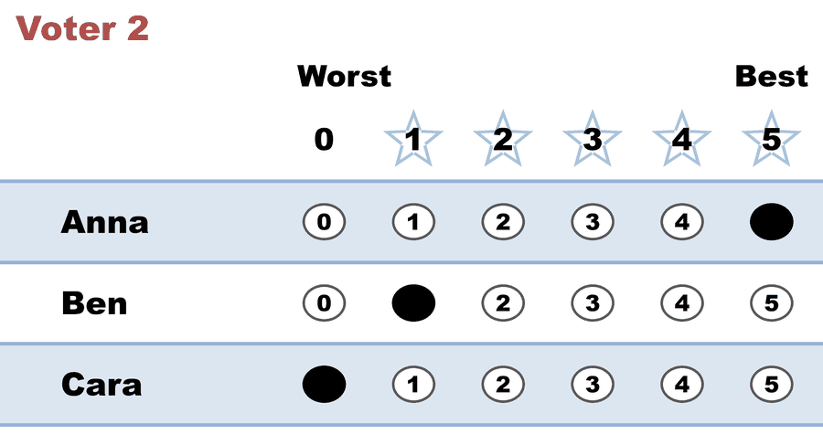
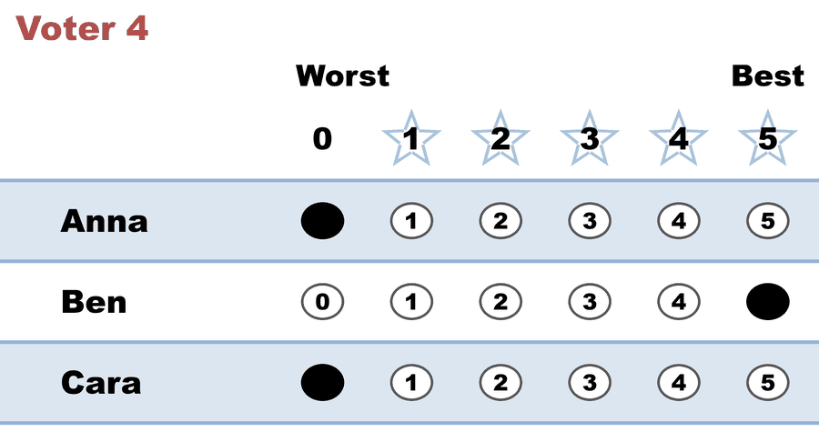
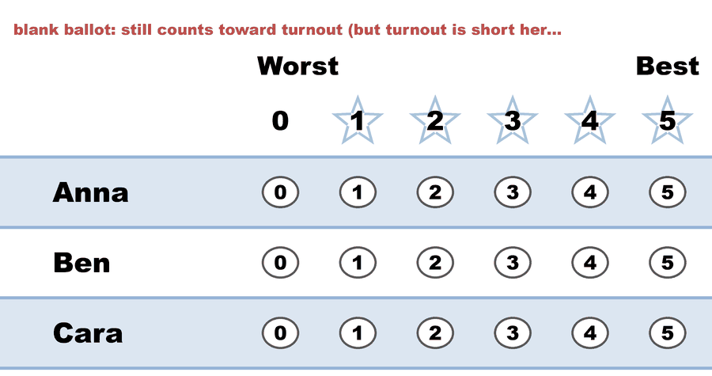

---
search:
  exclude: true
---

# Quorum FAILS — won the count, but not elected

*Generated from [`quorum_fail_demo_c3_b6.yaml`](../quorum_fail_demo_c3_b6.yaml) — do not edit by hand. Regenerate: `python STARVote_LH_tabulation_engine/tools_adam/scripts/build_yaml_pages.py`.*

**Method:** [STAR (single winner)](../../../01_Learn/README.md) · **1 seat**

## Scenario

The SAME six ballots as `quorum_demo_c3_b6.yaml` (Anna wins the tabulation) —
only the assumed electorate changes, and now no one is elected.

A made-up-for-teaching rule (NOT how real quorum works — a real election uses
the actual registered electorate): pretend the electorate is the turnout plus
another 100%, i.e. eligible_voters = 6 cast × 2 = 12. The default quorum is a
majority (>50%) of eligible voters, so it needs more than 6 — at least 7.

Exactly 6 of 12 turn out: 50%. A quorum is a *strict* majority, so 50% is not
enough — it fails by one. Anna still wins the count, but the election is
invalid for lack of turnout, so the engine declares NO WINNER. "Winning the
vote" and "being elected" are different things when a quorum isn't met.

→ Concept: 07_Concepts/topics/quorum.md
→ The same ballots that DO reach quorum: 01_STAR/02_Examples/cases/quorum_demo_c3_b6.yaml

## Parameters (from the YAML)

```yaml
eligible_voters: 12
```

## Ballots

The ballots as marked — the filled bubble is the score given, and the score is the number in its column:

| # | Ballot as marked | Anna | Ben | Cara |
|:--:|:--|:--:|:--:|:--:|
| 1 |  | 5 | 0 | 0 |
| 2 |  | 5 | 1 | 0 |
| 3 |  | 4 | 0 | 1 |
| 4 |  | 0 | 5 | 0 |
| 5 |  | 1 | 4 | 0 |
| 6 |  | - | - | - |

The same ballots as the file records them:

Row 1 = candidate names; each later row is one voter's 0–5 scores (a `N ×` prefix = N identical ballots).

Markers on these ballots: `-` blank · `~` race abstention · `&` candidate abstention · `?` spoiled · `%` spoiled+reissued — all tabulate as 0 (reported honestly).

```text
Anna, Ben, Cara
5, 0, 0
5, 1, 0
4, 0, 1
0, 5, 0
1, 4, 0
-, -, -    # blank ballot: still counts toward turnout (but turnout is short here)
```

## What the engine says

Full report from the [`_tabulated` mirror](../cases_tabulated/quorum_fail_demo_c3_b6_tabulated.txt) (regenerated on every run; every analysis forced on):

<!-- --8<-- [start:report] -->
```text
--- STAR Voting Method (single winner) ---
 Quorum: 6 of 12 eligible voters participated (50% turnout); requires more than 50% (>= 7). NOT MET.
 No winner declared — quorum not reached.
```
<!-- --8<-- [end:report] -->

Run it yourself:

```bash
python STARVote_LH_tabulation_engine/starvote_larry_hastings.py 01_STAR/02_Examples/cases/quorum_fail_demo_c3_b6.yaml
```

## See also

- [Quorum](../../../../07_Concepts/topics/quorum.md)
- [Glossary](../../../../07_Concepts/GLOSSARY.md) · [all cases by method](../../../../07_Concepts/YAML_test_case_index/README.md)

More cases in this set: [02a_c3_b1_three-candidates](02a_c3_b1_three-candidates.md) · [02b_c3_b2_three-candidates](02b_c3_b2_three-candidates.md) · [03a_c3_b3_style-bullet-vote](03a_c3_b3_style-bullet-vote.md) · [03b_c3_b3_1_style-protest-vote](03b_c3_b3_1_style-protest-vote.md) · [03b_c3_b3_2_expand_style-protest-vote](03b_c3_b3_2_expand_style-protest-vote.md) · [03c_c6_b8_style-gallery](03c_c6_b8_style-gallery.md) · [03d_c5_b5_style-gallery-five-more](03d_c5_b5_style-gallery-five-more.md) · [04b_c4_b3_display-options-all](04b_c4_b3_display-options-all.md) · [05a_c5_b3_unanimous-ballots](05a_c5_b3_unanimous-ballots.md) · [06a_c9_b3_large-field-equal-support](06a_c9_b3_large-field-equal-support.md) · [06b_c9_runoff-overturns-leader](06b_c9_runoff-overturns-leader.md) · [09_c4_b100_tennessee-capital](09_c4_b100_tennessee-capital.md) · [abstentions](abstentions.md) · [bv2182_tg4779_faq_runoff_reversal](bv2182_tg4779_faq_runoff_reversal.md) · [bv2184_fyy886_lunch_vote](bv2184_fyy886_lunch_vote.md) · [bv2187_qrw6wb_ann-bob-cal](bv2187_qrw6wb_ann-bob-cal.md) · [bv2256_c8h3tb_traditional_style](bv2256_c8h3tb_traditional_style.md) · [bv2263_xw23m9_over_50_percent](bv2263_xw23m9_over_50_percent.md) · [csv_ambiguity_ex1_c4_b8](csv_ambiguity_ex1_c4_b8.md) · [display_options_demo](display_options_demo.md) · [equal_support_runoff_demo](equal_support_runoff_demo.md) · [quorum_demo_c3_b6](quorum_demo_c3_b6.md) · [same_mean_different_spread_c2_b5](same_mean_different_spread_c2_b5.md) · [star_ala_approval](star_ala_approval.md) · [three_winners_cw_score_runoff](three_winners_cw_score_runoff.md) · [vote_splitting](vote_splitting.md) · [vote_splitting2](vote_splitting2.md) · [vote_splitting3](vote_splitting3.md) · [vote_splitting_scenario1_spoiler](vote_splitting_scenario1_spoiler.md) · [vote_splitting_scenario2_bloc_leads](vote_splitting_scenario2_bloc_leads.md) · [vote_splitting_scenario3_outsider_wins](vote_splitting_scenario3_outsider_wins.md)
