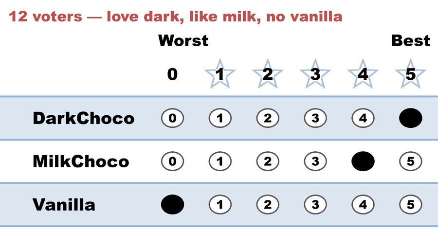
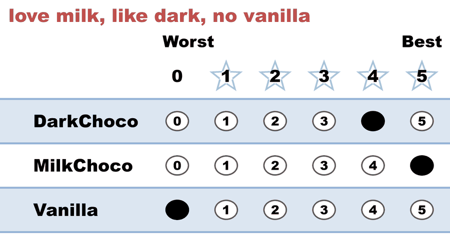
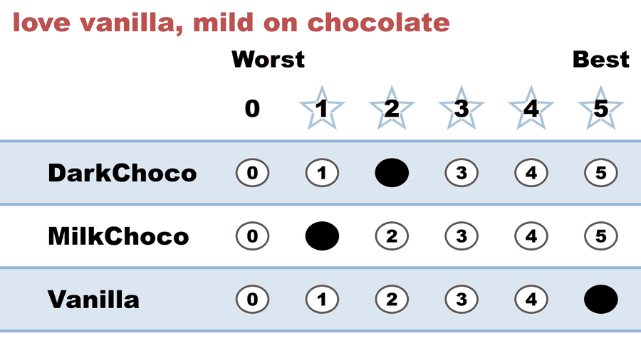

---
search:
  exclude: true
---

# Vote splitting — two chocolates split the majority

*Generated from [`vote_splitting.yaml`](../vote_splitting.yaml) — do not edit by hand. Regenerate: `python STARVote_LH_tabulation_engine/tools_adam/scripts/build_yaml_pages.py`.*

**Method:** [STAR (single winner)](../../../01_Learn/README.md) · **1 seat** · **Expected winner:** DarkChoco

## Scenario

Election: pick ONE dessert for the party. 36 voters.

Twenty-two of the thirty-six are chocolate lovers — a clear 61% majority. But
there are TWO chocolates on the menu, DarkChoco and MilkChoco, and only
fourteen voters prefer Vanilla.

Under Choose-One Plurality each voter may name only one flavor, so the
chocolate majority splits its vote — 12 for DarkChoco, 10 for MilkChoco — and
Vanilla wins with just 14 of 36 (38.9%), a dessert a 61% majority actively
dislikes. That is vote splitting / the spoiler effect.

STAR fixes it without asking chocolate to drop a flavor: every voter scores
all three 0–5, so a chocolate lover can give BOTH chocolates a high score
instead of choosing between them. The two highest totals advance to an
automatic runoff, and the winner has majority support head-to-head.

## Ballots

The ballots as marked — the filled bubble is the score given, and the score is the number in its column:

| Ballot as marked | Voters | DarkChoco | MilkChoco | Vanilla |
|:--|:--:|:--:|:--:|:--:|
|  | 12 | 5 | 4 | 0 |
|  | 10 | 4 | 5 | 0 |
|  | 14 | 2 | 1 | 5 |

The same ballots as the file records them:

Row 1 = candidate names; each later row is one voter's 0–5 scores (a `N ×` prefix = N identical ballots).

```text
Count:DarkChoco,MilkChoco,Vanilla
12:5,4,0   # love dark, like milk, no vanilla
10:4,5,0   # love milk, like dark, no vanilla
14:2,1,5   # love vanilla, mild on chocolate
```

## What the engine says

The count, step by step — the rounds and how the winner is reached:

<!-- --8<-- [start:report] -->
```text
[Divergence from STAR]
  STAR                   = DarkChoco
  Choose-One (Plurality) = Vanilla   (differs from STAR)

--- STAR Voting Method (single winner) ---

[STAR Voting]
 Tabulating 36 ballots.
Count × DarkChoco,MilkChoco,Vanilla
   14 ×         2,        1,      5
   12 ×         5,        4,      0
   10 ×         4,        5,      0

[STAR Voting: Scoring Round]
 The two highest-scoring candidates advance to the next round.
   DarkChoco     -- 128 -- First place
   MilkChoco     -- 112 -- Second place
   Vanilla       --  70
 DarkChoco and MilkChoco advance.

[STAR Voting: Automatic Runoff Round]
 The candidate preferred in the most head-to-head matchups wins.
   DarkChoco     -- 26 -- First place
   MilkChoco     -- 10
   Equal Support --  0
 DarkChoco wins.
   Runoff math:
     36  ballots cast
   −  0  Equal Support (no preference between the two finalists)
     ──
     36  voters with a preference  (majority = 19)
           DarkChoco 26 (72%)  ·  MilkChoco 10 (28%)

[STAR Voting: Winner — STAR Voting Method (single winner)]
 DarkChoco
```
<!-- --8<-- [end:report] -->

### Full audit — preference matrix, Condorcet, and score distribution

```text
--- Runoff (Preference) Matrix ---
Head-to-head / pairwise comparison
Legend: For - Equal Support - Against
        * indicates Top 2 Finalist
                  |  * DarkChoco  | * MilkChoco  |    Vanilla   |
-----------------------------------------------------------------
    * DarkChoco > |      ---      |26 -  0 - 10  |22 -  0 - 14  |
    * MilkChoco > | 10 -  0 - 26  |     ---      |22 -  0 - 14  |
        Vanilla > | 14 -  0 - 22  |14 -  0 - 22  |     ---      |

[Condorcet Winner]
  Condorcet Winner: DarkChoco — matches the STAR winner

[Condorcet Loser]
  Condorcet Loser: Vanilla — loses every head-to-head matchup — elected by Choose-One (Plurality)!

[Score Distribution] (how many ballots gave each star rating)
                   Score
Candidate   5   4   3   2   1   0  | Total   Avg
DarkChoco  12  10   0  14   0   0  |   128   3.6
MilkChoco  10  12   0   0  14   0  |   112   3.1
Vanilla    14   0   0   0   0  22  |    70   1.9
```

Everything in one file: the [`_tabulated` mirror](../cases_tabulated/vote_splitting_tabulated.txt) (regenerated on every run; every analysis forced on).

Run it yourself:

```bash
python STARVote_LH_tabulation_engine/starvote_larry_hastings.py 01_STAR/02_Examples/cases/vote_splitting.yaml
```

## See also

- [Vote splitting (worked set)](../../../../method_comparisons/split_voting/README.md)
- [Runoff reversal (worked set)](../../runoff_overturns_leader/README.md)
- [Glossary](../../../../07_Concepts/GLOSSARY.md) · [all cases by method](../../../../07_Concepts/YAML_test_case_index/README.md)

More cases in this set: [02a_c3_b1_three-candidates](02a_c3_b1_three-candidates.md) · [02b_c3_b2_three-candidates](02b_c3_b2_three-candidates.md) · [03a_c3_b3_style-bullet-vote](03a_c3_b3_style-bullet-vote.md) · [03b_c3_b3_1_style-protest-vote](03b_c3_b3_1_style-protest-vote.md) · [03b_c3_b3_2_expand_style-protest-vote](03b_c3_b3_2_expand_style-protest-vote.md) · [03c_c6_b8_style-gallery](03c_c6_b8_style-gallery.md) · [03d_c5_b5_style-gallery-five-more](03d_c5_b5_style-gallery-five-more.md) · [04b_c4_b3_display-options-all](04b_c4_b3_display-options-all.md) · [05a_c5_b3_unanimous-ballots](05a_c5_b3_unanimous-ballots.md) · [06a_c9_b3_large-field-equal-support](06a_c9_b3_large-field-equal-support.md) · [06b_c9_runoff-overturns-leader](06b_c9_runoff-overturns-leader.md) · [09_c4_b100_tennessee-capital](09_c4_b100_tennessee-capital.md) · [abstentions](abstentions.md) · [bv2182_tg4779_faq_runoff_reversal](bv2182_tg4779_faq_runoff_reversal.md) · [bv2184_fyy886_lunch_vote](bv2184_fyy886_lunch_vote.md) · [bv2187_qrw6wb_ann-bob-cal](bv2187_qrw6wb_ann-bob-cal.md) · [bv2256_c8h3tb_traditional_style](bv2256_c8h3tb_traditional_style.md) · [bv2263_xw23m9_over_50_percent](bv2263_xw23m9_over_50_percent.md) · [display_options_demo](display_options_demo.md) · [equal_support_runoff_demo](equal_support_runoff_demo.md) · [quorum_demo_c3_b6](quorum_demo_c3_b6.md) · [quorum_fail_demo_c3_b6](quorum_fail_demo_c3_b6.md) · [star_ala_approval](star_ala_approval.md) · [three_winners_cw_score_runoff](three_winners_cw_score_runoff.md) · [vote_splitting2](vote_splitting2.md) · [vote_splitting3](vote_splitting3.md) · [vote_splitting_scenario1_spoiler](vote_splitting_scenario1_spoiler.md) · [vote_splitting_scenario2_bloc_leads](vote_splitting_scenario2_bloc_leads.md) · [vote_splitting_scenario3_outsider_wins](vote_splitting_scenario3_outsider_wins.md)
