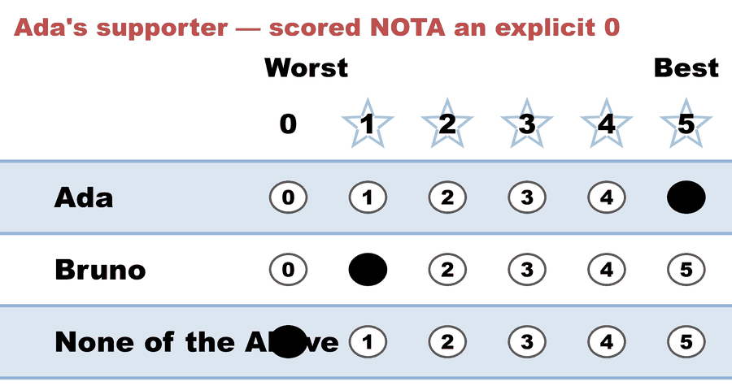
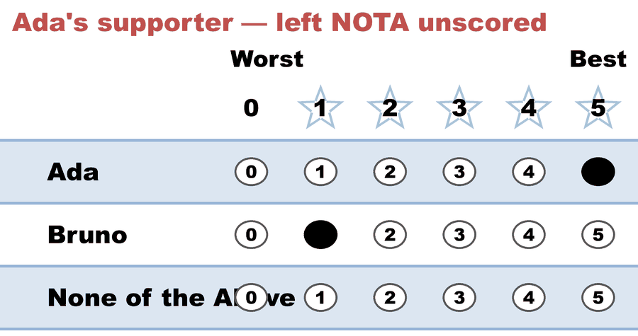
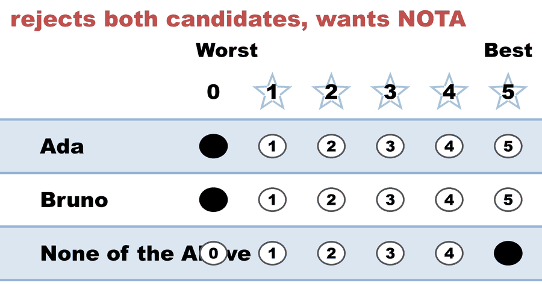

# BV215 — None of the Above wins (STAR), with a null abstention

<!-- case-meta:start — managed by build_yaml_pages.py; edit the YAML, not these lines -->
**Method:** [STAR (single winner)](../../01_Learn) · **1 seat** · **Expected winner:** None of the Above · [full count →](cases/cases_pages/bv215_26khr3_nota_wins.md)
<!-- case-meta:end -->

**▶ Live on BetterVoting:** [vote](https://bettervoting.com/26khr3) · **[results ↗](https://bettervoting.com/26khr3/results)** (election `26khr3`)

A constructed protest election that tests BetterVoting's **None of the Above** (`c-nota`) candidate and the **flat-0 vs null-abstention vs NOTA** distinction — and surfaces a product question: when None of the Above wins, BetterVoting simply seats it.

## What it teaches

1. **None of the Above is a real candidate.** On BetterVoting it's the special `c-nota` candidate, scored 0–5 like anyone else — not a spoiler flag. Here a protest majority scores it 5 and it **wins outright**. Neither BetterVoting nor the Larry Hastings engine gives a NOTA win any special handling (no "no winner / re-run" state); both just elect "None of the Above." Whether that's intended is an open BetterVoting question (see *Open question* below).

2. **Flat `0` vs `null` abstention.** Most rejections here are an explicit `0`. Ballot 2 instead leaves None of the Above **unscored** — BetterVoting stores that as `score: null` ("didn't score this candidate"), which is *distinct* from `0`. In the LH engine that per-candidate abstention is the `&` marker (tabulates as 0, but kept separate in the record — see the `Abs` column below). A single unscored candidate does **not** make the whole ballot an abstention (BetterVoting reported `nAbstentions: 0`). The full concept — how a zero, an abstention, and a NOTA vote differ — is in the lesson [Abstention vs. a zero vs. "None of the Above"](../../01_Learn/properties_and_limits/abstention_vs_zero_vs_nota.md).

3. **BV and LH agree** on the winner and every score/runoff number.

## The ballots

Candidates: **Ada, Bruno, None of the Above**. `&` = candidate abstention (BetterVoting `null`).

<!-- ballots:bv215_26khr3_nota_wins -->
The ballots as marked — the filled bubble is the score given, and the score is the number in its column:

| Ballot as marked | Ada | Bruno | None of the Above |
|:--|:--:|:--:|:--:|
|  | 5 | 1 | 0 |
|  | 5 | 1 | & |
|  | 0 | 0 | 5 |
|  | 0 | 0 | 5 |
|  | 0 | 0 | 5 |
|  | 0 | 0 | 5 |
<!-- /ballots -->

Voters 1 and 2 marked the same opinion of the candidates; they differ only on whether NOTA got an explicit `0` or no mark at all — and the count treats those the same.

## The result

**None of the Above is elected.** It tops the score round (20 vs Ada 10 vs Bruno 2), then wins the automatic runoff 4–2 over Ada.

<!-- report:bv215_26khr3_nota_wins -->
```text
--- STAR Voting Method (single winner) ---

[STAR Voting]
 Tabulating 6 ballots.
Count × Ada,Bruno,None of the Above
    4 ×   0,    0,                5
    1 ×   5,    1,                0
    1 ×   5,    1,                &

[STAR Voting: Scoring Round]
 The two highest-scoring candidates advance to the next round.
   None of the Above -- 20 -- First place
   Ada               -- 10 -- Second place
   Bruno             --  2
 None of the Above and Ada advance.

[STAR Voting: Automatic Runoff Round]
 The candidate preferred in the most head-to-head matchups wins.
   None of the Above -- 4 -- First place
   Ada               -- 2
   Equal Support     -- 0
 None of the Above wins.
   Runoff math:
     6  ballots cast
   − 0  Equal Support (no preference between the two finalists)
     ─
     6  voters with a preference  (majority = 4)
           None of the Above 4 (67%)  ·  Ada 2 (33%)

[STAR Voting: Winner — STAR Voting Method (single winner)]
 None of the Above
```
<!-- /report -->
(Note the `Abs` column: None of the Above shows `1` abstention — ballot 2's `&` — kept distinct from the `0` scores.)

Full engine detail: [`bv215_26khr3_nota_wins_tabulated.txt`](cases/cases_tabulated/bv215_26khr3_nota_wins_tabulated.txt). Frozen BetterVoting export: [`bv215_26khr3_nota_wins_bv_export.json`](cases/bv215_26khr3_nota_wins_bv_export.json). Tabulatable source: [`bv215_26khr3_nota_wins.yaml`](cases/bv215_26khr3_nota_wins.yaml).

## Open question (BetterVoting)

Seating "None of the Above" as the winner is easy to read as unintended — a NOTA option usually exists so voters can say *no candidate should be seated*. Filed as a clarification question: is a NOTA win meant to seat NOTA, or should it produce a "no candidate selected / re-run" outcome? → **[Equal-Vote/bettervoting#1421](https://github.com/Equal-Vote/bettervoting/issues/1421)**. This sits inside a wider cluster of BetterVoting abstain/blank/zero tickets — see the [BV abstain issue index](../../../07_Concepts/tabulation_engines/BV/abstain_issues_index.md).
