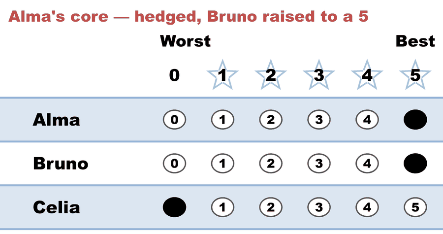
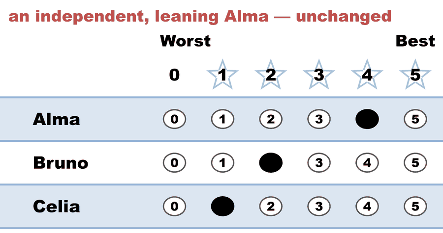
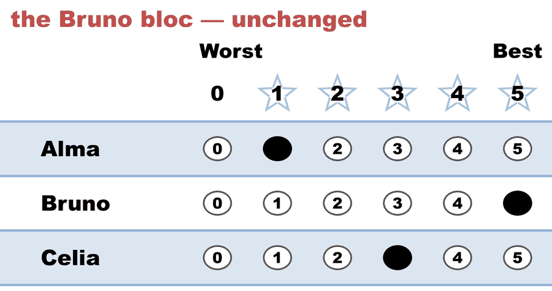
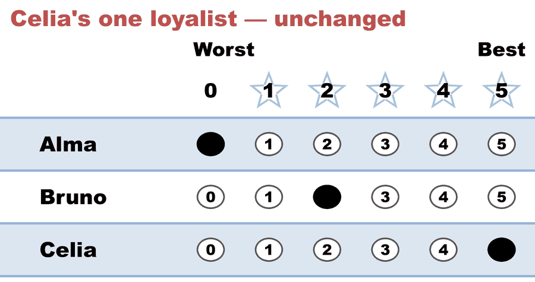

---
search:
  exclude: true
---

# Tactical maximization in STAR (2 of 2) — four voters hedge to a 5, and hand the seat to the hedge

*Generated from [`tactical_max_c3_b9_hedged.yaml`](../tactical_max_c3_b9_hedged.yaml) — do not edit by hand. Regenerate: `python STARVote_LH_tabulation_engine/tools_adam/scripts/build_yaml_pages.py`.*

**Method:** [STAR (single winner)](../../../../01_Learn/README.md) · **1 seat** · **Expected winner:** Bruno

## Scenario

Strategic ballots — half 2 of the worked expansive-sincerity pair
(07_Concepts/topics/insincere_votes/expansive_sincerity.md).
Identical to half 1 (tactical_max_c3_b9_honest.yaml) except that
Alma's four core members hedge: fearing Celia, they raise Bruno from
an honest 3 to a 5. They lower nobody — Alma keeps her 5 and her
score total of 27, unchanged. This is EXPANSIVE sincerity (tactical
maximization / up-voting): the order on the ballot is no longer true,
but only upward.
It costs them the election. Bruno's total climbs 31 -> 39; the
finalists are still Bruno and Alma; but in the automatic runoff a
ballot scoring both finalists 5 registers EQUAL SUPPORT. Four of nine
voters now sit out the only comparison they cared about, and Bruno
wins it 4-1. Alma loses to the candidate the hedgers insured against
— while Celia, the candidate they feared, finished third on 15 points
and was never in the runoff at all.
The lesson is not "never give a 5". It is that in STAR a 5 you give a
rival is spent in the SCORING round and silent in the RUNOFF: hedge
only against a candidate who can actually reach the final two.

## Ballots

The ballots as marked — the filled bubble is the score given, and the score is the number in its column:

| # | Ballot as marked | Alma | Bruno | Celia |
|:--:|:--|:--:|:--:|:--:|
| 1 |  | 5 | 5 | 0 |
| 2 |  | 5 | 5 | 0 |
| 3 |  | 5 | 5 | 0 |
| 4 |  | 5 | 5 | 0 |
| 5 |  | 4 | 2 | 1 |
| 6 |  | 1 | 5 | 3 |
| 7 |  | 1 | 5 | 3 |
| 8 |  | 1 | 5 | 3 |
| 9 |  | 0 | 2 | 5 |

The same ballots as the file records them:

Row 1 = candidate names; each later row is one voter's 0–5 scores (a `N ×` prefix = N identical ballots).

```text
Alma,Bruno,Celia
5,5,0     # Alma's core — hedged, Bruno raised to a 5
5,5,0     # Alma's core — hedged, Bruno raised to a 5
5,5,0     # Alma's core — hedged, Bruno raised to a 5
5,5,0     # Alma's core — hedged, Bruno raised to a 5
4,2,1     # an independent, leaning Alma — unchanged
1,5,3     # the Bruno bloc — unchanged
1,5,3     # the Bruno bloc — unchanged
1,5,3     # the Bruno bloc — unchanged
0,2,5     # Celia's one loyalist — unchanged
```

## What the engine says

The count, step by step — the rounds and how the winner is reached:

<!-- --8<-- [start:report] -->
```text
[Divergence from STAR]
  STAR                   = Bruno
  Choose-One (Plurality) = Alma   (differs from STAR)
  RCV-IRV                = Alma   (differs from STAR)
  Note: 4 of 9 ballots (44%) had equal non-zero scores, so their ranks were
        decided by candidate priority order. The RCV-IRV result may be an
        artifact of score-to-rank tie-breaking rather than a deep
        difference.
  Note: Ranked Robin (RCV-RR) agrees with STAR, so RCV-IRV is the lone
        outlier — the classic center-squeeze signature.
  Full round-by-round reports (generated for review):
  RCV-IRV rounds: cases_tabulated/tactical_max_c3_b9_hedged_RCV-IRV_tabulated.txt

--- STAR Voting Method (single winner) ---

[STAR Voting]
 Tabulating 9 ballots.
Count × Alma,Bruno,Celia
    4 ×    5,    5,    0
    3 ×    1,    5,    3
    1 ×    4,    2,    1
    1 ×    0,    2,    5

[STAR Voting: Scoring Round]
 The two highest-scoring candidates advance to the next round.
   Bruno         -- 39 -- First place
   Alma          -- 27 -- Second place
   Celia         -- 15
 Bruno and Alma advance.

[STAR Voting: Automatic Runoff Round]
 The candidate preferred in the most head-to-head matchups wins.
   Bruno         -- 4 -- First place
   Alma          -- 1
   Equal Support -- 4
 Bruno wins.
   Runoff math:
     9  ballots cast
   − 4  Equal Support (no preference between the two finalists)
     ─
     5  voters with a preference  (majority = 3)
           Bruno 4 (80%)  ·  Alma 1 (20%)

[STAR Voting: Winner — STAR Voting Method (single winner)]
 Bruno
```
<!-- --8<-- [end:report] -->

### Full audit — preference matrix, Condorcet, and score distribution

```text
--- Runoff (Preference) Matrix ---
Head-to-head / pairwise comparison
Legend: For - Equal Support - Against
        * indicates Top 2 Finalist
               |   * Alma   | * Bruno   |   Celia   |
-----------------------------------------------------
      * Alma > |    ---     |1 - 4 - 4  |5 - 0 - 4  |
     * Bruno > | 4 - 4 - 1  |   ---     |8 - 0 - 1  |
       Celia > | 4 - 0 - 5  |1 - 0 - 8  |   ---     |

[Condorcet Winner]
  Condorcet Winner: Bruno — matches the STAR winner

[Condorcet Loser]
  Condorcet Loser: Celia — loses every head-to-head matchup

[Score Distribution] (how many ballots gave each star rating)
                Score
Candidate  5  4  3  2  1  0  | Total   Avg
Alma       4  1  0  0  3  1  |    27   3.0
Bruno      7  0  0  2  0  0  |    39   4.3
Celia      1  0  3  0  1  4  |    15   1.7
```

Everything in one file: the [`_tabulated` mirror](../cases_tabulated/tactical_max_c3_b9_hedged_tabulated.txt) (regenerated on every run; every analysis forced on).

Run it yourself:

```bash
python STARVote_LH_tabulation_engine/starvote_larry_hastings.py 01_STAR/03_Criteria/tactical_maximization/cases/tactical_max_c3_b9_hedged.yaml
```

## See also

- [Methods disagree on this election](../../../../../method_comparisons/divergence_review/cases/IRV_DIFFERS_ARTIFACT/tactical_max_c3_b9_hedged.md) — its entry in the divergence review ledger
- [Runoff reversal (worked set)](../../../../02_Examples/runoff_overturns_leader/README.md)
- [Glossary](../../../../../07_Concepts/GLOSSARY.md) · [all cases by method](../../../../../07_Concepts/YAML_test_case_index/README.md)

More cases in this set: [tactical_max_c3_b9_honest](tactical_max_c3_b9_honest.md)
