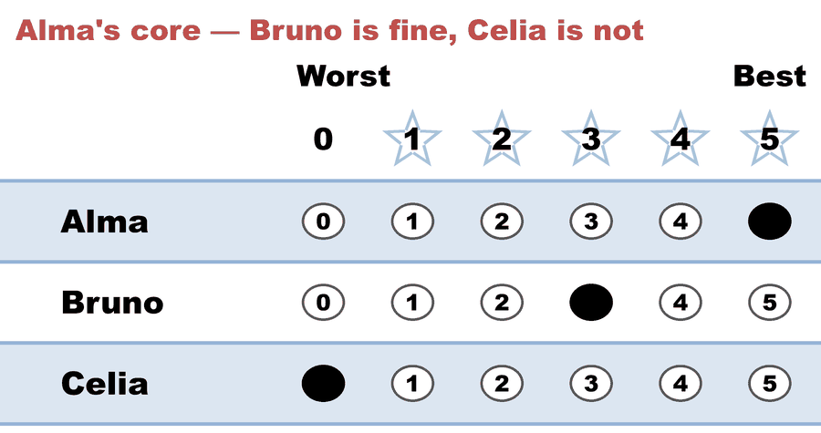
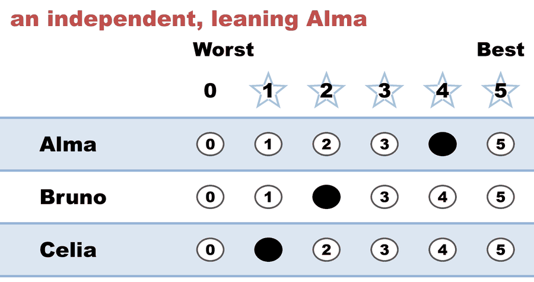
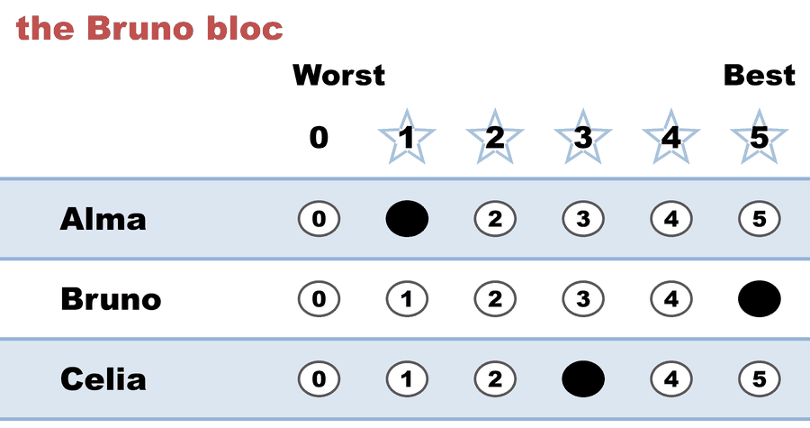
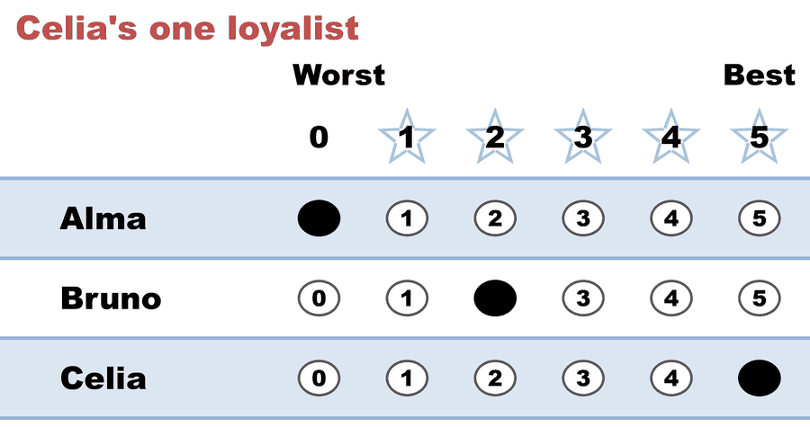

---
search:
  exclude: true
---

# Tactical maximization in STAR (1 of 2) — honest ballots: the hedgers' preference decides the runoff

*Generated from [`tactical_max_c3_b9_honest.yaml`](../tactical_max_c3_b9_honest.yaml) — do not edit by hand. Regenerate: `python STARVote_LH_tabulation_engine/tools_adam/scripts/build_yaml_pages.py`.*

**Method:** [STAR (single winner)](../../../../01_Learn/README.md) · **1 seat** · **Expected winner:** Alma

## Scenario

Honest ballots — half 1 of the worked expansive-sincerity pair
(07_Concepts/topics/insincere_votes/expansive_sincerity.md). A
neighborhood association of nine elects a chair: Alma, Bruno, Celia.
Four members are Alma's core: they honestly like Bruno too (3) and
want nothing to do with Celia (0). One independent leans Alma (4,2,1).
Three back Bruno (1,5,3), and one backs Celia (0,2,5).
Bruno leads the scoring round on points (31 to Alma's 27; Celia is a
distant 15 and never a threat), so the finalists are Bruno and Alma —
and the runoff reads only ORDER, where all five Alma-leaning ballots
put Alma above Bruno. Alma wins 5-4, with nobody sitting out: 9 of 9
voters had a preference. That last line is the whole point of the
pair: the four hedgers' Alma > Bruno preference IS Alma's margin.
Half 2 (tactical_max_c3_b9_hedged.yaml) has those four raise Bruno
3 -> 5 as insurance against Celia, and lose the election because of it.

## Ballots

The ballots as marked — the filled bubble is the score given, and the score is the number in its column:

| # | Ballot as marked | Alma | Bruno | Celia |
|:--:|:--|:--:|:--:|:--:|
| 1 |  | 5 | 3 | 0 |
| 2 |  | 5 | 3 | 0 |
| 3 |  | 5 | 3 | 0 |
| 4 |  | 5 | 3 | 0 |
| 5 |  | 4 | 2 | 1 |
| 6 |  | 1 | 5 | 3 |
| 7 |  | 1 | 5 | 3 |
| 8 |  | 1 | 5 | 3 |
| 9 |  | 0 | 2 | 5 |

The same ballots as the file records them:

Row 1 = candidate names; each later row is one voter's 0–5 scores (a `N ×` prefix = N identical ballots).

```text
Alma,Bruno,Celia
5,3,0     # Alma's core — Bruno is fine, Celia is not
5,3,0     # Alma's core — Bruno is fine, Celia is not
5,3,0     # Alma's core — Bruno is fine, Celia is not
5,3,0     # Alma's core — Bruno is fine, Celia is not
4,2,1     # an independent, leaning Alma
1,5,3     # the Bruno bloc
1,5,3     # the Bruno bloc
1,5,3     # the Bruno bloc
0,2,5     # Celia's one loyalist
```

## What the engine says

The count, step by step — the rounds and how the winner is reached:

<!-- --8<-- [start:report] -->
```text
[Divergence from STAR]
  STAR     = Alma
  Approval = Bruno   (differs from STAR)

[Runoff Reversal]
 - Score Round Winner(s) = (Bruno)
 - Runoff Round Winner   = (Alma)
  Candidate Bruno earned the highest total score, but
  Candidate Alma won the automatic runoff — not a malfunction,
  STAR working as designed: the runoff elects the finalist preferred
  by the majority (of voters with a preference).

--- STAR Voting Method (single winner) ---

[STAR Voting]
 Tabulating 9 ballots.
Count × Alma,Bruno,Celia
    4 ×    5,    3,    0
    3 ×    1,    5,    3
    1 ×    4,    2,    1
    1 ×    0,    2,    5

[STAR Voting: Scoring Round]
 The two highest-scoring candidates advance to the next round.
   Bruno         -- 31 -- First place
   Alma          -- 27 -- Second place
   Celia         -- 15
 Bruno and Alma advance.

[STAR Voting: Automatic Runoff Round]
 The candidate preferred in the most head-to-head matchups wins.
   Alma          -- 5 -- First place
   Bruno         -- 4
   Equal Support -- 0
 Alma wins.
   Runoff math:
     9  ballots cast
   − 0  Equal Support (no preference between the two finalists)
     ─
     9  voters with a preference  (majority = 5)
           Alma 5 (56%)  ·  Bruno 4 (44%)

[STAR Voting: Winner — STAR Voting Method (single winner)]
 Alma
```
<!-- --8<-- [end:report] -->

### Full audit — preference matrix, Condorcet, and score distribution

```text
--- Runoff (Preference) Matrix ---
Head-to-head / pairwise comparison
Legend: For - Equal Support - Against
        * indicates Top 2 Finalist
               |   * Alma   | * Bruno   |   Celia   |
-----------------------------------------------------
      * Alma > |    ---     |5 - 0 - 4  |5 - 0 - 4  |
     * Bruno > | 4 - 0 - 5  |   ---     |8 - 0 - 1  |
       Celia > | 4 - 0 - 5  |1 - 0 - 8  |   ---     |

[Condorcet Winner]
  Condorcet Winner: Alma — matches the STAR winner

[Condorcet Loser]
  Condorcet Loser: Celia — loses every head-to-head matchup

[Score Distribution] (how many ballots gave each star rating)
                Score
Candidate  5  4  3  2  1  0  | Total   Avg
Alma       4  1  0  0  3  1  |    27   3.0
Bruno      3  0  4  2  0  0  |    31   3.4
Celia      1  0  3  0  1  4  |    15   1.7
```

Everything in one file: the [`_tabulated` mirror](../cases_tabulated/tactical_max_c3_b9_honest_tabulated.txt) (regenerated on every run; every analysis forced on).

Run it yourself:

```bash
python STARVote_LH_tabulation_engine/starvote_larry_hastings.py 01_STAR/03_Criteria/tactical_maximization/cases/tactical_max_c3_b9_honest.yaml
```

## See also

- [Methods disagree on this election](../../../../../method_comparisons/divergence_review/cases/APPROVAL_OR_MINOR/tactical_max_c3_b9_honest.md) — its entry in the divergence review ledger
- [Runoff reversal (worked set)](../../../../02_Examples/runoff_overturns_leader/README.md)
- [Glossary](../../../../../07_Concepts/GLOSSARY.md) · [all cases by method](../../../../../07_Concepts/YAML_test_case_index/README.md)

More cases in this set: [tactical_max_c3_b9_hedged](tactical_max_c3_b9_hedged.md)
