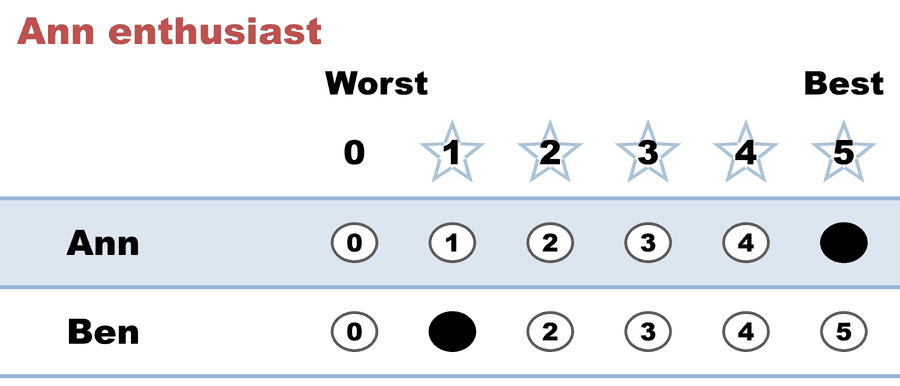
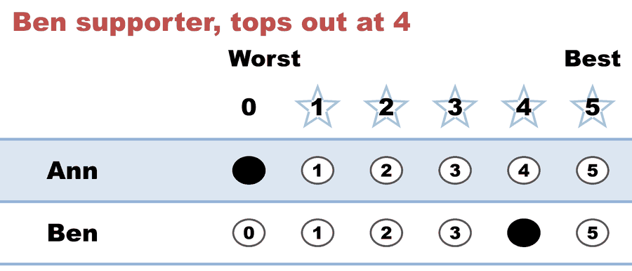

---
search:
  exclude: true
---

# Dead rung 03 — runoff tie broken by five-star

*Generated from [`tie_break_07_runoff_five_star_vs_adversarial_lot.yaml`](../tie_break_07_runoff_five_star_vs_adversarial_lot.yaml) — do not edit by hand. Regenerate: `python STARVote_LH_tabulation_engine/tools_adam/scripts/build_yaml_pages.py`.*

**Method:** [STAR (single winner)](../../../../01_Learn/README.md) · **1 seat** · **Expected winner:** Ann

**Official tie-break (lot) order:** Ben > Ann — consulted only if every deterministic tiebreaker stays tied ([how the ladder works](../../../../01_Learn/Tie_Breaking_STAR/tie_breaking.md)).

## Scenario

Two candidates, two voters, a perfect standoff: tied head-to-head (1-1) and
tied on total score (5-5). The runoff ladder's five-star rung decides —
Ann has one 5, Ben none, so Ann wins. The lot order deliberately favors
Ben: the expected winner (Ann) proves five-star outranks the lot.

## Ballots

The ballots as marked — the filled bubble is the score given, and the score is the number in its column:

| Ballot as marked | Ann | Ben |
|:--|:--:|:--:|
|  | 5 | 1 |
|  | 0 | 4 |

The same ballots as the file records them:

Row 1 = candidate names; each later row is one voter's 0–5 scores (a `N ×` prefix = N identical ballots).

```text
Ann,Ben
5,1   # Ann enthusiast
0,4   # Ben supporter, tops out at 4
```

## What the engine says

The count, step by step — the rounds and how the winner is reached:

<!-- --8<-- [start:report] -->
```text
[Divergence from STAR]
  STAR                   = Ann
  Choose-One (Plurality) = Ben   (differs from STAR)
  RCV-IRV                = Ben   (differs from STAR)
  Approval               = Ben   (differs from STAR)
  RCV-RR                 = Ben   (differs from STAR)
  Note: no ballots had tied scores, so RCV-IRV vs STAR here is a genuine
        method difference, not a tie-breaking artifact.
  Note: Ranked Robin (RCV-RR) sides with RCV-IRV, so STAR is the outlier
        here — STAR need not elect the Condorcet candidate.
  Full round-by-round reports (generated for review):
  RCV-IRV rounds: cases_tabulated/tie_break_07_runoff_five_star_vs_adversarial_lot_RCV-IRV_tabulated.txt
  RCV-RR round-robin: cases_tabulated/tie_break_07_runoff_five_star_vs_adversarial_lot_RCV-RR_tabulated.txt

--- STAR Voting Method (single winner) ---

[STAR Voting]
 Tabulating 2 ballots.
Ann,Ben
  5,  1
  0,  4

[STAR Voting: Scoring Round]
 The two highest-scoring candidates advance to the next round.
   Ann           -- 5 -- First place
   Ben           -- 5 -- Second place
 Ann and Ben advance.

[STAR Voting: Automatic Runoff Round]
 The candidate preferred in the most head-to-head matchups wins.
   Ann           -- 1 -- Tied for first place
   Ben           -- 1 -- Tied for first place
   Equal Support -- 0
 There's a two-way tie for first.

[STAR Voting: Automatic Runoff Round: First tiebreaker]
 The highest-scoring candidate wins.
   Ann           -- 5 -- Tied for first place
   Ben           -- 5 -- Tied for first place
 There's still a two-way tie for first.

[STAR Voting: Automatic Runoff Round: Second tiebreaker]
 The candidate with the most votes of score 5 wins.
   Ann           -- 1 -- First place
   Ben           -- 0
 Ann wins.

[STAR Voting: Winner — STAR Voting Method (single winner)]
 Ann
```
<!-- --8<-- [end:report] -->

### Full audit — preference matrix, Condorcet, and score distribution

```text
--- Runoff (Preference) Matrix ---
Head-to-head / pairwise comparison
Legend: For - Equal Support - Against
        * indicates Top 2 Finalist
               |   * Ann    |  * Ben    |
-----------------------------------------
       * Ann > |    ---     |1 - 0 - 1  |
       * Ben > | 1 - 0 - 1  |   ---     |

[Condorcet Winner]
  No strict Condorcet winner; unbeaten candidates: Ann, Ben (pairwise ties)

[Score Distribution] (how many ballots gave each star rating)
                Score
Candidate  5  4  3  2  1  0  | Total   Avg
Ann        1  0  0  0  0  1  |     5   2.5
Ben        0  1  0  0  1  0  |     5   2.5
```

Everything in one file: the [`_tabulated` mirror](../cases_tabulated/tie_break_07_runoff_five_star_vs_adversarial_lot_tabulated.txt) (regenerated on every run; every analysis forced on).

Run it yourself:

```bash
python STARVote_LH_tabulation_engine/starvote_larry_hastings.py 01_STAR/03_Criteria/tie_break_dead_rung/cases/tie_break_07_runoff_five_star_vs_adversarial_lot.yaml
```

## See also

- [Methods disagree on this election](../../../../../method_comparisons/divergence_review/cases/CYCLE_OR_THREE_WAY/tie_break_07_runoff_five_star_vs_adversarial_lot.md) — its entry in the divergence review ledger
- [Ties & tie-breaking (topic hub)](../../../../../07_Concepts/topics/ties/README.md)
- [The tie-breaking ladder (full chain)](../../../../01_Learn/Tie_Breaking_STAR/tie_breaking.md)
- [Runoff reversal (worked set)](../../../../02_Examples/runoff_overturns_leader/README.md)
- [Glossary](../../../../../07_Concepts/GLOSSARY.md) · [all cases by method](../../../../../07_Concepts/YAML_test_case_index/README.md)

More cases in this set: [bv126_ties_every_step_8fvd2x](bv126_ties_every_step_8fvd2x.md) · [dead_rung_scoring_dead_cap2](dead_rung_scoring_dead_cap2.md) · [dead_rung_scoring_dead_cap3](dead_rung_scoring_dead_cap3.md) · [dead_rung_scoring_dead_cap4](dead_rung_scoring_dead_cap4.md) · [tie_break_01_scoring_five_star_breaks](tie_break_01_scoring_five_star_breaks.md) · [tie_break_02_scoring_no_fives_to_lot](tie_break_02_scoring_no_fives_to_lot.md) · [tie_break_03_runoff_no_fives_to_lot](tie_break_03_runoff_no_fives_to_lot.md) · [tie_break_04_runoff_five_star_breaks](tie_break_04_runoff_five_star_breaks.md) · [tie_break_05_scoring_five_star_vs_adversarial_lot](tie_break_05_scoring_five_star_vs_adversarial_lot.md) · [tie_break_06_scoring_dead_rung_adversarial_lot](tie_break_06_scoring_dead_rung_adversarial_lot.md) · [tie_break_08_runoff_dead_rung_adversarial_lot](tie_break_08_runoff_dead_rung_adversarial_lot.md) · [tie_break_09_five_star_tied_nonzero](tie_break_09_five_star_tied_nonzero.md)
