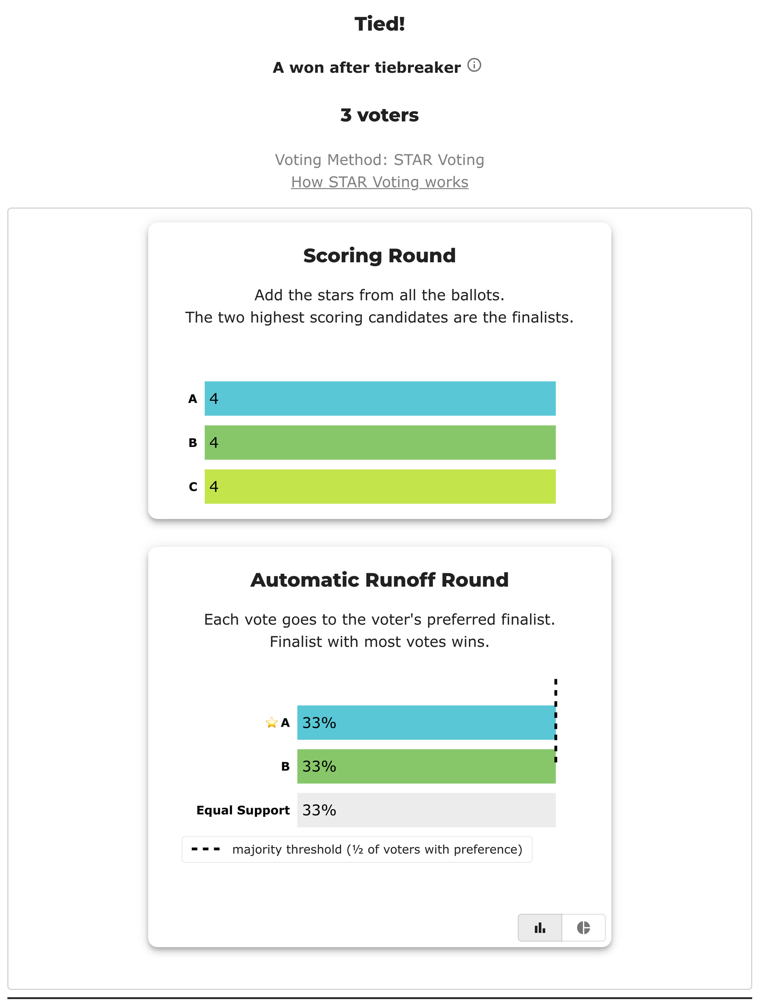

# Three candidates, three possible winners — the dead rung scales

*The 3-candidate analog of the BetterVoting `jfk7pd` case. Same phenomenon, one more candidate: a perfectly symmetric tie that no rung can break, so the lot decides — and now there are **three** winners it could pick.*

**▶ Live on BetterVoting:** [vote](https://bettervoting.com/vx89hj) · **[results ↗](https://bettervoting.com/vx89hj/results)** (election `vx89hj` · test `BV2285`).

Backing files: [`_A`](three_way_dead_rung_A.yaml) (elects A, and reproduces the live BV result) · [`_B`](three_way_dead_rung_B.yaml) (elects B) · [`_C`](three_way_dead_rung_C.yaml) (elects C). Parent set: [The "dead rung"](../README.md).

---

## The ballots

Three voters, each an exact rotation of the others (a "Condorcet-cycle-style" rock-paper-scissors of scores), capped at 4 so **nobody scores a 5**:

```
A, B, C
4, 0, 0     # voter 1 loves A
0, 4, 0     # voter 2 loves B
0, 0, 4     # voter 3 loves C
```

- **Totals:** A = B = C = **4** — a three-way tie for the two finalist slots.
- **Pairwise:** every head-to-head is **1–1** (each candidate beats one rival on one ballot, loses to the other on another, ties on the third).
- **Five-star:** all **0** — a **dead rung** (nobody used the scale max).

Nothing on the ballots distinguishes A, B, or C. The result is decided **entirely by the lot order**:

| Published lot order | Winner |
|---------------------|:------:|
| `[A, B, C]` | **A** |
| `[B, C, A]` | **B** |
| `[C, A, B]` | **C** |

All three verified against the engine. A **random** tie-break (BetterVoting's `tieBreakType: "random"`) draws one of the three; a **deterministic published** lot fixes it in advance. The live election below is one such draw — it landed on `A, B, C`, which is why the `_A` file reproduces it.

---

## Were you surprised two candidates was enough? Here's why more doesn't help.

The lot-decided tie has nothing to do with the *number* of candidates — it's about **symmetry among the tied set**. A tie reaches the lot whenever the ballots can't separate the tied candidates at *any* deterministic rung (pairwise, then five-star). Two candidates was enough because two mirror-image ballots are already perfectly symmetric. Adding candidates doesn't remove that possibility; it just changes the flavors:

1. **The mechanism is identical.** With `k` perfectly-tied candidates, every rung comes back equal and the lot picks the winner. 2, 3, 10 — same story.

2. **A bigger tied set makes the divergence *more* likely, not less.** A random draw agrees with a fixed published order only when it happens to put the same candidate first — probability `1/k`. So a re-count disagrees with probability **`(k − 1)/k`**: 50% for 2 tied, **67% for 3**, 75% for 4, 80% for 5. More tied candidates ⇒ *worse* reproducibility, not better.

3. **More candidates open a *second* place for the lot to bite.** With only two candidates, both are automatically finalists, so the tie can only happen in the runoff. With three or more, the lot can also decide **which two candidates become finalists** (the scoring-round tie) — and that choice can change who ultimately wins. (See the scoring-round dead-rung cases and the adversarial ones in the [parent folder](../README.md).)

4. **The one thing that *does* change: exact ties get rarer by accident.** A perfect tie needs engineered symmetry, and that's harder to hit unintentionally with more candidates and more voters. But "rare" isn't "impossible" — and when it happens in a real public election, a random tie-break means the certified winner isn't reproducible from the ballots. That's the whole point of a **pre-published, deterministic lot** (BetterVoting issue [#1063](https://github.com/Equal-Vote/bettervoting/issues/1063)).

**Bottom line:** more candidates never *fix* the issue — at best they make an accidental tie less frequent, and when a tie does occur they can make the random draw diverge *more* often and in *more* places (finalists as well as the winner).

---

## Reproduce

```bash
python STARVote_LH_tabulation_engine/starvote_larry_hastings.py \
  01_STAR/03_Criteria/tie_break_dead_rung/three_way_dead_rung_tie/three_way_dead_rung_A.yaml   # -> A
# swap _A for _B (-> B) or _C (-> C): same ballots, different lot, different winner
```

---

## On BetterVoting: `vx89hj` (BV2285)

These exact three ballots are now a real, public election — [results ↗](https://bettervoting.com/vx89hj/results). It exists so the lot-decided tie can be pointed at rather than described, and so the *second* place the lot bites (see point 3 above) has a live instance; the two-candidate `jfk7pd` structurally cannot show that one.

**Ignore who won.** The winner below is a draw, not a finding. Read the *mechanism*.



Two things on that page are worth slowing down for:

- **The scoring round is a three-way tie at 4, and the runoff card only shows two of the three candidates.** C is simply gone, with nothing on the page saying why. It was not beaten — it scored exactly what A and B scored. It lost a coin toss that the result page never mentions.
- **The runoff reads 33% / 33% / 33%.** One voter prefers A, one prefers B, and one (the C voter, who scored both finalists 0) registers as **Equal Support**. Nobody reached the majority threshold. The header's "Tied!" is the honest part; "A won after tiebreaker" is the whole story compressed into four words.

### What BV's own log says

The frozen export ([`bv2285_vx89hj_bv_export.json`](bv2285_vx89hj_bv_export.json)) records the count step by step:

```text
score_tied                    A, B, C   score 4          ← three-way tie for two seats
pairwise_too_many_candidates                             ← BV SKIPS the head-to-head rung
five_star_tied                A, B, C   votes 0          ← the DEAD RUNG
random_first                  A                          ← lot, bite 1: A is a finalist
random_second                 B                          ←             B is the other
advance_to_runoff_tiebreak    A, B                       ← C eliminated by draw, not by votes
runoff_tied                   A, B      votes 1, equal 1
runoff_score_tie              A, B      stars 4
runoff_five_star_tie          A, B      votes 0          ← dead rung again
runoff_random                 winner A, runner_up B      ← lot, bite 2: the winner
runoff_tiebreak               winner A
```

**The lot fires twice, exactly as predicted** — once to choose the finalist pair, once to settle the runoff. That is point 3 of the section above, observed rather than argued.

**`tieBreakType: "random"` is a seeded shuffle, not a live coin flip.** BV computes `seed = (ballotCount + hash(raceId)) >>> 0` and shuffles once, then publishes the drawn order as `perm` and per-candidate `tieBreakOrder`. Here it drew **A, B, C**. Recompute it yourself from the frozen export, with no BetterVoting code involved:

```bash
python STARVote_LH_tabulation_engine/tools_adam/bv_replay_tiebreak.py \
  01_STAR/03_Criteria/tie_break_dead_rung/three_way_dead_rung_tie/bv2285_vx89hj_bv_export.json
# seed 2132743651 -> recomputed ['A','B','C'] ; BV recorded ['A','B','C'] ; MATCH yes
```

So the result *is* reproducible after the fact — that part of the auditability gap is closed. What is **not** closed is the part [#1063](https://github.com/Equal-Vote/bettervoting/issues/1063) asks for: the order is a function of the ballot **count** and the race id, never of how anyone voted, and it isn't knowable until the count runs. A voter cannot check it in advance; a losing candidate cannot have predicted it. Pinning `lot_numbers: [A, B, C]` in [`_A`](three_way_dead_rung_A.yaml) replays BV's draw exactly — which is the point: the draw is *recordable*, so it may as well be *published first*.

### One genuine engine divergence: the pairwise rung

`pairwise_too_many_candidates` is BV declining to run the head-to-head tiebreaker at all once three or more candidates are tied. This engine does run it, and reads `0 / 0 / 0` — every matchup among the tied three is a draw, so nobody won one.

On *this* profile the two engines agree anyway, because perfect symmetry ties the pairwise rung too: both fall through to the next step and reach the lot. But they agree by luck, not by construction. A three-way score tie whose members are *not* mutually symmetric would be separable at the pairwise rung, and BV would skip straight past the separation to a draw. So: when quoting a rung-1 number on a 3+-way tie, **name the engine** — the two do not compute the same thing. (Related: BV [#1379](https://github.com/Equal-Vote/bettervoting/issues/1379) on making the fallen-through rungs visible in the UI.)

One thing this profile is *not* good for: because symmetry ties both statistics at once, it cannot distinguish **matchups won** from **preference votes** in the scoring round — the two readings that [`matchups_won_vs_preference_votes.md`](../../../01_Learn/Tie_Breaking_STAR/matchups_won_vs_preference_votes.md) is about. Don't cite it as evidence there.

---

Related: the real 2-candidate BetterVoting case [BV `jfk7pd`](../lot_random_vs_published_jfk7pd/lot_random_vs_published_jfk7pd.md) · the [dead-rung concept + cap ladder](../README.md) · generator [`generate_dead_rung_scenarios.py`](../../../../STARVote_LH_tabulation_engine/tools_adam/generate_dead_rung_scenarios.md).
