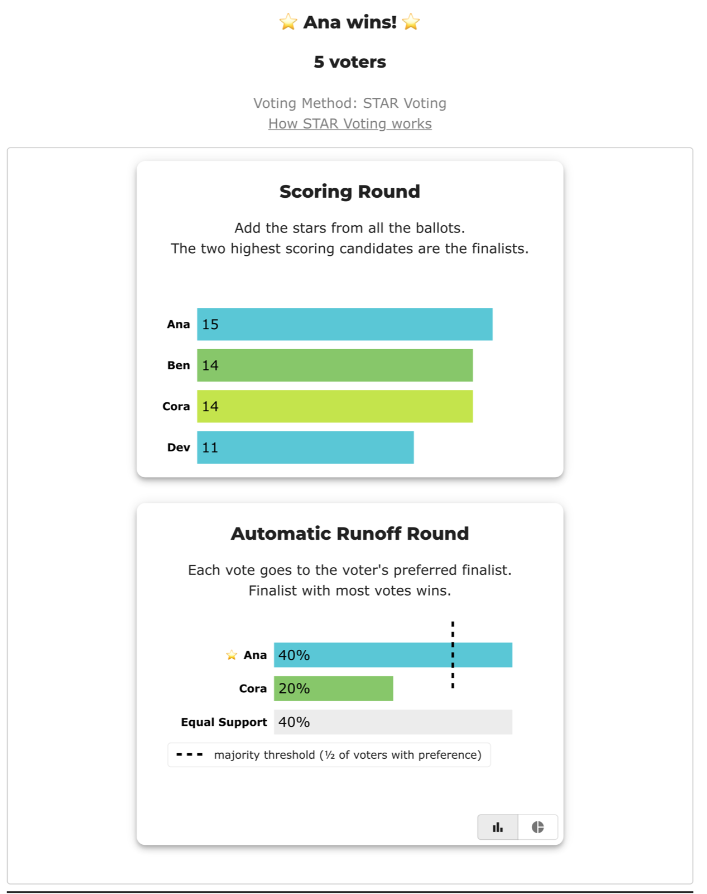
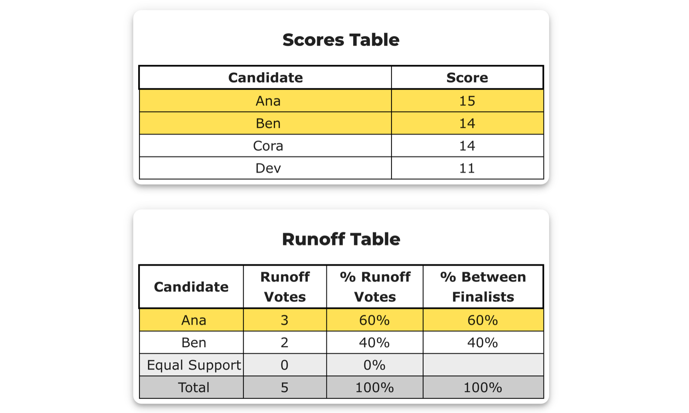

# Tied for the second finalist — the head-to-head rung settles it (BV2276, `qhjyr2`)

<!-- case-meta:start — managed by build_yaml_pages.py; edit the YAML, not these lines -->
**Method:** [STAR (single winner)](../../01_Learn/README.md) · **1 seat** · **Expected winner:** Ana · [full count →](cases/cases_pages/bv2276_qhjyr2_second_finalist_tie.md)
<!-- case-meta:end -->

**▶ Live on BetterVoting:** [vote](https://bettervoting.com/qhjyr2) · **[results ↗](https://bettervoting.com/qhjyr2/results)** (election `qhjyr2`).

> 🪜 **The simplest rung on the ladder.** Two candidates tie for the *second finalist slot*, and the **very first** deterministic rung — the head-to-head — settles it. No five-star rung, no lot, no random. It's the shortest possible version of the story [BV2180/`fp62p2`](bv2180_fp62p2_ice_cream_ladder.md) tells the long way, where pairwise *can't* separate three tied candidates and five-star has to take over.

**Level: 201 · deep dive**

Five voters, four candidates. Winner: **Ana**.

The point worth taking away: **a tie for a finalist slot sounds alarming and usually isn't.** It has an ordinary, deterministic answer — and that answer does not depend on candidate order, on ballot order, or on who happened to be listed second.

## The ballots (5 voters)

```
Ana, Ben, Cora, Dev
5,   3,   5,    0
3,   1,   3,    0
5,   4,   2,    1
1,   4,   0,    5
1,   2,   4,    5
```

Source: [`bv2276_qhjyr2_second_finalist_tie.yaml`](cases/bv2276_qhjyr2_second_finalist_tie.yaml).

## How the winner is found

| Step | What happens | Rung that decides |
|---|---|---|
| Scoring round | Ana **15** leads; **Ben 14** and **Cora 14** tie for the 2nd slot | — (tie) |
| Scoring tiebreak 1 | head-to-head: **Cora 3** vs Ben 2 → Cora advances | **pairwise** ✓ |
| Runoff | Ana **2** vs Cora **1**, with **2 voters at Equal Support** | — decided |

Cora reaches the runoff **without out-scoring Ben** — they finished level at 14. She gets there by being *preferred on more ballots*, which is the runoff's own yardstick applied one round early. That's the ladder's design: a scoring-round tie (equal totals) is broken by the runoff's question, not by another look at the totals.

### Why Equal Support is the biggest group

Two of the five voters score Ana and Cora **identically** — voter 1 gives both 5 stars, voter 2 gives both 3. Neither ballot expresses a preference *between the finalists*, so neither counts for either one:

| | Ana | Cora | counts for |
|---|:--:|:--:|---|
| voter 1 | 5 | 5 | — Equal Support |
| voter 2 | 3 | 3 | — Equal Support |
| voter 3 | 5 | 2 | Ana |
| voter 4 | 1 | 0 | Ana |
| voter 5 | 1 | 4 | Cora |

So Ana wins **2 – 1** among the three voters who *did* express a preference, while Equal Support (2) is as large as the winner's pile. That's not a defect — those voters genuinely didn't mind which of the two won, and STAR records that rather than inventing a preference for them. See [Equal Support in the glossary](../../../07_Concepts/GLOSSARY.md).

## View 1 — BetterVoting (`qhjyr2`)

BetterVoting runs the same ladder and reports `tieBreakType: "head_to_head"`, agreeing with LH on every number:



### A live reporting bug, preserved here on purpose

This election is also the regression fixture for **[BetterVoting issue #1484](https://github.com/Equal-Vote/bettervoting/issues/1484)**. Scroll down to *Race Details* on the live page and the tables name a **different finalist** than the charts above:



| Where on the page | Opponent | Runoff | Equal Support |
|---|---|---|:--:|
| Automatic Runoff chart | **Cora** ✓ | 40% / 20% | **40%** |
| Tabulation Steps | **Cora** ✓ | 2 to 1 | **2** |
| Scores Table (highlight) | **Ben** ✗ | — | — |
| Runoff Table | **Ben** ✗ | 3 / 2 | **0** |

Both halves are arithmetically right *for their own pair* — Ana vs Cora really is 2–1 with 2 equal, and Ana vs Ben really is 3–2 with 0 equal. The tables are reading the **second-highest scorer** (Ben) instead of the candidate the tiebreak advanced (Cora), so the runoff gets recomputed against the wrong opponent and Equal Support collapses to zero.

**The winner is not affected** — Ana wins either way, and the tabulation itself is correct. It's a reporting defect, and this election exists partly so there's a small, deterministic case to check a fix against.

## View 2 — the LH engine (reference)

<!-- report:bv2276_qhjyr2_second_finalist_tie -->
```text
--- STAR Voting Method (single winner) ---

[STAR Voting]
 Tabulating 5 ballots.
Ana,Ben,Cora,Dev
  5,  3,   5,  0
  3,  1,   3,  0
  5,  4,   2,  1
  1,  4,   0,  5
  1,  2,   4,  5

[STAR Voting: Scoring Round]
 The two highest-scoring candidates advance to the next round.
   Ana           -- 15 -- First place
   Ben           -- 14 -- Tied for second place
   Cora          -- 14 -- Tied for second place
   Dev           -- 11
 Ana advances, but there's a two-way tie for second.

[STAR Voting: Scoring Round: First tiebreaker]
 The candidate preferred in the most head-to-head matchups advances.
   Cora          -- 3 -- Second place
   Ben           -- 2
   Equal Support -- 0
 Ana and Cora advance.

[STAR Voting: Automatic Runoff Round]
 The candidate preferred in the most head-to-head matchups wins.
   Ana           -- 2 -- First place
   Cora          -- 1
   Equal Support -- 2
 Ana wins.
   Runoff math:
     5  ballots cast
   − 2  Equal Support (no preference between the two finalists)
     ─
     3  voters with a preference  (majority = 2)
           Ana 2 (67%)  ·  Cora 1 (33%)

[STAR Voting: Winner — STAR Voting Method (single winner)]
 Ana
```
<!-- /report -->

## See also

- [The STAR tie-breaking ladder](../../01_Learn/Tie_Breaking_STAR/tie_breaking.md) — the full protocol, rung by rung
- [Ice cream ladder (BV2180, `fp62p2`)](bv2180_fp62p2_ice_cream_ladder.md) — the same story when pairwise *can't* decide and five-star takes over
- [No Condorcet winner — top-two tie (BV830, `vb3xv2`)](bv830_vb3xv2_no_condorcet_tie_score.md) — a tie in the *runoff* instead of the scoring round
- [tie_break_dead_rung/](../tie_break_dead_rung/README.md) — what happens when the deterministic rungs run out and the lot is reached
