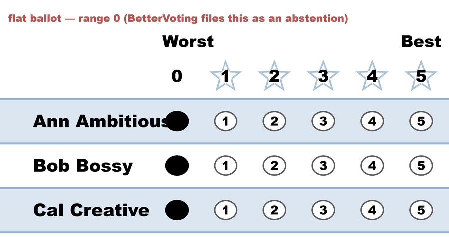
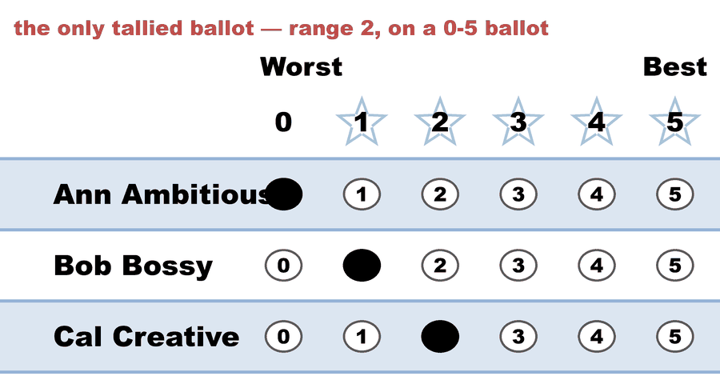
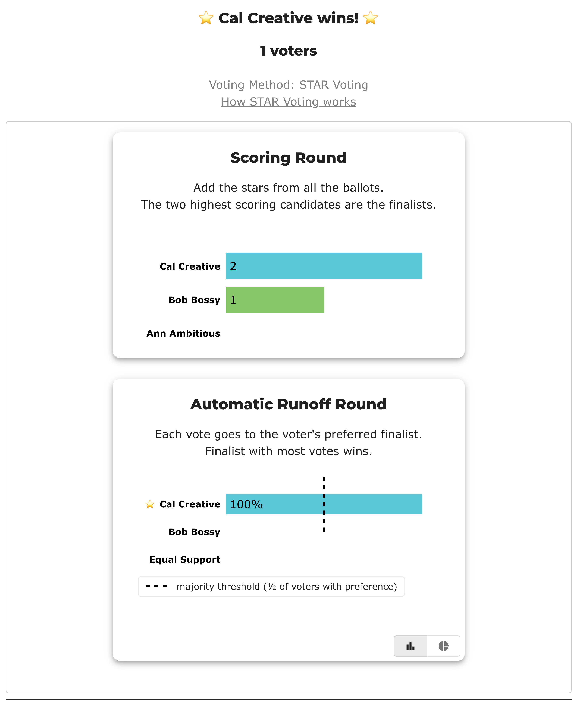

# hckrf7 — "Range of Scores" counts 3 ballots on a page that says 1 voter

<!-- case-meta:start — managed by build_yaml_pages.py; edit the YAML, not these lines -->
**Method:** [STAR (single winner)](../../01_Learn/README.md) · **1 seat** · **Expected winner:** Cal Creative · [full count →](cases/cases_pages/bhckrf7_range_of_scores.md)
<!-- case-meta:end -->

**▶ Live on BetterVoting:** [vote](https://bettervoting.com/hckrf7) · **[results ↗](https://bettervoting.com/hckrf7/results)** (election `hckrf7`) · issue [Equal-Vote/bettervoting#1487](https://github.com/Equal-Vote/bettervoting/issues/1487)

Three voters, three candidates, and a results page that quietly uses **two different denominators**. Nothing is miscounted — the winner, the score totals and the runoff are all correct. What's wrong is that one chart divides by a number the page never shows.

This is the third appearance of the same root cause as the rest of this folder: BetterVoting's **flat ballot = abstention** rule ([#884](https://github.com/Equal-Vote/bettervoting/issues/884)) is applied by the tabulator but *not* by the charts that sit beside it.

## What it teaches

1. **A percentage without its denominator isn't a number, it's a rumour.** The chart says 67%. Of what? The page's only visible count is `1 voters`, and 67% of 1 is not 2.
2. **The two engines label a flat ballot differently, and the label leaks into the display.** BetterVoting's *tabulator* drops a flat ballot; BetterVoting's *chart* keeps it. LH keeps it everywhere and says so out loud.
3. **The fix pattern already exists in BV's own history.** [#1390](https://github.com/Equal-Vote/bettervoting/issues/1390) / [PR #1431](https://github.com/Equal-Vote/bettervoting/pull/1431) fixed the mirror-image version of this — a chart that *dropped* ballots the tabulator counted. This one *keeps* ballots the tabulator dropped.

Wider comparison of what each report can and can't show: [Two views of the same scores](../../01_Learn/reporting/score_matrix_two_views.md).

## The ballots

Three ballots on a 0–5 STAR ballot. Two are flat all-zeros; one scores Cal 2, Bob 1, Ann 0 — a **range of 2** on a ballot that offers 5.

<!-- ballots:bhckrf7_range_of_scores -->
The ballots as marked — the filled bubble is the score given, and the score is the number in its column:

| # | Ballot as marked | Ann Ambitious | Bob Bossy | Cal Creative |
|:--:|:--|:--:|:--:|:--:|
| 1 |  | 0 | 0 | 0 |
| 2 |  | 0 | 1 | 2 |
| 3 |  | 0 | 0 | 0 |
<!-- /ballots -->

## What BetterVoting shows

The headline, above the charts — **"1 voters"**, with Cal Creative taking 100% of the runoff:



Scroll past *Race Details* into *Stats for Nerds*, pick **Range of Scores**, and the same page reports two bars — **33%** at range 2 and **67%** at range 0.

**You will not find that panel unless you turn it on.** `Results.tsx` renders `<ScoreRangeWidget/>` only under `flags.isSet('ALL_STATS')` — a localStorage override that BetterVoting's `flagDefinitions` calls *"Show all work in progress widgets under 'Stats for Nerds'"*. The dropdown on a normal STAR results page offers four panels and this is not one of them. So this page documents a **work-in-progress** widget: the defect is real, but it is one to fix before the widget ships rather than a bug a voter is hitting today.

<!-- Screenshot wanted — the Stats for Nerds "Range of Scores" panel (bars at 33% / 67%).
     Needs the ALL_STATS flag set in local storage; headless capture can't reach it
     (bv_result_screenshot.py hangs on the level-1 .detailExpander). Save it as
     cases/img/hckrf7_range_of_scores.png and add a sized  here (the tag is left out
     on purpose — check_repo_hygiene reads src= even inside a comment). -->

| Panel on the results page | Number | Denominator actually used |
|---|---:|---|
| Headline — "**1 voters**" | 1 | `nTallyVotes` — flat ballots removed |
| Runoff Table — `Total` | 1 | `nTallyVotes` — flat ballots removed |
| Scores Table (Cal 2, Bob 1, Ann 0) | — | flat ballots contribute 0 either way |
| **Stats for Nerds → Range of Scores** (`ALL_STATS` only) | 33% / 67% | **3** — every non-blank ballot |

The export agrees with the headline: `summaryData.nAbstentions = 2`, `nTallyVotes = 1`, and the frozen [`_bv_export.json`](cases/bhckrf7_range_of_scores_bv_export.json) carries all three ballots.

`33%` and `67%` are `1/3` and `2/3`. The chart's tall bar — the 67% at range 0 — is composed **entirely** of the two ballots the same page has already declared abstentions.

## Why, in BetterVoting's own source

Two files, two different ideas of "a ballot that counts":

- **The tabulator** applies the `#884` rule: an all-equal ballot is an abstention and is removed from the tally.
- **The chart** reads [`ScoreRangeWidget.tsx`](https://github.com/Equal-Vote/bettervoting/blob/main/packages/frontend/src/components/Election/Results/components/ScoreRangeWidget.tsx), which histograms `max(score) − min(score)` over `ballotsForRace()`. That helper ([`AnonymizedBallotsContextProvider.tsx`](https://github.com/Equal-Vote/bettervoting/blob/main/packages/frontend/src/components/AnonymizedBallotsContextProvider.tsx)) keeps every vote row with **at least one non-null score** — which is *LH's* abstention rule (blank only), not BetterVoting's. The bar chart then divides by the sum of its own buckets, i.e. 3.

So the widget and the headline are each internally consistent; they just don't share a definition, and the page never reconciles them.

**Is the chart's denominator wrong?** Arguably not — "did voters use the full 0–5 range?" is a question about *ballots as marked*, and a flat ballot is the most extreme case of not using the range, so excluding it would bias the answer. The defect is that the denominator is **invisible**. The chart needs to say `of 3 ballots`, or the page needs to say why 3 and 1 are both right.

## What LH does instead

Same election, LH engine. It never leaves a denominator to be inferred:

```
Voters with a preference: 1 of 3 (2 Equal Support).
Cal Creative 1 (100%) vs Bob Bossy 0 (0%); majority = 1.
```

`1`, `3`, and the gap between them, on one self-reconciling line — the house contract for [`show_runoff_percent`](../../01_Learn/reporting/reporting_LH/options.md). LH also files the two flat ballots as **Equal Support** rather than abstentions, so `1 + 2 = 3` closes.

LH has no per-ballot range statistic at all — that's genuinely BetterVoting's, and it's the useful half of this widget. See [Two views of the same scores](../../01_Learn/reporting/score_matrix_two_views.md) for the full division of labour.

<!-- report:bhckrf7_range_of_scores -->
```text
[Divergence from STAR]
  STAR     = Cal Creative
  Approval = Ann Ambitious   (differs from STAR)

--- STAR Voting Method (single winner) ---

[STAR Voting]
 Tabulating 3 ballots.
Count × Ann Ambitious,Bob Bossy,Cal Creative
    2 ×             0,        0,           0
    1 ×             0,        1,           2

[STAR Voting: Scoring Round]
 The two highest-scoring candidates advance to the next round.
   Cal Creative  -- 2 -- First place
   Bob Bossy     -- 1 -- Second place
   Ann Ambitious -- 0
 Cal Creative and Bob Bossy advance.

[STAR Voting: Automatic Runoff Round]
 The candidate preferred in the most head-to-head matchups wins.
   Cal Creative  -- 1 -- First place
   Bob Bossy     -- 0
   Equal Support -- 2
 Cal Creative wins.
   Runoff math:
     3  ballots cast
   − 2  Equal Support (no preference between the two finalists)
     ─
     1  voters with a preference  (majority = 1)
           Cal Creative 1 (100%)  ·  Bob Bossy 0 (0%)

[STAR Voting: Winner — STAR Voting Method (single winner)]
 Cal Creative
```
<!-- /report -->

## The fix, as filed — [#1487](https://github.com/Equal-Vote/bettervoting/issues/1487)

Print the denominator on the widget — `Difference between maximum and minimum score on ballots (3 ballots)` — and, when it differs from `nTallyVotes`, add one line saying the chart includes ballots the tabulator filed as abstentions. A one-string change plus a count; no tabulation change. The same audit is worth running across the other *Stats for Nerds* widgets, which all read the same `ballotsForRace()` helper.

Two earlier issues on this same widget are about different things and stay separate: [#1186](https://github.com/Equal-Vote/bettervoting/issues/1186) (typos in its caption text) and [#1196](https://github.com/Equal-Vote/bettervoting/issues/1196) (a proposed *Ballots — Span and Differentiation* report built on the same measure).
