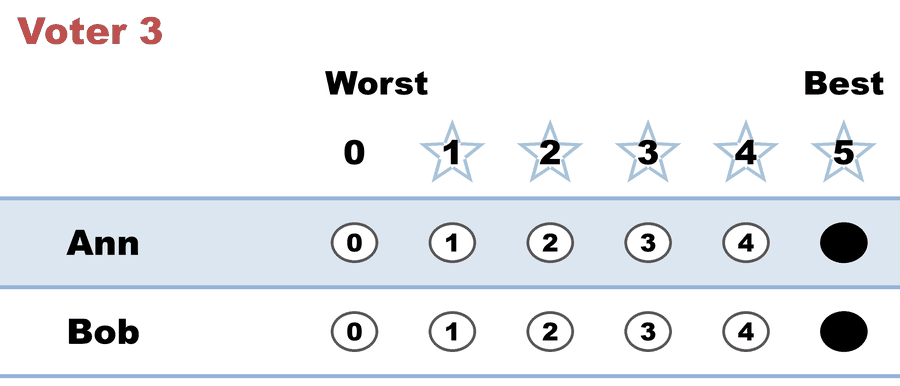

# BV11 — full & equal support (5,5) counted as abstentions

<!-- case-meta:start — managed by build_yaml_pages.py; edit the YAML, not these lines -->
**Method:** [STAR (single winner)](../../01_Learn/README.md) · **1 seat** · **Expected winner:** Ann · [full count →](cases/cases_pages/bv11_6xhfp8_full_equal_support.md)
<!-- case-meta:end -->

**▶ Live on BetterVoting:** [vote](https://bettervoting.com/6xhfp8) · **[results ↗](https://bettervoting.com/6xhfp8/results)** (election `6xhfp8`) · issue [Equal-Vote/bettervoting#1053](https://github.com/Equal-Vote/bettervoting/issues/1053)

Three voters each give **both** candidates the maximum score (`5,5`) — full, equal support. A valid STAR ballot. BetterVoting counts every one of them as an **abstention**.

## What it teaches

1. **Full equal support is a cast vote, not an abstention.** Each `5,5` contributes 5 to both candidates in the scoring round. BetterVoting's policy ([#884](https://github.com/Equal-Vote/bettervoting/issues/884)) treats any all-equal ballot as an abstention, so it reports `nTallyVotes = 0`, `nAbstentions = 3`, and the submit dialog warns "Abstained / No preference" on a full-support ballot ([#1053](https://github.com/Equal-Vote/bettervoting/issues/1053)).
2. **Yet a winner is still declared** off zero tallied votes — BetterVoting elects Ann.
3. **LH diverges.** It counts all three as real votes (Ann 15, Bob 15), making it a genuine **tie**, resolved to Ann by lot (CSV column order). Same winner, opposite reasoning: BetterVoting says "everyone abstained," LH says "everyone tied." LH matches the view that full equal support is a real vote — the #884 dispute.

## The ballots

<!-- ballots:bv11_6xhfp8_full_equal_support -->
The ballots as marked — the filled bubble is the score given, and the score is the number in its column:

| # | Ballot as marked | Ann | Bob |
|:--:|:--|:--:|:--:|
| 1 |  | 5 | 5 |
| 2 |  | 5 | 5 |
| 3 |  | 5 | 5 |
<!-- /ballots -->

Every bubble that could be filled *is* filled — maximum support, three times over.

## The result

**Ann is elected** — but as a **tie broken by lot** (Ann 15 = Bob 15), not off zero votes.

<!-- report:bv11_6xhfp8_full_equal_support -->
```text
--- STAR Voting Method (single winner) ---

[STAR Voting]
 Tabulating 3 ballots.
Count × Ann,Bob
    3 ×   5,  5

[STAR Voting: Scoring Round]
 The two highest-scoring candidates advance to the next round.
   Ann           -- 15 -- First place
   Bob           -- 15 -- Second place
 Ann and Bob advance.

[STAR Voting: Automatic Runoff Round]
 The candidate preferred in the most head-to-head matchups wins.
   Ann           -- 0 -- Tied for first place
   Bob           -- 0 -- Tied for first place
   Equal Support -- 3
 There's a two-way tie for first.

[STAR Voting: Automatic Runoff Round: First tiebreaker]
 The highest-scoring candidate wins.
   Ann           -- 15 -- Tied for first place
   Bob           -- 15 -- Tied for first place
 There's still a two-way tie for first.

[STAR Voting: Automatic Runoff Round: Second tiebreaker]
 The candidate with the most votes of score 5 wins.
   Ann           -- 3 -- Tied for first place
   Bob           -- 3 -- Tied for first place
 There's still a two-way tie for first.

*** No official tie-breaking lot numbers were provided.
    Ties are resolved using a fallback order: CSV column order.
    Lot-number priority order: ['Ann', 'Bob']

[Tiebreaker: Lot Number Priority]
  Tie among: ['Ann', 'Bob']
  Resolved: ['Ann'] (selected by lot-number priority).

[Lot-decided tie — rare]
  ⚠ The ballots did not break this tie: the deterministic rungs
    (pairwise / score, then five-star) all came back equal, so the
    pre-published LOT order chose among the tied candidates — the
    result here was set by lot, not by the votes. Usually the
    "dead rung": no tied candidate held a score-5 vote (five-star
    counts fives, not fours). Verify the tied candidates' 5-counts.

[STAR Voting: Winner — STAR Voting Method (single winner)]
 Ann
```
<!-- /report -->
BetterVoting result: `elected: ["Ann"]`, `nTallyVotes: 0`, `nAbstentions: 3`.

Full engine detail: [`bv11_6xhfp8_full_equal_support_tabulated.txt`](cases/cases_tabulated/bv11_6xhfp8_full_equal_support_tabulated.txt) · source [`.yaml`](cases/bv11_6xhfp8_full_equal_support.yaml). Part of the [BV abstain issue index](../../../07_Concepts/tabulation_engines/BV/abstain_issues_index.md).
