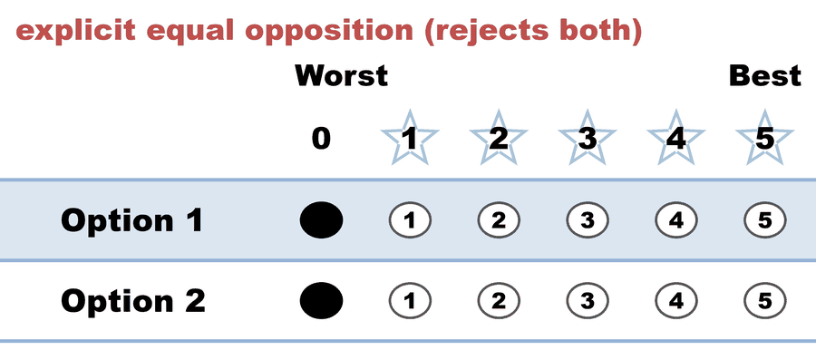
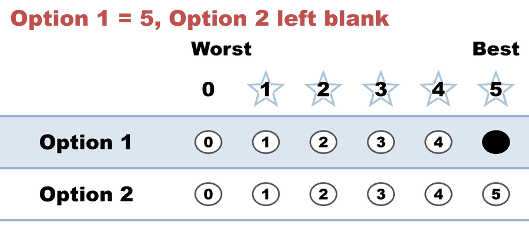

# BV655 — "equal opposition" (all-0) mislabeled as Abstained

<!-- case-meta:start — managed by build_yaml_pages.py; edit the YAML, not these lines -->
**Method:** [STAR (single winner)](../../01_Learn) · **1 seat** · **Expected winner:** Option 1 · [full count →](cases/cases_pages/bv655_jfrk9t_equal_opposition.md)
<!-- case-meta:end -->

**▶ Live on BetterVoting:** [vote](https://bettervoting.com/jfrk9t) · **[results ↗](https://bettervoting.com/jfrk9t/results)** (election `jfrk9t`) · issue [Equal-Vote/bettervoting#1090](https://github.com/Equal-Vote/bettervoting/issues/1090)

Reproduces the bug where an explicit **all-zero ("equal opposition")** ballot is treated and labeled the same as a true **abstention**. The BetterVoting election has two races built to contrast the two:

| | Race 1 — "equal opposition" | Race 2 — "Abstain Vote" |
|---|---|---|
| Ballot 1 | `0, 0` (scores both a 0) | `blank, blank` (scores nothing) |
| Ballot 2 | `5, blank` | `0, blank` |
| Voter intent | **actively rejects** both | **no preference** (abstains) |
| BetterVoting label | "Abstained — No preference" ❌ | "Abstained — No preference" ✅ |

The two races produce the *same* "Abstained" label, but they mean different things — that's the bug. This page reproduces **Race 1** as the tabulatable case; the raw export ([`_bv_export.json`](cases/bv655_jfrk9t_equal_opposition_bv_export.json)) contains both races.

## What it teaches

1. **Explicit `0` ≠ abstention.** Ballot 1's `0,0` is an *active rejection of the field*. The current STAR policy ([bettervoting#884](https://github.com/Equal-Vote/bettervoting/issues/884)) treats an all-equal ballot as an abstention, and the UI/CSV then label it "Abstained." An all-0 ballot is not a blank ballot — collapsing them loses the voter's intent ([bettervoting#1090](https://github.com/Equal-Vote/bettervoting/issues/1090)).
2. **The record keeps them separate in LH.** LH tabulates both an explicit `0` and an abstention marker (`~`/`&`) as 0, but stores them distinctly — so a report can tell "rejected everyone" from "didn't vote." BetterVoting stores only `0`/`null` and has no explicit abstain mark, so it can't (see the [abstain issue index](../../../07_Concepts/tabulation_engines/BV/abstain_issues_index.md) and the [lesson](../../01_Learn/properties_and_limits/abstention_vs_zero_vs_nota.md)).
3. **BV and LH diverge on the count.** Both elect Option 1, but BetterVoting counts Ballot 1 (`0,0`) as an **abstention** (`nAbstentions = 1`), while LH counts it as a real tally vote that registers as **Equal Support** in the runoff (`nAbstentions = 0`). Only a truly blank ballot abstains in LH. LH's treatment matches the view that an explicit 0 is a cast vote — the heart of the #884 dispute.

## The ballots (Race 1)

Options: **Option 1, Option 2**. `&` = the BetterVoting `null` (left blank).

<!-- ballots:bv655_jfrk9t_equal_opposition -->
The ballots as marked — the filled bubble is the score given, and the score is the number in its column:

| Ballot as marked | Option 1 | Option 2 |
|:--|:--:|:--:|
|  | 0 | 0 |
|  | 5 | & |
<!-- /ballots -->

Ballot 1 marked both zeros deliberately; ballot 2 left Option 2 untouched. On the count they land in the same place — that's the bug.

## The result

**Option 1 is elected** (score 5 vs 0; runoff 1–0). In LH, Ballot 1 (`0,0`) is a tally vote that shows as **Equal Support** in the runoff — *not* an abstention. (BetterVoting instead reports it as `nAbstentions = 1`.)

<!-- report:bv655_jfrk9t_equal_opposition -->
```text
--- STAR Voting Method (single winner) ---

[STAR Voting]
 Tabulating 2 ballots.
Option 1,Option 2
       0,       0
       5,       &

[STAR Voting: Scoring Round]
 The two highest-scoring candidates advance to the next round.
   Option 1      -- 5 -- First place
   Option 2      -- 0 -- Second place
 Option 1 and Option 2 advance.

[STAR Voting: Automatic Runoff Round]
 The candidate preferred in the most head-to-head matchups wins.
   Option 1      -- 1 -- First place
   Option 2      -- 0
   Equal Support -- 1
 Option 1 wins.
   Runoff math:
     2  ballots cast
   − 1  Equal Support (no preference between the two finalists)
     ─
     1  voters with a preference  (majority = 1)
           Option 1 1 (100%)  ·  Option 2 0 (0%)

[STAR Voting: Winner — STAR Voting Method (single winner)]
 Option 1
```
<!-- /report -->
(The `Abs = 1` on Option 2 is Ballot 2's `&` — a *per-candidate* blank — not a whole-ballot abstention. LH's whole-ballot abstention count here is 0; BetterVoting's is 1.)

Full engine detail: [`bv655_jfrk9t_equal_opposition_tabulated.txt`](cases/cases_tabulated/bv655_jfrk9t_equal_opposition_tabulated.txt). Tabulatable source: [`bv655_jfrk9t_equal_opposition.yaml`](cases/bv655_jfrk9t_equal_opposition.yaml).

Part of the BetterVoting abstain/blank/zero cluster — see the [issue index](../../../07_Concepts/tabulation_engines/BV/abstain_issues_index.md).
