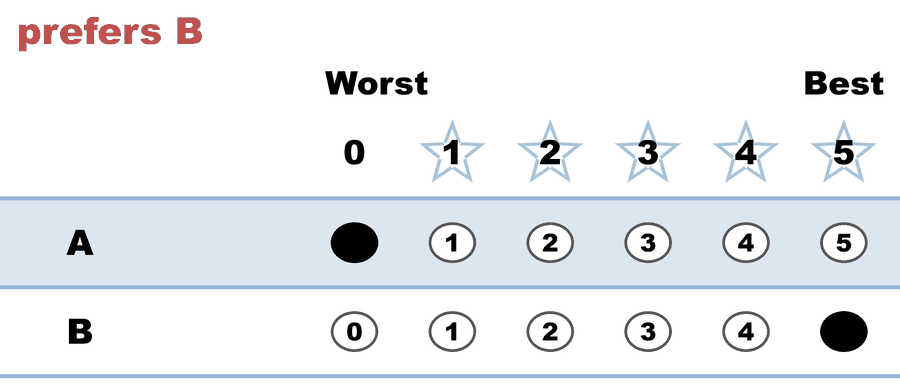
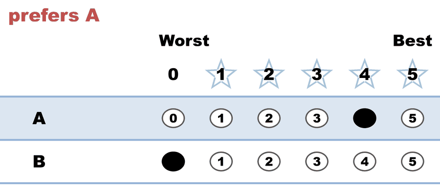
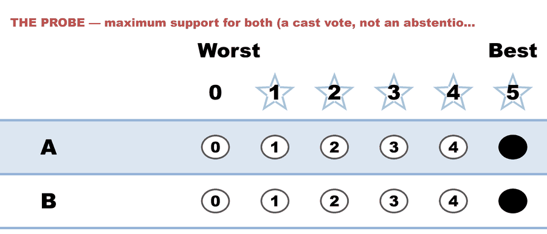
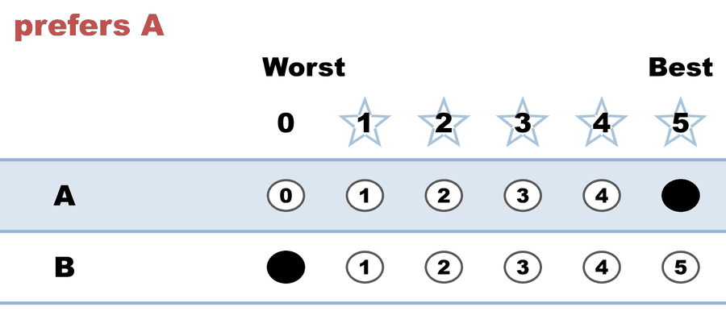
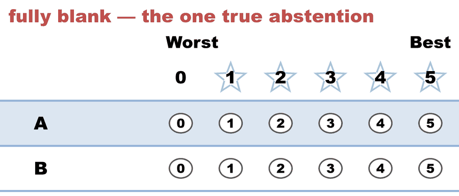

---
search:
  exclude: true
---

# BV2283 — Score both candidates 5 (STAR, 2 candidates): a vote, or an abstention?

*Generated from [`bv2283_hb4qvv_all_equal_recheck.yaml`](../bv2283_hb4qvv_all_equal_recheck.yaml) — do not edit by hand. Regenerate: `python STARVote_LH_tabulation_engine/tools_adam/scripts/build_yaml_pages.py`.*

**Method:** [STAR (single winner)](../../../../01_Learn/README.md) · **1 seat** · **Expected winner:** A

**▶ Live on BetterVoting:** [vote](https://bettervoting.com/hb4qvv) · **[results ↗](https://bettervoting.com/hb4qvv/results)** (election `hb4qvv` · test `BV2283`).

## Scenario

The LH reference for BetterVoting test BV2283 (election hb4qvv), a deliberate
RE-CAST of the June 2026 election 3w6v4b on exactly the same five ballots — cast
again so they are counted by today's tabulator rather than by the one that ran in
June.
Live results: https://bettervoting.com/hb4qvv/results
Frozen raw export: bv2283_hb4qvv_all_equal_recheck_bv_export.json.

The five ballots — one of each KIND of ballot:

  A,B
  0,5   prefers B
  4,0   prefers A
  5,5   THE PROBE — maximum support for BOTH (a cast vote, not an abstention)
  5,0   prefers A
  -,-   fully blank — a TRUE abstention

Winner: A — unchanged, and never in question. A ballot that scores every
candidate the same adds the same amount to each, so it cannot move the scoring
round, and it states no preference between the finalists, so it is neutral in
the runoff. That is exactly why this election measures the COUNT, not the winner.

WHY THIS ELECTION EXISTS. BetterVoting reports nTallyVotes 3 / nAbstentions 2 on
these five ballots: it files the 5,5 ballot as an abstention alongside the
genuinely blank one, and drops its scores from the totals. BV publishes A 9 and
B 5; a hand count of the ballots gives A 14 and B 10. The 5,5 voter's ten points
are simply absent, and nothing on the results page accounts for them.

ROOT CAUSE, read off BV's own source (verified on master 2026-08-09). Star.ts
passes makeAbstentionTest(TRUE), and Util.ts implements that as

  marks.every(m => m === marks[0])

— "every mark equal," not "every mark zero." filterInitialVotes returns as soon
as a stat test matches, so the ballot is counted in nAbstentions and never pushed
into tallyVotes. Star.ts and AllocatedScore.ts (STAR_PR) pass true; Approval,
Plurality, IRV and RankedRobin pass the default false. So an Approval voter who
approves everyone is counted; a STAR voter who scores everyone 5 is not.

WHY A NEW ELECTION RATHER THAN CITING 3w6v4b. The June election is in state
`draft`, so its public results page is not a link anyone else can open — no use
in a bug report. hb4qvv is `open`, carries the identical ballots, and returns the
identical numbers.

FILED as bettervoting#1508 (2026-08-09), with this election as the live
reproduction. Companion to #1478, which reports the same rule from a 3-candidate
bloc election.

LH counts it correctly: 5 ballots, 1 abstention (only the fully-blank row),
A 14, B 10, runoff A 2 - B 1 with 2 Equal Support. Two candidates is an unusual
STAR race, and that is the point — with only two candidates a 5,5 IS a flat
ballot, so the rule fires on the simplest example that exists.

## Ballots

The ballots as marked — the filled bubble is the score given, and the score is the number in its column:

| # | Ballot as marked | A | B |
|:--:|:--|:--:|:--:|
| 1 |  | 0 | 5 |
| 2 |  | 4 | 0 |
| 3 |  | 5 | 5 |
| 4 |  | 5 | 0 |
| 5 |  | - | - |

The same ballots as the file records them:

Row 1 = candidate names; each later row is one voter's 0–5 scores (a `N ×` prefix = N identical ballots).

Markers on these ballots: `-` blank · `~` race abstention · `&` candidate abstention · `?` spoiled · `%` spoiled+reissued — all tabulate as 0 (reported honestly).

```text
A,B
0,5   # prefers B
4,0   # prefers A
5,5   # THE PROBE — maximum support for both (a cast vote, not an abstention)
5,0   # prefers A
-,-   # fully blank — the one true abstention
```

## What the engine says

The count, step by step — the rounds and how the winner is reached:

<!-- --8<-- [start:report] -->
```text
--- STAR Voting Method (single winner) ---

[STAR Voting]
 Tabulating 5 ballots. Note: 1 of 5 ballots is marked as an abstention.
A,B
0,5
4,0
5,5
5,0
-,-
  ('-' = left blank / abstained; '0' = scored zero — both count as 0 stars.)

[STAR Voting: Scoring Round]
 The two highest-scoring candidates advance to the next round.
   A             -- 14 -- First place
   B             -- 10 -- Second place
 A and B advance.

[STAR Voting: Automatic Runoff Round]
 The candidate preferred in the most head-to-head matchups wins.
   A             -- 2 -- First place
   B             -- 1
   Equal Support -- 2
 A wins.
   Runoff math:
     5  ballots cast
   − 2  Equal Support (no preference between the two finalists)
     ─
     3  voters with a preference  (majority = 2)
           A 2 (67%)  ·  B 1 (33%)

[STAR Voting: Winner — STAR Voting Method (single winner)]
 A
```
<!-- --8<-- [end:report] -->

### Full audit — preference matrix, Condorcet, and score distribution

```text
--- Runoff (Preference) Matrix ---
Head-to-head / pairwise comparison
Legend: For - Equal Support - Against
        * indicates Top 2 Finalist
               |    * A     |   * B     |
-----------------------------------------
         * A > |    ---     |2 - 2 - 1  |
         * B > | 1 - 2 - 2  |   ---     |

[Condorcet Winner]
  Condorcet Winner: A — matches the STAR winner

[Condorcet Loser]
  Condorcet Loser: B — loses every head-to-head matchup

[Score Distribution] (how many ballots gave each star rating)
                Score
Candidate  5  4  3  2  1  0  Abs  | Total  Avg all  Avg rated
A          2  1  0  0  0  1    1  |    14      2.8        3.5
B          2  0  0  0  0  2    1  |    10      2.0        2.5
  Avg all   = Total / all ballots — a blank counts as 0, so this is the Total the Scoring Round ranks on, per ballot.
  Avg rated = Total / the ballots that scored this candidate (Abs excluded) — support among voters who had an opinion.
```

Everything in one file: the [`_tabulated` mirror](../cases_tabulated/bv2283_hb4qvv_all_equal_recheck_tabulated.txt) (regenerated on every run; every analysis forced on).

Run it yourself:

```bash
python STARVote_LH_tabulation_engine/starvote_larry_hastings.py 01_STAR/04_Real_Elections/pet_real_bv_election/cases/bv2283_hb4qvv_all_equal_recheck.yaml
```

## See also

- [Runoff reversal (worked set)](../../../../02_Examples/runoff_overturns_leader/README.md)
- [Ballot & terminology basics](../../../../../07_Concepts/topics/ballot_and_terminology_basics.md)
- [Glossary](../../../../../07_Concepts/GLOSSARY.md) · [all cases by method](../../../../../07_Concepts/YAML_test_case_index/README.md)

More cases in this set: [abstention_reconciliation_min_c2_b6](abstention_reconciliation_min_c2_b6.md) · [best_pet_c7_b461](best_pet_c7_b461.md) · [bv15_4h89vj_plurality_abstain](bv15_4h89vj_plurality_abstain.md) · [flat_scores_abstention_c3_b8](flat_scores_abstention_c3_b8.md) · [small_abstention_c2_b5](small_abstention_c2_b5.md)
