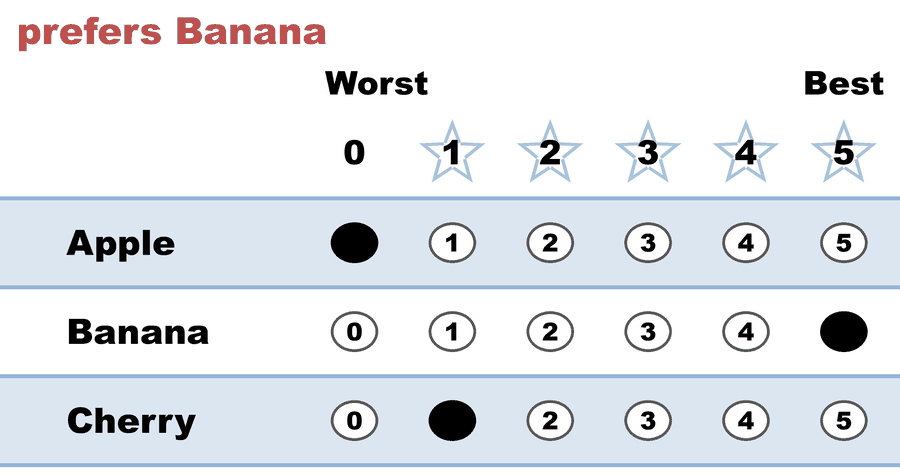
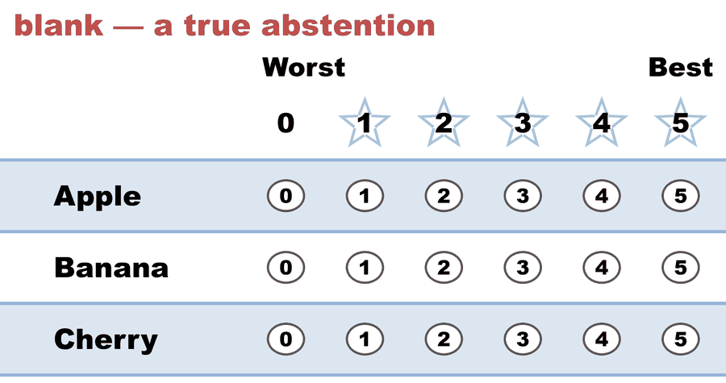
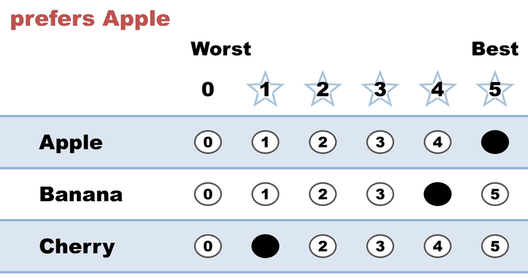
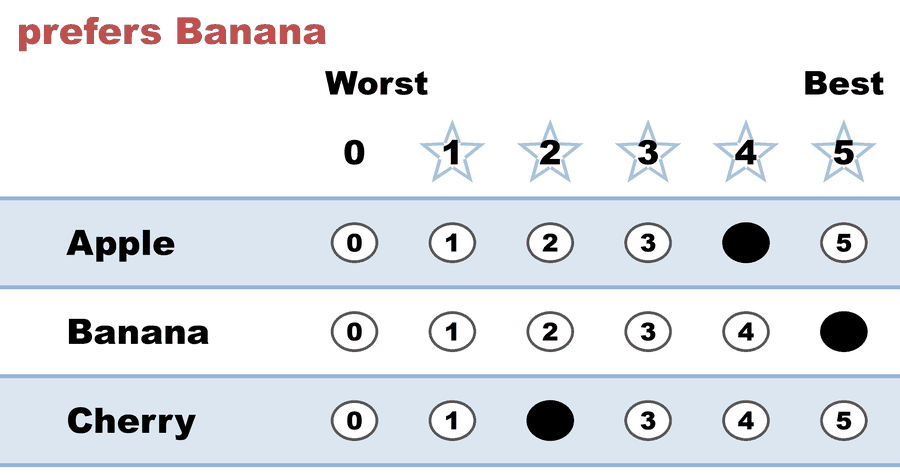
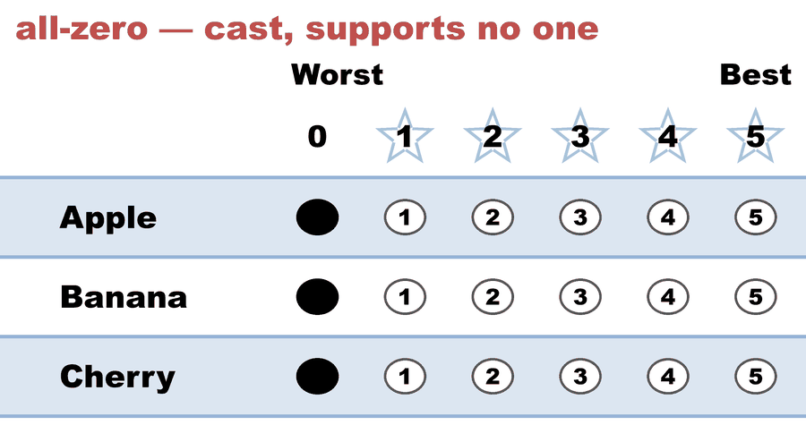
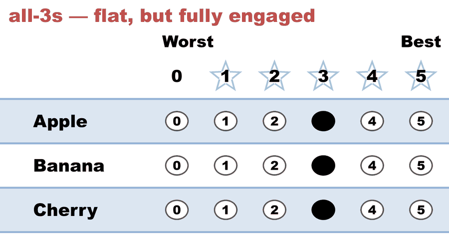
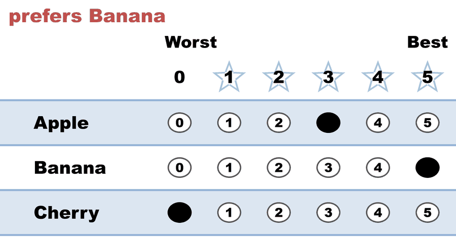
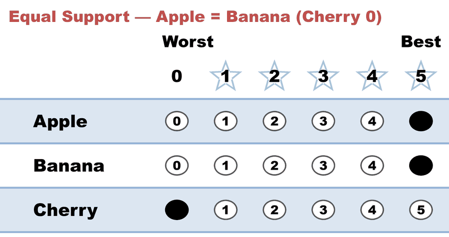

---
search:
  exclude: true
---

# BV Abstentions and flat scores (Apple/Banana/Cherry, 8 ballots)

*Generated from [`flat_scores_abstention_c3_b8.yaml`](../flat_scores_abstention_c3_b8.yaml) — do not edit by hand. Regenerate: `python STARVote_LH_tabulation_engine/tools_adam/scripts/build_yaml_pages.py`.*

**Method:** [STAR (single winner)](../../../../01_Learn/README.md) · **1 seat** · **Expected winner:** Banana

**▶ Live on BetterVoting:** [vote](https://bettervoting.com/dq2dmm) · **[results ↗](https://bettervoting.com/dq2dmm/results)** (election `dq2dmm`).

## Scenario

A REAL BetterVoting election (BV id dq2dmm), captured 2026-06-28. The canonical
small case for how BetterVoting and the LH engine differ on "no preference"
ballots — richer than two candidates because a third candidate (Cherry)
separates three distinct ideas a single election usually blurs:

  • a TRUE abstention (a blank ballot — no score for anyone): 1
  • a FLAT ballot (every candidate scored the same) — what BetterVoting files
    as an "abstention": 3   (the blank, 0,0,0, AND 3,3,3)
  • EQUAL SUPPORT in the runoff (the two finalists tied): 4
    (those 3 flat ballots PLUS 5,5,0, which is tied on Apple/Banana but is NOT
    flat, so BetterVoting counts it normally)

The point: BetterVoting's "flat = abstention" rule and STAR's "Equal Support"
are different sets. 3,3,3 is a fully engaged vote (Cherry got 3 too) that BV
drops; 5,5,0 is Equal Support that BV keeps. BetterVoting reports
nAbstentions = 3, nTallyVotes = 5; the LH engine counts all 8 and marks only
the blank an abstention. Same winner (Banana). Frozen export:
flat_scores_abstention_c3_b8_bv_export.json. Full write-up:
small_case_abstention_lesson.md.

BetterVoting issue: https://github.com/Equal-Vote/bettervoting/issues/1407
How to read this report (LH): 01_STAR/01_Learn/reporting/reporting_LH/
The reporting options used below: STAR_reporting/reporting_LH/options.md

## Ballots

The ballots as marked — the filled bubble is the score given, and the score is the number in its column:

| # | Ballot as marked | Apple | Banana | Cherry |
|:--:|:--|:--:|:--:|:--:|
| 1 |  | 0 | 5 | 1 |
| 2 |  | - | - | - |
| 3 |  | 5 | 4 | 1 |
| 4 |  | 4 | 5 | 2 |
| 5 |  | 0 | 0 | 0 |
| 6 |  | 3 | 3 | 3 |
| 7 |  | 3 | 5 | 0 |
| 8 |  | 5 | 5 | 0 |

The same ballots as the file records them:

Row 1 = candidate names; each later row is one voter's 0–5 scores (a `N ×` prefix = N identical ballots).

Markers on these ballots: `-` blank · `~` race abstention · `&` candidate abstention · `?` spoiled · `%` spoiled+reissued — all tabulate as 0 (reported honestly).

```text
Apple, Banana, Cherry
    0,      5,      1   # prefers Banana
    -,      -,      -   # blank — a true abstention
    5,      4,      1   # prefers Apple
    4,      5,      2   # prefers Banana
    0,      0,      0   # all-zero — cast, supports no one
    3,      3,      3   # all-3s — flat, but fully engaged
    3,      5,      0   # prefers Banana
    5,      5,      0   # Equal Support — Apple = Banana (Cherry 0)
```

## What the engine says

The count, step by step — the rounds and how the winner is reached:

<!-- --8<-- [start:report] -->
```text
--- STAR Voting Method (single winner) ---

[STAR Voting]
 Tabulating 8 ballots. Note: 1 of 8 ballots is marked as an abstention.
Apple,Banana,Cherry
    0,     5,     1
    -,     -,     -
    5,     4,     1
    4,     5,     2
    0,     0,     0
    3,     3,     3
    3,     5,     0
    5,     5,     0
  ('-' = left blank / abstained; '0' = scored zero — both count as 0 stars.)

[STAR Voting: Scoring Round]
 The two highest-scoring candidates advance to the next round.
   Banana        -- 27 -- First place
   Apple         -- 20 -- Second place
   Cherry        --  7
 Banana and Apple advance.

[STAR Voting: Automatic Runoff Round]
 The candidate preferred in the most head-to-head matchups wins.
   Banana        -- 3 -- First place
   Apple         -- 1
   Equal Support -- 4
 Banana wins.
   Runoff math:
     8  ballots cast
   − 4  Equal Support (no preference between the two finalists)
     ─
     4  voters with a preference  (majority = 3)
           Banana 3 (75%)  ·  Apple 1 (25%)

[STAR Voting: Winner — STAR Voting Method (single winner)]
 Banana
```
<!-- --8<-- [end:report] -->

### Full audit — preference matrix, Condorcet, and score distribution

```text
--- Runoff (Preference) Matrix ---
Head-to-head / pairwise comparison
Legend: For - Equal Support - Against
        * indicates Top 2 Finalist
               |  * Apple   | * Banana  |   Cherry  |
-----------------------------------------------------
     * Apple > |    ---     |1 - 4 - 3  |4 - 3 - 1  |
    * Banana > | 3 - 4 - 1  |   ---     |5 - 3 - 0  |
      Cherry > | 1 - 3 - 4  |0 - 3 - 5  |   ---     |

[Condorcet Winner]
  Condorcet Winner: Banana — matches the STAR winner

[Condorcet Loser]
  Condorcet Loser: Cherry — loses every head-to-head matchup

[Score Distribution] (how many ballots gave each star rating)
                Score
Candidate  5  4  3  2  1  0  Abs  | Total  Avg all  Avg rated
Apple      2  1  2  0  0  2    1  |    20      2.5        2.9
Banana     4  1  1  0  0  1    1  |    27      3.4        3.9
Cherry     0  0  1  1  2  3    1  |     7      0.9        1.0
  Avg all   = Total / all ballots — a blank counts as 0, so this is the Total the Scoring Round ranks on, per ballot.
  Avg rated = Total / the ballots that scored this candidate (Abs excluded) — support among voters who had an opinion.
```

Everything in one file: the [`_tabulated` mirror](../cases_tabulated/flat_scores_abstention_c3_b8_tabulated.txt) (regenerated on every run; every analysis forced on).

Run it yourself:

```bash
python STARVote_LH_tabulation_engine/starvote_larry_hastings.py 01_STAR/04_Real_Elections/pet_real_bv_election/cases/flat_scores_abstention_c3_b8.yaml
```

## See also

- [Ties & tie-breaking (topic hub)](../../../../../07_Concepts/topics/ties/README.md)
- [Runoff reversal (worked set)](../../../../02_Examples/runoff_overturns_leader/README.md)
- [Ballot & terminology basics](../../../../../07_Concepts/topics/ballot_and_terminology_basics.md)
- [Glossary](../../../../../07_Concepts/GLOSSARY.md) · [all cases by method](../../../../../07_Concepts/YAML_test_case_index/README.md)

More cases in this set: [abstention_reconciliation_min_c2_b6](abstention_reconciliation_min_c2_b6.md) · [best_pet_c7_b461](best_pet_c7_b461.md) · [bv15_4h89vj_plurality_abstain](bv15_4h89vj_plurality_abstain.md) · [bv2283_hb4qvv_all_equal_recheck](bv2283_hb4qvv_all_equal_recheck.md) · [small_abstention_c2_b5](small_abstention_c2_b5.md)
