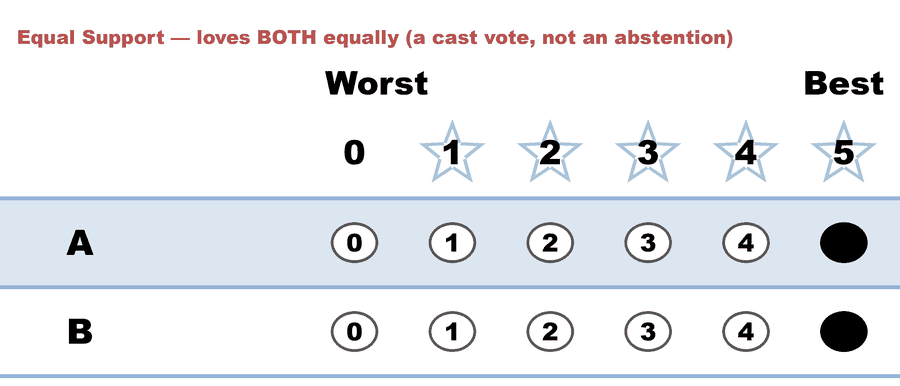
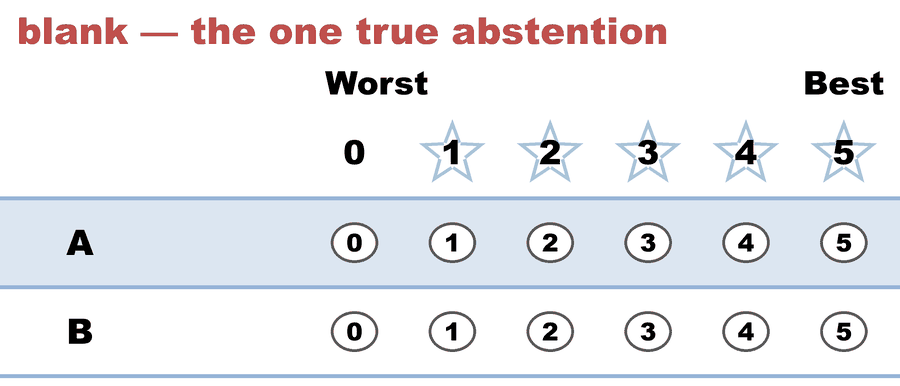

# The minimal case — BetterVoting calls a `5,5` an "abstention" (2 candidates)

**One line:** the tightest possible demonstration. Two candidates, five ballots. One voter scores **both** candidates **5** — maximum support for everyone — and BetterVoting files that ballot as an **abstention**. An [independent STAR engine](../../../07_Concepts/tabulation_engines/bettervoting_and_the_engine.md) (the [LH `starvote`](../../../07_Concepts/GLOSSARY.md) tabulator) counts it as **Equal Support** and still elects the same winner.

> **Filed with BetterVoting as [Equal-Vote/bettervoting#1508](https://github.com/Equal-Vote/bettervoting/issues/1508)** (2026-08-09) — this election, with BV's own source quoted. It came out of the broader pets reconciliation, [#1407](https://github.com/Equal-Vote/bettervoting/issues/1407).
>
> **▶ Live on BetterVoting:** the same five ballots, re-cast on 2026-08-09 so today's tabulator counts them — [vote](https://bettervoting.com/hb4qvv) · **[results ↗](https://bettervoting.com/hb4qvv/results)** (election `hb4qvv`, BV2283). Still **3 tallied / 2 abstentions**, A on 9 instead of 14. The June capture below (`3w6v4b`) is in `draft` state, so its results page won't open for anyone else — that is why the re-cast exists. Repo case: [`bv2283_hb4qvv_all_equal_recheck.md`](cases/cases_pages/bv2283_hb4qvv_all_equal_recheck.md).

This is the **2-candidate** member of the pair. Its richer sibling, which adds a third candidate to show that BetterVoting's rule is "*any* flat ballot = abstention" (it even drops an engaged `3,3,3`), is [When "no preference" gets called an "abstention"](small_case_abstention_lesson.md). At full scale: the 461-ballot [pet race](README.md).

→ Reading results: [How to read a STAR report](../../../07_Concepts/tabulation_engines/LH_starvote/reading_a_star_report.md) · [BetterVoting vs the LH engine — when the reports differ](../../../07_Concepts/tabulation_engines/bettervoting_and_the_engine.md#when-the-two-reports-differ-abstentions-vs-equal-support) · [Runoff percentages](../../01_Learn/the_count/runoff_percentages.md) · [`GLOSSARY`](../../../07_Concepts/GLOSSARY.md)

---

## The election

A real BetterVoting STAR election (**BV id `3w6v4b`**, captured 2026-06-28), two candidates `A` and `B`, five ballots:

<!-- ballots:small_abstention_c2_b5 -->
The ballots as marked — the filled bubble is the score given, and the score is the number in its column:

| # | Ballot as marked | A | B |
|:--:|:--|:--:|:--:|
| 1 |  | 0 | 5 |
| 2 |  | 4 | 0 |
| 3 |  | 5 | 5 |
| 4 |  | 5 | 0 |
| 5 |  | - | - |
<!-- /ballots -->

The **`5,5`** (ballot 3) is the one in dispute, and the **blank** (ballot 5) is what an abstention actually looks like: **nothing marked at all**.

- Frozen raw export: [`small_abstention_c2_b5_bv_export.json`](cases/small_abstention_c2_b5_bv_export.json)
- Converted election (LH-tabulatable): [`small_abstention_c2_b5.yaml`](cases/small_abstention_c2_b5.yaml)
- Full engine report: [`small_abstention_c2_b5_tabulated.txt`](cases/cases_tabulated/small_abstention_c2_b5_tabulated.txt)

## Two reports — one ballot of disagreement

| | BetterVoting | LH engine |
|---|---:|---:|
| Ballots tallied | **3** (`nTallyVotes`) | **5** |
| Abstentions | **2** — the `5,5` **and** the blank | **1** — the blank only |
| The `5,5` ballot | counted as an **abstention** ❌ | **Equal Support**: counted in the score round, neutral in the runoff ✓ |
| Automatic Runoff | A 2, B 1 | A 2, B 1, Equal Support 2 |
| **Winner** | **A** | **A** |

BetterVoting's own result, from the export:

```json
{ "nAbstentions": 2, "nTallyVotes": 3 }
```

With only two candidates, a `5,5` ballot *is* flat (every candidate equal), so BetterVoting's "flat = abstention" rule flags it directly. That's what makes this the cleanest one-sentence statement of the problem — though it can look like a harmless edge case, which is exactly why the 3-candidate sibling matters: there, a flat `3,3,3` is dropped while a genuine `5,5,0` no-preference ballot is kept, proving the two ideas are different.

## The rule, in one line

This isn't guesswork about BetterVoting's intent — the rule is a single expression in its tabulator, and it says "every mark **equal**" where you'd expect "every mark **zero**":

```ts
// packages/backend/src/Tabulators/Util.ts  (verified on master, 2026-08-09)
export const makeAbstentionTest = (markAllEqualAsAbstention: boolean = false) => {
	return [
		'nAbstentions',
		(vote: rawVote) => {
			const marks = Object.values(vote.marks).map(m => m ?? 0);
			return marks.every(m => m === (markAllEqualAsAbstention ? marks[0] : 0));
		}
	] as const;
}
```

Two details finish the picture. `filterInitialVotes` **returns** as soon as a test matches, so a matching ballot is tallied under `nAbstentions` and never enters the score totals — the scores are *dropped*, not merely relabelled. And the `true` is passed by exactly two tabulators, `Star.ts` and `AllocatedScore.ts` (STAR_PR); Approval, Plurality, IRV and Ranked Robin pass the default `false`. So **an Approval voter who approves everyone is counted; a STAR voter who scores everyone 5 is not.**

That asymmetry also marks the limit of the "harmless" reading. In single-winner STAR an all-equal ballot adds the same amount to every candidate and states no preference in the runoff, so it genuinely cannot change the winner — the totals are wrong, the outcome isn't. STAR_PR has no such protection: `AllocatedScore.ts` sets `quota = V / nWinners` from the count of *tallied* ballots, so dropping ballots shrinks the quota and moves the surplus arithmetic that decides seats.

## What the LH engine prints

<!-- report:small_abstention_c2_b5 -->
```text
--- STAR Voting Method (single winner) ---

[STAR Voting]
 Tabulating 5 ballots. Note: 1 of 5 ballots is marked as an abstention.
A,B
0,5
4,0
5,5
5,0
-,-
  ('-' = left blank / abstained; '0' = scored zero — both count as 0 stars.)

[STAR Voting: Scoring Round]
 The two highest-scoring candidates advance to the next round.
   A             -- 14 -- First place
   B             -- 10 -- Second place
 A and B advance.

[STAR Voting: Automatic Runoff Round]
 The candidate preferred in the most head-to-head matchups wins.
   A             -- 2 -- First place
   B             -- 1
   Equal Support -- 2
 A wins.
   Runoff math:
     5  ballots cast
   − 2  Equal Support (no preference between the two finalists)
     ─
     3  voters with a preference  (majority = 2)
           A 2 (67%)  ·  B 1 (33%)

[STAR Voting: Winner — STAR Voting Method (single winner)]
 A
```
<!-- /report -->
and in the saved `_tabulated` copy, the same as a funnel that adds up:

```
   Runoff math:
     5  ballots cast
   − 2  Equal Support (no preference between the two finalists)
     ─
     3  voters with a preference  (majority = 2)
           A 2 (67%)  ·  B 1 (33%)
```

Read it: **5 cast, 1 abstention** (the blank). The `5,5` and the blank both score A == B, so both sit in **Equal Support** and are excluded *only* from the runoff percentage. The 3 voters with a preference decide it, and A wins 2–1.

## Why it matters

1. **The `5,5` voter participated** — maximally. Calling that an "abstention" tells an auditor the ballot was empty. It wasn't.
2. **In STAR the score round adds every star.** A `5,5` adds 5 to each candidate; dropping it lowers the totals and makes the published numbers fail a hand count. (Here the example is symmetric, so the *winner* is safe — luck of the example, not a property to rely on.)
3. **"No preference" already has a correct home: Equal Support** — counted in the score round, neutral only in the runoff denominator. Folding it into "abstention" conflates "no preference between these two" with "didn't vote."

## See also

- Richer 3-candidate version (the canonical lesson): [When "no preference" gets called an "abstention"](small_case_abstention_lesson.md)
- Synthetic illustration (adds an explicit `0,0` row): [`abstention_reconciliation_min_c2_b6.yaml`](cases/abstention_reconciliation_min_c2_b6.yaml)
- Full 461-ballot race + frozen BV evidence: [A real BetterVoting election, end to end — "What Makes the Best Pet?"](README.md) · [BetterVoting result — frozen snapshot (pet race)](BV_result_snapshot.md)
- The reconciliation / issue write-up: [Equal Support ballots (incl. an all-5s vote) are being counted as "abs](LH_BV_reconciliation_issue.md) (→ [#1407](https://github.com/Equal-Vote/bettervoting/issues/1407))
- How it was reproduced on BetterVoting: [Small case — reproduce the abstention mislabel on BetterVoting](SMALL_CASE_reproduce_on_BV.md)
