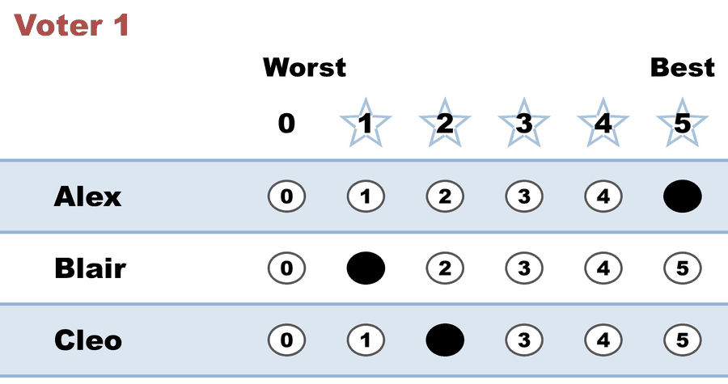
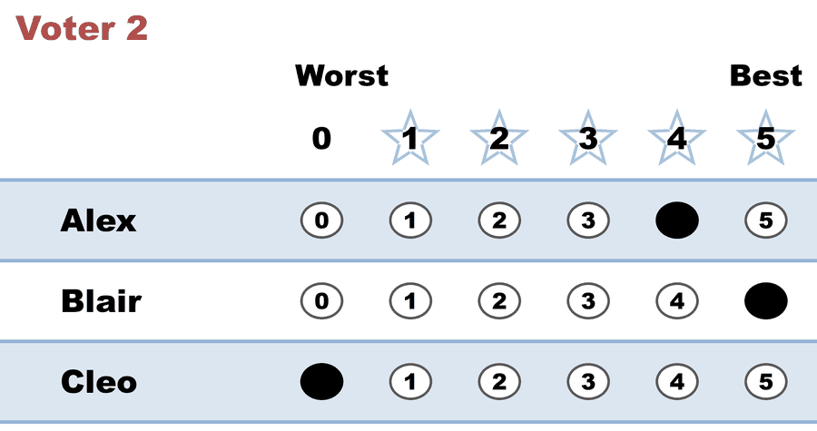
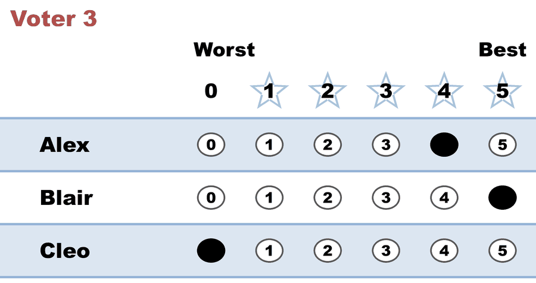
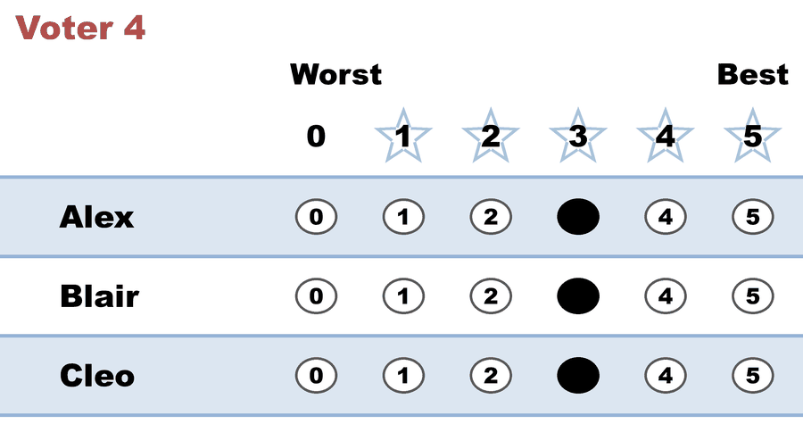

---
search:
  exclude: true
---

# Runoff 07 (WIP) — flat ballot exposes the BV abstention bug

*Generated from [`Runoff_07_flat_ballot_bv_bug_tf73v9.yaml`](../Runoff_07_flat_ballot_bv_bug_tf73v9.yaml) — do not edit by hand. Regenerate: `python STARVote_LH_tabulation_engine/tools_adam/scripts/build_yaml_pages.py`.*

**Method:** [STAR (single winner)](../../../../01_Learn/README.md) · **1 seat** · **Expected winner:** Blair

**▶ Live on BetterVoting:** [vote](https://bettervoting.com/tf73v9) · **[results ↗](https://bettervoting.com/tf73v9/results)** (election `tf73v9`).

## Scenario

⚠️ WORK IN PROGRESS — illustration pending a BetterVoting fix
(Equal-Vote/bettervoting#1407). A REAL BetterVoting election (BV id tf73v9),
captured 2026-06-28. A reversal (Alex leads the scoring round, Blair wins the
runoff) that ALSO contains a flat ballot (3,3,3). The two reports AGREE on the
winner (Blair) but DISAGREE on the bookkeeping: the LH engine counts all 4
ballots and treats the 3,3,3 as Equal Support; BetterVoting files the 3,3,3 as an
ABSTENTION (nAbstentions = 1, nTallyVotes = 3) and drops its 3 stars from every
candidate's total. This is the flat-ballot abstention bug, now inside a reversal.
Level 201/301. Full two-view lesson: Runoff_07_flat_ballot_bv_bug_tf73v9.md

## Ballots

The ballots as marked — the filled bubble is the score given, and the score is the number in its column:

| # | Ballot as marked | Alex | Blair | Cleo |
|:--:|:--|:--:|:--:|:--:|
| 1 |  | 5 | 1 | 2 |
| 2 |  | 4 | 5 | 0 |
| 3 |  | 4 | 5 | 0 |
| 4 |  | 3 | 3 | 3 |

The same ballots as the file records them:

Row 1 = candidate names; each later row is one voter's 0–5 scores (a `N ×` prefix = N identical ballots).

```text
Alex, Blair, Cleo
5, 1, 2
4, 5, 0
4, 5, 0
3, 3, 3
```

## What the engine says

The count, step by step — the rounds and how the winner is reached:

<!-- --8<-- [start:report] -->
```text
[Divergence from STAR]
  STAR     = Blair
  Approval = Alex   (differs from STAR)

[Runoff Reversal]
 - Score Round Winner(s) = (Alex)
 - Runoff Round Winner   = (Blair)
  Candidate Alex earned the highest total score, but
  Candidate Blair won the automatic runoff — not a malfunction,
  STAR working as designed: the runoff elects the finalist preferred
  by the majority (of voters with a preference).

--- STAR Voting Method (single winner) ---

[STAR Voting]
 Tabulating 4 ballots.
Count × Alex,Blair,Cleo
    2 ×    4,    5,   0
    1 ×    5,    1,   2
    1 ×    3,    3,   3

[STAR Voting: Scoring Round]
 The two highest-scoring candidates advance to the next round.
   Alex          -- 16 -- First place
   Blair         -- 14 -- Second place
   Cleo          --  5
 Alex and Blair advance.

[STAR Voting: Automatic Runoff Round]
 The candidate preferred in the most head-to-head matchups wins.
   Blair         -- 2 -- First place
   Alex          -- 1
   Equal Support -- 1
 Blair wins.
   Runoff math:
     4  ballots cast
   − 1  Equal Support (no preference between the two finalists)
     ─
     3  voters with a preference  (majority = 2)
           Blair 2 (67%)  ·  Alex 1 (33%)

[STAR Voting: Winner — STAR Voting Method (single winner)]
 Blair
```
<!-- --8<-- [end:report] -->

### Full audit — preference matrix, Condorcet, and score distribution

```text
--- Runoff (Preference) Matrix ---
Head-to-head / pairwise comparison
Legend: For - Equal Support - Against
        * indicates Top 2 Finalist
               |   * Alex   | * Blair   |    Cleo   |
-----------------------------------------------------
      * Alex > |    ---     |1 - 1 - 2  |3 - 1 - 0  |
     * Blair > | 2 - 1 - 1  |   ---     |2 - 1 - 1  |
        Cleo > | 0 - 1 - 3  |1 - 1 - 2  |   ---     |

[Condorcet Winner]
  Condorcet Winner: Blair — matches the STAR winner

[Condorcet Loser]
  Condorcet Loser: Cleo — loses every head-to-head matchup

[Score Distribution] (how many ballots gave each star rating)
                Score
Candidate  5  4  3  2  1  0  | Total   Avg
Alex       1  2  1  0  0  0  |    16   4.0
Blair      2  0  1  0  1  0  |    14   3.5
Cleo       0  0  1  1  0  2  |     5   1.3
```

Everything in one file: the [`_tabulated` mirror](../cases_tabulated/Runoff_07_flat_ballot_bv_bug_tf73v9_tabulated.txt) (regenerated on every run; every analysis forced on).

Run it yourself:

```bash
python STARVote_LH_tabulation_engine/starvote_larry_hastings.py 01_STAR/04_Real_Elections/runoff_reversal_bv_cases/cases/Runoff_07_flat_ballot_bv_bug_tf73v9.yaml
```

## See also

- [Methods disagree on this election](../../../../../method_comparisons/divergence_review/cases/APPROVAL_OR_MINOR/Runoff_07_flat_ballot_bv_bug_tf73v9.md) — its entry in the divergence review ledger
- [Runoff reversal (worked set)](../../../../02_Examples/runoff_overturns_leader/README.md)
- [Ballot & terminology basics](../../../../../07_Concepts/topics/ballot_and_terminology_basics.md)
- [Glossary](../../../../../07_Concepts/GLOSSARY.md) · [all cases by method](../../../../../07_Concepts/YAML_test_case_index/README.md)

More cases in this set: [Runoff_01_confirms_leader_r2pvc9](Runoff_01_confirms_leader_r2pvc9.md) · [Runoff_02_atom_reversal_yx9447](Runoff_02_atom_reversal_yx9447.md) · [Runoff_03_enthusiasts_vs_majority_rkgtpk](Runoff_03_enthusiasts_vs_majority_rkgtpk.md) · [Runoff_04_reversal_at_scale_bfjqmg](Runoff_04_reversal_at_scale_bfjqmg.md) · [Runoff_05_reversal_with_equal_support_xgkw3w](Runoff_05_reversal_with_equal_support_xgkw3w.md) · [Runoff_06_confirms_at_scale_d664xw](Runoff_06_confirms_at_scale_d664xw.md) · [Runoff_08_ca_governor_reversal_gvdy42](Runoff_08_ca_governor_reversal_gvdy42.md)
