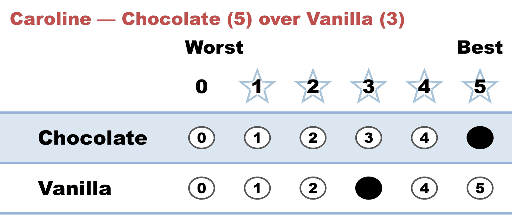

---
search:
  exclude: true
---

# The simplest possible STAR Voting example

*Generated from [`01a_c2_b1_two-candidates.yaml`](../01a_c2_b1_two-candidates.yaml) — do not edit by hand. Regenerate: `python STARVote_LH_tabulation_engine/tools_adam/scripts/build_yaml_pages.py`.*

**Method:** [STAR (single winner)](../../../../01_Learn) · **1 seat** · **Expected winner:** Chocolate

## Scenario

The smallest possible STAR election: ONE voter, two flavors. Caroline scores
Chocolate 5 and Vanilla 3; with only two candidates both advance, and her
preference decides the runoff — Chocolate wins. Illustration-only: use it to
learn the report layout (ballots, Scoring Round, Automatic Runoff) before
anything interesting happens. With two candidates STAR always agrees with
Choose-One; the interesting cases start at three.

## Ballots

The ballot as marked — the filled bubble is the score given, and the score is the number in its column:

| Ballot as marked | Chocolate | Vanilla |
|:--|:--:|:--:|
|  | 5 | 3 |

The same ballot as the file records it:

Row 1 = candidate names; each later row is one voter's 0–5 scores (a `N ×` prefix = N identical ballots).

```text
Chocolate,Vanilla
        5,      3       # Caroline — Chocolate (5) over Vanilla (3)
```

## What the engine says

The count, step by step — the rounds and how the winner is reached:

<!-- --8<-- [start:report] -->
```text
--- STAR Voting Method (single winner) ---

[STAR Voting]
 Tabulating 1 ballot.
Chocolate,Vanilla
        5,      3

[STAR Voting: Scoring Round]
 The two highest-scoring candidates advance to the next round.
   Chocolate     -- 5 -- First place
   Vanilla       -- 3 -- Second place
 Chocolate and Vanilla advance.

[STAR Voting: Automatic Runoff Round]
 The candidate preferred in the most head-to-head matchups wins.
   Chocolate     -- 1 -- First place
   Vanilla       -- 0
   Equal Support -- 0
 Chocolate wins.
   Runoff math:
     1  ballots cast
   − 0  Equal Support (no preference between the two finalists)
     ─
     1  voters with a preference  (majority = 1)
           Chocolate 1 (100%)  ·  Vanilla 0 (0%)

[STAR Voting: Winner — STAR Voting Method (single winner)]
 Chocolate
```
<!-- --8<-- [end:report] -->

### Full audit — preference matrix, Condorcet, and score distribution

```text
--- Runoff (Preference) Matrix ---
Head-to-head / pairwise comparison
Legend: For - Equal Support - Against
        * indicates Top 2 Finalist
                  |  * Chocolate  |  * Vanilla   |
--------------------------------------------------
    * Chocolate > |      ---      |  1 - 0 - 0   |
      * Vanilla > |   0 - 0 - 1   |     ---      |

[Condorcet Winner]
  Condorcet Winner: Chocolate — matches the STAR winner

[Condorcet Loser]
  Condorcet Loser: Vanilla — loses every head-to-head matchup

[Score Distribution] (how many ballots gave each star rating)
                Score
Candidate  5  4  3  2  1  0  | Total   Avg
Chocolate  1  0  0  0  0  0  |     5   5.0
Vanilla    0  0  1  0  0  0  |     3   3.0
```

Everything in one file: the [`_tabulated` mirror](../cases_tabulated/01a_c2_b1_two-candidates_tabulated.txt) (regenerated on every run; every analysis forced on).

Run it yourself:

```bash
python STARVote_LH_tabulation_engine/starvote_larry_hastings.py 01_STAR/09_Parked/silly_two_cand_STAR/cases/01a_c2_b1_two-candidates.yaml
```

## See also

- [Runoff reversal (worked set)](../../../../02_Examples/runoff_overturns_leader/README.md)
- [Glossary](../../../../../07_Concepts/GLOSSARY.md) · [all cases by method](../../../../../07_Concepts/YAML_test_case_index/README.md)

More cases in this set: [01a_c2_b2_two-candidates](01a_c2_b2_two-candidates.md) · [01b_c2_b2_two-candidates](01b_c2_b2_two-candidates.md) · [01c_c2_b3_two-candidates](01c_c2_b3_two-candidates.md)
