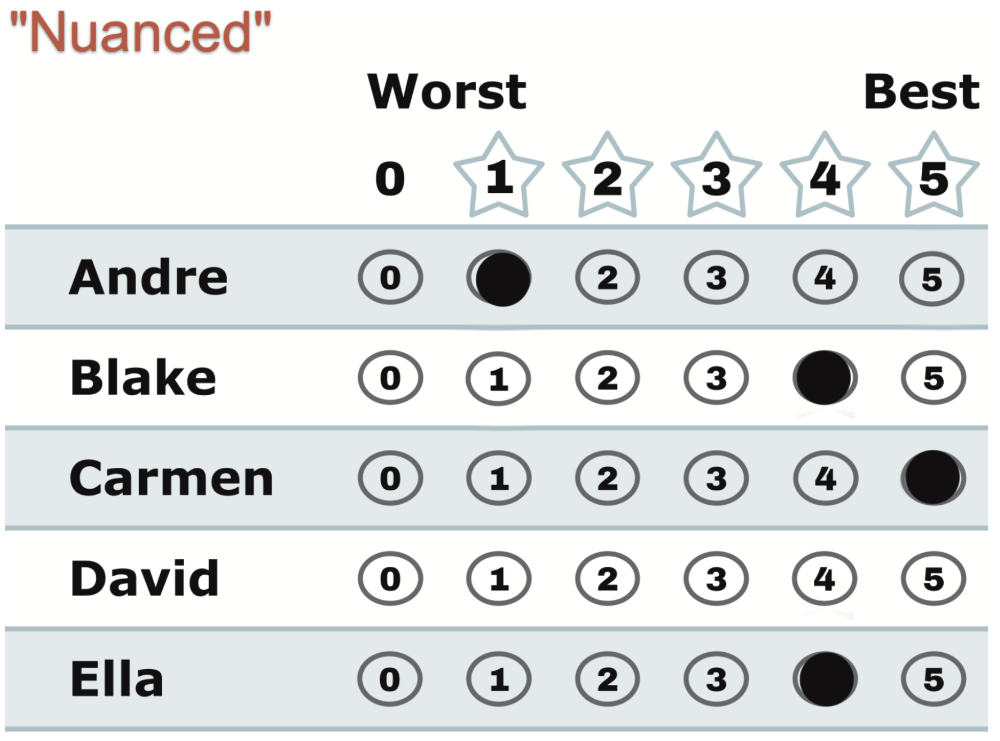

# "Nuanced" — the full range, honestly

*A 5 where you love, a 1 where you don't, a genuine tie where you're torn, a blank where there's nothing to say. The ballot used the way it was designed.*

← One of eight [voting styles](../STAR_ballot_voting_styles.md). Every style is legal and counted; this page is what this one means, when it fits, and what it trades away.

## What this ballot says

**"Carmen first; Blake and Ella both strong — and I truly can't split them; Andre barely; David no."** The equal 4s are the signature move: a real tie, recorded as one, because equal scores are allowed and no rule forces you to invent a preference you don't feel.

## When it fits

- Always — this is the style the instructions on the ballot are steering you toward: favorite at 5, worst at 0 or blank, everyone else wherever they honestly land.
- Especially in big fields, where "compare each candidate against your two anchors" is fast, and a forced full ranking would be real work.

## The trade-off, honestly

There barely is one — that's the point of this page sitting beside the others. This ballot maximizes what the count can hear from you: full weight at the top, real distinctions where you feel them, none where you don't. The one consequence worth knowing: any two candidates you scored *equally* are an [Equal Support](../../../00_start_here/GLOSSARY.md) pair if they both reach the [runoff](../the_count/STAR_Automatic_Runoff.md) — you told the count you're happy either way, and it takes you at your word. That's not a flaw; it's your tie, honored.

## This exact style in a real election

In the runnable [style-gallery election](../../_main/cases/cases_pages/03c_c6_b8_style-gallery.md), the nuanced row is `3,4,0,3,1,5` — full range, with an honest 3–3 tie for two mid-field candidates. Bianca (4) and Frank (5) became the finalists, and the ballot's runoff vote went to Frank — this voter's true favorite — by the 5-over-4 gap. Every distinction it recorded got used; the one tie it declared was between two candidates who didn't make the final anyway.

## Related

- [Ranked](ranked.md) — what this ballot looks like when you *don't* allow yourself ties
- [Scores vs. Ranks](../../../00_start_here/scores_and_ranks/scores_vs_ranks.md) — why ratings carry more honest information than forced rankings
